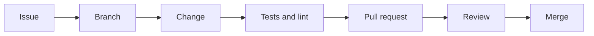

# Contributing to OMES

Thanks for your interest in OMES. This document describes the actual
contribution workflow used in this repository today. If something below
does not match reality, that is a bug in this document — please fix it or
open an issue.

## 1. Before you start

- Read [docs/scope.md](docs/scope.md) for what OMES is and is not, and its
  non-goals and destructive-operation policy.
- Read [docs/omarchy-compatibility-inventory.md](docs/omarchy-compatibility-inventory.md)
  if your change touches anything inspired by upstream Omarchy — check
  whether the capability is already classified PORT/ADAPT/DEFER/REJECT.
- Read [docs/branding-and-trademarks.md](docs/branding-and-trademarks.md)
  before writing any user-facing text that names Omarchy, Ubuntu, Linux
  Mint, Docker, Telegram, or Hermes Agent.
- Check open issues on GitHub before starting substantial work; OMES uses
  one issue per pull request (see §3).

## 2. Branching and commits

- Branch names follow `feat/<issue>-<slug>`, `docs/<issue>-<slug>`,
  `ci/<issue>-<slug>`, `fix/<issue>-<slug>`, etc. — a type prefix, the issue
  number, and a short slug (e.g. `feat/6-preflight-check`).
- Base your branch on the current `origin/main` (or on the specific branch
  a PR is stacked on, if the task says so). If `main` has moved since you
  branched, rebase before pushing:
  ```
  git fetch origin
  git rebase origin/main
  ```
- Commit messages follow [Conventional Commits](https://www.conventionalcommits.org/):
  `feat:`, `fix:`, `docs:`, `ci:`, `test:`, `chore:`, `security:`, followed
  by a concise summary. Reference the issue in the body (e.g. `Closes #N`).
- OMES does not require a DCO-style sign-off line. By opening a pull
  request against this repository, you agree your contribution is licensed
  under the same [MIT License](LICENSE) as the rest of the project.

## 3. One issue, one branch, one pull request

- Each pull request addresses exactly one GitHub issue.
- The PR title format is `<type>: <summary> (#N)`.
- The PR description must include: a summary of the change, `Closes #N`,
  and a "Verification" section listing the exact commands you ran and their
  results (see §5 for what to run).
- Do not bundle unrelated changes (e.g. a docs fix and a new module) into
  one PR — open separate issues/PRs instead.

## 4. Change fragments

Every pull request that changes user-visible behavior or documentation adds
one change fragment file under `changes/`, named `changes/<issue>-<slug>.md`:

```
---
issue: N
type: added|changed|fixed|docs|ci|security
---
One-line description of the user-visible change.
```

`CHANGELOG.md` is compiled from these fragments at release time — do not
edit `CHANGELOG.md` directly in a feature/docs PR.

**Fragment rules (enforced by CI on every PR, see below):**

- YAML-style frontmatter delimited by two literal `---` lines is required.
- `issue:` must be a positive integer (the GitHub issue this PR closes or
  references).
- `type:` must be exactly one of the ADR-0010 types: `security`, `added`,
  `changed`, `fixed`, `docs`, `ci`. Conventional-commit/SemVer words such as
  `minor`, `patch`, `feat`, `refactor`, or `chore` are **not** valid `type`
  values here, even though they are valid commit-message prefixes (§2) —
  the two vocabularies are different on purpose.
- The body must be non-empty and a **single paragraph**: no blank line
  inside the body, and no line starting with markdown list or heading
  markup (`- `, `* `, `1. `, `#`/`##`/...). `scripts/release.sh` joins every
  body line with a space into one changelog bullet at release time, so a
  bulleted list, a heading, or a paragraph break inside the body would
  produce a malformed changelog entry. A hard-wrapped line that merely
  begins with an issue reference, e.g. `#217).`, is fine — only a `#` run
  immediately followed by whitespace (`# `, `## `, ...) counts as heading
  markup.

Every PR that adds or changes a fragment is validated on CI by
`scripts/release.sh --validate-fragments` (issue #238), which runs the
exact same parser `scripts/release.sh` uses to compile `CHANGELOG.md` at
release time, so a fragment that passes CI cannot later break a release.
Run it locally before opening a PR:

```bash
scripts/release.sh --validate-fragments
```

It is read-only (no VERSION/CHANGELOG/git mutation, no network access), and
exits 0 when `changes/` is empty or holds only a `README.md`/placeholder
file.

### Cutting a release

Releases follow [ADR-0010](docs/adr/0010-versioning-and-change-fragments.md)
and are cut from a clean, green `main` with `scripts/release.sh`:

```bash
scripts/release.sh 0.2.0 --dry-run   # preview the compiled CHANGELOG section
scripts/release.sh 0.2.0             # compile changes/*.md, set VERSION, remove
                                     # the fragments, commit, and tag v0.2.0
git push origin main --follow-tags
```

The script refuses to run on a dirty tree, on an existing tag, or when
`changes/` is empty, and rejects malformed fragments. Create the GitHub
release from the tag afterwards (`gh release create vX.Y.Z --notes-from-tag`
or paste the CHANGELOG section).

## 5. Required local workflow: ShellCheck, bats, and the test matrix

All shell code (`bin/`, `lib/`, `modules/`, `install/`, `tests/shims/`) must
pass ShellCheck, and every bats suite under `tests/` must pass before a PR
is ready for review.

**Prefer `tests/run.sh` and `scripts/test-matrix.sh`** — they run the exact
checks CI runs and fall back to Docker automatically when a tool is not
installed locally, so local and CI results should not diverge:

```bash
./tests/run.sh              # ShellCheck (-S style) + tests/unit + tests/integration
./scripts/lint.sh           # ShellCheck + shfmt + yamllint (what .github/workflows/lint.yml runs)
./scripts/test-matrix.sh    # real apt-get/dpkg inside disposable containers, all supported OSes
```

If you want to run ShellCheck directly against a specific severity/image
instead, run it against **both** images below — `scripts/lint.sh` pins the
`stable` tag by digest for local/CI parity on everyday changes, but CI's
`.github/workflows/lint.yml` `shellcheck` job resolves to ShellCheck
**v0.9.0** at the time this document was written, and a finding that only
one of the two versions reports is exactly the kind of drift a docs-accuracy
PR should catch before it reaches CI:

```bash
# Whatever scripts/lint.sh currently pins (the "stable" tag, by digest)
docker run --rm -v "$PWD:/mnt" koalaman/shellcheck:stable -x -S style <files>

# The exact version CI's shellcheck job runs
docker run --rm -v "$PWD:/mnt" koalaman/shellcheck:v0.9.0 -x -S style <files>

# Unit tests
docker run --rm -v "$PWD:/code" -w /code bats/bats:latest tests/unit

# Integration tests
docker run --rm -v "$PWD:/code" -w /code bats/bats:latest tests/integration
```

Add `--user "$(id -u):$(id -g)"` to any `docker run` command if file
ownership on generated artifacts matters on your host. See
[docs/ci.md](docs/ci.md) for what every CI job does, what blocks a PR versus
is advisory, and how to run `gitleaks`/`actionlint`/`check-links.py` locally
too.

## 5a. PR checklist

Before opening a pull request:

- [ ] One issue, one branch, one PR (§3); PR title `<type>: <summary> (#N)`.
- [ ] `./tests/run.sh` passes.
- [ ] `./scripts/lint.sh` passes (or the two ShellCheck images in §5, if you
      changed shell code specifically).
- [ ] If your change touches a module installed by the `server`/`desktop`
      profiles, `./scripts/test-matrix.sh` still passes for at least
      `ubuntu:24.04` (`OMES_MATRIX_IMAGES="ubuntu:24.04"`).
- [ ] A `changes/<issue>-<slug>.md` fragment exists (§4).
- [ ] Every doc your change affects was updated in the same PR (§7) — if you
      touched code, grep the docs you're about to touch for stale claims
      (`grep -rn "Not implemented yet" docs/`) before writing new ones.
- [ ] No secret, real-looking token, or `.env` file is staged.
- [ ] The PR description has `Closes #N`, a summary, and a **Verification**
      section listing the exact commands you ran and their results.

## 6. Secrets

- Never commit tokens, API keys, `.env` files, or any other secret to this
  repository, in any branch, commit message, or PR description.
- Hermes Agent secrets live only in `$HERMES_HOME/.env` on the target host
  (mode `0600`); OMES never writes secrets into its own state files, logs,
  or backups' metadata.
- If you accidentally commit a secret, do not just delete it in a follow-up
  commit — it remains in git history. Stop, rotate the secret, and open an
  issue describing what needs to be scrubbed.

## 7. Documentation accuracy

Documentation in this repository must describe the actual state of the
code, not planned or aspirational behavior:

- If a feature is not yet implemented, say so explicitly: "Not implemented
  yet (tracked in #N)."
- Do not describe a CLI flag, module, or command that does not exist in the
  current branch/`main`.
- When you change behavior, update the relevant doc in the same PR.
- Follow the naming and disclaimer rules in
  [docs/branding-and-trademarks.md](docs/branding-and-trademarks.md) in any
  text you write.

## 8. Scope of a single contribution

Unless your assigned issue says otherwise, keep changes inside the files
and directories the issue is actually about. Do not edit `README.md`
unless your task explicitly says to, and never edit `CHANGELOG.md` (see
§4).

## 9. Getting help

Open a GitHub issue with the `type:question` label (or the closest
available label) if a step in this document does not work as described.

<!-- OMES-MERMAID: CONTRIBUTING.md -->

## Visual summary



