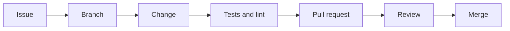

# Contributing to OMES

Thanks for your interest in OMES. This document describes the actual
contribution workflow used in this repository today. If something below
does not match reality, that is a bug in this document — please fix it or
open an issue.

## 1. Before you start

- Read [docs/scope.md](docs/scope.md) for what OMES is and is not, and its
  non-goals and destructive-operation policy.
- Read [docs/omarchy-compatibility-inventory.md](docs/omarchy-compatibility-inventory.md)
  if your change touches anything inspired by upstream Omarchy — check
  whether the capability is already classified PORT/ADAPT/DEFER/REJECT.
- Read [docs/branding-and-trademarks.md](docs/branding-and-trademarks.md)
  before writing any user-facing text that names Omarchy, Ubuntu, Linux
  Mint, Docker, Telegram, or Hermes Agent.
- Check open issues on GitHub before starting substantial work; OMES uses
  one issue per pull request (see §3).

## 2. Branching and commits

- Branch names follow `feat/<issue>-<slug>`, `docs/<issue>-<slug>`,
  `ci/<issue>-<slug>`, `fix/<issue>-<slug>`, etc. — a type prefix, the issue
  number, and a short slug (e.g. `feat/6-preflight-check`).
- Base your branch on the current `origin/main` (or on the specific branch
  a PR is stacked on, if the task says so). If `main` has moved since you
  branched, rebase before pushing:
  ```
  git fetch origin
  git rebase origin/main
  ```
- Commit messages follow [Conventional Commits](https://www.conventionalcommits.org/):
  `feat:`, `fix:`, `docs:`, `ci:`, `test:`, `chore:`, `security:`, followed
  by a concise summary. Reference the issue in the body (e.g. `Closes #N`).
- OMES does not require a DCO-style sign-off line. By opening a pull
  request against this repository, you agree your contribution is licensed
  under the same [MIT License](LICENSE) as the rest of the project.

## 3. One issue, one branch, one pull request

- Each pull request addresses exactly one GitHub issue.
- The PR title format is `<type>: <summary> (#N)`.
- The PR description must include: a summary of the change, `Closes #N`,
  and a "Verification" section listing the exact commands you ran and their
  results (see §5 for what to run).
- Do not bundle unrelated changes (e.g. a docs fix and a new module) into
  one PR — open separate issues/PRs instead.

## 4. Change fragments

Every pull request that changes user-visible behavior or documentation adds
one change fragment file under `changes/`, named `changes/<issue>-<slug>.md`:

```
---
issue: N
type: added|changed|fixed|docs|ci|security
---
One-line description of the user-visible change.
```

`CHANGELOG.md` is compiled from these fragments at release time — do not
edit `CHANGELOG.md` directly in a feature/docs PR.

## 5. Required checks: ShellCheck and bats

All shell code (`bin/`, `lib/`, `modules/`, `install/`) must pass
ShellCheck, and all bats test suites under `tests/` must pass before a PR
is ready for review.

If you don't have the tools installed locally, run them via Docker exactly
as follows:

```bash
# ShellCheck (style-level checks, following sourced files)
docker run --rm -v "$PWD:/mnt" koalaman/shellcheck:stable -x -S style <files>

# Unit tests
docker run --rm -v "$PWD:/code" -w /code bats/bats:latest tests/unit

# Integration tests
docker run --rm -v "$PWD:/code" -w /code bats/bats:latest tests/integration
```

Add `--user "$(id -u):$(id -g)"` to either `docker run` command if file
ownership on generated artifacts matters on your host.

`tests/run.sh` (once present) runs ShellCheck plus the unit and integration
suites, falling back to Docker automatically when the tools are not
installed locally — prefer it once it exists in the repository.

## 6. Secrets

- Never commit tokens, API keys, `.env` files, or any other secret to this
  repository, in any branch, commit message, or PR description.
- Hermes Agent secrets live only in `$HERMES_HOME/.env` on the target host
  (mode `0600`); OMES never writes secrets into its own state files, logs,
  or backups' metadata.
- If you accidentally commit a secret, do not just delete it in a follow-up
  commit — it remains in git history. Stop, rotate the secret, and open an
  issue describing what needs to be scrubbed.

## 7. Documentation accuracy

Documentation in this repository must describe the actual state of the
code, not planned or aspirational behavior:

- If a feature is not yet implemented, say so explicitly: "Not implemented
  yet (tracked in #N)."
- Do not describe a CLI flag, module, or command that does not exist in the
  current branch/`main`.
- When you change behavior, update the relevant doc in the same PR.
- Follow the naming and disclaimer rules in
  [docs/branding-and-trademarks.md](docs/branding-and-trademarks.md) in any
  text you write.

## 8. Scope of a single contribution

Unless your assigned issue says otherwise, keep changes inside the files
and directories the issue is actually about. Do not edit `README.md`
unless your task explicitly says to, and never edit `CHANGELOG.md` (see
§4).

## 9. Getting help

Open a GitHub issue with the `type:question` label (or the closest
available label) if a step in this document does not work as described.

<!-- OMES-MERMAID: CONTRIBUTING.md -->

## Visual summary



