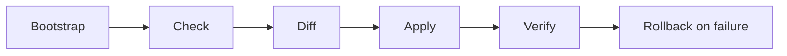

# OMES

OMES is an **independent, Omarchy-inspired** compatibility layer and deployment
toolkit for **Ubuntu Server 24.04 LTS** and **Linux Mint 22.x**, with
[Hermes Agent](https://hermes-agent.nousresearch.com/) as the integrated
automation layer.

> **Disclaimer.** OMES is an independent, MIT-licensed project. It is inspired
> by the Omarchy workflow but is not official Omarchy, and it is not
> affiliated with, endorsed by, or sponsored by the Omarchy project, Canonical
> (Ubuntu), the Linux Mint project, Docker, Inc., Telegram, or Nous Research.
> Hermes Agent is a product of Nous Research; OMES integrates with it as an
> external dependency and does not develop or maintain it. See
> [docs/branding-and-trademarks.md](docs/branding-and-trademarks.md).

## What OMES does

1. Detects your platform (Ubuntu Server 24.04/22.04 LTS, Linux Mint 22.x) and
   refuses to mutate anything unsupported (exit 3 before any mutation).
2. Runs every module's read-only preflight check before applying anything
   (`omes check` → `omes install`), backing up any file it is about to touch.
3. Installs an Omarchy-inspired baseline: CLI tooling and a firewall/update
   policy on the server profile; an opt-in, additive Hyprland session next to
   Cinnamon on the desktop profile — plus Hermes Agent as the automation layer
   on either.
4. Verifies every change it makes (`module_verify`), and reports drift on
   every later `omes doctor` run, not just at install time.
5. Reverses itself on request: `omes backup`/`omes restore`/`omes uninstall`
   work fully offline and never delete anything OMES did not itself install.

## Status

**Pre-alpha, version `0.1.0-dev`.** The CLI (`bin/omes`), the shared library
(`lib/omes/*.sh`), every module referenced by the `server`/`desktop`/`hermes`
profiles (`apt-base`, `security-baseline`, `containers`, `hermes`,
`hermes-gateway`, `hermes-gateway-system`, `desktop-preflight`,
`hyprland-session`, `desktop-config`), the bootstrap installer, and the bats
unit/integration test suite are all implemented and tested against shimmed
commands in CI. What that does **not** mean: it has not yet had a tagged
release, and the container/VM compatibility matrix (`scripts/test-matrix.sh`,
`tests/vm/`) is still building out real-host coverage for every scenario — see
[docs/architecture.md §13](docs/architecture.md#13-non-goals-and-known-limitations)
for the known limitations that remain even where the code is implemented.

## Architecture and roadmap

OMES is deliberately layered rather than a second agent runtime:

- **OMES** owns host compatibility, preflight, installation, service lifecycle,
  hardening, health, backup, restore, rollback, compatibility evidence, and
  deployment/provenance state.
- **Hermes Agent** remains the agent runtime for reasoning, messaging, channels,
  sessions, memory, skills, delegation, cron, browser automation, and model/provider
  routing. OMES integrates with Hermes and does not replace it.
- **AWCMS/Control Center** is a planned companion business/control plane for
  tenants, catalog, subscriptions, invoices, entitlements, approvals, domains,
  and operational reporting. It must never execute arbitrary host shell commands.
- **External providers** remain their own authorities: Cloudflare/SRS-X for
  registrar state, the selected DNS provider for DNS state, and GitHub for
  repository/workflow/provenance observations.

The implementation sequence is tracked in GitHub milestones:

| Milestone | Scope | Status |
|---|---|---|
| [MVP Implementation](https://github.com/ahliweb/omes/milestone/2) | Native OMES + Hermes + systemd lifecycle | Active roadmap |
| [Quality and Security](https://github.com/ahliweb/omes/milestone/3) | Health, hardening, backup, compatibility, provenance | Active roadmap |
| [Control Center and Entitlements](https://github.com/ahliweb/omes/milestone/5) | AWCMS boundary, audited jobs, catalog, subscriptions, entitlements | Staged |
| [Billing Automation](https://github.com/ahliweb/omes/milestone/6) | Ledger, payment automation, webhooks, reporting | Staged |
| [Domain and Integration Services](https://github.com/ahliweb/omes/milestone/8) | Provider abstraction, Cloudflare, SRS-X, GitHub, domain reconciliation | Staged |
| [Multi-Server Operations](https://github.com/ahliweb/omes/milestone/7) | Rootless Compose and optional Coolify | Later stage |

The web Control Center, billing service, registrar adapters, DNS integration,
GitHub adapter, and multi-server backends are **not part of the current Bash
CLI implementation unless their linked issues have landed**. Herman is a
reference-only UX input for the staged Control Center; it is not a runtime,
executor, dependency, or source of truth. See the [Herman reference evaluation](docs/web-panel-reference-evaluation.md)
and [ADR-0016](docs/adr/0016-herman-web-panel-reference.md). See the canonical
[Control Center and integrations design](docs/control-center-and-integrations.md)
and [ADR-0011](docs/adr/0011-control-center-and-provider-boundaries.md).

## Supported platforms

| Platform | Tier | Notes |
|---|---|---|
| Ubuntu Server 24.04 LTS, amd64 | tier1 | Primary target |
| Linux Mint 22.x, amd64 | tier1 | Desktop target |
| Ubuntu Server 22.04 LTS, amd64 | tier2 | Supported, lower priority |
| Any supported OS above, arm64 | tier3 | Best-effort |
| Anything else (Debian, Fedora, etc.) | unsupported | `omes check`/`omes install` exit 3 before any mutation |

See [docs/compatibility-matrix.md](docs/compatibility-matrix.md) for the full
matrix and detection rules.

## Quick start

The same one-liner bootstraps either profile; which profile you install is
just a flag. Full walkthrough (every privileged command explained, both
profiles, provider/Telegram setup, upgrading, uninstalling, supported vs.
unsupported configurations): [docs/installation.md](docs/installation.md).

```bash
# 1. Bootstrap: clones OMES and symlinks ~/.local/bin/omes (no other mutation)
curl -fsSL https://raw.githubusercontent.com/ahliweb/omes/main/install/bootstrap.sh | bash

# 2. Preflight: read-only checks, safe to run any time, as any user
omes check --profile server        # or --profile desktop

# 3. See exactly what would happen - no mutation
sudo omes install --profile server --dry-run --yes

# 4. Apply as root, then as your own user (root-scope and user-scope modules
#    never run in the same invocation - see "Root/user scope" below)
sudo omes install --profile server --yes
omes install --profile server --yes

# 5. Verify
omes doctor
sudo omes doctor
```

`install/bootstrap.sh` never mutates the system beyond installing `git` (via
apt, with an explicit sudo prompt printed first) and cloning/symlinking OMES
itself; it never installs an OMES module. Every module apply is preceded by a
read-only check phase, and idempotent: re-running `omes install` on an
unchanged system makes no further changes.

## CLI overview

```text
omes check       Run platform + module preflight checks (no mutation)
omes install     Check-all-then-apply the requested profile/modules
omes status      Show platform, profile, per-module, backup, and log summary
omes modules     List available modules (scope, description, status)
omes doctor      Run health checks (OK/WARN/FAIL); exits 0 unless a FAIL
omes update      Fast-forward this checkout via git, then re-run `check`
omes backup      Create an on-demand backup of all managed paths
omes restore     Restore files from a backup session (offline-safe)
omes uninstall   Roll back applied modules and their managed paths
omes version     Print the OMES version
omes help        Show usage
```

Full synopsis, flags, JSON schema, and worked examples per command:
[docs/cli.md](docs/cli.md).

Global flags: `--profile <server|desktop|hermes>`, `--module <name>`
(repeatable), `--dry-run`, `--json`, `--yes`, `--verbose`, `--log-file <path>`,
`--allow-docker-group`, `--from <timestamp>` (restore), `--list` (restore),
`--reason <text>` (backup), `--purge-packages` (uninstall).

Env overrides: `OMES_DRY_RUN=1`, `OMES_JSON=1`, `OMES_STATE_DIR`,
`OMES_LOG_FILE`, `OMES_ROOT`, `OMES_NONINTERACTIVE=1`, `OMES_BACKUP_KEEP`.

Every command supports `--json`, emitting exactly one JSON object on stdout
(all logging moves to stderr) — see
[docs/cli.md §3](docs/cli.md#3-json-output-contract) for the shared schema and
a per-command sample.

**Root/user scope (no auto-escalation).** Every module declares
`MODULE_SCOPE=root` or `MODULE_SCOPE=user`. `omes check`/`omes install`/`omes
uninstall` only run the modules matching the *current* effective privilege and
**skip** the rest, printing the exact follow-up command
(e.g. `sudo omes install --profile server` prints `Run as your user: omes
install --profile server` for the profile's user-scope modules once its
root-scope modules are done). OMES never calls `sudo` or `sudo -u` on your
behalf. See [ADR-0005](docs/adr/0005-root-and-user-scope-separation.md).

### Exit codes

| Code | Meaning |
|---|---|
| 0 | Success |
| 1 | General/unexpected error (includes a failed `omes doctor` check) |
| 2 | Usage error |
| 3 | Unsupported platform (OS/arch) — detected before any mutation |
| 4 | Preflight failed (a `module_check` failed; no mutation occurred) |
| 5 | Privilege error — reserved for an explicit `--module <name>` request whose scope does not match the current privilege |
| 6 | Module apply failed (names the module) |
| 7 | Verification failed (names the module) |
| 8 | Network required but unavailable |
| 9 | Backup/restore failed |
| 10 | Rollback failed (names the module) |

Full reference, including per-command JSON schemas: [docs/cli.md](docs/cli.md).

## Project layout

```text
bin/omes                 CLI entry point
lib/omes/                core.sh, log.sh, json.sh, detect.sh, state.sh, backup.sh, restore.sh, module.sh, pkg.sh
modules/                 apt-base, security-baseline, containers, hermes, hermes-gateway,
                          hermes-gateway-system, desktop-preflight, hyprland-session, desktop-config
profiles/                server.profile, desktop.profile, hermes.profile
install/bootstrap.sh     curl-able bootstrap entry point
install/preflight.sh     thin wrapper for `omes check`
config/                  desktop config templates (hypr, waybar, foot, shell, nvim)
tests/                   bats unit + integration tests, shims, scripts/test-matrix.sh, tests/vm/
docs/                    installation, troubleshooting, configuration, architecture, security, ADRs, business
```

See [docs/README.md](docs/README.md) for a grouped index of every document,
and [docs/architecture.md](docs/architecture.md) §2 for the full annotated
repository tree.

## How to test

```bash
./tests/run.sh                              # ShellCheck + bats unit + integration (Docker fallback if tools are missing)
./scripts/test-matrix.sh                    # real apt-get/dpkg inside disposable containers per supported OS
OMES_MATRIX_IMAGES="ubuntu:24.04" ./scripts/test-matrix.sh   # a single image
```

See [docs/testing.md](docs/testing.md) for the full test pyramid and
[docs/ci.md](docs/ci.md) for what runs in CI, what blocks a PR, and how to
run every CI check locally.

## Contributing

See [AGENTS.md](AGENTS.md) for the operating contract for coding agents and
contributors. See [CONTRIBUTING.md](CONTRIBUTING.md) for the branching/commit/PR
workflow, required local checks (ShellCheck, bats, `tests/run.sh`,
`scripts/test-matrix.sh`), change fragments, and the documentation-accuracy
rule this repository holds itself to.

## Security

See [SECURITY.md](SECURITY.md) for how to report a vulnerability, and
[docs/security.md](docs/security.md) / [docs/threat-model.md](docs/threat-model.md)
for the security baseline and threat model this project maintains.

## Further reading

- [docs/hermes-deployment-guide.md](docs/hermes-deployment-guide.md) —
  authoritative, end-to-end Hermes runtime deployment runbook: paths,
  permissions, service persistence, logs, Telegram allowlists, health,
  hardening, backups, upgrades, rollback, and removal boundaries
- [docs/installation.md](docs/installation.md) — complete operator walkthrough,
  both profiles, every privileged command explained
- [docs/troubleshooting.md](docs/troubleshooting.md) — symptom → cause → fix,
  by exit code and by component
- [docs/configuration.md](docs/configuration.md) — every environment
  variable OMES reads, grouped by component
- [docs/architecture.md](docs/architecture.md) — execution model, module
  contract, state/backup model, exit codes, privilege model
- [docs/compatibility-matrix.md](docs/compatibility-matrix.md) — supported
  platforms and detection rules
- [docs/security.md](docs/security.md) and
  [docs/threat-model.md](docs/threat-model.md) — security baseline and threat
  model
- [docs/scope.md](docs/scope.md) — product scope and non-goals
- [docs/research-and-implementation-plan.md](docs/research-and-implementation-plan.md) —
  research baseline and phased implementation plan
- [docs/control-center-and-integrations.md](docs/control-center-and-integrations.md) —
  proposed web control plane, billing, domain, DNS, Cloudflare, SRS-X, and GitHub boundaries
- [docs/web-panel-reference-evaluation.md](docs/web-panel-reference-evaluation.md) —
  Herman web-panel reference decision, fit matrix, security adaptations, and issue mapping
- [docs/adr/](docs/adr/) — architecture decision records
- [CONTRIBUTING.md](CONTRIBUTING.md) and
  [THIRD_PARTY_NOTICES.md](THIRD_PARTY_NOTICES.md)

## License

MIT. See [LICENSE](LICENSE).

<!-- OMES-MERMAID: README.md -->

## Visual summary



