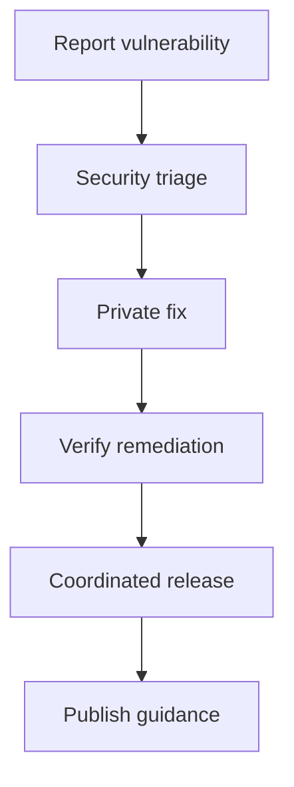

# Security Policy

OMES is an independent, MIT-licensed Omarchy-inspired compatibility layer and deployment
toolkit for Ubuntu Server LTS and Linux Mint, with Hermes Agent as an integrated automation
layer. It is not the official Omarchy distribution.

This document covers how to report a vulnerability in the OMES project itself (this
repository's scripts, modules, and CI). For the project's broader threat model and the
security baseline OMES enforces or checks, see [`docs/threat-model.md`](docs/threat-model.md)
and [`docs/security.md`](docs/security.md).

## Reporting a vulnerability

**Please report privately — do not open a public GitHub issue.**

Report suspected vulnerabilities using GitHub's private security advisory feature on this
repository:

<https://github.com/ahliweb/omes/security/advisories/new>

This creates a private draft advisory visible only to the maintainer(s) until a fix is ready,
which avoids disclosing an exploitable issue (e.g., a supply-chain gap, a privilege-escalation
path, a secret-handling flaw) before there is a patched release.

If you cannot use GitHub's advisory feature, open a regular issue that contains only the
words "security issue, contact requested" and no technical detail; a maintainer will follow up
to arrange a private channel.

Please include, as available:

- affected version (`VERSION` file / release tag) or commit SHA;
- the platform (Ubuntu Server 24.04, Ubuntu 22.04, Linux Mint 22.x, other) and profile
  (server, desktop, hermes) involved;
- reproduction steps or a minimal example;
- the potential impact (e.g., secret exposure, privilege escalation, remote code execution
  via a Telegram-reachable path);
- whether the issue is in OMES's own code or in an upstream dependency it invokes (Hermes
  installer, apt/PPA packages, Docker, Telegram Bot API).

Do not include real secrets (API keys, bot tokens) in a report; describe the exposure path
instead.

## Response expectations

OMES is currently maintained by a single maintainer (ahliweb) without a dedicated security
team or SLA contract. As a best-effort target:

- **Acknowledgment:** within 5 business days of a report through the private advisory
  channel above.
- **Initial assessment** (confirmed / not reproducible / needs more information): within 10
  business days of acknowledgment.
- **Fix or mitigation timeline:** communicated once the issue is assessed, prioritized by
  severity per the categories in [`docs/threat-model.md`](docs/threat-model.md) (a threat
  rated High likelihood / High impact there is treated as higher priority than a Low/Low
  finding).
- **Disclosure:** coordinated with the reporter; a fix is released and the advisory is made
  public (with credit, if desired) once a patched version is available.

These are best-effort targets, not a contractual SLA. There is no paid support tier tied to
response time at this stage of the project (see `docs/research-and-implementation-plan.md`
§5 for the project's current business status).

## Supported versions

OMES follows [Semantic Versioning](https://semver.org/) as recorded in the repository's
`VERSION` file. Until the first `1.0.0` release, OMES is pre-release (`0.x`) software: only
the latest published `0.x` release receives security fixes, and no version is guaranteed
backward-compatible.

| Version range | Supported |
|----------------|-----------|
| Latest release on `main` (current `0.x`) | Yes |
| Older `0.x` releases | No — upgrade to the latest release |
| `1.x` (once released) | Latest minor release within the current major version |

This table will be revised when OMES reaches `1.0.0` and adopts a longer-lived support
window; until then, "supported" means "the version currently tagged as latest."

## Scope

In scope: vulnerabilities in this repository's shell scripts (`bin/`, `lib/`, `modules/`,
`install/`), CI workflows (`.github/workflows/`), and documentation that could lead someone to
configure OMES insecurely (e.g., a documented default that is actually unsafe).

Out of scope (report upstream instead): vulnerabilities in Ubuntu, Linux Mint, Docker,
Hermes Agent itself, the Telegram Bot API, or an LLM provider's platform. If an OMES default
makes exploitation of an upstream issue meaningfully easier (for example, a missing firewall
default that exposes an otherwise-upstream service), that gap in OMES's own defaults is in
scope — please report it here as well as, or instead of, upstream.

## No bug bounty

OMES does not currently operate a paid bug bounty program. Reports are welcomed and credited
in release notes/advisories with the reporter's consent, but no monetary reward is offered at
this stage.

<!-- OMES-MERMAID: SECURITY.md -->

## Visual summary

