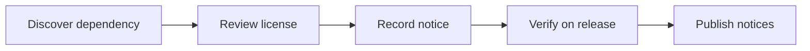

# Third-party notices

OMES itself is licensed under the [MIT License](LICENSE). OMES does not
vendor (copy into this repository) the source code of any third-party
project listed below; it either invokes them as external packages/binaries
installed through the host's package manager or an upstream installer, or
it ships small configuration templates derived from documented, public
configuration formats. This file records what OMES depends on or refers to,
under what license, and how it is used, so that distribution of OMES
remains compliant.

This file is maintained by hand and reviewed whenever a new module or
dependency is added (see [CONTRIBUTING.md](CONTRIBUTING.md)). License
information for third-party projects was checked on 2026-09-18 using the
commands noted per row; re-verify before each release, since upstream
licenses can change.

## License summary

| Component | Upstream | License | How OMES uses it |
|---|---|---|---|
| OMES | this repository | MIT | The project itself. |
| Omarchy | https://github.com/omacom/omarchy | MIT — verified 2026-09-18 via `gh api repos/omacom/omarchy --jq .license` (returned `{"key":"mit","name":"MIT License",...}`) | References only. OMES does not copy Omarchy source, configs, or assets; it is inspired by Omarchy's documented workflow (see [docs/omarchy-compatibility-inventory.md](docs/omarchy-compatibility-inventory.md)) and links to the public [Omarchy manual](https://omarchy.org/manual/) as a source. |
| Hermes Agent | https://github.com/NousResearch/hermes-agent | MIT — verified 2026-09-18 via `gh api repos/NousResearch/hermes-agent --jq .license` (returned `{"key":"mit","name":"MIT License",...}`). Re-verify this at release time: Hermes Agent is a Nous Research product distributed and versioned independently of OMES, and its license metadata can change between releases. | Invokes. OMES downloads Hermes's own installer script to a temporary file (optionally verifying `OMES_HERMES_INSTALLER_SHA256`) and runs it; OMES then invokes the installed `hermes` binary and manages its systemd unit and config paths. No Hermes source is bundled in this repository. |
| Hyprland | https://github.com/hyprwm/Hyprland | BSD-3-Clause | Invokes (optional). On the Linux Mint desktop profile, when a user opts into the Hyprland session, OMES installs the Hyprland package from whatever repository is configured (see [docs/omarchy-compatibility-inventory.md](docs/omarchy-compatibility-inventory.md)) and writes configuration files derived from Hyprland's documented, public config syntax. No Hyprland source is bundled. |
| Ubuntu | https://ubuntu.com | "Ubuntu" and the Ubuntu logo are trademarks of Canonical Ltd. Ubuntu's own package licenses vary per package and are governed by their respective upstream projects and Debian/Ubuntu archive policy. | OMES targets Ubuntu Server as a supported host OS and invokes `apt` to install packages from Ubuntu's own archives. OMES does not redistribute Ubuntu packages and is not affiliated with or endorsed by Canonical. |
| Linux Mint | https://linuxmint.com | "Linux Mint" and its logo are trademarks of the Linux Mint project. | OMES targets Linux Mint as a supported desktop host OS and invokes `apt` to install packages from Ubuntu/Mint archives. OMES does not redistribute Linux Mint packages and is not affiliated with or endorsed by the Linux Mint project. |
| Docker Engine / Docker CLI | https://github.com/moby/moby, https://docs.docker.com | Docker Engine and CLI: Apache License 2.0. "Docker" and the Docker logo are trademarks of Docker, Inc. | Invokes (optional). OMES can install Docker from Docker's official apt repository (Ubuntu) or the underlying Ubuntu codename repository (Mint, with an explicit non-parity warning — see [docs/scope.md](docs/scope.md)) and manages the `docker` systemd service. No Docker source is bundled; OMES never adds a user to the `docker` group without the explicit `--allow-docker-group` flag. |
| Telegram Bot API | https://core.telegram.org/bots/api | "Telegram" is a trademark of Telegram FZ-LLC / Telegram Messenger Inc. The Bot API itself is a public HTTP API, not a redistributed library. | References only, via Hermes. When an operator opts into the Hermes Telegram gateway, Hermes Agent (not OMES) communicates with the Telegram Bot API. OMES never stores a Telegram bot token in this repository or in git history. |

## Additional CLI tooling installed by OMES modules

The tools below are installed on the target host via the host's own package
manager (`apt`) or the tool's own official installer (e.g. `mise`); none of
their source code is vendored in this repository. Licenses are
well-established and stable for these projects; verify the exact license
file shipped with the installed package version if a formal audit requires
it.

| Component | Upstream | License | How OMES uses it |
|---|---|---|---|
| mise | https://github.com/jdx/mise | MIT | Invokes. Installed via mise's official installer; manages language/tool runtime versions for both profiles. |
| Neovim | https://github.com/neovim/neovim | Apache License 2.0 (with some bundled Vim-licensed components) | Invokes. Installed via `apt`; OMES templates a LazyVim-based configuration into the user's config directory. |
| starship | https://github.com/starship/starship | ISC License | Invokes. Installed via `apt` or upstream installer; OMES templates a prompt configuration. |
| fzf | https://github.com/junegunn/fzf | MIT | Invokes. Installed via `apt`. |
| zoxide | https://github.com/ajeetdsouza/zoxide | MIT | Invokes. Installed via `apt` or upstream installer. |
| eza | https://github.com/eza-community/eza | MIT | Invokes. Installed via `apt` (verify per release) or upstream repository. |
| bat | https://github.com/sharkdp/bat | MIT or Apache License 2.0 (dual-licensed) | Invokes. Installed via `apt` (may be named `batcat` on older Ubuntu releases). |
| ripgrep | https://github.com/BurntSushi/ripgrep | MIT or The Unlicense (dual-licensed) | Invokes. Installed via `apt`. |
| fd | https://github.com/sharkdp/fd | MIT or Apache License 2.0 (dual-licensed) | Invokes. Installed via `apt` (may be named `fdfind` on older Ubuntu releases). |
| lazygit | https://github.com/jesseduffield/lazygit | MIT | Invokes. Installed via `apt` (verify per release) or upstream release binary. |
| lazydocker | https://github.com/jesseduffield/lazydocker | MIT | Invokes. Installed via upstream release binary (rarely packaged in `apt`). |
| btop | https://github.com/aristocratos/btop | Apache License 2.0 | Invokes. Installed via `apt`. |

## How to keep this file current

- When a new module adds a dependency on a package, service, or installer
  not listed above, add a row before merging (see
  [CONTRIBUTING.md](CONTRIBUTING.md)).
- When a licensing question is genuinely unresolved (as opposed to merely
  unverified against a specific release), say so explicitly — do not guess.
  This file intentionally marks Hermes Agent's license for re-verification
  at release time because it is an external product with its own release
  cadence.
- Trademark names ("Ubuntu," "Linux Mint," "Docker," "Telegram," "Omarchy")
  are used only nominatively (to say what OMES targets or integrates with),
  never as a claim of affiliation or endorsement. See
  [docs/branding-and-trademarks.md](docs/branding-and-trademarks.md).

<!-- OMES-MERMAID: THIRD_PARTY_NOTICES.md -->

## Visual summary

