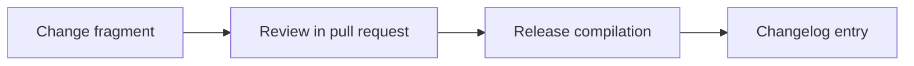

Add docs/scope.md defining what OMES is/is not, its two profiles, non-goals, and the destructive-operation policy.

<!-- OMES-MERMAID: changes/1-scope.md -->

## Visual summary

```mermaid
flowchart LR
    Fragment[Change fragment] --> Review[Review in pull request]
    Review --> Release[Release compilation]
    Release --> Changelog[Changelog entry]
```

