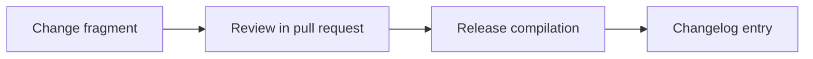

Add OMES positioning statement, per-ICP value propositions, honest alternative comparisons, measurable benefit claims, a trademark-safe messaging do/don't list, and English + Bahasa Indonesia pitches.

<!-- OMES-MERMAID: changes/20-positioning.md -->

## Visual summary

