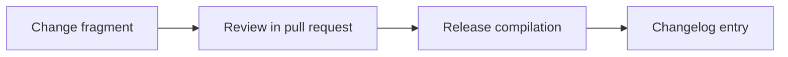

Add OMES competitive-landscape comparison (Omarchy, Omakub, vanilla Ubuntu/Mint, dotfiles, Ansible/NixOS, managed AI platforms, DIY Hermes) with sourced confidence levels, substitutes, and reasons not to choose OMES.

<!-- OMES-MERMAID: changes/21-competitors.md -->

## Visual summary

