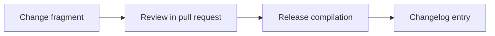

Add OMES business-model evaluation (open-core, paid setup, managed deployment, support, hardening, training, integrations), service package scopes, and an MVP monetization recommendation with kill criteria.

<!-- OMES-MERMAID: changes/22-business-model.md -->

## Visual summary

