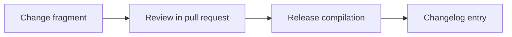

Add the pilot program: internal and external cohorts for server/desktop/Hermes-Telegram deployments, onboarding steps mapped to the OMES CLI contract, instrumentation methodology, feedback template, go/no-go thresholds, and a pilot exit report template.

<!-- OMES-MERMAID: changes/24-pilot-program.md -->

## Visual summary

