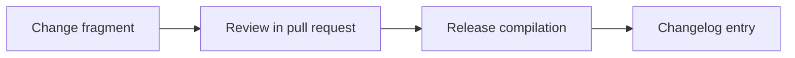

Add support tiers (Community, Assisted, Professional, Business, Enterprise) with scope, channels, non-binding response targets, exclusions, and ASSUMPTION operational cost figures, plus a clearly separated security-sensitive support section and a never-supported list.

<!-- OMES-MERMAID: changes/25-support-tiers.md -->

## Visual summary

