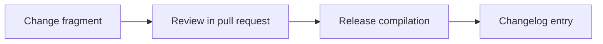

Add THIRD_PARTY_NOTICES.md, docs/branding-and-trademarks.md, and CONTRIBUTING.md to document licensing, trademark usage, and the contribution workflow.

<!-- OMES-MERMAID: changes/26-licensing.md -->

## Visual summary

