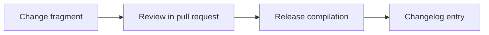

Add release gates for alpha/beta/public with technical and business gates, KPI definitions, kill criteria and re-evaluation triggers, a go/no-go checklist mapping gates to proving issues/artifacts, and a release-readiness review procedure.

<!-- OMES-MERMAID: changes/27-release-gates.md -->

## Visual summary

