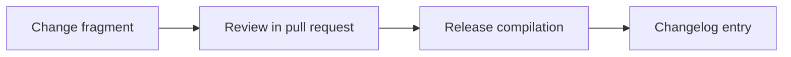

Add the OS/hardware compatibility matrix (support tiers, detection contract, GPU/preflight requirements) and `/etc/os-release` test fixtures for Ubuntu, Mint, Debian, LMDE, and Fedora.

<!-- OMES-MERMAID: changes/3-compatibility-matrix.md -->

## Visual summary

