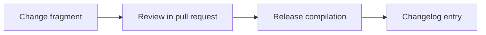

Document the OMES module architecture, execution model, state/backup/logging contracts, and add ADR-0001 through ADR-0010 covering the underlying design decisions.

<!-- OMES-MERMAID: changes/4-architecture.md -->

## Visual summary

