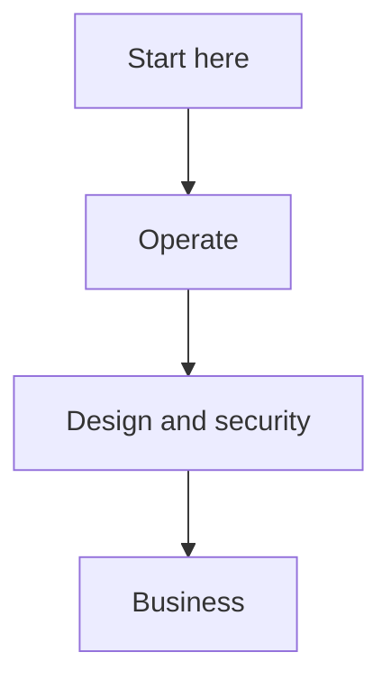

# OMES documentation index

Grouped index of every document in this repository. See the top-level
[README.md](../README.md) for the project overview and quick start.

## Start here

| Document | What it covers |
|---|---|
| [hermes-deployment-guide.md](hermes-deployment-guide.md) | Authoritative, end-to-end Hermes runtime deployment runbook: prerequisites, paths, permissions, service persistence, logs, Telegram allowlists, health, exposure audit, hardening, backups, upgrades, rollback, and removal boundaries. |
| [installation.md](installation.md) | Complete operator walkthrough for a clean machine, both profiles, every privileged command explained, supported vs. unsupported configurations. |
| [troubleshooting.md](troubleshooting.md) | Symptom → cause → fix, organized by exit code and by component. |
| [configuration.md](configuration.md) | Every environment variable OMES reads, grouped by component, with defaults. |
| [cli.md](cli.md) | Full `bin/omes` command reference: flags, exit codes, JSON schemas, worked examples. |
| [compatibility-evidence.md](compatibility-evidence.md) | `omes health versions`/`omes status` compatibility evidence: field list, evidence-is-not-a-guarantee scope note. |

## Operate

| Document | What it covers |
|---|---|
| [ubuntu-server.md](ubuntu-server.md) | The `server` profile end to end: modules, firewall/SSH, update policy, Docker, troubleshooting. |
| [linux-mint.md](linux-mint.md) | The `desktop` profile end to end: package availability, the Cinnamon-fallback guarantee, recovery. |
| [hermes-integration.md](hermes-integration.md) | The `hermes`/`hermes-gateway`/`hermes-gateway-system`/`hermes-restricted` modules: install model, secrets boundary, user-vs-system gateway, restricted/local-only posture, health, exposure audit, backup. |
| [agent-deployment.md](agent-deployment.md) | `omes agent`: per-agent manifest schema, lifecycle, systemd MVP, and the rootless Docker Compose isolation backend. |
| [agent-runtime-boundary.md](agent-runtime-boundary.md) | The runtime-neutral contract OMES needs from any agent runtime, and how Hermes fulfils it today. |
| [hermes-hardening.md](hermes-hardening.md) | Opt-in systemd hardening profiles (`off`/`conservative`/`strict`) for the Hermes gateway unit. |
| [hermes-backup.md](hermes-backup.md) | `omes agent-backup`: Hermes data-class backup/restore, class-to-path mapping, secret exclusion. |
| [telegram-security.md](telegram-security.md) | The Telegram allowlist model, safe chat-id discovery, token rotation, operator checklist. |
| [ollama.md](ollama.md) | The optional local Ollama runtime: health checks, capability profiles, exposure policy. |
| [content-distribution.md](content-distribution.md) | The optional content distribution workflow (inbox, jobs, approvals, worker contract). |
| [content-threat-model.md](content-threat-model.md) | Threat model for the content distribution workflow, cross-referenced with its design and test docs. |
| [graphify.md](graphify.md) | The Graphify/Obsidian integration boundary: what OMES owns vs. what Graphify owns. |
| [graphify-privacy.md](graphify-privacy.md) | Graphify privacy, provenance, and deletion: `.graphifyignore`/`.gitignore` defaults, `init-ignore`/`purge`. |
| [jobs.md](jobs.md) | `omes job`: the OMES-side control job runner (state machine, approval policy, operation table, retry/reconciliation). |
| [provenance.md](provenance.md) | Supply-chain provenance: `omes audit provenance`, recorded package/installer checksums and metadata. |
| [rollback.md](rollback.md) | Backup layout, `omes backup`/`omes restore`/`omes uninstall`, what is and isn't reversible. |
| [disaster-recovery.md](disaster-recovery.md) | Scenario-driven recovery walkthroughs exercised by the integration test suite. |
| [testing.md](testing.md) | The test pyramid (unit/integration bats, container matrix, VM matrix, manual checklist) and how to run each layer. |
| [ci.md](ci.md) | What runs in GitHub Actions, what blocks a PR vs. is advisory, how to run every check locally. |
| [packages.md](packages.md) | `lib/omes/pkg.sh`: package-name mapping, repository validation, the no-PPA-unless-allowlisted policy. |

## Design & security

| Document | What it covers |
|---|---|
| [architecture.md](architecture.md) | The module contract, execution model, state/backup model, exit codes, privilege model. |
| [security.md](security.md) | The security baseline: least-privilege defaults, Telegram/firewall/update policy, secret handling. |
| [ai-data-privacy-and-model-security.md](ai-data-privacy-and-model-security.md) | AI data classification, local/private vs cloud-model boundary, model egress rules, RAG/embedding privacy, and governance references. |
| [threat-model.md](threat-model.md) | Trust boundaries, assets, the full STRIDE threat table and mitigations. |
| [compatibility-matrix.md](compatibility-matrix.md) | Supported OS/hardware matrix, tiers, detection contract. |
| [scope.md](scope.md) | What OMES is and is not, non-goals, the destructive-operation policy. |
| [omarchy-compatibility-inventory.md](omarchy-compatibility-inventory.md) | Capability-by-capability PORT/ADAPT/DEFER/REJECT decisions against upstream Omarchy. |
| [branding-and-trademarks.md](branding-and-trademarks.md) | Naming rules and the required disclaimer text. |
| [adr/](adr/README.md) | Architecture Decision Records. |
| [research-and-implementation-plan.md](research-and-implementation-plan.md) | The original research baseline and phased implementation plan. |
| [agent-orchestration-roadmap.md](agent-orchestration-roadmap.md) | Staged agent deployment roadmap: native systemd MVP, rootless Compose isolation, optional Coolify backend, and evidence-gated Nomad/Kubernetes evaluation. |
| [control-center-and-integrations.md](control-center-and-integrations.md) | AWCMS-based Control Center boundary, idempotent jobs, billing, Cloudflare, SRS-X, GitHub, DNS, provider reconciliation, and the shipped-versus-deferred delivery status. |
| [control-center-release-closeout.md](control-center-release-closeout.md) | Evidence record for the Control Center release (epic #195, issue #202): verification gates, ownership-boundary checks, operator flow, recovery guidance, and deferred work. |
| [control-center-contracts.md](control-center-contracts.md) | Versioned wire contract between an AWCMS-based Control Center, OMES, and Hermes. |
| [control-center-foundation.md](control-center-foundation.md) | OMES-side contract deliverable for the Control Center foundation issue; the web GUI/tenant/RBAC layers are implemented in `ahliweb/awcms`. |
| [control-center-threat-model.md](control-center-threat-model.md) | Design-stage threat model for the Control Center boundary, ahead of a running implementation. |
| [coolify-adapter.md](coolify-adapter.md) | The optional Coolify deployment adapter: fake-provider contracts, what is and isn't wired up yet. |
| [domain-providers.md](domain-providers.md) | Domain registrar/DNS provider abstraction, capabilities, and provider profiles (issues #98-#102). |
| [web-panel-reference-evaluation.md](web-panel-reference-evaluation.md) | Herman web-panel evaluation: adopted UX patterns, rejected boundaries, fit matrix, security adaptations, and implementation mapping. |

## Business

| Document | What it covers |
|---|---|
| [business/README.md](business/README.md) | Index of the business/go-to-market documents. |
| [business/business-model.md](business/business-model.md) | Business model. |
| [business/competitive-landscape.md](business/competitive-landscape.md) | Competitive landscape. |
| [business/graphify-use-cases.md](business/graphify-use-cases.md) | Graphify/Obsidian use cases, value-vs-novelty separation, measurement plan, and packaging recommendation. |
| [business/icp-and-customer-discovery.md](business/icp-and-customer-discovery.md) | Ideal customer profile and discovery notes. |
| [business/pilot-program.md](business/pilot-program.md) | Pilot program design. |
| [business/positioning.md](business/positioning.md) | Product positioning. |
| [business/release-gates.md](business/release-gates.md) | Release gate criteria. |
| [business/support-tiers.md](business/support-tiers.md) | Support tier definitions. |
| [business/unit-economics.md](business/unit-economics.md) | Unit economics. |

## Contracts and skills

| Document | What it covers |
|---|---|
| [contracts/README.md](../contracts/README.md) | Versioned JSON schemas, request/response contracts, fixtures, and validation boundaries for OMES, AWCMS, and provider integrations. |
| [skills/content/SKILL.md](../skills/content/SKILL.md) | Repository-local content workflow guidance; documentation only, not a second OMES runtime. |
| [modules/graphify/skill/SKILL.md](../modules/graphify/skill/SKILL.md) | Graphify module skill boundary; operational guidance, not a replacement for OMES runtime contracts. |

<!-- OMES-MERMAID: docs/README.md -->

## Visual summary

