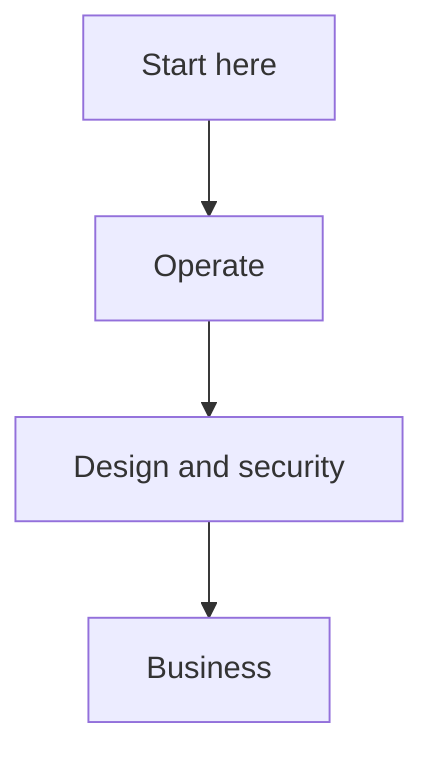

# OMES documentation index

Grouped index of every document in this repository. See the top-level
[README.md](../README.md) for the project overview and quick start.

## Start here

| Document | What it covers |
|---|---|
| [installation.md](installation.md) | Complete operator walkthrough for a clean machine, both profiles, every privileged command explained, supported vs. unsupported configurations. |
| [troubleshooting.md](troubleshooting.md) | Symptom → cause → fix, organized by exit code and by component. |
| [configuration.md](configuration.md) | Every environment variable OMES reads, grouped by component, with defaults. |
| [cli.md](cli.md) | Full `bin/omes` command reference: flags, exit codes, JSON schemas, worked examples. |

## Operate

| Document | What it covers |
|---|---|
| [ubuntu-server.md](ubuntu-server.md) | The `server` profile end to end: modules, firewall/SSH, update policy, Docker, troubleshooting. |
| [linux-mint.md](linux-mint.md) | The `desktop` profile end to end: package availability, the Cinnamon-fallback guarantee, recovery. |
| [hermes-integration.md](hermes-integration.md) | The `hermes`/`hermes-gateway`/`hermes-gateway-system` modules: install model, secrets boundary, user-vs-system gateway. |
| [telegram-security.md](telegram-security.md) | The Telegram allowlist model, safe chat-id discovery, token rotation, operator checklist. |
| [rollback.md](rollback.md) | Backup layout, `omes backup`/`omes restore`/`omes uninstall`, what is and isn't reversible. |
| [testing.md](testing.md) | The test pyramid (unit/integration bats, container matrix, VM matrix, manual checklist) and how to run each layer. |
| [ci.md](ci.md) | What runs in GitHub Actions, what blocks a PR vs. is advisory, how to run every check locally. |
| [packages.md](packages.md) | `lib/omes/pkg.sh`: package-name mapping, repository validation, the no-PPA-unless-allowlisted policy. |

## Design & security

| Document | What it covers |
|---|---|
| [architecture.md](architecture.md) | The module contract, execution model, state/backup model, exit codes, privilege model. |
| [security.md](security.md) | The security baseline: least-privilege defaults, Telegram/firewall/update policy, secret handling. |
| [threat-model.md](threat-model.md) | Trust boundaries, assets, the full STRIDE threat table and mitigations. |
| [compatibility-matrix.md](compatibility-matrix.md) | Supported OS/hardware matrix, tiers, detection contract. |
| [scope.md](scope.md) | What OMES is and is not, non-goals, the destructive-operation policy. |
| [omarchy-compatibility-inventory.md](omarchy-compatibility-inventory.md) | Capability-by-capability PORT/ADAPT/DEFER/REJECT decisions against upstream Omarchy. |
| [branding-and-trademarks.md](branding-and-trademarks.md) | Naming rules and the required disclaimer text. |
| [adr/](adr/README.md) | Architecture Decision Records. |
| [research-and-implementation-plan.md](research-and-implementation-plan.md) | The original research baseline and phased implementation plan. |

## Business

| Document | What it covers |
|---|---|
| [business/README.md](business/README.md) | Index of the business/go-to-market documents. |
| [business/business-model.md](business/business-model.md) | Business model. |
| [business/competitive-landscape.md](business/competitive-landscape.md) | Competitive landscape. |
| [business/icp-and-customer-discovery.md](business/icp-and-customer-discovery.md) | Ideal customer profile and discovery notes. |
| [business/pilot-program.md](business/pilot-program.md) | Pilot program design. |
| [business/positioning.md](business/positioning.md) | Product positioning. |
| [business/release-gates.md](business/release-gates.md) | Release gate criteria. |
| [business/support-tiers.md](business/support-tiers.md) | Support tier definitions. |
| [business/unit-economics.md](business/unit-economics.md) | Unit economics. |

<!-- OMES-MERMAID: docs/README.md -->

## Visual summary

