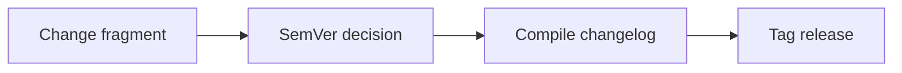

# ADR-0010: Versioning via SemVer + change fragments compiled at release

- Status: Accepted
- Date: 2026-09-18

## Context

OMES needs a versioning scheme (referenced by `omes.version` and
`module.<name>.version` in the state model, `docs/architecture.md`
Section 6.3) and a way to accumulate a changelog across many
concurrently-developed PRs without merge conflicts on a single shared
`CHANGELOG.md`. The brief already mandates the mechanics: a `VERSION`
file, a `changes/` directory where every PR adds one fragment file
(`changes/<issue>-<slug>.md` with an `issue`/`type` front-matter and a
one-line description), an explicit rule that `CHANGELOG.md` is compiled at
release time and never hand-edited, and git tags of the form `vX.Y.Z`.
This ADR records why this specific scheme (SemVer + change fragments) was
chosen over the alternatives.

Candidates considered: SemVer `VERSION` file + `changes/` fragments
compiled into `CHANGELOG.md` at release (adopted), directly hand-editing a
shared `CHANGELOG.md` in every PR, and date-based/CalVer versioning with
no structured change-fragment mechanism.

## Options considered

### Option A: SemVer `VERSION` file, `changes/*.md` fragments per PR, compiled into `CHANGELOG.md` at release, tagged `vX.Y.Z`

- Security: a single, unambiguous `VERSION` file gives every module's
  `module.<name>.version` state key (Section 6.3) an authoritative,
  greppable source to compare against, which supports drift detection
  (`omes update` can tell a module was applied under an older OMES
  version) without parsing git history or tags at runtime.
- Performance: change fragments are tiny files; compiling them at release
  time is a one-off script run, not a cost paid on every `omes` invocation
  or even every PR merge.
- Maintainability: this is the core benefit — many contributors/agents
  working in parallel worktrees (as this very task demonstrates) each add
  their own `changes/<issue>-<slug>.md` file, which cannot merge-conflict
  with another PR's fragment the way concurrent edits to one shared
  `CHANGELOG.md` section would. SemVer gives a shared, well-understood
  vocabulary (major/minor/patch) for what kind of change is being shipped.
- Scalability: scales with contributor/PR count precisely because
  fragments are independent files — this is the same rationale changesets-
  style tooling in other ecosystems uses for the identical problem.
- Compatibility: SemVer's meaning (breaking/feature/fix) maps cleanly onto
  OMES's own module contract changes — e.g. a change to the state key
  namespace (Section 6.3) or the module contract (Section 4) is a
  candidate major bump; a new module or profile is a candidate minor
  bump; a bug fix is a patch.
- Operational complexity: operators get one clear, orderable version
  string (`vX.Y.Z` git tags) to reference when filing issues or asking
  "what version introduced this," and `CHANGELOG.md` at release time
  reads as a curated, deduplicated summary rather than a raw commit log.
- Long-term implications: requires a release-time compilation step
  (a script or workflow that concatenates/sorts `changes/*.md` fragments
  into a new `CHANGELOG.md` section and clears the `changes/` directory)
  to exist and be maintained — Implementation status: tracked alongside
  the release process (not yet a separate issue at time of writing;
  referenced here so the ADR does not overstate what exists).

### Option B: Hand-edit a single shared `CHANGELOG.md` directly in every PR

- Security: no material security difference.
- Performance: no material difference.
- Maintainability: worse — every concurrent PR touching `CHANGELOG.md`'s
  "Unreleased" section is a near-guaranteed merge conflict once more than
  one PR is open at a time, which is exactly the situation this repository
  is already in (multiple parallel worktrees/agents working issues #1-#27
  concurrently per the brief). This was the primary reason to reject this
  option.
- Scalability: actively degrades as contributor/PR concurrency increases,
  the opposite of what OMES needs given its multi-agent, multi-worktree
  development model.
- Compatibility: no material difference.
- Operational complexity: rebasing/resolving `CHANGELOG.md` conflicts
  becomes a routine tax on every contributor, and increases the chance a
  change's log entry is silently dropped during a conflict resolution.
- Long-term implications: does not scale into a release process with
  many contributors; rejected specifically because of the concurrency
  cost.

### Option C: Date-based/CalVer versioning with no structured change-fragment mechanism (e.g. free-form commit-log-derived changelog)

- Security: no material difference from Option A regarding the versioning
  scheme itself.
- Performance: no material difference.
- Maintainability: a commit-log-derived changelog (e.g. auto-generated
  from conventional-commit messages at release time) avoids the
  merge-conflict problem of Option B, but loses the deliberate,
  human-curated "one-line description of the user-visible change" that a
  dedicated fragment file provides — commit messages are written for
  version-control history, not necessarily for an end-user-facing
  changelog entry, and the brief's own working rules already mandate a
  separate, structured fragment per PR regardless.
- Scalability: comparable to Option A on the merge-conflict axis (both
  avoid a shared shared-file conflict), but CalVer (e.g. `2026.09`) does
  not carry SemVer's breaking/feature/fix signal, which matters for a
  tool making contract guarantees (module interface, state key namespace,
  exit codes) that operators and module authors need to know about
  changing or not changing across versions.
- Compatibility: SemVer's major-version-bump convention is a stronger,
  more standard signal for "this may break your existing modules/state"
  than a date-based scheme, which says only "when," not "how disruptive."
- Operational complexity: no material difference from Option A on this
  axis.
- Long-term implications: rejected primarily because SemVer's
  breaking-change signal is directly useful for OMES's own module/state
  contract stability guarantees (Sections 4 and 6 of
  `docs/architecture.md`), which a purely date-based scheme does not
  communicate.

## Decision

Version OMES with SemVer (`MAJOR.MINOR.PATCH`) recorded in a single
`VERSION` file at the repository root — the authoritative source for
`omes.version`/`module.<name>.version` state keys. Every PR that makes a
user-visible change adds exactly one fragment file at
`changes/<issue>-<slug>.md` with `issue`/`type` front-matter
(`type` one of `added|changed|fixed|docs|ci|security`) and a one-line
description. `CHANGELOG.md` is never hand-edited; it is compiled from
`changes/*.md` fragments at release time, after which the fragments are
cleared and a `vX.Y.Z` git tag is created matching the new `VERSION`.

## Consequences

- Every PR in this repository (including this one) must add exactly one
  `changes/<issue>-<slug>.md` fragment — enforced by the brief's working
  rules, not optionally.
- A major version bump is warranted for changes to the module contract
  (Section 4), the state key namespace (Section 6.3), or the exit code
  table (Section 9) — these are the load-bearing contracts external
  modules/operators depend on.
- The release-time compilation step (fragment → `CHANGELOG.md`, tag
  creation, and verification) is automated via `scripts/release.sh` (issue #168).
  It enforces:
  1. Clean `main` branch and green CI checks on the release commit.
  2. Compilation of `changes/*.md` fragments into `CHANGELOG.md` and bump of `VERSION`.
  3. Synchronization of `README.md` version claims.
  4. Creation of annotated tag `vX.Y.Z` pointing to the exact release commit.
  5. Refusal to rewrite or retarget existing public release tags.
  6. Optional push, GitHub Release creation, and read-back verification.
- The release process generates and verifies a comprehensive Release Evidence Bundle
  (issue #173, `scripts/generate-release-bundle.py`, `scripts/verify-release-bundle.py`):
  `release-manifest.json` (schema-validated), `sbom.json` (CycloneDX 1.5 format),
  `provenance.slsa.json` (in-toto SLSA v1.0 provenance attestation),
  `compatibility-evidence.json` (fail-closed OS/scenarios), `recovery-evidence.json`,
  `security-checks.json`, `limitations.json`, and `SHA256SUMS`. Releases cannot proceed
  with unverified, missing, or tampered evidence artifacts.
- **Historical divergence note (`v0.3.0`, issue #168)**: Git tag `v0.3.0` points
  immutably to commit `626751635ca1f43993679cecf076850f86ba0845`. A subsequent
  rebase on `main` produced commit `f669f08365a716f60908e2e1ef180f1e8e3fff2f`.
  Per ADR-0010 and security policy, existing public release tags are never force-moved;
  all releases after `v0.3.0` enforce strict linear ancestry and required check
  verification via `scripts/release.sh`.
- `docs/architecture.md`'s repository layout (Section 2) reflects
  `VERSION`, `CHANGELOG.md`, and `changes/` exactly as this ADR defines
  them.
- **CI-time validation (issue #238)**: the `v0.4.0` release found 22 of 32
  pending fragments the compile step in `scripts/release.sh` could not
  parse, all merged through green CI, because nothing validated a fragment
  before release time. `scripts/release.sh --validate-fragments` now runs
  the same fragment parser the compile step uses (a single shared
  `fragment_errors` function, not a second implementation) as a blocking
  check on every pull request — see [docs/ci.md](../ci.md) Section 9 and
  [CONTRIBUTING.md](../../CONTRIBUTING.md) Section 4 for the exact rules
  enforced (frontmatter, positive-integer `issue`, ADR-0010 `type`, and a
  single-paragraph body).

<!-- OMES-MERMAID: docs/adr/0010-versioning-and-change-fragments.md -->

## Visual summary

