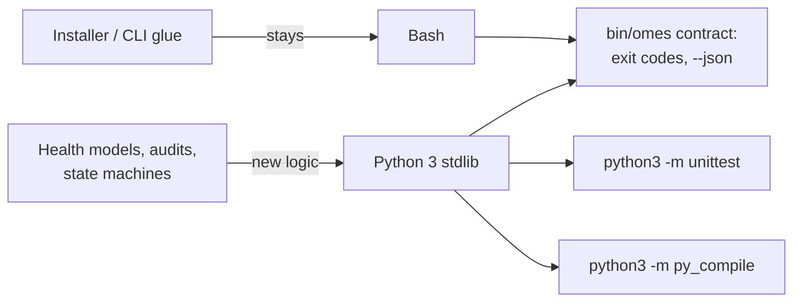

# ADR-0012: Python 3 stdlib only for workflow engines; bash stays the installer/CLI glue

- Status: Accepted
- Date: 2026-09-19

## Context

Issues #71, #79, and #80 (layered Ollama health checks, a layered agent
health/readiness model, and a gateway exposure audit) each need JSON
schema-shaped validation, small state machines (service → model →
capability layers; host → runtime → gateway → provider → channel
layers), retry/timeout logic, and structured parsing (Ollama's HTTP API
responses, `ss -H -tulpn` listener tables). OMES today is entirely Bash
(ADR-0001). Bash can do string processing and can shell out to `curl`,
but bounded-timeout HTTP calls with JSON body parsing, JSON Schema-style
validation, and multi-layer status aggregation become fragile and hard to
test correctly in Bash — quoting, subshell exit-code propagation, and
JSON escaping errors compound quickly once the logic is no longer "run a
command and check its exit code."

This ADR decides how OMES adds that logic without abandoning ADR-0001's
reasoning for the parts of OMES that reasoning still applies to
(installer/CLI glue, module lifecycle, privilege and platform checks).

## Options considered

### Option A: Bash-only (extend the existing pattern)

- Security: no new interpreter or dependency surface; but JSON
  construction/parsing in Bash (as `lib/omes/json.sh` already shows for
  simple flat objects) becomes unsafe or unreadable for nested,
  variable-shaped structures like Ollama's `/api/tags`, `/api/ps`, and
  `/api/embed` responses, or a JSON Schema validator — the risk of a
  quoting/escaping bug that corrupts `--json` output or misparses a
  malicious/malformed response is materially higher than in a language
  with a real JSON parser.
- Performance: shelling out to `curl`/`jq`-free parsing per field is slow
  and multiplies subprocess overhead for layered checks that already need
  several HTTP round trips.
- Maintainability: today's Bash codebase is disciplined and well-tested,
  but nested JSON tree-walking and JSON Schema-shaped validation in Bash
  is exactly the kind of logic that becomes unmaintainable line-noise
  (`jq`-less, no arrays-of-objects support, associative arrays are the
  closest thing to a struct).
- Scalability: does not scale to the number of capability checks #71
  specifies (chat, structured output, tool calling, embeddings, vision)
  without duplicating substantial parsing logic per check.
- Compatibility: stays within the existing toolchain (bash + coreutils +
  curl), no new runtime requirement on the host.
- Operational complexity: no new interpreter to install; but every new
  health/audit check becomes a new source of subtle Bash JSON bugs.
- Long-term implications: locks every future workflow-engine-shaped
  feature (health models, audits, future agent-deployment state machines
  per docs/agent-orchestration-roadmap.md) into the same fragile pattern.

### Option B: Python 3 stdlib only (adopted)

- Security: `urllib.request`, `json`, `subprocess`, and `http.server`
  (for fakes in tests) are stdlib, well-audited, and widely deployed;
  adding no third-party package means no new supply-chain surface (no
  `pip install`, no `requirements.txt`, no transitive dependency tree to
  audit or pin) — consistent with the repository's existing no-new-attack-surface
  posture (docs/security.md §6, supply-chain rules). `python3` is already
  present on every OMES-supported platform (Ubuntu Server 24.04/22.04,
  Linux Mint 22.x all ship it, and `tests/run.sh`'s bats image already
  needed python3 for JSON-validity assertions before this ADR).
- Performance: a real JSON parser, real HTTP client with per-request
  timeouts (`urllib.request.urlopen(req, timeout=N)`), and real data
  structures (dicts/lists) make bounded, layered checks straightforward
  and fast to write correctly; one Python process replaces several `curl`
  + text-munging subprocess chains per check.
- Maintainability: the health/audit logic (issues #71, #79, #80) is
  naturally expressed as small pure functions operating on parsed JSON —
  testable with `python3 -m unittest` and stdlib `http.server`-based
  fakes, without a container or real Ollama/Hermes instance, which is
  more thorough and more maintainable than shell-based bats fixtures
  alone for this class of logic.
- Scalability: adding a new capability check or a new health layer is a
  new function plus a unit test with a fake HTTP response, not new
  Bash string-parsing.
- Compatibility: `python3 -m py_compile` and `python3 -m unittest` are
  cheap, deterministic CI steps; stdlib-only means no version pinning
  problem across Ubuntu 22.04/24.04's differing default Python 3 minor
  versions (3.10 vs 3.12) beyond stdlib API stability, which the stdlib
  guarantees far more strongly than any third-party package would.
- Operational complexity: no virtualenv, no `pip`, no PEP 668
  externally-managed-environment friction (the same PEP 668 constraint
  that makes `docs/research-and-implementation-plan.md`'s Graphify
  integration require `uv tool install` rather than system pip) — a
  stdlib-only script runs with the system `python3` as-is.
- Long-term implications: establishes one consistent pattern for every
  future workflow-engine-shaped feature (agent deployment lifecycle state
  machine, provenance hashing/retry logic) without opening the door to
  arbitrary PyPI dependencies, which would reintroduce exactly the
  supply-chain and environment-management problems this decision avoids.

### Option C: Adopt a new dependency (e.g. `requests`, `jsonschema`, `pydantic`)

- Security: every dependency is a new supply-chain trust boundary
  (transitive dependencies, install-time code execution via
  `setup.py`/build backends, version drift); AGENTS.md §3 and
  docs/security.md §6 already treat unaudited new dependencies as a cost
  to justify, not a default.
- Performance: negligible improvement over stdlib `urllib`/`json` for the
  request volumes involved (a handful of bounded HTTP calls per check
  run).
- Maintainability: convenience APIs (`requests`, `jsonschema`) are
  pleasant, but the actual logic needed (GET/POST with a timeout, parse
  JSON, validate a small fixed set of fields) does not need a general
  JSON Schema engine or a full HTTP client library to be readable.
- Scalability: no material advantage at this feature set's size.
- Compatibility: requires `pip install` (blocked by PEP 668 on
  externally-managed Debian/Ubuntu Python by default) or a vendored
  virtualenv the installer would need to create and maintain — new
  installation-time complexity and failure modes (network access at
  install time, wheel availability for the host's Python/arch) that a
  stdlib-only approach avoids entirely.
- Operational complexity: a virtualenv or `pip install --break-system-packages`
  step becomes a new failure mode in `module_check`/`module_apply` for
  every health/audit feature, and a new offline/air-gapped install
  scenario to document and support.
- Long-term implications: once one third-party Python dependency is
  accepted, the bar for the next one erodes, moving OMES away from its
  current small, auditable dependency footprint.

## Decision

Bash remains the implementation language for installer/module/CLI glue —
platform detection, privilege checks, module lifecycle (check → apply →
verify → rollback), state and backup management, and the `bin/omes`/
`lib/omes/cmd/<name>.sh` command surface (ADR-0001 stands for that
scope). New workflow-engine-shaped logic — JSON Schema-style validation,
multi-layer health/readiness state machines, structured HTTP API
consumption, and similar state-machine/parsing-heavy logic — is written
in Python 3 using **only the standard library** (no `pip`, no
`requirements.txt`, no vendored third-party packages). Python code lives
under `lib/omes/py/<package>/`, with `python3 -m unittest` tests under
`tests/py/<package>/`. Bash invokes it as
`python3 "$OMES_ROOT/lib/omes/py/<pkg>/cli.py" ...`, passing structured
data as JSON on stdin/argv and reading a single JSON object back on
stdout under `--json` — never secrets on argv, matching the existing
`bin/omes` contract (docs/cli.md, docs/architecture.md §3).

This decision governs `lib/omes/py/health/*` (issues #71, #79) and
`lib/omes/py/exposure` logic (issue #80) introduced in this batch, and is
intended to be the default answer for future workflow-engine-shaped work
referenced by docs/agent-orchestration-roadmap.md (the agent deployment
lifecycle state machine, provenance hashing) unless a future ADR
supersedes it with evidence that stdlib is no longer sufficient.

## Consequences

- `tests/run.sh` gains a `python3 -m unittest discover -s tests/py -t .`
  step (added once, by whichever change is first to add a `tests/py/`
  suite) alongside ShellCheck and bats, and a `python3 -m py_compile`
  pass over every file under `lib/omes/py/` — both must be green for a
  PR to merge.
- Any `import` in `lib/omes/py/**` outside the Python standard library is
  a review-blocking violation of this ADR; there is no `requirements.txt`
  and none should be added without a superseding ADR.
- Python modules must not receive secrets via `sys.argv` (visible in
  `ps`); bash callers pass secret *references* (env var names, file
  paths) and the Python side reads secret values itself when unavoidable
  (e.g. a bearer token file path), never accepting the value itself as a
  command-line argument.
- `lib/omes/py/*/cli.py` entry points follow the same exit-code and
  `--json` contract as `bin/omes` (docs/cli.md §2–3) so bash callers
  (`lib/omes/cmd/health.sh`, `lib/omes/cmd/audit.sh`, module
  `module_doctor` hooks) can treat them exactly like any other checked
  subprocess.
- Fakes for tests (a fake Ollama, a fake `ss`/`ufw` listener table) are
  built with stdlib `http.server` / plain text fixtures, not a real
  network dependency — keeping `tests/py` runnable offline and in CI
  without Docker.

<!-- OMES-MERMAID: docs/adr/0012-python-stdlib-for-workflow-engines.md -->

## Visual summary

