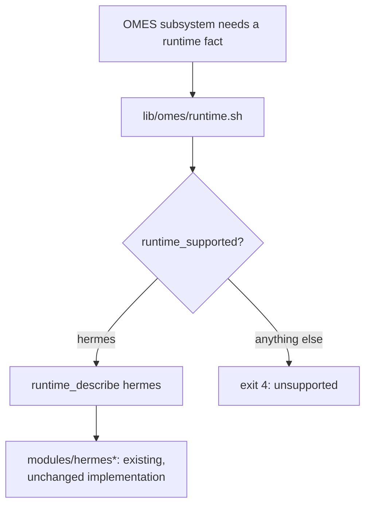

# ADR-0013: Agent-runtime abstraction boundary, with Hermes as the only implementation

- Status: Accepted
- Date: 2026-09-19

## Context

OMES deploys, configures, checks, backs up, and hardens Hermes Agent. The
backlog (docs/agent-orchestration-roadmap.md) and issue #85 ask OMES to
define install/preflight/verify/service/health/provenance/backup/rollback
contracts in a way that does not hardcode "Hermes" into every OMES-side
concept, so a future second runtime would not require rewriting OMES's
module, health, and audit surfaces from scratch. At the same time, OMES
must not become a second agent runtime, reimplement Hermes's channels,
memory, skills, sessions, browser automation, cron, webhooks, model
routing, or dashboards, or pretend a second runtime is supported before
one actually exists.

## Options considered

### Option A: Keep everything Hermes-specific, no shared contract

- Security: no new abstraction to get wrong, but also no single place to
  audit "what does OMES assume about any agent runtime" — Hermes-specific
  assumptions (HERMES_HOME resolution, unit names) are duplicated across
  `modules/hermes*`, and any future health/audit code that also needs
  them (issues #71, #79, #80) would re-derive them independently, risking
  drift (e.g. one place assumes `~/.hermes`, another a stale override).
- Performance: no difference.
- Maintainability: low — the same runtime facts (HERMES_HOME resolution,
  `hermes-gateway` unit name, version-check command) are already computed
  in `modules/hermes/module.sh` and `modules/hermes-gateway/module.sh`
  independently before this ADR; a third and fourth consumer (health
  model, audit) would triple that duplication.
- Scalability: does not scale — every new OMES subsystem that needs a
  runtime fact re-implements the same lookup.
- Compatibility: no impact.
- Operational complexity: low short-term, but growing duplication is
  itself a form of complexity (more places to update when a fact
  changes).
- Long-term implications: if a second runtime is ever evaluated, every
  consumer of Hermes-specific facts must be found and generalized at
  once — a large, risky, all-at-once refactor instead of an incremental
  one.

### Option B: Build a full runtime plugin/adapter framework now, for a hypothetical second runtime

- Security: speculative abstraction increases the amount of code to
  audit for a capability (a second runtime) that does not exist yet and
  is explicitly out of scope for this issue and this roadmap phase.
- Performance: no material difference; added indirection has a small,
  probably irrelevant cost.
- Maintainability: worse in the near term — a plugin system designed
  against a single real implementation (Hermes) tends to encode
  Hermes-shaped assumptions into "generic" interfaces anyway, then needs
  reworking once a genuinely different second runtime's constraints are
  known.
- Scalability: unproven — without a second real runtime to design
  against, the abstraction boundary is a guess.
- Compatibility: no impact today; risks being wrong about what a second
  runtime would actually need.
- Operational complexity: adds real complexity (a plugin loader,
  capability negotiation, versioned interfaces) to solve a problem OMES
  does not have yet, contradicting the roadmap's explicit non-goal
  ("adopt Nomad/Kubernetes without measured requirements" — the same
  evidence-gated principle applies to a runtime plugin system).
- Long-term implications: risks becoming unused machinery, or worse,
  actively wrong machinery that the eventual second runtime does not fit,
  requiring a rewrite anyway.

### Option C: A small, explicit contract layer (`lib/omes/runtime.sh`) with exactly one supported runtime, documented non-goals, and isolation requirements written down for the future (adopted)

- Security: centralizes the runtime facts every OMES subsystem needs
  (`runtime_describe`, `runtime_home`, `runtime_service_unit`) in one
  reviewable file, and explicitly documents the isolation requirements
  (separate users, ports, state directories, credentials, browser
  profiles, health checks) a future runtime would need to meet BEFORE it
  is added — turning a security review into a checklist rather than an
  afterthought.
- Performance: negligible — a few Bash function calls replace equivalent
  inline logic.
- Maintainability: the single highest-leverage option — Hermes-specific
  facts move to one place (`lib/omes/runtime.sh`), reducing duplication,
  while `modules/hermes*` keep their existing, already-tested behavior
  (this ADR does not mandate rewriting them; it mandates that *new*
  runtime-fact lookups go through the contract layer).
- Scalability: the contract (install, preflight, verify, service, health,
  provenance, backup classes, rollback) is sized for exactly the
  interfaces OMES's existing architecture already needs (module
  check/apply/verify/rollback, `omes doctor`'s `module_doctor` hook,
  backup/restore) rather than a speculative superset.
- Compatibility: `runtime_supported()` only returns true for `hermes`
  today; `runtime_require()` fails closed (exit 4) for anything else, so
  no caller can silently treat an unsupported name as if it worked.
- Operational complexity: minimal — one new library file, sourced
  explicitly by the commands/modules that need it (bin/omes is not
  modified — see docs/cli.md §4.12 and lib/omes/cmd/README.md for how
  extension commands and their libraries are wired in without touching
  the core CLI entry point).
- Long-term implications: when a second runtime is genuinely evaluated,
  the isolation requirements in docs/agent-runtime-boundary.md become the
  acceptance checklist, and `runtime_supported`/`runtime_describe` are
  the two functions that change first — a bounded, reviewable diff
  instead of a repository-wide refactor.

## Decision

1. **Hermes-specific vs. runtime-neutral.** `modules/hermes*` remain
   Hermes-specific implementations (they call `hermes`, manage
   `HERMES_HOME`, `hermes-gateway` systemd units, and Hermes's own
   `.env`/config files directly). `lib/omes/runtime.sh` is the
   runtime-neutral contract layer: `runtime_supported <name>`,
   `runtime_require <name>` (dies exit 4 for anything but `hermes`), and
   `runtime_describe <name>` (JSON metadata: name, version command, home
   env var, service unit names per scope, health probe entrypoint,
   backup classes, provenance sources — see
   docs/agent-runtime-boundary.md for the full interface table and
   tests/fixtures/runtime/hermes.json for the exact shape). New
   subsystems that need a runtime fact (the health model in #71/#79, the
   audit in #80) read it from `lib/omes/runtime.sh`, not by re-deriving
   it.
2. **Non-goals.** This ADR and issue #85 do not add a second runtime,
   do not reimplement channels, memory, skills, sessions, browser
   automation, cron, webhooks, model/provider routing, or dashboards —
   all of those remain exclusively Hermes's responsibility. OMES does
   not gain a plugin-loading mechanism; `runtime_supported` is a fixed
   allowlist of one name.
3. **Isolation requirements for any future runtime.** Before OMES ever
   adds a second `runtime_supported` entry, that runtime's OMES
   integration must define: a dedicated non-root service account/user
   distinct from any other runtime's; non-overlapping ports and unit
   names; a separate state/home directory tree (never shared with
   Hermes's `HERMES_HOME`); its own credential/secret references (never
   sharing a `.env` or token with another runtime); its own browser
   automation profile directory, if applicable; and its own bounded,
   read-only health probe entrypoint reachable the same way
   `runtime_describe`'s `health_probe` field is reachable for Hermes
   today. These requirements are recorded in full in
   docs/agent-runtime-boundary.md so they are reviewable independent of
   any specific runtime's PR.

## Consequences

- `lib/omes/runtime.sh` is additive; it does not change
  `modules/hermes*`'s existing, tested behavior — MODULE_SCOPE, unit
  names, and `HERMES_HOME` resolution stay exactly as they are today, and
  every existing hermes/hermes-gateway/hermes-gateway-system test keeps
  passing unmodified.
- `bin/omes` is not edited to source `lib/omes/runtime.sh` directly (out
  of this issue's file scope); consumers (`lib/omes/cmd/health.sh`,
  `lib/omes/cmd/audit.sh`, and any `module_doctor` hook that needs it)
  source it themselves, the same pattern
  `modules/hermes-gateway/telegram-allowlist.sh` already uses for
  `lib/omes/core.sh`/`lib/omes/log.sh`.
- A future PR proposing a second runtime must update
  `runtime_supported`/`runtime_describe`, add a matching fixture under
  `tests/fixtures/runtime/`, and demonstrate the isolation requirements
  in this ADR are met — this ADR is the acceptance bar for that PR, not
  a decision that a second runtime is coming.
- Documentation describing Hermes-specific behavior (docs/hermes-integration.md)
  is unchanged in substance; it gains a pointer to
  docs/agent-runtime-boundary.md for readers who want the runtime-neutral
  framing.

<!-- OMES-MERMAID: docs/adr/0013-agent-runtime-boundary.md -->

## Visual summary

