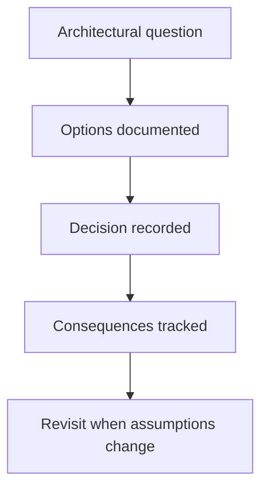

# Architecture Decision Records

This directory records the decisions behind the OMES architecture
described in [`docs/architecture.md`](../architecture.md), in a MADR-lite
format: Title, Status, Date, Context, Options considered (with pros/cons
across security, performance, maintainability, scalability, compatibility,
operational complexity, and long-term implications), Decision, Consequences.

All ADRs below were authored on 2026-09-18 as part of issue
[#4](https://github.com/ahliweb/omes/issues/4), "Design OMES module
architecture and state model."

| ADR | Title | Status |
|---|---|---|
| [0001](0001-bash-as-implementation-language.md) | Bash as the implementation language | Accepted |
| [0002](0002-explicit-state-file.md) | Explicit key=value state file | Accepted |
| [0003](0003-module-contract-check-apply-verify-rollback.md) | Module contract: check / apply / verify / rollback | Accepted |
| [0004](0004-check-all-before-mutate.md) | Check-all-before-mutate execution order | Accepted |
| [0005](0005-root-and-user-scope-separation.md) | Root and user scope separation | Accepted |
| [0006](0006-hermes-upstream-installer-with-pinning.md) | Hermes: upstream installer, downloaded to file, with optional pinning | Accepted |
| [0007](0007-docker-access-policy.md) | Docker access policy: sudo docker default, rootless next, group opt-in | Accepted |
| [0008](0008-desktop-profile-opt-in-no-source-builds.md) | Desktop profile is opt-in; no source builds in the MVP | Accepted |
| [0009](0009-testing-with-bats-in-containers.md) | Testing with bats-core in containers | Accepted |
| [0010](0010-versioning-and-change-fragments.md) | Versioning via SemVer + change fragments compiled at release | Accepted |

## Conventions

- ADRs are numbered sequentially and are never renumbered or deleted; a
  superseded decision gets a new ADR that says so and the old one's Status
  is updated to `Superseded by ADR-00NN`.
- Status is one of: `Proposed`, `Accepted`, `Superseded by ADR-00NN`,
  `Rejected`.
- An ADR records why a decision was made, not the full implementation —
  implementation details belong in `docs/architecture.md` and in code.

<!-- OMES-MERMAID: docs/adr/README.md -->

## Visual summary

