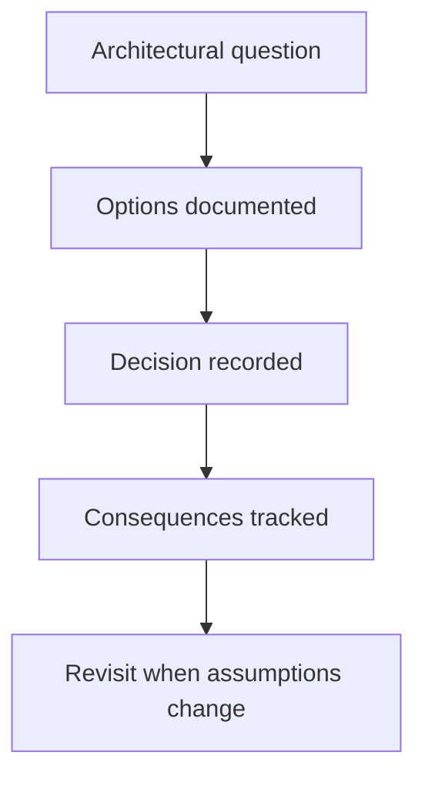

# Architecture Decision Records

This directory records the decisions behind the OMES architecture
described in [`docs/architecture.md`](../architecture.md), in a MADR-lite
format: Title, Status, Date, Context, Options considered (with pros/cons
across security, performance, maintainability, scalability, compatibility,
operational complexity, and long-term implications), Decision, Consequences.

All ADRs below were authored on 2026-09-18 as part of issue
[#4](https://github.com/ahliweb/omes/issues/4), "Design OMES module
architecture and state model."

| ADR | Title | Status |
|---|---|---|
| [0001](0001-bash-as-implementation-language.md) | Bash as the implementation language | Accepted |
| [0002](0002-explicit-state-file.md) | Explicit key=value state file | Accepted |
| [0003](0003-module-contract-check-apply-verify-rollback.md) | Module contract: check / apply / verify / rollback | Accepted |
| [0004](0004-check-all-before-mutate.md) | Check-all-before-mutate execution order | Accepted |
| [0005](0005-root-and-user-scope-separation.md) | Root and user scope separation | Accepted |
| [0006](0006-hermes-upstream-installer-with-pinning.md) | Hermes: upstream installer, downloaded to file, with optional pinning | Accepted |
| [0007](0007-docker-access-policy.md) | Docker access policy: sudo docker default, rootless next, group opt-in | Accepted |
| [0008](0008-desktop-profile-opt-in-no-source-builds.md) | Desktop profile is opt-in; no source builds in the MVP | Accepted |
| [0009](0009-testing-with-bats-in-containers.md) | Testing with bats-core in containers | Accepted |
| [0010](0010-versioning-and-change-fragments.md) | Versioning via SemVer + change fragments compiled at release | Accepted |
| [0011](0011-control-center-and-provider-boundaries.md) | Control Center and external provider boundaries | Accepted as design boundary |
| [0012](0012-python-stdlib-for-workflow-engines.md) | Python 3 stdlib only for workflow engines; bash stays the installer/CLI glue | Accepted |
| [0013](0013-agent-runtime-boundary.md) | Agent-runtime abstraction boundary, with Hermes as the only implementation | Accepted |
| [0014](0014-graphify-integration-boundary.md) | Graphify integration boundary | Accepted as design boundary |
| [0015](0015-content-distribution-workflow.md) | Content distribution workflow architecture | Superseded by ADR-0024 |
| [0016](0016-herman-web-panel-reference.md) | Herman is a UX reference, not an OMES dependency | Accepted |
| [0017](0017-upstream-first-ownership-and-boundary-enforcement.md) | Upstream-first ownership and architecture boundary enforcement | Accepted |
| [0018](0018-runtimedeployment-v2-and-hermes-profile-references.md) | RuntimeDeployment v2 contract and Hermes profile references | Accepted |
| [0019](0019-delegate-native-hermes-gateway-lifecycle.md) | Delegate native agent deployment lifecycle to Hermes CLI | Accepted |
| [0020](0020-delegate-hermes-backup-and-recovery.md) | Delegate profile and full-runtime backup to Hermes native commands | Accepted |
| [0021](0021-align-hermes-docker-topology.md) | Align Hermes container deployment with official Docker topology | Accepted |
| [0022](0022-consume-hermes-native-health.md) | Consume Hermes-native health endpoints and retain OMES host aggregation | Accepted |
| [0023](0023-control-center-ui-ux-design-system.md) | Adopt OMES Control Center UI/UX design system and screen architecture | Accepted |
| [0024](0024-content-workflow-boundary-and-migration.md) | Content distribution workflow boundary and migration to AWCMS and Hermes | Accepted |

ADRs 0012 and 0013 were authored on 2026-09-19 as part of issue
[#85](https://github.com/ahliweb/omes/issues/85), "Define an
agent-runtime abstraction boundary with Hermes as the first
implementation."

ADR 0017 was authored on 2026-09-21 as part of issue
[#171](https://github.com/ahliweb/omes/issues/171), "ci(architecture):
enforce upstream-first ownership across OMES, Hermes, Omarchy and AWCMS."

ADR 0018 was authored on 2026-09-21 as part of issue
[#174](https://github.com/ahliweb/omes/issues/174), "refactor(agent):
introduce RuntimeDeployment v2 with Hermes profile references."

ADR 0019 was authored on 2026-09-21 as part of issue
[#175](https://github.com/ahliweb/omes/issues/175), "refactor(hermes):
delegate native agent deployment lifecycle to Hermes CLI."

ADR 0020 was authored on 2026-09-21 as part of issue
[#176](https://github.com/ahliweb/omes/issues/176), "refactor(hermes):
delegate profile and full-runtime backup to Hermes native commands."

ADR 0021 was authored on 2026-09-21 as part of issue
[#177](https://github.com/ahliweb/omes/issues/177), "refactor(hermes):
align container deployment with official Hermes Docker topology."

ADR 0022 was authored on 2026-09-21 as part of issue
[#178](https://github.com/ahliweb/omes/issues/178), "refactor(health):
consume Hermes-native runtime status and keep OMES host aggregation."

ADR 0023 was authored on 2026-09-21 as part of issue
[#200](https://github.com/ahliweb/omes/issues/200) and epic
[#195](https://github.com/ahliweb/omes/issues/195), "Adopt OMES Control
Center UI/UX design system and screen architecture."

ADR 0024 was authored on 2026-09-21 as part of issue
[#179](https://github.com/ahliweb/omes/issues/179), "refactor(content):
move domain-heavy content workflows out of OMES core to AWCMS module."

## Conventions

- ADRs are numbered sequentially and are never renumbered or deleted; a
  superseded decision gets a new ADR that says so and the old one's Status
  is updated to `Superseded by ADR-00NN`.
- Status is one of: `Proposed`, `Accepted`, `Superseded by ADR-00NN`,
  `Rejected`.
- An ADR records why a decision was made, not the full implementation —
  implementation details belong in `docs/architecture.md` and in code.

<!-- OMES-MERMAID: docs/adr/README.md -->

## Visual summary

