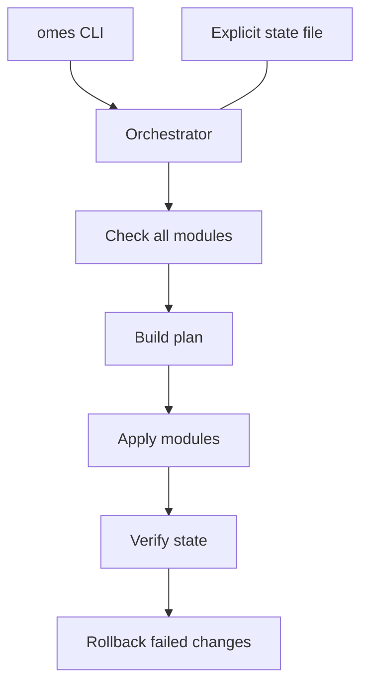

# OMES Architecture

> Status: authoritative design document.
> This document specifies the OMES module architecture and state model
> decided in issue [#4](https://github.com/ahliweb/omes/issues/4), building
> on the scope defined in [#1](https://github.com/ahliweb/omes/issues/1),
> the threat model in [#2](https://github.com/ahliweb/omes/issues/2), and
> the compatibility matrix in [#3](https://github.com/ahliweb/omes/issues/3).
>
> **Reading convention:** every normative statement in this document is a
> **Contract** — a rule that implementers must follow and that operators can
> rely on. Where a component described here does not yet exist in the
> repository, the section says explicitly **"Implementation status: tracked
> in issue #N"**. This document must never be read as evidence that code
> exists; check the repository tree and the linked issue for that.
>
> OMES is an independent, MIT-licensed, **Omarchy-inspired** compatibility
> layer for Ubuntu Server 24.04 LTS and Linux Mint 22.x, with Hermes Agent as
> the automation layer. OMES is not official Omarchy and must never be
> presented as such.

## Table of contents

1. [Overview and component diagram](#1-overview-and-component-diagram)
2. [Repository layout](#2-repository-layout)
3. [Execution model](#3-execution-model)
4. [Module contract](#4-module-contract)
5. [Profiles](#5-profiles)
6. [State model](#6-state-model)
7. [Backup model](#7-backup-model)
8. [Logging](#8-logging)
9. [Exit codes](#9-exit-codes)
10. [Privilege model](#10-privilege-model)
11. [Network model](#11-network-model)
12. [Extension points](#12-extension-points)
13. [Non-goals and known limitations](#13-non-goals-and-known-limitations)
14. [Control Center and provider boundary](#14-control-center-and-provider-boundary)
15. [Web-panel reference boundary](#15-web-panel-reference-boundary)

---

## 1. Overview and component diagram

OMES is a single bash CLI (`bin/omes`) that loads a shared library
(`lib/omes/*.sh`), resolves a **profile** (an ordered list of modules), and
runs each module through a fixed `check` → `apply` → `verify` lifecycle,
with `rollback` available on failure or on explicit request. All mutating
state lives in an explicit state file, not in inferred filesystem probing.
All mutations that touch a pre-existing file are backed up first.

```text
                                   operator
                                       │
                                       │  sudo omes install --profile server
                                       │  omes check / status / doctor / backup / restore
                                       ▼
                              ┌──────────────────┐
                              │     bin/omes      │  CLI entry point (bash)
                              │  arg/flag parsing  │
                              │  command dispatch  │
                              └─────────┬──────────┘
                                        │ sources
                                        ▼
                    ┌───────────────────────────────────────┐
                    │              lib/omes/*.sh             │
                    │                                         │
                    │  core.sh   strict mode, constants,      │
                    │            exit codes, common helpers   │
                    │  log.sh    human + JSON logging          │
                    │  detect.sh OS/arch/privilege/network/    │
                    │            display/GPU detection         │
                    │            (read-only, no mutation)       │
                    │  state.sh  state file read/write          │
                    │  backup.sh backup + manifest + restore    │
                    │  module.sh module loader/runner            │
                    │            (check-all-then-apply)          │
                    │  pkg.sh    apt helpers, package mapping     │
                    │  json.sh   json_escape, json_kv helpers     │
                    └─────────────────┬───────────────────────┘
                                      │ loads
                                      ▼
                       ┌─────────────────────────────┐
                       │      profiles/<name>.profile │  ordered module list
                       │  server | desktop | hermes    │  per profile
                       └───────────────┬───────────────┘
                                       │ resolves MODULE_REQUIRES
                                       │ (topological sort)
                                       ▼
                     ┌───────────────────────────────────┐
                     │        modules/<name>/module.sh     │
                     │  MODULE_SCOPE=root|user              │
                     │  module_check / module_apply /        │
                     │  module_verify / module_rollback       │
                     └───────┬───────────────┬────────────────┘
                             │               │
                 mutates     │               │  registers via
                 filesystem, │               │  omes_manage_path()
                 packages,   │               │
                 services    ▼               ▼
        ┌────────────────────────┐   ┌─────────────────────────┐
        │  upstream systems        │   │   state dir (per scope)   │
        │  apt / dpkg               │   │  /var/lib/omes (root)      │
        │  systemd (system/--user)  │   │  $XDG_STATE_HOME/omes (usr) │
        │  Hermes upstream installer │   │  state file (key=value)     │
        │  Docker daemon / group      │  │  backups/<timestamp>/       │
        └────────────────────────┘   │  logs/omes-<timestamp>.log  │
                                      └─────────────────────────┘
```

Component responsibilities:

| Component | Responsibility |
|---|---|
| `bin/omes` | Parses global flags/commands, sets up environment, dispatches to `lib/omes/module.sh` for `check`/`install`, and to `state.sh`/`backup.sh` for `status`/`backup`/`restore`/`uninstall`. |
| `lib/omes/core.sh` | `set -Eeuo pipefail` strict mode, exit code constants, shared helpers (`omes_die`, `omes_require_root`, `omes_require_nonroot`, `omes_dry_run`). |
| `lib/omes/log.sh` | Human and JSON log emitters, log file management, secret redaction. |
| `lib/omes/detect.sh` | Read-only OS/arch/privilege/network/display/GPU detection used by `check` and by modules; never mutates. |
| `lib/omes/state.sh` | Reads/writes the `key=value` state file atomically. |
| `lib/omes/backup.sh` | Creates timestamped backups with `MANIFEST`/`META`, applies retention (`backup_prune`). |
| `lib/omes/restore.sh` | Resolves/validates a backup session, restores files by verified sha256 (`omes restore`), and the generic managed-path rollback `omes uninstall` uses. |
| `lib/omes/module.sh` | Loads a profile, topologically sorts modules by `MODULE_REQUIRES`, runs the check-all-then-apply sequence, enforces `MODULE_SCOPE`. |
| `lib/omes/pkg.sh` | apt helpers and package-name mapping/validation across Ubuntu/Mint. |
| `lib/omes/json.sh` | `json_escape`/`json_kv` helpers used by `log.sh` and command handlers for `--json` output. |
| `profiles/<name>.profile` | Declares the ordered module list for a named profile (`server`, `desktop`, `hermes`). |
| `modules/<name>/module.sh` | One unit of installable/checkable functionality, implementing the module contract (Section 4). |
| Upstream systems | `apt`/`dpkg` (packages), `systemd` (services, system and `--user`), the Hermes upstream installer script, the Docker daemon/group. OMES never vendors these; it drives them through their documented interfaces. |

Implementation status: implemented. `bin/omes` and every `lib/omes/*.sh` file,
every module in the table above, and every `profiles/*.profile` file exist in
this repository and are exercised by `tests/unit/*.bats`/`tests/integration/*.bats`.

## 2. Repository layout

Only paths relevant to the architecture are listed; each has exactly one
purpose. Every path below exists in this repository today.

```text
bin/omes                        # CLI entry point (bash). Parses flags/commands, dispatches.
lib/omes/core.sh                # Strict mode, exit code constants, common helpers.
lib/omes/log.sh                 # Human + JSON logging, log file, secret redaction.
lib/omes/detect.sh              # OS/arch/privilege/network/display/GPU detection (read-only).
lib/omes/state.sh               # State file read/write (atomic).
lib/omes/backup.sh              # Backup creation, manifest, retention.
lib/omes/restore.sh             # Restore-from-backup and generic managed-path rollback.
lib/omes/module.sh              # Module loader/runner (topological sort, check-all-then-apply).
lib/omes/pkg.sh                 # apt helpers, package name mapping/validation.
lib/omes/json.sh                # json_escape, json_kv helpers for --json output.
modules/<name>/module.sh        # One module implementing the module contract (Section 4).
profiles/server.profile         # Ordered module list for the server profile.
profiles/desktop.profile        # Ordered module list for the desktop profile.
profiles/hermes.profile         # Ordered module list for the hermes profile.
install/bootstrap.sh            # curl-able entry point: clones a pinned ref, runs preflight, hands off to bin/omes.
install/preflight.sh            # Thin wrapper around `bin/omes check`.
config/hypr/                    # Desktop config templates (desktop profile only, Hyprland).
config/waybar/                  # Desktop config templates (desktop profile only, status bar).
config/foot/                    # Desktop config templates (desktop profile only, terminal).
config/shell/                   # Desktop config templates (desktop profile only, shell rc snippets).
config/nvim/                    # Desktop config templates (desktop profile only, editor).
tests/unit/*.bats               # Unit tests sourcing lib/omes/*.sh directly.
tests/integration/*.bats        # Integration tests executing bin/omes against shims.
tests/vm/                       # VM-based compatibility test definitions.
tests/fixtures/                 # Fixtures, e.g. tests/fixtures/os-release/ variants.
tests/shims/                    # Fake apt-get/systemctl/sudo/hermes/curl for integration tests.
.github/workflows/lint.yml      # ShellCheck + bats CI.
.github/workflows/compatibility.yml # OS/profile compatibility matrix CI.
docs/architecture.md            # This document.
docs/adr/*.md                   # Architecture Decision Records.
docs/business/*.md              # Business plan and go-to-market documents.
contracts/                      # Versioned JSON schemas and fixtures for integration boundaries.
skills/                         # Repository-local workflow/content skill documentation.
VERSION                         # SemVer version string, single source of truth (see ADR-0010).
CHANGELOG.md                    # Compiled at release time from changes/*.md; never hand-edited.
changes/*.md                    # Per-PR change fragments, compiled into CHANGELOG.md at release.
README.md                       # Project overview and quickstart.
CONTRIBUTING.md                 # Contribution rules (branching, PR, commit conventions).
SECURITY.md                     # Vulnerability reporting policy.
THIRD_PARTY_NOTICES.md          # Third-party license notices.
LICENSE                         # MIT license.
```

## 3. Execution model

### 3.1 `check` vs `install`

**Contract:**

- `omes check [--profile <name>] [--module <name>]...` runs `module_check`
  for every module in scope. It performs **no mutation** of any kind: no
  package installation, no file writes outside the log file, no service
  changes, no state file writes. It is safe to run repeatedly, as any user,
  at any time, including offline (subject to Section 11).
- `omes install [--profile <name>] [--module <name>]...` runs the full
  **check-all-then-apply** sequence (Section 3.2). It is the only command
  that mutates the system, and only after every module in scope has passed
  `module_check`.
- Every other command (`status`, `doctor`, `backup`, `restore`, `update`,
  `uninstall`, `modules`, `version`) is defined by its own contract but must
  not silently perform an `install`-equivalent mutation; commands that do
  mutate (`restore`, `uninstall`, `update`) must say so in `--help` and
  respect `--dry-run`.

### 3.2 Run sequence (check-all-then-apply)

```text
omes install --profile <name>
  │
  1. Resolve platform (detect.sh). Unsupported OS/arch → exit 3 immediately.
  │
  2. Load profiles/<name>.profile → ordered module name list (± --module filter).
  │
  3. For each module, source modules/<name>/module.sh and read metadata
     (MODULE_NAME, MODULE_SCOPE, MODULE_REQUIRES, MODULE_PROFILES).
  │
  4. Topologically sort modules by MODULE_REQUIRES (Section 4.4).
     A cycle is a fatal usage error → exit 2, no module runs.
  │
  5. Privilege gate (filter, not fail): partition the resolved module
     order by MODULE_SCOPE against the current effective privilege
     (Section 4.5) — root (EUID 0) or non-root. Modules whose
     MODULE_SCOPE matches the current privilege continue into the check/
     apply phases below; modules of the OTHER scope are skipped for this
     run (logged, not applied, not failed) — this is the expected,
     non-error outcome for a mixed-scope profile run under one privilege
     level, and does NOT exit 5. `bin/omes` never escalates (no internal
     `sudo`) and never de-escalates (no internal `sudo -u`) on the
     operator's behalf.
     The ONLY case this step exits 5 is an explicit `--module <name>`
     request naming a module whose MODULE_SCOPE does not match the
     current effective privilege — asking BY NAME for a module the
     current invocation cannot run is a privilege usage error, distinct
     from a profile that simply contains modules of both scopes.
  │
  6. CHECK PHASE (no mutation):
     for each module in the scope-filtered order: run module_check.
       - any module_check fails → log which module(s) failed → exit 4.
       - NOTHING is applied, even for modules whose check passed.
  │
  7. APPLY PHASE (only entered if step 6 passed for all scope-filtered modules):
     for each module in the scope-filtered order:
       a. omes_manage_path is available; module_apply registers every path
          it will touch via omes_manage_path <path> BEFORE writing to it.
       b. For each newly registered managed path that already exists,
          lib/omes/backup.sh backs it up (Section 7) before module_apply
          overwrites it.
       c. Run module_apply (honors --dry-run: prints planned actions, does
          not mutate, and does not write state — see 3.4).
       d. Run module_verify.
       e. On success: lib/omes/state.sh writes module.<name>.status=applied
          and related keys (Section 6).
       f. On module_apply or module_verify failure: STOP. Do not proceed to
          the next module. Exit 6 (apply failed) or 7 (verify failed),
          naming the failed module. Already-applied modules from this run
          remain applied; the failed module is left in a failed state
          (module.<name>.status=failed) for the operator to inspect,
          re-run, or roll back explicitly.
  │
  8. Print/emit final summary (human or JSON per Section 8), including
     any modules skipped in step 5 for scope mismatch and the exact
     follow-up command to apply them (e.g. after `sudo omes install
     --profile server` finishes its root-scope modules, it prints:
     "Run as your user: omes install --profile server" to apply the
     profile's user-scope modules; the reverse case — a non-root
     invocation that skipped root-scope modules — prints "Run with sudo:
     sudo omes install --profile server").
```

**Fail-fast semantics:** a failure at any step stops the run at that point.
The check phase fails fast across *all* modules before any apply; the apply
phase fails fast at the *first* failing module and does not attempt
subsequent modules in the same run. OMES does not auto-rollback on apply
failure; `module_rollback` is invoked only via `omes uninstall`/`omes
restore`, or when the operator explicitly requests rollback. This is a
deliberate choice: automatic rollback on failure can compound a partial
failure into a second, unattended mutation.

### 3.3 Idempotency

**Contract — a module is idempotent if and only if all three hold:**

1. **Re-run converges.** Running `module_apply` twice in a row (with no
   external change in between) produces the same observable end state as
   running it once; the second run performs no unnecessary writes.
2. **No unintended changes.** `module_apply` only ever changes the paths,
   packages, and services it declares (via `omes_manage_path`,
   `module.<name>.installed_packages`, `module.<name>.services`); it never
   touches unrelated configuration, and re-running it does not undo
   changes made by unrelated modules or by the operator outside OMES.
3. **Verify passes.** After any successful `module_apply` — first run or
   Nth run — `module_verify` returns 0.

Modules must be written so that `module_check` returning success is
consistent with `module_apply` being a no-op (already-satisfied state), and
`module_check` returning failure is consistent with `module_apply` having
real work to do. `omes install` run twice against an unchanged system must
leave `module.<name>.status=applied` for every module and change no file
mtimes/contents beyond what a no-op implies.

### 3.4 Dry-run semantics

**Contract:** `--dry-run` (equivalently `OMES_DRY_RUN=1`) applies to the
apply phase only (the check phase never mutates regardless). Under
dry-run:

- `module_apply` MUST detect dry-run (via the shared helper `omes_dry_run`,
  backed by `OMES_DRY_RUN`) and, for every action it would otherwise take,
  print a human-readable line describing the planned action (e.g. `[omes]
  DRY-RUN would install package: build-essential`) instead of performing it.
- No package is installed, no file is written or backed up, no service is
  started/enabled, and no state key is written.
- `module_verify` is skipped under dry-run (there is nothing to verify);
  the run instead reports what would have been verified.
- Exit code is 0 if every module's dry-run apply would have been safe to
  attempt (i.e., check phase passed); dry-run does not exit 6/7 since it
  never actually applies or verifies.

## 4. Module contract

### 4.1 File and interface

Every module is a single file at `modules/<name>/module.sh`:

```bash
#!/usr/bin/env bash
# shellcheck shell=bash
MODULE_NAME="apt-base"
MODULE_DESCRIPTION="Base CLI tooling"
MODULE_SCOPE="root"            # root | user  (never both)
MODULE_REQUIRES=()             # module names that must be applied first
MODULE_PROFILES=(server desktop)
module_check()    { :; }       # preflight only, NO mutation; return 0 ok / non-zero fail; print reasons via log_*
module_apply()    { :; }       # idempotent; MUST honor omes_dry_run (print planned actions, do nothing)
module_verify()   { :; }       # proves apply succeeded
module_rollback() { :; }       # best-effort undo using backups/state
```

**Contract — metadata variables** (all required, read by `lib/omes/module.sh`
via `source` before any function is called):

| Variable | Type | Meaning |
|---|---|---|
| `MODULE_NAME` | string | Stable identifier, matches the directory name (`modules/<name>/`). Used as the key namespace root in the state file (`module.<name>.*`). |
| `MODULE_DESCRIPTION` | string | One-line human-readable description, shown by `omes modules`. |
| `MODULE_SCOPE` | `root` \| `user` | Exactly one. Declares which privilege level the module's functions must run under (Section 4.5). A module MUST NOT support both; a module needing both root and user actions must be split into two modules with a `MODULE_REQUIRES` edge between them. |
| `MODULE_REQUIRES` | bash array of strings | Names of modules that must reach `module.<name>.status=applied` before this module's `module_check`/`module_apply` runs in an `install`. Empty array if none. |
| `MODULE_PROFILES` | bash array of strings | Profile names this module is valid under; `lib/omes/module.sh` uses this only for validation/listing, not for ordering (ordering is the profile file's job — see Section 5). |

### 4.2 Functions and lifecycle

**Contract — the four functions, called in this order per module, per run:**

1. `module_check` — read-only preflight. Returns 0 if the module's
   preconditions are satisfiable (or already satisfied) on this host;
   non-zero otherwise. MUST NOT write to the filesystem (log file excepted),
   install packages, or change service state. MUST print its reasoning via
   `log_info`/`log_warn`/`log_error` (never silent failure).
2. `module_apply` — mutates the host to reach the module's target state.
   MUST be idempotent (Section 3.3). MUST check `omes_dry_run` at the top
   and switch to plan-only output if set (Section 3.4). MUST call
   `omes_manage_path <path>` for every filesystem path it creates or
   modifies, before modifying it, so that backup/restore/uninstall can find
   it.
3. `module_verify` — read-only. Returns 0 only if `module_apply`'s target
   state is actually observed on the host (e.g. binary present and
   runnable, service `active`, config file contains expected marker).
   `module_verify` must not merely repeat `module_check`'s logic; it proves
   the *result*, not the *precondition*.
4. `module_rollback` — best-effort undo. Uses the module's own backups
   (Section 7) and state keys (Section 6) to restore pre-apply state:
   restore backed-up files, stop/disable services it started/enabled,
   optionally remove packages it installed (governed by the same
   `--purge-packages` policy as `omes uninstall`). Rollback is invoked by
   `omes uninstall`, by `omes restore`, or by an operator explicitly
   recovering from a `failed` state; it is never invoked automatically
   mid-`install` (Section 3.2).

All four functions run in the runner's shell after `source
modules/<name>/module.sh`; they must not `exit` directly (that would kill
the whole `omes` process) — they return a status code and let
`lib/omes/module.sh` decide the process exit code.

### 4.3 Inputs and outputs

**Inputs available to every module function:**

- Environment variables set by `bin/omes` before sourcing the module:
  `OMES_DRY_RUN`, `OMES_JSON`, `OMES_STATE_DIR`, `OMES_LOG_FILE`,
  `OMES_ROOT`, `OMES_NONINTERACTIVE`, plus whatever the module itself
  reads from its own documented env vars (e.g. `OMES_HERMES_INSTALLER_SHA256`).
- Global flags already parsed by `bin/omes` and exposed as shell variables
  or helper functions (`omes_dry_run`, `omes_profile`, `--allow-docker-group`
  state, etc.) — modules must not re-parse `$@`.
- Shared helpers from `lib/omes/*.sh`: `log_info`/`log_warn`/`log_error`,
  `omes_manage_path`, `state_get`/`state_set`, `backup_path`, `pkg_install`,
  `omes_require_root`/`omes_require_user`.

**Outputs every module function produces:**

- Log lines via `log_*` helpers (human text or JSON event, Section 8) —
  the only permitted stdout/stderr writes for `module_check`.
- State keys written only by the runner after a module function returns
  (modules never write the state file directly) — Section 6.
- An integer exit status (0 = success) returned from the function, which
  the runner maps into the process exit codes in Section 9.

### 4.4 Ordering via `MODULE_REQUIRES`

**Contract:** `lib/omes/module.sh` builds a dependency graph from every
resolved module's `MODULE_REQUIRES` and computes a topological order
(e.g. Kahn's algorithm) before the check phase begins. Rules:

- A module's dependencies must themselves be present in the resolved
  module set (i.e., listed in the active profile, or pulled in — profiles
  list modules explicitly; OMES does not silently add undeclared modules
  to satisfy a dependency). A missing dependency is a usage error → exit 2.
- A cycle in `MODULE_REQUIRES` (directly or transitively) is a **fatal
  usage error**: exit 2, with a log line naming the modules in the cycle.
  No `module_check` or `module_apply` runs when a cycle is detected.
- Ties (modules with no ordering relationship) are broken by the order
  they appear in the profile file, to keep runs deterministic.
- `MODULE_REQUIRES` orders *within* an `install`/`check` run; it does not
  imply the required module belongs to every profile that requires it —
  each profile file must still list every module it needs, including
  transitive requirements.

### 4.5 `MODULE_SCOPE`: root vs user separation

**Contract:**

- `MODULE_SCOPE="root"` modules perform actions that need root (package
  installation, system services, files outside the invoking user's home).
  `MODULE_SCOPE="user"` modules perform actions scoped to the invoking
  user (per-user Hermes install, `--user` systemd units, dotfiles in
  `$HOME`).
- **Contract: no automatic privilege escalation or de-escalation.**
  `bin/omes` never internally invokes `sudo` to gain root, and never
  internally invokes `sudo -u <user>` (or any other mechanism) to shed
  root and act as another user. Every module function always runs under
  whatever effective privilege the operator started the `omes` process
  with — nothing else.
- **Scope filtering, not failure, for a mixed-scope profile.** When a
  resolved profile (or the full unfiltered module set) contains modules of
  both scopes, `omes check`/`omes install` runs only the modules whose
  `MODULE_SCOPE` matches the current effective privilege (Section 3.2,
  step 5) and **skips** the others, printing which modules were skipped
  and the exact command to run afterward to apply them:
  - `sudo omes install --profile server` runs the profile's root-scope
    modules as root, skips its user-scope modules, and on completion
    prints `Run as your user: omes install --profile server` (no `sudo`)
    to apply the skipped user-scope modules as the operator's own login
    user.
  - `omes install --profile server` (no `sudo`, run as a normal user)
    runs the profile's user-scope modules, skips its root-scope modules,
    and on completion prints `Run with sudo: sudo omes install --profile
    server` to apply the skipped root-scope modules.
  - This means a mixed-scope profile is applied to completion by **two**
    separate operator-initiated invocations — one as root, one as the
    target user — never by one invocation acting on the operator's behalf
    as the other identity.
- **`exit 5` is reserved for an explicit, unsatisfiable request**, not for
  a mixed-scope profile: `--module <name>` naming a specific module whose
  `MODULE_SCOPE` does not match the current effective privilege is a
  privilege usage error (the operator asked BY NAME for something this
  invocation cannot do) and exits **5** immediately, with no mutation.
  Running a whole profile that happens to mix scopes is never itself an
  error.
- `omes doctor`/`omes status` are read-only and may run as either root or
  the target user; they report both scopes' status (reading each scope's
  own state directory when readable) rather than refusing outright, since
  they do not mutate.

See ADR-0005 for why automatic `sudo -u` re-dispatch was considered and
rejected in favor of this skip-and-instruct model.

### 4.6 `omes_manage_path`

**Contract:** `omes_manage_path <path>` is a helper in `lib/omes/module.sh`
that a module calls, from `module_apply`, once per filesystem path
(file or directory) it is about to create or modify — **before** doing so.
Effects:

- If `<path>` already exists, `lib/omes/backup.sh` is invoked to back it up
  (Section 7) before the module proceeds to write it.
- `<path>` is appended (colon-separated, matching the state file's list
  encoding) to the in-memory set that the runner writes, on success, to
  `module.<name>.managed_paths` in the state file (Section 6).
- Registering a path is what makes it visible to `omes backup`, `omes
  restore`, and `omes uninstall` — a module that writes a path without
  calling `omes_manage_path` first has, by definition, broken the backup
  and uninstall contract for that path. Code review and the module test
  suite (bats) treat this as a defect.
- Calling `omes_manage_path` on a path is idempotent; calling it twice in
  the same `module_apply` for the same path is a no-op the second time.

## 5. Profiles

**Contract:** a profile is a file at `profiles/<name>.profile` containing
an ordered, newline-separated list of module names valid for that profile.
`lib/omes/module.sh` reads this list, filters it by any `--module` flags,
and topologically re-sorts it per Section 4.4 (the profile's own order is
the tie-breaker, not the sole authority — `MODULE_REQUIRES` can reorder
within it).

**Module names are the contract of this document.** Whether a given
module's `module.sh` exists yet, and how complete it is, is tracked per
module. All modules named below exist and are implemented in this
repository — a profile listing a module name here is a statement of
composition that matches `profiles/*.profile` exactly.

| Profile | Modules (in intended order) | Notes |
|---|---|---|
| `server` | `apt-base`, `security-baseline`, `hermes`, `hermes-gateway`, `containers` (optional, commented out by default) | Headless Ubuntu Server 24.04/22.04 target. `containers` is listed in `profiles/server.profile` but commented out; enable it explicitly with `sudo omes install --module containers` or by uncommenting the line — Docker access policy is governed by ADR-0007. `hermes-gateway-system` is never wired into any profile (opt-in only, root-scope alternative to `hermes-gateway`). |
| `desktop` | `apt-base`, `desktop-preflight`, `hyprland-session`, `desktop-config`, `hermes` (optional, commented out by default) | Linux Mint 22.x target. `hermes`/`hermes-gateway` are commented out in `profiles/desktop.profile` (server/hermes profiles are the primary Hermes delivery path); `desktop-preflight` gates GPU/kernel/Mesa/Wayland/portal checks before any desktop package is touched (ADR-0008). Cinnamon remains selectable; OMES never removes it. |
| `hermes` | `apt-base`, `hermes`, `hermes-gateway` | Hermes-only profile for a host that does not need the rest of the server baseline, or is being used purely to add/upgrade Hermes on an already-baselined host. |

Implementation status: implemented. Every module named above exists at
`modules/<name>/module.sh` and is exercised by
`tests/unit/<name>.bats`/`tests/integration/<name>.bats` (`security-baseline`
by `tests/integration/server.bats`, `hyprland-session`/`desktop-config` by
`tests/integration/desktop.bats`).

## 6. State model

### 6.1 State directory

**Contract:**

- Root scope: `/var/lib/omes/`
- User scope: `${XDG_STATE_HOME:-$HOME/.local/state}/omes/`
- Either is overridable with `OMES_STATE_DIR` (primarily for tests).
- Directory mode: `0700`. The state *file* itself: mode `0600`.
- Layout: `<state-dir>/state` (the state file), `<state-dir>/backups/`
  (Section 7), `<state-dir>/logs/` (Section 8).
- Root and user scope are entirely separate state directories/files; a
  root-scope module's state never lives in a user's state dir and vice
  versa. This mirrors the `MODULE_SCOPE` separation in Section 4.5.

### 6.2 File format

**Contract:** the state file is plain `key=value` lines, one per line, no
quoting, no nesting, no comments. UTF-8, LF line endings. Consumers parse
it with a simple `key=value` split (`state_get`/`state_set` in
`lib/omes/state.sh`); it is deliberately not JSON/YAML/INI so that it stays
`grep`/`awk`-able and diffable, and so a corrupted or partially-written file
degrades to "line ignored" rather than "unparseable blob" (see ADR-0002).

### 6.3 Key namespace

**Contract — the complete key namespace:**

| Key | Example value | Meaning |
|---|---|---|
| `omes.version` | `0.1.0` | The OMES `VERSION` at the time of the last write to this state file. |
| `omes.profile` | `server` | The profile name most recently installed against this state dir. |
| `module.<name>.status` | `applied` | One of `applied`, `failed`, `rolled-back`, `removed`. |
| `module.<name>.applied_at` | `2026-09-18T10:00:00Z` | UTC timestamp (ISO 8601) of the **first** successful `module_apply` + `module_verify` that moved this module into `applied` status (`lib/omes/module.sh`'s `run_apply`: only rewritten when the previous status was not `applied`, or the key was never set) — stays stable across idempotent re-runs. |
| `module.<name>.last_run_at` | `2026-09-18T10:05:00Z` | UTC timestamp (ISO 8601) of the **most recent** successful `module_apply` + `module_verify`, written on every successful run including idempotent re-runs (comparing it to `applied_at` is how you tell "this module last changed vs. this module was last confirmed unchanged"). State-file-only: `omes status`/`omes status --json` do **not** currently surface this key (verified by running `omes status --json` after a real apply — its `modules[]` objects have only `name`/`status`/`applied_at`/`version`); read it with `state_get "module.<name>.last_run_at"` or by inspecting `<state-dir>/state` directly. |
| `module.<name>.version` | `0.1.0` | The OMES `VERSION` this module was last successfully applied under (lets `omes update` detect drift). |
| `module.<name>.managed_paths` | `/home/u/.hermes/config.yaml:/home/u/.hermes/.env` | Colon-separated list of paths registered via `omes_manage_path` during the last successful apply. |
| `module.<name>.installed_packages` | `curl:git:build-essential` | Colon-separated list of apt package names this module installed (informational; used by `omes uninstall --purge-packages`). |
| `module.<name>.services` | `hermes-gateway` | Colon-separated list of systemd unit names (system or `--user`, per `MODULE_SCOPE`) this module created/enabled. |

`module.<name>.status` values:

| Value | Meaning |
|---|---|
| `applied` | Last `module_apply` + `module_verify` succeeded and nothing has since removed it. |
| `failed` | Last `module_apply` or `module_verify` failed; the module is left in this state for operator inspection (Section 3.2, step 7f). |
| `rolled-back` | `module_rollback` ran successfully after a failure or an explicit rollback request. |
| `removed` | `omes uninstall` removed the module's managed paths/services/state. |

### 6.4 Write atomicity

**Contract:** every write to the state file is: write the full new content
to a temp file in the same directory (`state.tmp.$$` or `mktemp` in that
directory, to guarantee same-filesystem `rename`), `chmod 0600` it, then
`mv` it over the real state file. This guarantees that any concurrent
reader, or a process crash mid-write, only ever sees either the fully-old
or fully-new state file — never a truncated/partial one. `lib/omes/state.sh`
is the only code path permitted to write the state file; modules call
`state_set`/`state_get`, never open the file directly.

### 6.5 Permissions

**Contract:** state directory `0700`; state file `0600`. Both root-owned
(root scope) or user-owned (user scope) matching the scope that wrote them.
This is deliberate defense-in-depth: state may reference paths and package
names that reveal what secrets exist (e.g. `.env` paths) even though it
never contains secret values themselves (Section 7.5).

### 6.6 Why state is explicit

**Rationale:** OMES tracks `module.<name>.status` and its associated keys
explicitly instead of inferring "is this module installed?" by re-probing
the filesystem/package manager/service manager at every run, for four
reasons:

1. **Idempotency needs a source of truth for what OMES did**, as distinct
   from what happens to be true of the host. A package can be present
   because the operator installed it manually, not because OMES did;
   inferring status from presence alone would make `omes uninstall` remove
   things OMES never installed, and would make `module_check` unable to
   distinguish "already satisfied by OMES" from "already satisfied by
   someone else" (both return success from `module_check`, but only the
   former is safe to roll back).
2. **Backup/restore/uninstall need an authoritative list of managed paths**
   (`managed_paths`) — re-deriving "which files did this module touch" by
   diffing the filesystem is unreliable and slow, and impossible offline
   against a system that has since changed.
3. **Failure reporting needs a durable record of `failed` state** so a
   re-run, or a different operator entirely, can see exactly which module
   broke and when, without re-running the whole check phase first.
4. **Auditability**: `applied_at` and `version` give a durable, offline-
   readable history of what OMES changed and when, independent of log
   retention.

## 7. Backup model

### 7.1 Layout

**Contract:**

```text
<state-dir>/backups/<UTC timestamp, e.g. 2026-09-18T101530Z>/
  MANIFEST                 # sha256  original-absolute-path   (one line per backed-up file)
  META                      # omes version, module name, reason
  <original path, relative> # e.g. home/u/.hermes/config.yaml — copied file, preserving the
                             # original path structure relative to filesystem root so restore
                             # can reconstruct absolute paths unambiguously
```

- One backup directory per triggering event (a single `module_apply`'s
  pre-write backups for one module in one `install` run share one
  timestamp directory).
- Directory and all contents: mode `0700`. `.env`/secret files are copied
  with mode `0600` regardless of their source mode.
- Backups are local, on the same host, under the state directory; OMES
  does not transmit backups off-host (see ADR scope — Section 13 notes
  this as a limitation).

### 7.2 `MANIFEST` format

**Contract:** one line per backed-up file:

```text
<sha256 of the ORIGINAL file's content, computed before backup>  <original absolute path>
```

Space-separated (matching `sha256sum` output format), so `sha256sum -c
MANIFEST` (run with `cwd` set appropriately, or with paths adjusted) can
independently verify a restore.

### 7.3 `META` format

**Contract:** `key=value` lines (same style as the state file):

```text
omes_version=0.1.0
module=hermes
reason=pre-apply-backup
timestamp=2026-09-18T10:15:30Z
```

`reason` is a short fixed vocabulary (`pre-apply-backup`, `pre-restore-backup`,
`manual`) identifying why the backup was taken.

### 7.4 Restore algorithm

**Contract — `omes restore [--from <timestamp>]`:**

1. Determine the target backup: the given `<timestamp>` directory, or (if
   omitted) the lexicographically-latest directory under
   `<state-dir>/backups/` (timestamps are UTC and zero-padded, so
   lexicographic order is chronological order).
2. Read `MANIFEST`; for each line, verify the *currently backed-up copy's*
   sha256 matches the recorded hash (detects on-disk corruption of the
   backup itself before it is trusted).
3. For each verified entry, copy the backed-up file back to its original
   absolute path, preserving the original file's mode where recorded, and
   preserving `0600` for anything under a path OMES treats as secret
   (`.env` files).
4. Before overwriting a currently-existing file at the destination, take a
   **new** backup of it first (`reason=pre-restore-backup`) — restore never
   destroys the pre-restore state without a recovery path of its own.
5. Update the state file: for the module named in `META`, if the restore
   fully succeeded, leave `module.<name>.status` as-is unless the operator
   is restoring as part of an explicit rollback flow (in which case the
   caller — `module_rollback` or `omes uninstall`'s rollback step — sets
   `status=rolled-back`).
6. Any hash mismatch in step 2, or any copy failure in step 3, aborts the
   remaining steps and exits **9** (backup/restore failed), naming the
   first failing path; already-restored files from this invocation are
   left restored (partial restore is reported, not silently rolled further
   back — the operator is told exactly what happened).
7. `omes restore` MUST work fully offline (Section 11) — it only reads
   local backup files and writes local destination files.

### 7.5 Retention

**Contract:** by default, OMES keeps the last **10** backup directories
(across all modules, ordered by timestamp) per scope's state directory,
and prunes older ones (`lib/omes/backup.sh`'s `backup_prune`) after every
successful `module_apply`'s backup step (`run_apply` in `lib/omes/module.sh`)
and after every `omes backup`. Retention count is the `OMES_BACKUP_KEEP`
environment variable (default `10`), not currently exposed as its own CLI
flag — see [docs/configuration.md](configuration.md).

### 7.6 What is never backed up in plaintext logs

**Contract:** backups themselves copy full file *content*, including
secret files like `$HERMES_HOME/.env` (with mode forced to `0600`, per
7.1) — that is what makes restore meaningful. What is **never** written in
plaintext is: **log output**. `MANIFEST`/`META`/log lines reference file
*paths*, never file *contents*, and the logging redaction rule (Section
8.3) additionally redacts any log line that would otherwise echo a
secret-shaped value. In short: backups may contain secrets (that is their
job, and they are permission-locked at `0700`/`0600`); logs never do.

## 8. Logging

### 8.1 Human output contract

**Contract:** default (non-`--json`) output is plain text, one line per
event, prefixed:

- `[omes] ` — informational
- `[omes] WARN ` — warning, non-fatal
- `[omes] ERROR ` — error, usually preceding a non-zero exit

Colors are used only when stdout is a TTY (`[ -t 1 ]`) and the `NO_COLOR`
environment variable is unset (per the https://no-color.org/ convention).
Colors never change the meaning of a line — they are a rendering hint only.

### 8.2 JSON output contract

**Contract:** with `--json` (or `OMES_JSON=1`), the command emits **exactly
one** JSON object on stdout for the whole invocation, e.g.:

```json
{"command":"check","ok":true,"platform":{"os":"ubuntu","version":"24.04"},"checks":[{"name":"os","ok":true,"detail":"ubuntu 24.04"}],"exit_code":0}
```

- No other stdout noise is permitted in JSON mode — anything that would
  normally go to human stdout (progress lines, warnings) instead goes to
  **stderr** and/or the log file, never mixed into the JSON stdout stream.
  This lets `omes ... --json | jq .` always work.
- `lib/omes/json.sh` provides `json_escape` (string escaping) and `json_kv`
  (building `"key":value` fragments) so command handlers assemble the
  final object consistently rather than hand-rolling escaping per call
  site.

### 8.3 Log file and secret redaction

**Contract:**

- Log file location: `<state-dir>/logs/omes-<UTC timestamp>.log`, one file
  per `omes` invocation, unless overridden with `--log-file <path>` /
  `OMES_LOG_FILE`.
- Every line written to the log file (regardless of human/JSON mode on
  stdout) is line-oriented text carrying at least: timestamp, level,
  module (if any), message.
- **Redaction rule:** before any value is written to the log file or to
  stderr, `lib/omes/log.sh` inspects the associated **key** (environment
  variable name, config key, or CLI flag name being logged). If the key
  matches the case-insensitive pattern `TOKEN|KEY|SECRET|PASSWORD`
  (as a substring, e.g. `TELEGRAM_BOT_TOKEN`, `API_KEY`, `HERMES_SECRET`,
  `DB_PASSWORD` all match), the **value** is replaced with `***REDACTED***`
  in the emitted line. This rule applies uniformly to human and JSON log
  output and is applied at the point of formatting, so no code path can
  bypass it by choosing a different emitter.
- This redaction is a safety net, not the primary secret-handling
  mechanism — modules must not construct log lines that embed secret
  values in the message text under an innocuous key name; the state file
  and backups are the durable sensitive-data locations (Sections 6, 7),
  and logs should describe *actions*, not *payloads*.

## 9. Exit codes

**Contract — stable across releases, documented in `docs/cli.md`:**

| Code | Meaning |
|---|---|
| 0 | Success |
| 1 | General/unexpected error |
| 2 | Usage error (bad flags, missing dependency, `MODULE_REQUIRES` cycle) |
| 3 | Unsupported platform (OS/arch) — detected BEFORE any mutation |
| 4 | Preflight failed (one or more `module_check` failed; no mutation occurred) |
| 5 | Privilege error (needs root / must not be root) |
| 6 | Module apply failed (message names the module) |
| 7 | Verification failed (message names the module) |
| 8 | Network required but unavailable |
| 9 | Backup/restore failed |
| 10 | Rollback failed |

Exit codes 0–10 are reserved and stable; a future addition must use the
next unused integer and must not repurpose an existing code.

## 10. Privilege model

**Contract:**

- **Root-scope modules** (`MODULE_SCOPE=root`) run as root. The operator
  invokes `sudo omes install --profile server` (or `--profile hermes`, or
  any profile containing root-scope modules) to apply them; when the
  process is not root, `bin/omes` skips root-scope modules rather than
  running them (Section 4.5) — it does not call `sudo` itself.
- **User-scope modules** (`MODULE_SCOPE=user`) run as the invoking user,
  **never** as root. `bin/omes` never runs a user-scope module's functions
  while EUID is 0, and never shells out to `sudo -u <user>` (or any
  equivalent) to act as another user on the operator's behalf; when the
  process is root, `bin/omes` skips user-scope modules rather than
  de-escalating to run them (Section 4.5). This keeps root and user runs
  as two entirely separate, independently auditable invocations, each
  with its own log file and its own scope's state directory (Section 6.1)
  — no root process ever writes to, or acts within, a user's `$HOME`/
  `$XDG_RUNTIME_DIR` on that user's behalf.
- `bin/omes` performs a `sudo -n true` (non-interactive, non-mutating)
  check during `check`/preflight when the resolved module set contains
  root-scope modules and the process is not already root, purely to tell
  the operator ahead of time whether they have usable, non-interactively-
  cached `sudo` for the follow-up `sudo omes install ...` invocation
  Section 4.5 tells them to run — it is informational only. It never
  causes `bin/omes` to invoke `sudo` itself, and its result does not
  change whether root-scope modules run in the *current* (non-root)
  invocation: they are skipped regardless, per Section 4.5.
- **No `curl | bash` of unpinned content inside modules.** Any module that
  needs to run an upstream installer script (the canonical example is the
  Hermes installer) MUST download it to a file first (e.g. `curl -fsSL
  <url> -o <tmpfile>`), optionally verify it against a checksum the
  operator can supply (e.g. `OMES_HERMES_INSTALLER_SHA256`), and only then
  execute that file. Piping a network response directly into a shell
  (`curl ... | bash`) is never permitted inside a module, because it
  removes the ability to inspect, checksum, or log the exact content that
  is about to run as code (see ADR-0006).

## 11. Network model

**Contract:**

- Modules that install packages (`apt-base`, `containers`) or download
  upstream installers (`hermes`) need network access; this is expected and
  is not itself an error condition — `module_check` for such a module
  should fail informatively (not crash) when network is required and
  absent, which the runner surfaces as exit **4** (preflight failed) during
  `check`/`install`.
- The following commands **must work fully offline** and must not attempt
  any network call: `omes status`, `omes restore`, `omes uninstall`.
  These operate purely on local state, local backups, and local system
  inspection (packages already installed, services already present).
- If any of `status`/`restore`/`uninstall` is invoked in a context where a
  code path would require network (which should not happen given the
  contract above, but is treated as a defect if it does), that path must
  detect the absent network and exit **8** (network required but
  unavailable) rather than hang or fail with an unrelated error.
- `omes check`/`omes install` may legitimately need network per the first
  bullet; `lib/omes/detect.sh` provides a read-only network-reachability
  check that `module_check` implementations can call, so failures are
  reported as a named, specific check rather than a generic timeout.

## 12. Extension points

### 12.1 Adding a module

1. Create `modules/<name>/module.sh` implementing the contract in Section 4
   (all five metadata variables, all four functions).
2. Add `<name>` to every `profiles/<profile>.profile` file where it should
   run, in a position consistent with its `MODULE_REQUIRES`.
3. Add `tests/unit/<name>.bats` (sourcing `module.sh` directly) and, if the
   module touches packages/services, `tests/integration/<name>.bats`
   (executing `bin/omes` against `tests/shims/`).
4. Add fixtures under `tests/fixtures/` if the module needs a specific
   `/etc/os-release` variant or other environment shape.
5. Run `tests/run.sh` (ShellCheck + unit + integration) before opening a PR.
6. Add a `changes/<issue>-<slug>.md` fragment describing the new module.

### 12.2 Adding a profile

1. Create `profiles/<name>.profile` listing module names in intended
   order.
2. Ensure every listed module declares `<name>` in its `MODULE_PROFILES`
   array (or add it there).
3. Document the profile in Section 5 of this file (a profile is part of
   the architecture contract, not just a data file) and in `docs/cli.md`'s
   `--profile` flag description.
4. Add an integration test exercising `omes check --profile <name>` at
   minimum.

### 12.3 Adding a platform

1. Extend `lib/omes/detect.sh` with detection logic for the new
   `/etc/os-release` `ID`/`ID_LIKE`/`VERSION_ID`/codename combination, and
   add a fixture under `tests/fixtures/os-release/`.
2. Add the platform to the compatibility matrix
   (tracked in issue #3) with an explicit support tier (1/2/3) — OMES does
   not silently expand support; an undetected/unlisted platform must
   continue to exit **3**.
3. Update `lib/omes/pkg.sh`'s package-name mapping if the new platform
   uses different package names for existing dependencies.
4. Add the platform to `.github/workflows/compatibility.yml`.

## 12.4 Agent-runtime boundary

`lib/omes/runtime.sh` is a small, runtime-neutral contract layer:
`runtime_supported <name>`, `runtime_require <name>` (fails closed, exit
4, for anything but `hermes`), `runtime_describe <name>` (JSON metadata:
version command, home env var, per-scope service unit names, health
probe entrypoint, backup classes, provenance sources), `runtime_home
<name>`, and `runtime_service_unit <name> <user|system>`. Hermes is the
only implemented runtime today; `modules/hermes*` are unchanged
Hermes-specific implementations. See
[docs/agent-runtime-boundary.md](agent-runtime-boundary.md) and
[ADR-0013](adr/0013-agent-runtime-boundary.md) for the full interface
table, the Hermes mapping, and the isolation requirements a future
runtime would have to meet. `lib/omes/runtime.sh` is sourced explicitly
by the commands/modules that need it, not by `bin/omes` itself (the same
pattern `modules/hermes-gateway/telegram-allowlist.sh` already uses for
`lib/omes/core.sh`/`lib/omes/log.sh`).

## 12.5 Agent deployment lifecycle (issue #87)

`lib/omes/cmd/agent.sh` + `lib/omes/py/agent/` implement the MVP native
systemd backend from
[docs/agent-orchestration-roadmap.md](agent-orchestration-roadmap.md):
a versioned JSON manifest (`contracts/agent/v1/agent-deployment.schema.json`)
declares a Hermes-runtime agent deployment, which
`omes agent apply` carries through `check -> plan -> backup -> mutate ->
verify` to the `declared -> preflighted -> planned -> backed-up ->
applied -> verified -> ready -> healthy` lifecycle (failure states
`degraded | failed | rolled-back`). Full design:
[docs/agent-deployment.md](agent-deployment.md).

Unlike the rest of OMES's state (Section 6, a single `key=value` file per
scope), each agent's lifecycle state is its own JSON file at
`<state-dir>/agents/<name>/state.json` (`lib/omes/py/agent/state.py`),
because it needs structured history and per-agent isolation rather than
a flat namespace. It records `state`, a bounded `history`,
`managedPaths` (exactly what `rollback` may remove), and `provenance`
(`omesVersion`, `gitRef`, `hermesVersion` - never credentials). See
[docs/agent-deployment.md section 4](agent-deployment.md#4-state-and-provenance).

This reuses, rather than duplicates: #79's health model
(`lib/omes/py/health/`), #81's `hardening_render` (`modules/hermes-gateway/
hardening.sh`), and #82's data-class backup engine
(`lib/omes/py/hermesbackup/`). See section 12.4 for its relationship (and
current non-integration) with `lib/omes/runtime.sh`.

## 13. Non-goals and known limitations

**Non-goals:**

- OMES is not, and must never claim to be, official Omarchy. It does not
  replicate Arch/pacman/AUR behavior, Limine snapshot boot flows, or ISO
  installation.
- OMES does not manage disk encryption, bootloader configuration, or
  full-disk provisioning; those are host/OS installer concerns outside
  OMES's scope (see the scope document, issue #1).
- OMES does not build Hyprland (or any desktop component) from source as
  a default path (see ADR-0008); source builds are explicitly out of
  scope for the MVP.
- OMES does not transmit backups off-host, and does not provide a remote
  backup destination, encryption-at-rest for backups, or a backup
  scheduler beyond the pre-apply/pre-restore triggers in Section 7.
- OMES does not manage the Docker daemon's own configuration beyond the
  access-policy decision in ADR-0007 (it does not configure Docker
  networking, storage drivers, or registries).
- OMES does not provide a GUI; it is a CLI tool only.

**Known limitations:**

- Automatic rollback on apply failure is intentionally not performed
  (Section 3.2); an operator must explicitly request rollback/restore,
  which means a failed `install` can leave a host in a partially-applied
  state until the operator acts.
- The topological sort in Section 4.4 orders modules within one profile
  resolution; it does not detect or resolve conflicting `MODULE_REQUIRES`
  across profiles that are never run together, since each `omes install`
  invocation only ever resolves one profile (± `--module` filtering) at a
  time.
- Backup retention (Section 7.5) is a fixed count, not a size- or
  age-based policy; a host that runs many `install`s in quick succession
  relies on the count-based prune running promptly.
- A profile that mixes `MODULE_SCOPE=root` and `MODULE_SCOPE=user` modules
  (Section 4.5) is never fully applied by a single `omes install`
  invocation — it requires one root invocation and one user invocation,
  run separately by the operator. `omes install` does not track "the
  other half is still pending" as its own state key; the skip message
  printed at the end of each run (Section 3.2, step 8) is the only
  reminder, so an operator who ignores it can be left believing a mixed
  profile is fully applied when only one scope's modules are.
- A `MODULE_REQUIRES` edge that crosses scopes (e.g. a user-scope module
  requiring a root-scope module) can only be satisfied by an *earlier,
  separate* invocation that already applied the root-scope side, because
  root-scope and user-scope state directories are distinct and the root
  one is not readable by a non-root user (`0700`, Section 6.5). A
  user-scope module's `module_check` therefore cannot read the root
  scope's state file to confirm a cross-scope dependency was applied; it
  must instead check for the dependency's observable effect on the host
  (e.g. a package binary present, a system service active). This is an
  accepted consequence of the scope separation in ADR-0005, not a defect
  in the state model.
- arm64 is a best-effort (tier 3) platform per the compatibility matrix
  (issue #3); this document's contracts apply there too, but test coverage
  and operator support are weaker than on tier 1/2 amd64 targets.

## 14. Control Center and provider boundary

The current OMES implementation remains a Bash CLI and host toolkit. A future AWCMS/awcms-one-based Control Center is a companion control plane, not a replacement for the CLI or a second Hermes runtime. Its design and issue mapping are authoritative in [docs/control-center-and-integrations.md](control-center-and-integrations.md) and [ADR-0011](adr/0011-control-center-and-provider-boundaries.md).

The Control Center may own tenant, catalog, subscription, invoice, payment, entitlement, approval, support, and reporting state. OMES owns host and deployment state; Hermes owns agent runtime state. Web mutations reach OMES only through an authenticated, allowlisted, idempotent, audited job boundary. Arbitrary shell execution and public privileged listeners are prohibited by design.

Provider adapters are staged and not implemented in this CLI branch:

- [#98](https://github.com/ahliweb/omes/issues/98) owns the registrar/DNS abstraction, capability matrix, catalog, price snapshot, and manual fallback.
- [#99](https://github.com/ahliweb/omes/issues/99) owns Cloudflare Registrar/DNS for supported international extensions.
- [#100](https://github.com/ahliweb/omes/issues/100) owns SRS-X for supported Indonesian `.id` workflows and documents.
- [#101](https://github.com/ahliweb/omes/issues/101) owns GitHub App, repository, webhook, Actions, and provenance integration.
- [#102](https://github.com/ahliweb/omes/issues/102) owns domain billing and provider reconciliation.

Registrar and DNS remain separate contracts. Provider state, invoice state, entitlement state, DNS state, and deployment state must never be collapsed into one boolean `active` field. External calls happen outside database transactions and are reconciled asynchronously. Unsupported provider capability becomes an explicit manual task rather than an implicit retry or provider substitution.

The Control Center and provider boundary is a design-only capability until the linked issues land; this section must not be read as evidence that a web GUI or provider adapter exists.

## 15. Web-panel reference boundary

Herman is an external local-panel reference, not an OMES dependency. The accepted fit matrix and security adaptations are documented in [docs/web-panel-reference-evaluation.md](web-panel-reference-evaluation.md) and [ADR-0016](adr/0016-herman-web-panel-reference.md).

The following patterns are suitable for reimplementation in a future Control Center or optional local operator console: board-based navigation, deployment/project cards, runtime/session status, usage and insight summaries, streamed job output, maintenance/backup workflows, explicit confirmation, and degraded/offline states. They must be implemented through the existing tenant, job, audit, provider, and source-of-truth contracts in issues #89–#102.

The following are not transferable without redesign: local token-only authentication, direct subprocess or filesystem execution, raw SSH/API/git credential handling, arbitrary endpoint probing, coupling to Hermes internal databases, and local single-user assumptions. The web surface must never become an arbitrary shell or privileged listener. This section is a design boundary only; it does not mean Herman or an OMES web GUI is implemented.

<!-- OMES-MERMAID: docs/architecture.md -->

## Visual summary



