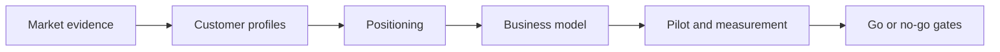

# OMES business documentation

This directory holds OMES's business-validation track: customer discovery, positioning, competitive research, and business-model work. It complements the technical plan in [docs/research-and-implementation-plan.md](../research-and-implementation-plan.md) (section 5 is the baseline for everything here) and does not describe the product's implementation — see the repository root `docs/` for that.

## Ground rules for every document in this directory

- OMES is an independent, Omarchy-inspired, MIT-licensed project. It is never described as official Omarchy.
- Hermes Agent is a Nous Research product; OMES integrates with it but does not own or resell it.
- No market size, willingness-to-pay figure, or price point is stated as fact. Anything unknown is labeled `ASSUMPTION` with a stated validation method.
- Each document separates "Validated" (cited evidence: interview, pilot log, or reproducible test) from "Hypothesis" (belief pending validation).
- Written for ahliweb founders/operators and technical buyers evaluating OMES.

## Documents

| Document | Covers | Tracking issue |
|---|---|---|
| [icp-and-customer-discovery.md](icp-and-customer-discovery.md) | ICP candidates, jobs-to-be-done, prioritization rubric, interview plan and guide, evidence capture template, assumption register | [#19](https://github.com/ahliweb/omes/issues/19) |
| [positioning.md](positioning.md) | Positioning statement, value proposition per ICP, comparison summary, measurable benefit claims, messaging do/don't list, English and Bahasa Indonesia pitch | [#20](https://github.com/ahliweb/omes/issues/20) |
| [competitive-landscape.md](competitive-landscape.md) | Comparison matrix vs. Omarchy, Omakub, vanilla Ubuntu/Mint, dotfiles tools, config-management tools, managed AI platforms, DIY Hermes; substitutes; reasons not to choose OMES | [#21](https://github.com/ahliweb/omes/issues/21) |
| [business-model.md](business-model.md) | Business-model options (open-core, paid setup, managed deployment, support, hardening, training, integrations), service package definitions, pricing logic, MVP monetization recommendation | [#22](https://github.com/ahliweb/omes/issues/22) |
| [unit-economics.md](unit-economics.md) | Pilot-time and cost-tracking formulas and instrumentation (authored in a parallel workstream) | see plan section 5.4 |
| [pilot-program.md](pilot-program.md) | Internal/external pilot design and rollout (authored in a parallel workstream) | see plan section 6 |
| [support-tiers.md](support-tiers.md) | Support-tier definitions feeding the business model (authored in a parallel workstream) | related to [#22](https://github.com/ahliweb/omes/issues/22) |
| [release-gates.md](release-gates.md) | Go/no-go release criteria (authored in a parallel workstream) | see plan section 7 |
| [graphify-use-cases.md](graphify-use-cases.md) | Graphify/Obsidian use cases (onboarding, architecture discovery, project memory, research, runbooks), value-vs-novelty separation, measurement plan, privacy objections and willingness-to-pay interview questions, packaging recommendation | [#57](https://github.com/ahliweb/omes/issues/57) |

The last four documents are written by parallel agents working the same milestone; if a link above is not yet live, that document has not landed on `main` yet. Add new business documents to this table when they are created.

## Reading order

1. [icp-and-customer-discovery.md](icp-and-customer-discovery.md) — who we think we're building for, and how we're testing that.
2. [positioning.md](positioning.md) — how we describe OMES once we have discovery evidence.
3. [competitive-landscape.md](competitive-landscape.md) — how OMES compares to alternatives, honestly.
4. [business-model.md](business-model.md) — how OMES could make money, and what would have to be true first.

<!-- OMES-MERMAID: docs/business/README.md -->

## Visual summary

