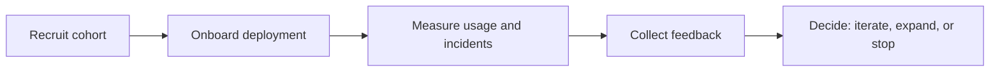

# OMES pilot program

Status: draft, pre-pilot. All thresholds in this document are **initial ASSUMPTION thresholds**
— they are starting points for a go/no-go decision, not validated targets. They must be revised
once real pilot data exists, and the revision must be logged (see section 7).

OMES is an independent, MIT-licensed, Omarchy-inspired compatibility layer and deployment
toolkit for Ubuntu Server 24.04 LTS and Linux Mint 22.x, with Hermes Agent as the automation
layer. It is not the official Omarchy project; pilot participants must be told this explicitly
during onboarding (see section 2, step 0 for every deployment type).

This document implements `docs/research-and-implementation-plan.md` section 5.4 ("unit
economics to measure") and section 6 ("Days 0-30: run the first internal pilot"; "Days 61-90:
run 2-5 controlled pilots"). Every measurement collected here is the raw data source for
`docs/business/unit-economics.md`'s inputs table and for the pilot-metrics business gate in
`docs/business/release-gates.md`.

## 1. Pilot cohorts

| Cohort | Who | Deployment types | Count (target) |
|---|---|---|---|
| Internal | ahliweb (repository owner) | all three types, run personally | 1 of each type (3 total) |
| External | freelancers/developers and small agencies per the plan's priority ICP (section 5.1) | all three types | at least 3 participants per type (9 total) |

Sequencing: the internal pilot for a given deployment type must complete and pass its own
go/no-go review (section 6) before that deployment type is offered to any external
participant. This mirrors the plan's validation order (internal operators first).

Each pilot instance is one **deployment** in the sense defined by
`docs/business/unit-economics.md` section 1.

## 2. Onboarding steps per deployment type

Every onboarding session starts with step 0 for all three types:

> Step 0 (all types): tell the participant, in writing, that OMES is an independent,
> Omarchy-inspired MIT project, not the official Omarchy distribution or affiliated with it;
> that installs are designed to be reversible via `omes backup`/`omes restore`; and that no
> step is destructive by default. Get explicit consent to proceed before running `omes install`.

### 2.1 Ubuntu Server headless host

1. Provision or select a host running Ubuntu Server 24.04 LTS amd64 (tier 1) or 22.04 amd64
   (tier 2), with SSH access as a sudo-capable user. Note the OS version on the operator
   worksheet.
2. Set `OMES_LOG_FILE` (or accept the default) so all timestamps in section 3 are recoverable
   from one file.
3. Run `omes check --profile server`. This must complete with no mutation. If it fails (exit
   code 3 unsupported platform, or exit 4 preflight failed), record it as an intervention
   (section 3) and resolve before continuing; do not proceed to install on an unsupported
   platform (exit 3).
4. Run `omes install --profile server --dry-run` first so the participant can review planned
   actions, then run `omes install --profile server` for real.
5. Run `omes doctor` to verify Hermes and the `hermes-gateway` systemd unit are healthy.
6. Run `omes status` to confirm the state file shows every server-profile module as applied.
7. Reboot the host and re-run `omes doctor` and `systemctl status hermes-gateway` to confirm
   the service survives reboot.
8. If anything fails, use `omes backup`/`omes restore` (offline-capable) to test rollback
   before escalating; record every rollback per section 3.

### 2.2 Linux Mint workstation

1. Confirm the host runs Linux Mint 22.x amd64 (tier 1 desktop). Note the release on the
   operator worksheet.
2. Run `omes check --profile desktop`. Preflight must cover GPU, kernel, Mesa, Wayland,
   portal, and display-manager checks with no mutation.
3. Run `omes install --profile desktop --dry-run`, review with the participant, then run
   `omes install --profile desktop` for real. This backs up the existing Cinnamon/session
   configuration before any change (per the module contract's `omes_manage_path`/backup step).
4. Run `omes doctor`.
5. Log out and confirm both the new Hyprland-based session entry and the original Cinnamon
   session are selectable at the display manager's login screen; log back in with each at
   least once.
6. Run `omes status` to confirm the desktop-profile modules are applied.
7. If login, multi-monitor, or screen sharing fails, use `omes restore` to return to the
   backed-up Cinnamon configuration; record as a rollback (section 3), not silently.

### 2.3 Hermes Telegram deployment

1. Confirm the underlying host already has the `hermes` profile applied (fresh install via
   `omes install --profile hermes`, or added on top of an existing server/desktop host).
2. Run `omes check --profile hermes` to confirm network access and privilege scope for the
   Hermes gateway before mutating anything.
3. Run `omes install --profile hermes --dry-run`, then `omes install --profile hermes` for
   real, to install/verify the per-user Hermes install and gateway service.
4. Configure Telegram allowlists with the participant: `TELEGRAM_BOT_TOKEN`,
   `TELEGRAM_ALLOWED_USERS` (DM allowlist), `TELEGRAM_ALLOWED_CHATS` and
   `TELEGRAM_GROUP_ALLOWED_CHATS` (both must list every authorized group). Restart the
   gateway after any allowlist edit — allowlists are read only at gateway start.
5. Run `omes doctor` (which wraps `hermes doctor`) to confirm the gateway is healthy.
6. Send one authorized test message and one deliberately unauthorized test message (from a
   non-allowlisted account, if one is available) to confirm `unauthorized_dm_behavior` and
   group/DM isolation work as configured. Never call Telegram `getUpdates` against the
   running polling gateway (409 conflict) during this test.
7. Run `omes status` to confirm the hermes-profile modules and managed secret paths
   (`$HERMES_HOME/.env`, mode 0600) are recorded in state.

## 3. Instrumentation: what is measured and how

All timestamp-based metrics come from the OMES log file (`OMES_LOG_FILE`, default under the
state directory), which records a timestamped line for the start and end of every `omes`
subcommand invocation and every module's `check`/`apply`/`verify`/`rollback` call. Metrics that
the CLI cannot observe (manual fixes, opinions, intent to pay) come from the **operator
worksheet**, a one-row-per-event log the pilot operator (ahliweb, for both internal and
external pilots) fills in during the session, and from the **feedback template** (section 4)
filled in by the participant.

| Metric | Definition | How it is measured |
|---|---|---|
| Time-to-first-success | Wall-clock time from the participant's first `omes install` invocation to the first exit-code-0 completion of that command for this deployment (includes any retries after fixed failures). | OMES log file: timestamp of first `install` start line minus timestamp of the first `install` line with `exit_code=0`, for this deployment's log entries. Cross-checked against the operator worksheet's start/end time columns. |
| Preflight time | Wall-clock duration of `omes check`. | OMES log file: timestamp delta between the `check` start line and its completion line. Feeds `preflight_time_hours` in `docs/business/unit-economics.md`. |
| Install time | Wall-clock duration of `omes install` (successful run only). | OMES log file: timestamp delta between the `install` start line and its exit-code-0 completion line. Feeds `install_time_hours`. |
| Intervention count | Number of manual actions the operator took that the CLI itself did not perform (e.g., editing a config file by hand, manually restarting a service, manually resolving a package conflict). | Operator worksheet: one row per intervention, with a free-text reason and the module involved, filled in live during the session. Sum of `troubleshooting_time_hours`-worthy events feeds `docs/business/unit-economics.md`'s `troubleshooting_time_hours` input. |
| Failures by module | Count of `module apply failed` (exit 6) and `verification failed` (exit 7) events, grouped by `MODULE_NAME`. | OMES log file (or `--json` output, which names the failed module in the message): grep/tally lines matching exit codes 6 and 7 per module, across the pilot cohort for that deployment type. |
| Rollback count | Number of times `omes restore` or a module's `module_rollback` ran for this deployment, split into intentional (test) vs. forced (recovering from a real failure). | OMES log file: count of `restore`/`rollback` invocation lines. Operator worksheet: a yes/no "was this a deliberate test or a real recovery" column for each one. |
| Retention at 30 days | Whether the deployment is still active and OMES-managed 30 calendar days after its first successful install. | Follow-up check-in at day 30: participant (or operator, remotely) runs `omes status`; retained = every previously-applied module still shows `status=applied` in the state file and the relevant service (e.g. `hermes-gateway`) is running. Recorded on the feedback template's follow-up section. |
| Willingness to pay / objections | Whether the participant would pay `setup_fee_usd` and/or `support_subscription_usd_per_month` (from `docs/business/unit-economics.md`) for this engagement, and their stated reasons if not. | Feedback template (section 4), filled in by the participant after the deployment is complete, not by the operator on their behalf. |

## 4. Feedback collection template

Use this template verbatim for every pilot participant (internal and external), filled in by
the participant, not the operator:

```
OMES pilot feedback — <deployment type: server | desktop | hermes> — <date>
Participant (name/handle, or "internal — ahliweb"):

1. On a scale of 1-5, how well did the install match what you expected? ___
2. What was the single most confusing or frustrating step, if any?
   _______________________________________________________________
3. Did you need to ask for help at any point? If yes, what for?
   _______________________________________________________________
4. Would you have paid <setup_fee_usd from docs/business/unit-economics.md, current base
   scenario> USD for this setup to be done for you, if you had not been a pilot participant?
   [ ] Yes, at that price   [ ] Yes, but at a lower price (state price: ____)
   [ ] No — reason: _______________________________________________
5. Would you pay <support_subscription_usd_per_month from docs/business/unit-economics.md,
   current base scenario> USD/month for ongoing support (updates, troubleshooting,
   incident response)?
   [ ] Yes   [ ] No — reason: ____________________________________
6. Anything you would want changed before recommending this to someone else?
   _______________________________________________________________

--- Follow-up at day 30 (operator fills in from `omes status` / a short check-in) ---
7. Is the deployment still active and OMES-managed? [ ] Yes  [ ] No — reason: ___________
8. Has the participant made any unmanaged manual changes that OMES is unaware of? ________
```

## 5. Operator worksheet (structure)

One row per event, kept alongside the OMES log file for each pilot deployment:

| Timestamp | Deployment ID | Event type (intervention / rollback / note) | Module (if any) | Description | Deliberate test? (Y/N) | Time spent (hours) |
|---|---|---|---|---|---|---|

## 6. Go/no-go thresholds (initial ASSUMPTION)

These thresholds gate whether a deployment type is ready to move from internal pilot to
external pilot, and from external pilot to `docs/business/release-gates.md`'s alpha gate.
Every number below is an initial ASSUMPTION threshold, not a validated target.

| Deployment type | Metric | Initial ASSUMPTION threshold |
|---|---|---|
| Ubuntu Server headless | Time-to-first-success | <= 60 minutes |
| Ubuntu Server headless | Intervention count | <= 2 per deployment |
| Ubuntu Server headless | Failures by module | 0 modules with a failure rate > 30% across the cohort |
| Linux Mint workstation | Time-to-first-success | <= 90 minutes (desktop preflight/config surface is larger per the plan's Phase 3) |
| Linux Mint workstation | Intervention count | <= 3 per deployment |
| Linux Mint workstation | Cinnamon fallback availability | 100% — every participant must be able to log back into Cinnamon after install |
| Hermes Telegram | Time-to-first-success | <= 30 minutes (assumes an existing server/desktop host with the `hermes` profile as the only work) |
| Hermes Telegram | Unauthorized-access test | 0 unauthorized test messages accepted by the bot, across the cohort |
| All types | Rollback count | Forced (non-deliberate) rollbacks <= 1 per deployment; more than 1 forced rollback is a fail for that deployment |
| All types | Retention at 30 days | >= 70% of completed pilot deployments still active and OMES-managed at day 30 |
| All types | Willingness to pay | >= 50% of external pilot participants answer "Yes" (at any price) to feedback-template question 4 |

If a deployment type fails a threshold, do not average it away across other types — treat each
deployment type's gate independently, per the plan's phased rollout (Phase 2 server before
Phase 3 desktop).

## 7. Pilot exit report template

Fill in one of these per deployment type once its pilot cohort (internal + all external
participants for that type) is complete:

```
OMES pilot exit report — <deployment type> — <date range>

1. Cohort: <N internal, N external> completed deployments; <N> abandoned/incomplete (reason).
2. Metrics observed (median / range across the cohort):
   - Time-to-first-success: ____
   - Preflight time: ____
   - Install time: ____
   - Intervention count: ____
   - Failures by module: <module: count, module: count, ...>
   - Rollback count (deliberate / forced): ____ / ____
   - Retention at 30 days: ____ % of cohort
   - Willingness to pay: ____ % "Yes" at stated price; ____ % "Yes" at lower price
     (median stated price: ____); top 3 objections: __________________________
3. Threshold-by-threshold result (section 6): PASS/FAIL for each row, with the observed value.
4. Recommended update to docs/business/unit-economics.md's inputs (section 6 of that
   document): which inputs changed, from what value to what value, and why.
5. Go/no-go recommendation for this deployment type: proceed to next cohort / hold and fix
   <specific gap> / stop.
6. Any threshold in section 6 that should itself be revised, and the proposed new value with
   justification (this is a change to this document, tracked separately, not silently edited
   into the exit report).
```

<!-- OMES-MERMAID: docs/business/pilot-program.md -->

## Visual summary



