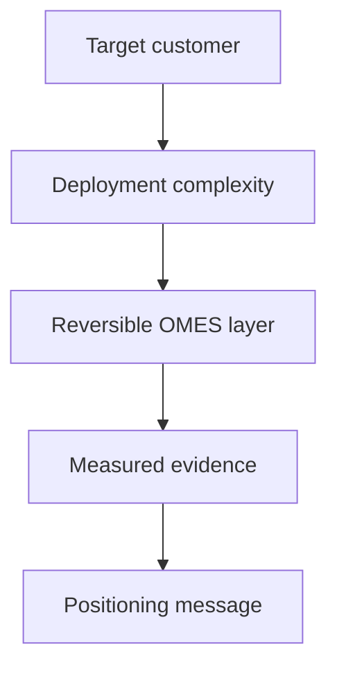

# OMES Positioning

> Status: Hypothesis-stage messaging, built on the ICP work in [icp-and-customer-discovery.md](icp-and-customer-discovery.md). Treat every claim below as a testable hypothesis until it carries a cited evidence source.
> Baseline: [docs/research-and-implementation-plan.md](../research-and-implementation-plan.md), sections 5.1–5.2.
> Last updated: 2026-09-18.

OMES is an independent, Omarchy-inspired, MIT-licensed project. It is never described as official Omarchy, as "Omarchy for Ubuntu," or as affiliated with, endorsed by, or a distribution of Omarchy. Hermes Agent is a Nous Research product; OMES integrates with it and does not own, resell, or speak on behalf of it.

## Validated

Nothing here is validated yet. Positioning claims below are Hypothesis until backed by interview evidence (per the [icp-and-customer-discovery.md](icp-and-customer-discovery.md) interview plan) or by a measured pilot result (per the metrics in the [Measurable benefit claims](#measurable-and-testable-benefit-claims) section). This section will list dated evidence citations as discovery and pilots produce them.

## Hypothesis: positioning statement

This is the plan's recommended statement (section 5.2), used verbatim as the working positioning until customer language from interviews suggests a revision:

> OMES is an open-source deployment layer that makes Ubuntu Server and Linux Mint ready for Hermes-based development and operations, with an Omarchy-inspired workflow that remains reversible and respects the host platform.

Key words chosen deliberately:

- "deployment layer," not "distribution" — OMES does not replace Ubuntu/Mint; it configures them.
- "Omarchy-inspired workflow," not "Omarchy for Ubuntu" or "Omarchy port" — avoids any affiliation or equivalence claim.
- "reversible" and "respects the host platform" — sets the security/operations expectation (backup, rollback, no destructive defaults) rather than promising feature parity with Arch/Hyprland.

## Hypothesis: value proposition per ICP

Each value proposition follows the pattern: for [ICP], who [pain], OMES [what it does], unlike [current alternative], because [reason]. All pains and reasons are drawn from [icp-and-customer-discovery.md](icp-and-customer-discovery.md) and remain `ASSUMPTION` pending interview validation.

| ICP | Value proposition (Hypothesis) |
|---|---|
| ICP-1: ahliweb internal operators | For ahliweb's own team, who lose time re-provisioning wiped or new machines, OMES gives a repeatable, checked install with a documented rollback path, unlike ad hoc shell history, because every module is check-then-apply-then-verify with a backup taken first. |
| ICP-2: Freelancers/developers | For solo developers who want the Omarchy-style workflow without migrating to Arch, OMES brings that workflow to Ubuntu/Mint they already run, unlike Omakub (Ubuntu-only, not Hermes-integrated) or personal dotfiles (config only, no agent setup), because it wires up Hermes as a first-class, checked module alongside the dev environment. |
| ICP-3: Agencies | For agencies running many client servers with no dedicated DevOps hire, OMES gives a documented, idempotent baseline that new hires can run themselves, unlike internally-maintained scripts that only the original author understands, because the module contract (`check`/`apply`/`verify`/`rollback`) and JSON output make the setup inspectable and auditable by anyone on the team. |
| ICP-4: Small teams needing a Hermes assistant | For small teams who want an internal AI assistant but lack ops expertise to run one safely, OMES sets up Hermes's gateway with correct allowlists and systemd units out of the box, unlike a hand-rolled Hermes install, because OMES encodes the documented allowlist and secret-boundary requirements as preflight checks rather than leaving them to be discovered after a misconfiguration. |
| ICP-5: Self-hosters | For self-hosters who want control and reversibility, OMES never mutates the host without a backup and a rollback path, unlike installer scripts with no undo, because every managed path is registered, backed up with a manifest, and restorable offline. |
| ICP-6: Education labs | For lab admins who need identical, resettable images across many machines, OMES gives a scriptable, dry-run-capable baseline that's easy to explain and re-apply, unlike bespoke golden images that drift over a term, because `--dry-run` and `--json` make the install process explainable and scriptable into existing lab tooling. |
| ICP-7: Technical SMEs | For SMEs under audit or compliance pressure with no platform team, OMES gives an inspectable, logged installation process, unlike unmanaged individual tool adoption, because state, backups, and logs are written to well-known, documented locations rather than living only in someone's head. |

## Hypothesis: comparison vs. alternatives

This is a positioning-level summary. The full dimension-by-dimension comparison with sources and confidence levels lives in [competitive-landscape.md](competitive-landscape.md) (issue #21); this section states only the honest "better/worse" framing used in messaging.

| Alternative | Where OMES is better (Hypothesis) | Where OMES is worse / not applicable (honest) |
|---|---|---|
| Omarchy (Arch/Hyprland) | Runs on Ubuntu Server LTS and Linux Mint, which many teams already standardize on and cannot or will not migrate off; no full-disk ISO install required. | Omarchy's Arch/Hyprland/Quickshell integration is deeper and more current on cutting-edge packages than anything Ubuntu/Mint's repositories provide; OMES does not attempt ISO-level snapshot/boot management (e.g., Limine) at all. |
| Omakub (Ubuntu desktop) | Adds a server profile and first-class, checked Hermes integration; explicit rollback/backup contract per module. | Omakub is a more mature, longer-running project for the Ubuntu desktop use case specifically; if a user wants only the desktop dotfiles-style experience with no Hermes/server component, Omakub may be simpler. |
| Vanilla Ubuntu/Mint | Removes the manual, undocumented setup step; gives a documented, reversible baseline and Hermes wiring. | Vanilla Ubuntu/Mint has zero third-party dependency risk and the widest official support surface — OMES adds a layer that must itself be maintained and trusted. |
| Dotfiles repos (e.g., chezmoi) | Covers system-level setup (packages, services, Hermes gateway), not just personal config files; has an explicit module contract with preflight/verify/rollback. | Dotfiles tools are simpler, more mature, and more portable across distros/OSes for pure personal-config use; if the entire need is "sync my dotfiles," a dotfiles tool is less machinery. |
| Ansible/config-management (Ansible, NixOS-style) | Lower barrier to entry for a single machine or small team — no need to learn a full configuration-management language just to get a baseline. | Ansible and NixOS-style tools are far more powerful and battle-tested for fleets, declarative state, and complex multi-host orchestration; OMES is not a replacement for a mature CM pipeline at scale. |
| Managed AI-agent platforms / hosted assistants | Keeps data and execution on infrastructure the customer owns and controls, rather than a third-party SaaS; no recurring hosting fee from OMES itself. | A managed platform typically has a support SLA, a polished UI, and no local ops burden — OMES requires the customer (or a paid OMES service) to operate the result. |
| DIY Hermes install (no OMES) | Encodes the documented allowlist, secret-boundary, and systemd PATH requirements as preflight checks and defaults, reducing the chance of a known misconfiguration. | A careful, Hermes-docs-literate operator can achieve the same end state manually with no additional dependency; OMES adds no capability Hermes itself doesn't already document. |

## Measurable and testable benefit claims

Every claim ships with the metric and how it is measured. No claim here may be published in external marketing until it has at least one pilot measurement behind it (see [icp-and-customer-discovery.md](icp-and-customer-discovery.md) evidence template and the forthcoming `unit-economics.md`).

| Claim | Metric | How measured |
|---|---|---|
| "Time-to-working-Hermes-gateway is fast on Ubuntu 24.04" | Wall-clock minutes from `omes install --profile hermes` start to a passing `hermes doctor` and a responding gateway | Pilot log entry: start timestamp, end timestamp, machine spec, `hermes doctor` output attached. Target ceiling: `ASSUMPTION`, to be set after the first 3 pilot runs — not asserted as "< 30 min" until measured. |
| "Re-running the installer is safe" | Number of unintended changes (diff against previous state) after running `omes install` twice in a row on the same host | Integration test log (`tests/integration/*.bats`, per the engineering brief) plus at least one pilot re-run log. |
| "Rollback restores the pre-install state" | Pass/fail on `omes restore` reproducing the pre-backup file set (hash match against `MANIFEST`) | Bats integration test asserting `sha256sum` match; pilot log noting whether a real rollback was needed and its outcome. |
| "Setup requires fewer manual interventions than a documented-but-manual Hermes install" | Count of manual steps/interventions per install, OMES vs. a control manual install | Pilot comparison log: same task, one operator using OMES, one following Hermes docs manually, both logging intervention count. |
| "Preflight catches unsupported platforms before any mutation" | Pass/fail: exit code 3 returned with zero filesystem writes on an unsupported OS fixture | Bats unit/integration test against `tests/fixtures/os-release/` fixtures (per the engineering brief's testing conventions). |

Until a claim has a logged measurement, it is written in this document as a hypothesis with a method, not as a completed result — and it must not appear in external-facing marketing copy in a completed-result form.

## Messaging do / don't list (trademark-safe)

**Do:**

- Say "Omarchy-inspired."
- Say "an independent, MIT-licensed project."
- Say "not affiliated with or endorsed by Omarchy or Nous Research."
- Say "integrates with Hermes Agent, a Nous Research product."
- Describe concrete, checkable behavior ("idempotent installer," "explicit rollback," "preflight before mutation").
- Attribute claims to pilots/interviews when citing a number ("in our first pilot, X took Y minutes").

**Don't:**

- Don't say "official Omarchy," "Omarchy for Ubuntu/Mint," "Omarchy port," or "Omarchy distribution."
- Don't say or imply OMES is made, sponsored, or reviewed by the Omarchy or Nous Research teams.
- Don't use Omarchy's or Hermes's logos, wordmarks, or visual identity in OMES marketing materials.
- Don't state a market size, a willingness-to-pay figure, or a price point as fact.
- Don't publish a "< N minutes" or "N% faster" claim that has no logged pilot measurement behind it.
- Don't claim security guarantees beyond what OMES actually manages (see the plan's section 2.4 — OMES doesn't control bootloader/disk encryption on an existing host).

## Short pitch

### English

> OMES is an independent, open-source (MIT) deployment layer that brings an Omarchy-inspired, keyboard-first workflow to Ubuntu Server LTS and Linux Mint — with Hermes Agent wired in as your automation layer. Every step is checked before it runs, backed up before it changes anything, and reversible if it doesn't work out. Not official Omarchy. Not a hosted service. Just a toolkit you run on machines you already own.

### Bahasa Indonesia

> OMES adalah lapisan deployment open-source (lisensi MIT) yang independen, membawa workflow ala Omarchy (Omarchy-inspired) ke Ubuntu Server LTS dan Linux Mint — dengan Hermes Agent terpasang sebagai lapisan otomasi. Setiap langkah diperiksa sebelum dijalankan, dicadangkan (backup) sebelum ada perubahan, dan bisa dibatalkan (reversible) jika hasilnya tidak sesuai. Bukan Omarchy resmi. Bukan layanan hosting. OMES adalah toolkit yang berjalan di mesin yang sudah Anda miliki.

Both pitches avoid any claim of official affiliation, avoid stating a price, and describe only behavior OMES actually implements per the engineering brief (idempotent, checked, backed-up, reversible).

<!-- OMES-MERMAID: docs/business/positioning.md -->

## Visual summary

