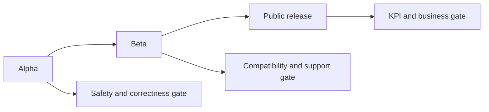

# OMES release gates, KPIs, and go/no-go criteria

Status: draft, pre-alpha. This document operationalizes
`docs/research-and-implementation-plan.md` section 7 ("Go/no-go criteria") into concrete,
checkable gates for three release stages: alpha, beta, and public. It depends on artifacts
from `docs/business/unit-economics.md` (#23), `docs/business/pilot-program.md` (#24), the test
matrix (#15), lint/secret-scan CI (#16), and rollback/disaster-recovery testing (#17). None of
the numeric thresholds below should be read as validated facts before the referenced
issue/pilot artifact exists; where a threshold is itself an ASSUMPTION (inherited from
`docs/business/pilot-program.md` or `docs/business/unit-economics.md`), it is marked as such.

OMES is an independent, MIT-licensed, Omarchy-inspired compatibility layer and deployment
toolkit for Ubuntu Server 26.04 LTS, Ubuntu Server 24.04 LTS, and Linux Mint 22.x, with Hermes Agent as the automation
layer. It is not the official Omarchy project, and no release gate below waives that.

## 1. Release stages

### 1.1 Alpha

**Technical gates** (all must pass before alpha):

- Installation succeeds on the Tier-1 matrix: Ubuntu Server 26.04 LTS amd64, Ubuntu Server 24.04
  LTS amd64, and Linux Mint 22.x amd64 (per the compatibility matrix), proven by the test matrix
  in #15 and #167.
- Re-run idempotency: running `omes install` a second time on an already-applied host makes
  no further changes and exits 0, proven by #15.
- Reboot survival: after a reboot, all applied services (at minimum the `hermes-gateway`
  systemd unit for the server profile) are running and `omes doctor` is clean, proven by #15.
- Rollback tested: `omes restore` recovers a host to its pre-install state, tested offline,
  proven by #17.
- Secret scan clean: no secret/token pattern in the working tree or git history, proven by the
  CI secret-scan job in #16.
- ShellCheck clean: `shellcheck -x -S style` passes on all shell sources, proven by the CI lint
  job in #16.
- No destructive default: every mutating command requires an explicit profile/module choice or
  confirmation (`--yes`), and unsupported-platform detection (exit 3) happens before any
  mutation, proven jointly by #15 and #17.
- Release provenance and commit integrity: release cut via `scripts/release.sh` (#168) from clean
  `main` with green CI checks, matching VERSION/changelog/tag, and verified read-back of git tag
  and GitHub Release.
- Docs walkthrough by a second operator: someone other than ahliweb follows the published
  documentation unaided and completes at least the Ubuntu Server onboarding steps in
  `docs/business/pilot-program.md` section 2.1, recorded as part of the internal pilot's exit
  report (#24).

**Business gates** (all must pass before alpha):

- At least the internal pilot (`docs/business/pilot-program.md` section 1) has completed a
  real workflow on the server profile and produced a pilot exit report (#24, section 7 of that
  document).
- The unit-economics model (`docs/business/unit-economics.md`, #23) is published and auditable
  — its existence and internal consistency are required for alpha, not a specific profitable
  result yet.

### 1.2 Beta

**Technical gates** (all of alpha, plus):

- The desktop profile (Linux Mint) independently passes its own Tier-1 matrix run, including
  Cinnamon-fallback verification, per #15. If the desktop profile is delayed per section 3 of
  this document, beta may proceed server/hermes-only with that explicitly recorded as a known
  limitation.
- Expanded regression coverage from the Phase 5 test matrix passes: unavailable-network
  handling, package-installation failure handling, and broken-session rollback, per #15.
- Rollback and disaster recovery are re-tested against the expanded matrix (not just the
  alpha-gate happy path), per #17.

**Business gates** (all of alpha, plus):

- External pilots (`docs/business/pilot-program.md` section 1) are complete for every
  deployment type being taken into beta, and each deployment type's go/no-go thresholds
  (`docs/business/pilot-program.md` section 6) pass independently — a passing average across
  types does not substitute for a passing result per type.
- `docs/business/unit-economics.md`'s inputs have been updated at least once from real pilot
  data using that document's section 6 procedure (i.e., the model is no longer running on
  100% pre-pilot ASSUMPTION values for every input).
- `docs/business/support-tiers.md`'s operational cost assumptions have been reconciled against
  actual operator-worksheet hours from the pilots.

### 1.3 Public

**Technical gates** (all of beta, plus):

- The Tier-1 installation, idempotency, and reboot-survival results in #15 are reproduced
  cleanly across at least two consecutive CI/test-matrix runs (not a single lucky pass).
- All known limitations remaining at public release are published in the documentation
  (per the engineering brief's rule to describe actual, not planned, state).

**Business gates** (all of beta, plus):

- The support-cost-vs-setup-value KPI (section 2) is non-negative across the external pilot
  cohort's observed data — i.e., the cohort's measured inputs do not resemble the downside or
  stress scenario in `docs/business/unit-economics.md` section 4.
- The willingness-to-pay threshold in `docs/business/pilot-program.md` section 6 is met across
  the combined external pilot cohort, not just one deployment type.
- No kill-criteria trigger from section 4 of this document is currently active.

### 1.4 Control Center and provider pilot

This is a separate gate from the native OMES alpha/beta release. It may not be used to imply that the CLI is production-ready, and the CLI may not be declared commercially ready merely because a web prototype works.

Required design/implementation evidence for a Control Center pilot:

- #89 and #90 contracts reviewed; no arbitrary shell path exists;
- tenant isolation, RBAC/ABAC, idempotency, audit, and reconciliation tests pass;
- AWCMS outage does not stop a healthy local deployment;
- manual invoice and entitlement behavior is deterministic before live payment automation;
- provider adapters expose capability and manual fallback states;
- Cloudflare registration uses authoritative check and explicit final confirmation;
- SRS-X `.id` document handling has encryption, access audit, expiry, and retention evidence;
- GitHub webhook signatures and delivery replay protection are tested;
- no live credentials are needed for default CI tests;
- provider costs, manual intervention, failure rate, reconciliation drift, and support hours are measured before pricing claims;
- Herman is documented as a reference-only UX input; no source code or runtime dependency is accepted without license/provenance/security review, and no web panel may bypass the #89/#90 contracts.

A domain/billing pilot is **not go** when any operation can silently report provider success, lose tenant scope, expose raw credentials/PII, or automatically destroy a healthy deployment on payment state alone.

## 2. KPI definitions

| KPI | Formula | Unit | Source |
|---|---|---|---|
| Installation success rate | successful installs / attempted installs | % | Test matrix results, #15 |
| Idempotency success rate | re-runs producing no further change and exit 0 / total re-run attempts | % | Test matrix results, #15 |
| Reboot survival rate | hosts with all managed services running after reboot / hosts tested | % | Test matrix results, #15 |
| Rollback success rate | successful `omes restore` recoveries / attempted rollbacks | % | Rollback/DR test results, #17 |
| Secret findings | count of secret/token patterns detected in tree or history | count (target 0) | CI secret-scan job, #16 |
| ShellCheck findings | count of ShellCheck errors/warnings at `-S style` | count (target 0) | CI lint job, #16 |
| Time-to-first-success | wall-clock time from first `omes install` invocation to first exit-0 completion | minutes, per deployment type | `docs/business/pilot-program.md` section 3, #24 |
| Intervention count | manual actions logged on the operator worksheet per deployment | count, per deployment | `docs/business/pilot-program.md` section 3/5, #24 |
| Retention at 30 days | deployments still active and OMES-managed at day 30 / completed deployments | % | `docs/business/pilot-program.md` section 3, #24 |
| Willingness to pay | participants answering "Yes" (any price) / participants surveyed | % | `docs/business/pilot-program.md` section 4, #24 |
| Support burden | `support_hours_per_deployment_per_month` (total monthly support hours / active subscribed deployments) | hours/deployment/month | `docs/business/unit-economics.md` section 2, reconciled with `docs/business/support-tiers.md` section 3, #23/#25 |
| Steady-state monthly contribution | `support_subscription_usd_per_month - infra_cost_usd_per_month - support_cost_usd_per_month` (per `docs/business/unit-economics.md` section 3) | USD/month per subscribed deployment | `docs/business/unit-economics.md`, #23 |
| Support-cost-vs-setup-value ratio | `(support_hours_per_deployment_per_month * hourly_labor_cost_usd) / support_subscription_usd_per_month` | ratio (target < 1) | `docs/business/unit-economics.md` + `docs/business/support-tiers.md`, #23/#25 |

## 3. Kill criteria and re-evaluation triggers

These are drawn directly from `docs/research-and-implementation-plan.md` section 7 and made
checkable against this document's KPIs and the pilot/economics documents.

**Delay the desktop (Linux Mint) release when:**

- Hyprland requires a fragile source build for the target environment (see
  `docs/business/support-tiers.md` section 6, "source builds" are never supported).
- The Cinnamon fallback is not guaranteed to work after install (pilot-program.md section 2.2
  requires verifying both sessions are selectable).
- Screen sharing, desktop portals, or GPU support are unstable during pilot testing.
- The support matrix cannot realistically be maintained by the current operator capacity
  (compare against `docs/business/support-tiers.md` section 1's cost assumptions).

Re-evaluation trigger: re-run the Linux Mint Tier-1 matrix (#15) and the desktop-profile
internal pilot (#24) after the blocking issue is fixed; do not schedule a desktop beta date
until both pass.

**Delay or stop monetization (paid tiers) when:**

- Observed support time exceeds the value delivered by setup — i.e., the cohort's measured
  `support_hours_per_deployment_per_month * hourly_labor_cost_usd` approaches or exceeds
  `support_subscription_usd_per_month` (support-cost-vs-setup-value ratio approaches or
  exceeds 1), matching the downside scenario in `docs/business/unit-economics.md` section 4.3.
- External pilot participants show no willingness to pay (below the threshold in
  `docs/business/pilot-program.md` section 6).
- Positioning is not meaningfully different from dotfiles or Ansible-based setups in pilot
  feedback (feedback-template question 6 responses repeatedly say so).
- Cross-distro/cross-profile maintenance cost cannot be covered by service revenue, i.e. the
  observed cohort resembles the stress scenario in `docs/business/unit-economics.md` section
  4.4 (negative steady-state contribution).

Re-evaluation trigger: when any of the above is observed, stop selling the affected tier(s),
re-run the unit-economics update procedure (`docs/business/unit-economics.md` section 6) with
the observed data, and re-price or re-scope before resuming sales — do not continue selling at
the same price/scope while "hoping" the trend reverses.

**General kill criteria (any stage):**

- A destructive default is discovered (any mutating action that runs without an explicit
  profile/module selection or without `--yes`/dry-run review). Treat as a stop-ship defect at
  any stage, not a beta-only concern.
- A secret is found to have been committed to the repository or its history. Stop release,
  rotate per `docs/business/support-tiers.md` section 4.2, and re-run the secret scan (#16)
  clean before resuming.

## 4. Go/no-go checklist

| Gate | Stage(s) | Proven by (issue/artifact) |
|---|---|---|
| Installation success on Tier-1 matrix | Alpha, Beta, Public | #15 (installation and regression test matrix) |
| Re-run idempotency | Alpha, Beta, Public | #15 |
| Reboot survival | Alpha, Beta, Public | #15 |
| Rollback tested | Alpha, Beta, Public | #17 (rollback and disaster-recovery testing) |
| Secret scan clean | Alpha, Beta, Public | #16 (shell linting, secret scanning, supply-chain checks) |
| ShellCheck clean | Alpha, Beta, Public | #16 |
| No destructive default | Alpha, Beta, Public | #15 + #17 (proven jointly by the test matrix and rollback testing) |
| Docs walkthrough by a second operator | Alpha | #24 (`docs/business/pilot-program.md` internal pilot exit report) |
| Internal pilot completes a real workflow | Alpha | #24 |
| Unit-economics model published and auditable | Alpha | #23 (`docs/business/unit-economics.md`) |
| Desktop profile passes its own Tier-1 matrix | Beta | #15 |
| Expanded regression matrix (network/package/session failures) | Beta | #15, #17 |
| External pilots complete, per-type thresholds pass | Beta | #24 (`docs/business/pilot-program.md` section 6) |
| Unit-economics inputs updated from real pilot data | Beta | #23 |
| Support-tier cost assumptions reconciled against pilot data | Beta | #25 (`docs/business/support-tiers.md`) referenced by #23/#24 |
| Two consecutive clean Tier-1 test-matrix runs | Public | #15 |
| Known limitations published in documentation | Public | repository docs (all `docs/*.md`) |
| Support-cost-vs-setup-value KPI non-negative across cohort | Public | #23 + #24 |
| Willingness-to-pay threshold met across combined cohort | Public | #24 |
| No active kill-criteria trigger (section 3) | Public | #23 + #24 + this document |

## 5. Release-readiness review procedure

1. Before proposing a stage transition (alpha -> beta, or beta -> public), the operator
   (ahliweb) fills in the go/no-go checklist in section 4 with the current status and the
   specific artifact/run that proves each row (a link to a CI run, a pilot exit report, or the
   relevant commit of `docs/business/unit-economics.md`).
2. Any row marked FAIL or "not yet measured" blocks that stage transition; there is no
   partial/majority-pass rule — every row in the target stage's gate list must be PASS.
3. Check the kill criteria in section 3 against current pilot/economics data. If any kill
   criterion is triggered, the review stops here regardless of the checklist result, and the
   affected area (desktop release, or monetization) is put on hold per section 3's
   re-evaluation trigger.
4. Record the review outcome (proceed / hold with reason / stop) and the date. If proceeding,
   note the release stage and the specific commit/tag being released.
5. Re-run this procedure again before every subsequent stage transition; a passed alpha review
   does not carry forward to beta or public without its own review.

<!-- OMES-MERMAID: docs/business/release-gates.md -->

## Visual summary

