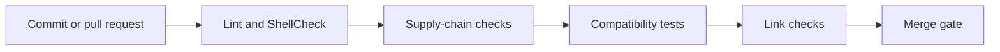

# OMES Continuous Integration

> Status: describes the CI implemented in issue [#16](https://github.com/ahliweb/omes/issues/16)
> — `.github/workflows/lint.yml`, `.github/workflows/compatibility.yml`,
> `.github/dependabot.yml`, `.gitleaks.toml`, `.yamllint.yml`, and the
> `scripts/lint.sh` / `scripts/check-supply-chain.sh` / `scripts/check-links.py`
> scripts those workflows call. This document describes what exists today,
> not aspirational behavior; see [docs/security.md](security.md) section 6-7
> for the supply-chain and release-gate *requirements* this CI implements.
>
> The core installer (`bin/omes`, `lib/omes/*.sh`, `modules/`, `tests/run.sh`,
> `.shellcheckrc`) is tracked separately in issue
> [#6](https://github.com/ahliweb/omes/issues/6) and may not exist yet on a
> given branch. Every CI step that depends on it is guarded with
> `if: hashFiles('<path>') != ''` (or an equivalent `[ -e ... ]` shell check
> inside a script), so both workflows in this document are safe, harmless
> no-ops before issue #6 merges and exercise the real CLI once it does.

## 1. Workflows

### 1.1 `.github/workflows/lint.yml`

Triggers: every pull request, and every push to `main`. Runs are
cancelled and replaced when a newer commit lands on the same PR/branch
(`concurrency` with `cancel-in-progress: true`). Every job requests only
`permissions: contents: read` — no job in this workflow needs to write to
the repository, comment on pull requests, or write security-events.

| Job | What it does | Blocks merge? |
|---|---|---|
| `shellcheck` | Runs `scripts/lint.sh shellcheck` — ShellCheck at `-S warning` (blocking) then `-S style` (reported, not blocking) over every shell file in scope (§2.1). | **Yes** (at `warning` severity and above). Style-level findings are printed but do not fail the job. |
| `shfmt` | Runs `scripts/lint.sh shfmt` — `shfmt -i 2 -ci -bn -d` (diff mode) over the same file set. | **No.** `continue-on-error: true`. See §3 for why. |
| `bats` | Installs `bats` (apt) and runs `tests/run.sh` (ShellCheck + unit + integration, per [ADR-0009](adr/0009-testing-with-bats-in-containers.md)) — only if `tests/run.sh` exists yet. | **Yes**, once issue #6 merges. No-op (and passes) before that. |
| `gitleaks` | Full git-history secret scan via `gitleaks/gitleaks-action`, checked out with `fetch-depth: 0` so history (not just the diff) is scanned. | **Yes.** |
| `yamllint` | Runs `scripts/lint.sh yamllint` over every tracked `*.yml`/`*.yaml` file (primarily `.github/workflows/*`), using `.yamllint.yml`. | **Yes.** |
| `actionlint` | Runs `rhysd/actionlint` (via Docker, pinned by image digest) against `.github/workflows/*.yml`. | **Yes.** |
| `supply-chain` | Runs `scripts/check-supply-chain.sh` (§4). | **Yes**, for the action-pinning and unsafe-pipe checks. The external-URL listing is informational only. |
| `check-links` | Runs `scripts/check-links.py` (§5) over every tracked `*.md` file. | **Yes**, for a link whose *target file* does not exist. Anchor-only mismatches are printed as advisory warnings. |

### 1.2 `.github/workflows/compatibility.yml`

Triggers: every pull request, every push to `main`, a weekly schedule
(Monday 03:17 UTC), and `workflow_dispatch` (manual run). Same
`concurrency`/`cancel-in-progress` policy as `lint.yml`. `permissions:
contents: read` throughout.

| Job | What it does | Blocks merge? |
|---|---|---|
| `matrix` | For each of `ubuntu:24.04`, `ubuntu:22.04`, `linuxmintd/mint22-amd64` (containers, running as root): installs `sudo`, `curl`, `ca-certificates`, `git`, then (once `bin/omes` exists) runs `bin/omes version --json`, `bin/omes check --json` (result recorded, not gating), and `bin/omes install --profile server --dry-run --yes`. | **Yes** for `version`/`install --dry-run`; `check`'s exit code is recorded, not gating (a container can legitimately fail a hardware/network preflight check without that being a CI defect). |
| `real-install-ubuntu-24-04` | On `ubuntu:24.04` only: a **real**, non-dry-run `bin/omes install --profile server --yes` as root, run **twice in a row** to prove idempotency, then uploads `/var/lib/omes/logs` as a build artifact (`actions/upload-artifact`). | **No.** `continue-on-error: true` — this is allowed to fail until the `security-baseline` (#7) and `hermes` (#15) modules exist, since a bare container currently has no applicable server-profile modules to install end-to-end. Once those modules land, this job becomes the real idempotency proof and should be revisited for whether it should start blocking. |

**Compatibility-matrix mapping.** `docs/compatibility-matrix.md` section 1
defines four support tiers; this workflow currently covers exactly the
**Tier 1** platforms for the `server` profile
(`ubuntu:24.04` — Tier 1 server) and one representative of Tier 1 desktop
(`linuxmintd/mint22-amd64`, standing in for Linux Mint 22.x) plus the Tier 2
`ubuntu:22.04`. Per compatibility-matrix.md section 1, Tier 1 platforms must
be tested "in CI containers **and** in a VM before every release" — the
container matrix here is the CI-container half of that requirement; the VM
half is `tests/vm/` (tracked separately, see compatibility-matrix.md
section 7). Tier 2 (`ubuntu:22.04`) is tested "periodically, not on every
release" per that same table — today this workflow runs it on every PR/push
in addition to the weekly schedule, which is a stricter cadence than the
minimum the matrix document requires, not a shortfall. Promoting a new
platform to Tier 1 requires adding it to this workflow's matrix, per
compatibility-matrix.md section 6, step 6.

## 2. Running the checks locally

### 2.1 `scripts/lint.sh` — ShellCheck, shfmt, yamllint

```bash
scripts/lint.sh              # everything (shellcheck + shfmt + yamllint)
scripts/lint.sh shellcheck   # ShellCheck only (same two-pass warning/style split as CI)
scripts/lint.sh shfmt        # shfmt diff only
scripts/lint.sh yamllint     # yamllint only
```

File scope for ShellCheck/shfmt (matches the `shellcheck` and `shfmt` CI
jobs exactly, since both call this same script): every tracked path ending
in `.sh` (this already covers `modules/**/*.sh` and `lib/**/*.sh`), every
tracked `tests/**/*.bash`, and every tracked path under `bin/` or
`install/` that is a shell script by shebang or MIME type (`file
--mime-type`) — this catches an extensionless entry point like `bin/omes`
without also picking up a non-shell file that happens to live in `bin/`.

The script uses a locally installed `shellcheck`/`shfmt`/`yamllint` when
present (GitHub-hosted `ubuntu-24.04` runners ship ShellCheck by default),
and otherwise falls back to the pinned Docker images named at the top of
`scripts/lint.sh`, so local and CI results should not diverge.

### 2.2 `scripts/check-supply-chain.sh`

```bash
scripts/check-supply-chain.sh
```

See §4 below for what it checks.

### 2.3 `scripts/check-links.py`

```bash
python3 scripts/check-links.py                 # every tracked *.md file
python3 scripts/check-links.py docs/ci.md ...   # or specific files
```

See §5 below.

### 2.4 gitleaks (full history)

```bash
docker run --rm -v "$PWD:/repo" zricethezav/gitleaks:latest \
  detect --source /repo --config /repo/.gitleaks.toml --no-banner --redact
```

Run this from the actual repository root (not a `git worktree` whose
`.git` file points outside the mounted volume — if it does, mount the
parent repository path instead so the `gitdir:` link inside `.git`
resolves). `--redact` keeps any genuine finding's secret value out of the
command's own output.

### 2.5 actionlint

```bash
docker run --rm -v "$PWD:/repo" -w /repo \
  rhysd/actionlint@sha256:b1934ee5f1c509618f2508e6eb47ee0d3520686341fec936f3b79331f9315667 \
  -color
```

### 2.6 bats (once issue #6 merges)

```bash
./tests/run.sh
```

Per [ADR-0009](adr/0009-testing-with-bats-in-containers.md), this runs
ShellCheck plus `tests/unit/*.bats` and `tests/integration/*.bats`, using
Docker (`bats/bats:latest`) when `bats` is not installed locally.

## 3. What blocks merge vs. what is advisory

**Blocking** (a failing job fails the PR check): `shellcheck` (at
`warning` severity), `bats` (once #6 merges), `gitleaks`, `yamllint`,
`actionlint`, `supply-chain` (action pinning + unsafe-pipe checks),
`check-links` (broken link *targets*), and the `compatibility.yml` `matrix`
job's `version`/`install --dry-run` steps.

**Advisory** (reported, does not fail the PR check): `shfmt` — the
repository's shell code is new and its formatting conventions are still
being established; making `shfmt` blocking before there is an agreed,
enforced style would make every future formatting-convention decision a
breaking CI change instead of a deliberate, reviewed one. Revisit this once
the core installer (#6) and its modules have landed and a style has
settled. Also advisory: `check-supply-chain.sh`'s external-download-URL
listing (informational, for human review, never fails), `check-links.py`'s
anchor-only warnings (the heading-to-slug matching is a best-effort
approximation of GitHub's own algorithm and can have false positives), and
`compatibility.yml`'s `check --json` step (a container's preflight result
is recorded, not gating) and its entire `real-install-ubuntu-24-04` job
(`continue-on-error: true`, see §1.2).

## 4. `scripts/check-supply-chain.sh`

Three checks, run against the working tree:

1. **Every `uses:` in `.github/workflows/*.yml` is pinned to a full 40-hex
   commit SHA.** A mutable tag or branch reference (`uses: actions/checkout@v4`)
   fails this check; `uses: actions/checkout@<40-hex-sha> # v7.0.1` passes.
   Local composite actions (`uses: ./...`) and Docker-image actions
   (`uses: docker://...`) are skipped, since neither is a tag-versioned
   GitHub Action reference. This implements the
   [docs/security.md](security.md) section 6 rule "GitHub Actions pinned by
   SHA."
2. **No tracked shell script pipes a network download directly into a
   shell interpreter.** The rule: the only permitted pattern for fetching a
   third-party installer is *download to a file first* (e.g. `curl -fsSL
   <url> -o <tmpfile>`), optionally verify a checksum, then execute that
   file as its own, separate step — never `curl ... | bash` or `wget ... |
   sh`. This is the same rule [ADR-0006](adr/0006-hermes-upstream-installer-with-pinning.md)
   and docs/security.md section 6 state for the Hermes installer,
   mechanically enforced here across every tracked shell script. A
   line that is a deliberate, reviewed exception may be marked with a
   trailing `# check-supply-chain: allow` comment (none exist today).
3. **External download URLs under `bin/`, `lib/`, `modules/`, `install/`
   are listed for human review.** Informational only — this never fails
   the check. It exists so a reviewer can see, in one place, every URL a
   PR's shell code would fetch from.

## 5. `scripts/check-links.py`

Scans every tracked `*.md` file for Markdown links
(`[text](target)`), skips absolute URLs (`http://`, `https://`, `mailto:`,
...) and same-page anchors (`#foo`), and resolves every remaining
*relative* link against the linking file's own directory. A link whose
target file does not exist is a hard failure. A link with a `#fragment`
whose target file exists, but where the fragment cannot be matched against
any Markdown heading in that file (via a best-effort approximation of
GitHub's heading-to-anchor slug algorithm), is printed as an advisory
warning rather than failing the job, since the slug heuristic is not exact.

## 6. SHA-pinning policy and how Dependabot updates pins

Per [docs/security.md](security.md) section 6: "Every third-party Action
referenced in `.github/workflows/*.yml` is pinned to a commit SHA, not a
mutable tag or branch. Bumping a pin is a reviewed change, not an automatic
update." Concretely:

- Every `uses: <owner>/<repo>@<ref>` in this repository's workflows uses a
  full 40-character commit SHA as `<ref>`, with a trailing `# vX.Y.Z`
  comment naming the human-readable release that SHA corresponds to (e.g.
  `uses: actions/checkout@3d3c42e5aac5ba805825da76410c181273ba90b1 # v7.0.1`).
  `scripts/check-supply-chain.sh` enforces this mechanically (§4.1).
- `.github/dependabot.yml` configures the `github-actions` package
  ecosystem with a weekly update schedule. Dependabot resolves the new
  release's commit SHA itself and opens a PR that updates both the SHA and
  the trailing version comment — it never leaves an action pinned to a
  moving tag. That PR goes through the same review and the same
  `lint.yml` checks (including `supply-chain`, which would fail the PR if
  Dependabot ever produced an unpinned or non-SHA reference) as any other
  change before it can merge.
- To resolve a tag to its commit SHA by hand (e.g. when adding a new
  action Dependabot doesn't cover yet, or verifying a Dependabot PR):
  `gh api repos/<owner>/<repo>/git/ref/tags/<tag>` and read `.object.sha`
  (if `.object.type` is `tag` rather than `commit`, it is an annotated tag
  — follow `.object.url` one more level, e.g.
  `gh api repos/<owner>/<repo>/git/tags/<sha>`, to reach the underlying
  commit SHA). Never guess or hand-type a SHA.
- Docker images referenced by digest in `scripts/lint.sh` and in
  `lint.yml`'s `actionlint` step (`image@sha256:...`) follow the same
  spirit — pinned to an immutable digest, not a mutable tag like `:latest`
  or `:stable` — but are not `uses:` GitHub Action references, so they are
  not covered by `scripts/check-supply-chain.sh`'s action-pinning check or
  by Dependabot's `github-actions` ecosystem. Bumping one of these digests
  is a manual, reviewed edit (re-resolve with `docker inspect --format
  '{{index .RepoDigests 0}}' <image>:<tag>` after pulling the tag you want).

## 7. How to add a `.gitleaks.toml` allowlist entry

`.gitleaks.toml` extends gitleaks' built-in default ruleset
(`[extend] useDefault = true`) with an OMES-specific `[allowlist]`. Before
adding an entry:

1. Run the local full-history scan (§2.4) *without* your proposed entry
   and confirm it actually flags the line in question — do not add an
   allowlist entry speculatively.
2. Confirm by inspection that the flagged value is not a real secret (a
   test fixture, a documented placeholder like `TELEGRAM_BOT_TOKEN=changeme`,
   or an intentionally-fake example token shape used to illustrate what
   *not* to commit).
3. Add the narrowest entry that resolves the finding:
   - A whole-file/whole-directory exemption goes under `[allowlist].paths`
     as a regex anchored to the path (e.g. `'''^tests/fixtures/.*'''`) —
     use this only for fixtures that are inherently fake data by
     construction.
   - A specific string/pattern exemption goes under
     `[allowlist].regexes`, scoped as tightly as possible to the exact
     documented placeholder (not a broad pattern that could also match a
     real secret of the same shape elsewhere in the repository).
4. Re-run the local full-history scan (§2.4) and confirm it is now clean,
   then paste that output in the PR that adds the entry — the same
   evidence standard docs/security.md section 7's "No secret in the tree
   or history" release gate requires.
5. Never add an allowlist entry for a value that is, or was ever, a real
   credential — rotate it first (see `SECURITY.md`), then the finding
   remains in history by design (gitleaks scans history) and is not
   something an allowlist entry should hide.

<!-- OMES-MERMAID: docs/ci.md -->

## Visual summary



