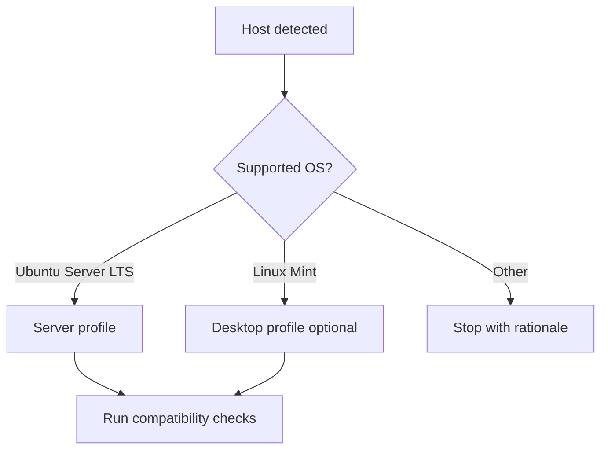

# OMES Compatibility Matrix

> Status: baseline decision for Phase 0 (issue #3). Describes the operating-system and
> hardware matrix OMES targets, how OMES detects a platform, and how support tiers map to
> CLI behavior. See [`docs/research-and-implementation-plan.md`](./research-and-implementation-plan.md)
> for the product rationale behind these decisions.
>
> OMES is an **Omarchy-inspired** compatibility layer and deployment toolkit. It is not the
> official Omarchy distribution and must never be described as such.
>
> Everything in this document describes the actual, implemented behavior of the `omes` CLI
> (`bin/omes`, `lib/omes/detect.sh`, `lib/omes/pkg.sh`) — detection, tiering, and preflight
> are all live code, not a design contract awaiting implementation. Tiers are re-evaluated
> periodically — see [8. Re-evaluation cadence](#8-re-evaluation-cadence).

## 1. Support tiers

OMES classifies every platform it can detect into exactly one of four tiers. The tier
determines whether `omes check`/`omes install` proceed, warn, or refuse.

| Tier | Meaning | CI / release gate | `omes` behavior |
|---|---|---|---|
| **Tier 1** | Fully supported. | Tested in CI containers **and** in a VM before every release; a regression here blocks the release. | Runs normally. No platform warning. |
| **Tier 2** | Best effort. | Tested periodically (not on every release; see [Re-evaluation cadence](#8-re-evaluation-cadence)). Regressions are tracked but do not block a release by themselves. | Runs normally. May print an informational note that the platform is best-effort. |
| **Tier 3** | Community / unsupported. | Not tested in CI or VM. Community reports only. | Runs, but `omes check`/`omes install` print a `WARN` naming the platform as community-supported and pointing at this document. Continues unless the user aborts. |
| **Unsupported** | Not a target platform. | Never tested. | `omes` **exits with code 3 before any mutation** (per the exit-code contract in `docs/cli.md`). The error message names the detected `ID`/`ID_LIKE`/`VERSION_ID` and points at this document and at [How to add a platform](#6-how-to-add-a-platform). |

Tier assignment is per **(OS, version, architecture, profile)** tuple — the same OS can be
Tier 1 for one profile and Tier 2 or unsupported for another (see the desktop-profile caveat
for Ubuntu 24.04 Desktop below).

## 2. OS matrix

### 2.1 Server profile

| OS | Version | Arch | Tier | Notes |
|---|---|---|---|---|
| Ubuntu Server | 24.04 LTS ("noble") | amd64 | **Tier 1** | Initial server target (issue #3 acceptance criteria). Standard support until **April 2029** ([Ubuntu release cycle](https://ubuntu.com/about/release-cycle)). |
| Ubuntu Server | 22.04 LTS ("jammy") | amd64 | **Tier 2** | Retained for migration/compatibility. Standard support until **April 2027**. |
| Ubuntu Server | 24.04 LTS / 22.04 LTS | arm64 | **Tier 3** | See [2.3 Architecture](#23-architecture). |

### 2.2 Desktop profile

| OS | Version | Arch | Tier | Notes |
|---|---|---|---|---|
| Linux Mint | 22, 22.1, 22.2 ("wilma"/"xia"/…, based on Ubuntu 24.04 "noble") | amd64 | **Tier 1 (desktop)** | Initial desktop target (issue #3 acceptance criteria). Mint 22.x is supported into **2029**, in line with its Ubuntu 24.04 base. |
| Ubuntu Desktop | 24.04 LTS ("noble") | amd64 | **Tier 2** | The desktop *profile* (Hyprland session, config templates) is not targeted at stock Ubuntu Desktop — GNOME/Wayland stack differs from Mint's Cinnamon/LightDM baseline. Base OS support dates match Ubuntu Server 24.04 (April 2029). |
| Linux Mint | 21.x ("vera"/"vanessa"/"victoria"/"virginia", based on Ubuntu 22.04) | amd64 | **Unsupported** | Predates the 22.x baseline OMES targets; not tested, exits with code 3. |
| LMDE (Linux Mint Debian Edition) | any | amd64 | **Unsupported** | Debian base, not an Ubuntu derivative — package repos, `UBUNTU_CODENAME`, and kernel/Mesa cadence do not match the Ubuntu-derived assumptions OMES makes. See fixture [`lmde-6`](../tests/fixtures/os-release/lmde-6). |
| Ubuntu Desktop / Server | any supported version | arm64 | **Tier 3** | Community/unsupported; see [2.3 Architecture](#23-architecture). |

### 2.3 Architecture

| Arch (`uname -m`) | OMES arch label | Tier |
|---|---|---|
| `x86_64` | `amd64` | Matches the OS/version tier above. |
| `aarch64` | `arm64` | **Tier 3** across the board — Ubuntu publishes arm64 images and Hermes/Hyprland dependencies are largely available, but OMES does not run arm64 in CI or VM testing yet. |
| anything else (`i686`, `armv7l`, `riscv64`, …) | n/a | **Unsupported**, exit code 3. |

### 2.4 Explicitly unsupported distributions (with rationale)

These are called out because they are plausible "it should just work" candidates users may
try, given their Ubuntu/Debian lineage:

| Distribution | Rationale |
|---|---|
| Debian | `ID=debian` with no `UBUNTU_CODENAME`; no Ubuntu PPA/archive alignment, different kernel and Mesa cadence. See fixture [`debian-12`](../tests/fixtures/os-release/debian-12). |
| Pop!_OS | Ubuntu-based but ships its own kernel, GNOME/COSMIC session, and driver stack (System76) that diverge from the Mint/Cinnamon and Ubuntu Server baselines OMES validates. |
| Zorin OS | Ubuntu-based but a distinct desktop/theming layer and release cadence not aligned to Ubuntu LTS point releases; not validated. |
| elementary OS (Pantheon) | Ubuntu-based but its own compositor/session (Pantheon) rather than Cinnamon or the Hyprland session OMES manages; display-manager and portal assumptions do not hold. |
| WSL (Windows Subsystem for Linux), any distro | No systemd by default (WSL1 has none; WSL2 requires opt-in `systemd=true` in `wsl.conf`, not assumed present) and no Wayland compositor/display server — the desktop profile's Hyprland session and the server profile's `systemctl`-based service management cannot be assumed to work. `omes check` detects WSL (see [3.4](#34-wsl-detection)) and reports it explicitly rather than failing silently. |

## 3. Detection contract

This section is the exact contract `lib/omes/detect.sh` implements against `omes check`'s
`platform` JSON object. Detection performs **no mutation**.

### 3.1 `/etc/os-release` fields

OMES reads the following fields from `/etc/os-release` (override path via
`OMES_OS_RELEASE_FILE`, used by tests to point at `tests/fixtures/os-release/*`):

| Field | Used for |
|---|---|
| `ID` | Primary distribution identifier (`ubuntu`, `linuxmint`, `debian`, `fedora`, …). |
| `ID_LIKE` | Fallback family match when `ID` alone is ambiguous or unrecognized (e.g. Mint sets `ID_LIKE="ubuntu debian"`). |
| `VERSION_ID` | Release version (`24.04`, `22.04`, `22`, `22.1`, `21.3`, …) — looked up against the tier table in [3.5](#35-decision-table). |
| `VERSION_CODENAME` | Native codename of the release itself (`noble`, `jammy`, `xia`, `wilma`, …). |
| `UBUNTU_CODENAME` | Present on Ubuntu and on Ubuntu-derivatives (Mint); identifies which Ubuntu package archive/codename the host should use for Ubuntu-only third-party repos (e.g. Docker's official Ubuntu-only apt repo). Required to distinguish Mint 22.x (`UBUNTU_CODENAME=noble`) from Mint 21.x (`UBUNTU_CODENAME=jammy`). |

OMES does **not** read `PRETTY_NAME` or `NAME` for decisions — they are display-only and are
free-form strings not suited to branching logic.

### 3.2 Architecture

- Source: `uname -m`.
- Mapping: `x86_64` → `amd64`; `aarch64` → `arm64`. Any other value is recorded as-is and
  treated as unsupported (see [2.3](#23-architecture)).

### 3.3 Virtualization detection

- Source: `systemd-detect-virt` (falls back to reporting `unknown` if the binary is absent,
  which is itself a signal — see [4.4](#44-vms)).
- Output feeds the hardware/GPU decision in [4.4](#44-vms) (e.g. `kvm`, `qemu`, `vmware`,
  `microsoft` for Hyper-V, or `none` for bare metal) and is included in `omes check --json`
  under `platform.virt`.

### 3.4 WSL detection

- Source: read `/proc/sys/kernel/osrelease` and check (case-insensitively) whether it
  contains the substring `microsoft`. WSL2 kernels report a string such as
  `5.15.153.1-microsoft-standard-WSL2`.
- WSL is detected independently of `systemd-detect-virt` (which reports the *hypervisor*,
  not WSL specifically) and independently of `/etc/os-release` (a WSL guest still reports
  `ID=ubuntu` or `ID=linuxmint` like a normal install).
- When WSL is detected, `omes check` reports it explicitly (`platform.wsl: true` in JSON,
  a `WARN` line in human output) and the platform is treated as **Unsupported** regardless
  of the underlying distribution's own tier, per [2.4](#24-explicitly-unsupported-distributions-with-rationale).

### 3.5 Decision table

`ID` / `ID_LIKE` and `VERSION_ID` (with `UBUNTU_CODENAME` as a disambiguator) resolve to a
tier, which resolves to an exit/behavior:

| `ID` | `ID_LIKE` | `VERSION_ID` | `UBUNTU_CODENAME` | Tier | Exit behavior |
|---|---|---|---|---|---|
| `ubuntu` | — | `24.04` | `noble` | Tier 1 (server) / Tier 2 (desktop profile) | proceed |
| `ubuntu` | — | `22.04` | `jammy` | Tier 2 | proceed, informational note |
| `linuxmint` | `ubuntu debian` | `22`, `22.1`, `22.2` | `noble` | Tier 1 (desktop) | proceed |
| `linuxmint` | `ubuntu debian` | `21.x` | `jammy` | Unsupported | exit 3, no mutation |
| `linuxmint` | `debian` (no `ubuntu`) | any (LMDE) | absent | Unsupported | exit 3, no mutation |
| `ubuntu`/`linuxmint` | — | supported version | — | arch = `arm64` → Tier 3 | proceed with `WARN` |
| `debian`, `pop`, `zorin`, `elementary` | any | any | — | Unsupported | exit 3, no mutation |
| anything else | — | — | — | Unsupported | exit 3, no mutation |
| any of the above | — | — | — | WSL detected (3.4) | Unsupported (overrides row above), exit 3, no mutation |

Adding a new platform to this table follows the process in
[6. How to add a platform](#6-how-to-add-a-platform).

The exit-3 message always includes the detected `ID`, `VERSION_ID`, `ID_LIKE` (if set),
architecture, and a pointer to this document, per the CLI's stable exit-code contract
(exit 3 = "unsupported platform (OS/arch) — detected BEFORE any mutation").

### 3.6 Server vs. desktop detection

Because the same OS/version can host either profile, OMES additionally distinguishes a
"desktop-like" session from a headless one, using (in order, first match wins):

1. `systemctl get-default` returns `graphical.target` → desktop-like.
2. A display manager is installed/enabled (e.g. `lightdm`, `gdm3`, `sddm` present under
   `systemctl list-unit-files` or as a package) → desktop-like.
3. `XDG_SESSION_TYPE` is set (`wayland` or `x11`) in the invoking environment → desktop-like
   (weakest signal — only meaningful when `omes` is run interactively from a graphical
   session, not over SSH).
4. None of the above → headless/server-like.

This signal is advisory (used for defaulting `--profile` and for warnings), not a hard gate:
the user's explicit `--profile server|desktop|hermes` flag always wins.

## 4. Hardware assumptions

### 4.1 Minimums by profile

| Profile | Minimum RAM | Minimum free disk |
|---|---|---|
| Server | 2 GB | 10 GB free |
| Desktop | 8 GB | 20 GB free |

These are `omes check` preflight thresholds (`4/preflight failed` on shortfall), not hard
technical minimums for the underlying OS — they reflect what OMES needs headroom for
(package installs, Hermes Agent, backups, and — for desktop — a Wayland/Hyprland session).

### 4.2 GPU matrix (desktop profile only)

| GPU vendor / driver | Tier | Notes |
|---|---|---|
| Intel (Mesa `iris`/`crocus`) | **Tier 1** | Open-source Mesa driver, well-exercised under Wayland/Hyprland. |
| AMD (Mesa `amdgpu`) | **Tier 1** | Open-source Mesa driver; `amdgpu` (not the legacy `radeon`) is required. |
| NVIDIA proprietary driver | **Tier 2, with warnings** | Requires driver **>= 555** for explicit sync support under Wayland compositors (including Hyprland), and `nvidia-drm.modeset=1` on the kernel command line. `omes check` warns if the installed driver is older or `modeset=1` is not set, but does not block by itself. |
| Nouveau (open-source NVIDIA) | **Unsupported for Hyprland** | Lacks the KMS/atomic-modesetting and explicit-sync features Hyprland depends on for NVIDIA hardware; users are directed to the proprietary driver or Cinnamon fallback. |
| Virtual GPU (virtio-gpu, QXL) | **Desktop: Tier 3. Server: Tier 1.** | Server profile has no GPU/session requirement, so virtio-gpu/QXL are irrelevant to it and fully supported by definition. Desktop profile (Hyprland) over virtio-gpu/QXL is community/best-effort only — 3D acceleration and explicit sync support in these virtual GPUs vary by hypervisor and are not validated in CI. |

### 4.3 Kernel/Mesa minimums for Hyprland on Ubuntu 24.04

Be honest about upstream drift: **Ubuntu 24.04's apt repositories may lag the Hyprland
version and its Mesa/wlroots dependencies** relative to what Hyprland upstream recommends.
OMES's desktop profile therefore:

- installs Hyprland only from apt or a PPA source that has passed OMES's own package/
  repository validation (`pkg_exists_in_repos`/`repo_validate` in `lib/omes/pkg.sh`,
  implemented — see [docs/packages.md](packages.md)); as of this writing no PPA is
  allowlisted, so on a stock Ubuntu 24.04/Mint 22.x host this preflight check FAILs
  naming `hyprland`/`hypridle`/`hyprlock` — see [docs/linux-mint.md §3](linux-mint.md);
- **never builds Hyprland (or its dependencies) from source by default**; a from-source path,
  if ever offered, would be explicit opt-in and out of scope for the MVP;
- treats an apt/PPA Hyprland version that is older than upstream's latest as an accepted
  trade-off of the Tier 1 desktop target, not a bug to work around with source builds;
  Cinnamon remains the supported fallback session when Hyprland packaging is insufficient
  for a given Mint point release.

### 4.4 VMs

Virtualization is detected per [3.3](#33-virtualization-detection). It affects GPU tier
([4.2](#42-gpu-matrix-desktop-profile-only)) and is informational for the server profile
(no behavioral change — a VM is a fully supported way to run the server profile).

## 5. Preflight requirements

`omes check` verifies the following before `omes install` is allowed to mutate anything
(exit 4 = preflight failed).

### 5.1 Server profile

| Requirement | Check |
|---|---|
| `systemd` | PID 1 is `systemd` (e.g. via `ps -p 1 -o comm=`). |
| `sudo` | `sudo` binary present and the invoking user has sudo rights (or is root, subject to the module's `MODULE_SCOPE`). |
| `apt` | `apt-get`/`apt` present (Ubuntu package manager). |
| `curl` | present (used for downloads, e.g. the Hermes installer). |
| `git` | present (used to clone/update the OMES repo and pinned refs). |
| `python3` | present (Ubuntu ships it by default; used by supporting tooling). |
| network | outbound network reachable (see exit code 8 = "network required but unavailable"). |

### 5.2 Desktop profile

| Requirement | Check |
|---|---|
| Wayland-capable GPU | GPU vendor/driver resolves to Tier 1 or Tier 2 per [4.2](#42-gpu-matrix-desktop-profile-only); Nouveau or unrecognized GPUs fail this check. |
| `libinput` | input driver stack present (keyboard/mouse/touchpad under a Wayland compositor). |
| `xdg-desktop-portal` | present, with a backend appropriate to the session (e.g. `xdg-desktop-portal-wlr` or `-gtk`), required for screen sharing/file pickers under Hyprland. |
| Display manager | present and enabled — **LightDM on Mint** (Mint's default and the one OMES's Hyprland session entry is validated against). |
| PolicyKit | a running PolicyKit agent (`polkit`), required for privileged desktop actions (e.g. NetworkManager, mount). |

All desktop-profile requirements are additive to the server-profile ones (a desktop host is
still expected to have `sudo`, `apt`, `curl`, `git`, network, etc.).

## 6. How to add a platform

To move a platform from Unsupported/Tier 3 into a higher tier (or to add a new one):

1. Open an issue describing the candidate OS/version/arch/profile and why it matters.
2. Add a realistic fixture to `tests/fixtures/os-release/<id>-<version>` (see
   [7. Test fixtures](#7-test-fixtures) for the naming and content convention) and extend
   the detection unit tests to cover it.
3. Add the platform to the decision table in [3.5](#35-decision-table) and to the relevant
   matrix table in [2. OS matrix](#2-os-matrix), at the tier the evidence supports —
   normally Tier 3 first.
4. Run the full test matrix (`tests/run.sh`) against the platform, in CI containers and,
   for anything targeting Tier 1, in a VM.
5. Update this document (tables + rationale) and the EOL/support dates in the same PR that
   changes the tier, citing the distribution's own release-cycle page.
6. Promotion to Tier 1 additionally requires the platform to be added to
   `.github/workflows/compatibility.yml`'s matrix (implemented — see [docs/ci.md](ci.md)) so it is
   tested on every release, not just periodically.

## 7. Test fixtures

`tests/fixtures/os-release/` contains one file per platform variant, each a realistic
`/etc/os-release` for that platform. Detection unit/integration tests select a fixture via
the `OMES_OS_RELEASE_FILE` environment variable (see the module/testing contract in the
project brief), e.g.:

```bash
OMES_OS_RELEASE_FILE="$PWD/tests/fixtures/os-release/linuxmint-22.1" bin/omes check --json
```

Current fixtures:

| File | Represents | Expected tier |
|---|---|---|
| [`ubuntu-24.04`](../tests/fixtures/os-release/ubuntu-24.04) | Ubuntu Server/Desktop 24.04 LTS ("noble") | Tier 1 (server) / Tier 2 (desktop) |
| [`ubuntu-22.04`](../tests/fixtures/os-release/ubuntu-22.04) | Ubuntu 22.04 LTS ("jammy") | Tier 2 |
| [`linuxmint-22`](../tests/fixtures/os-release/linuxmint-22) | Linux Mint 22 ("wilma", noble base) | Tier 1 (desktop) |
| [`linuxmint-22.1`](../tests/fixtures/os-release/linuxmint-22.1) | Linux Mint 22.1 ("xia", noble base) | Tier 1 (desktop) |
| [`linuxmint-21.3`](../tests/fixtures/os-release/linuxmint-21.3) | Linux Mint 21.3 ("virginia", jammy base) | Unsupported |
| [`debian-12`](../tests/fixtures/os-release/debian-12) | Debian 12 ("bookworm") | Unsupported |
| [`lmde-6`](../tests/fixtures/os-release/lmde-6) | Linux Mint Debian Edition 6 ("faye") | Unsupported |
| [`fedora-40`](../tests/fixtures/os-release/fedora-40) | Fedora Linux 40 | Unsupported |

## 8. Re-evaluation cadence

This matrix is re-evaluated (and this document updated in the same PR as any resulting code
change) on each of the following triggers, whichever comes first:

- **each Ubuntu LTS point release** (e.g. 24.04.1 → 24.04.2, or a new 22.04.x) — confirm
  `VERSION_ID`/`UBUNTU_CODENAME` parsing still matches and re-run the Tier 1 VM test;
- **each Linux Mint point release** (e.g. 22 → 22.1 → 22.2) — add a fixture, confirm the
  `UBUNTU_CODENAME` base is still `noble`, and re-run the Tier 1 desktop VM test;
- a new Ubuntu LTS or Mint major version enters public availability (evaluated, not
  auto-promoted — starts at Tier 3 per [6. How to add a platform](#6-how-to-add-a-platform));
- an existing Tier 1/Tier 2 release reaches end of standard support on
  [ubuntu.com/about/release-cycle](https://ubuntu.com/about/release-cycle) — it is downgraded
  at least one tier in the same PR that acknowledges the EOL date;
- a Tier 2 platform accumulates repeated periodic-test failures — downgraded to Tier 3
  pending investigation.

<!-- OMES-MERMAID: docs/compatibility-matrix.md -->

## Visual summary



