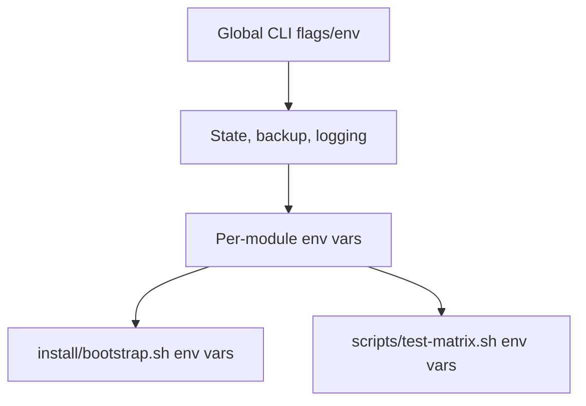

# OMES Configuration Reference

> Status: describes the actual repository state. Every variable below was found by
> grepping `bin/`, `lib/`, `modules/`, `install/`, `config/`, and `scripts/` for
> `OMES_` and cross-checking against the source. Flags are documented in full, with
> worked examples, in [docs/cli.md](cli.md) — this page is the single place that
> lists every environment variable OMES reads, grouped by the component that reads
> it, with its default and whether it is an operator-facing knob or a test-only
> override.

Legend: **Operator** — a real deployment knob, safe to set on a target host.
**Test-only** — exists so `tests/unit/*.bats`/`tests/integration/*.bats` can exercise
a code path without root/real hardware/a real filesystem; setting it in production
has no documented, supported effect and is not recommended.

## 1. Global CLI (`bin/omes`, `lib/omes/core.sh`, `lib/omes/log.sh`)

| Variable | Flag equivalent | Default | Kind | Meaning |
|---|---|---|---|---|
| `OMES_DRY_RUN` | `--dry-run` | `0` | Operator | `1` prints planned actions, mutates nothing. |
| `OMES_JSON` | `--json` | `0` | Operator | `1` emits exactly one JSON object on stdout; all logging moves to stderr/log file. |
| `OMES_NONINTERACTIVE` | `--yes` | `0` | Operator | `1` auto-confirms mutating prompts. |
| `OMES_ASSUME_YES` | — | `0` | Operator | Alternate spelling `omes_noninteractive()` also honors; `--yes` sets `OMES_NONINTERACTIVE`, not this one, but either satisfies the same check. |
| `OMES_VERBOSE` | `--verbose` | `0` | Operator | `1` also prints `DEBUG`-level lines to the console (always in the log file regardless). |
| `OMES_LOG_FILE` | `--log-file <path>` | `<state-dir>/logs/omes-<UTC timestamp>.log` | Operator | Override the log file location. |
| `OMES_STATE_DIR` | — | `/var/lib/omes` (root) / `${XDG_STATE_HOME:-$HOME/.local/state}/omes` (user) | Operator | Override the state directory for either scope. |
| `OMES_ROOT` | — | auto-detected from `bin/omes`'s own path | Operator (rarely needed) | Repository root; every `lib/omes/*.sh`/`modules/*/module.sh` sources relative to this. |
| `OMES_ALLOW_DOCKER_GROUP` | `--allow-docker-group` | unset | Operator (flag-set only) | Set internally by `bin/omes` from the flag; the `containers` module reads it. Not documented as a directly-settable env var. |
| `NO_COLOR` | — | unset | Operator | Any non-empty value disables ANSI color in human output, per [no-color.org](https://no-color.org/). |

## 2. Backup / package rate-limiting (`lib/omes/backup.sh`, `lib/omes/pkg.sh`)

| Variable | Default | Kind | Meaning |
|---|---|---|---|
| `OMES_BACKUP_KEEP` | `10` | Operator | Retention count for `backup_prune` — how many backup sessions are kept per scope's state dir. |
| `OMES_PKG_APT_UPDATE_MAX_AGE` | `3600` (1 hour) | Operator | Minimum seconds between `apt-get update` calls (`pkg_apt_update`'s rate limit), tracked via the `pkg.apt_update.last_run` state key. |
| `OMES_ASSUME_ONLINE` | unset | Test-only | `1` forces `detect_network` to report online without a real network check. |
| `OMES_ASSUME_OFFLINE` | unset | Test-only | `1` forces `detect_network` to report offline. Checked after `OMES_ASSUME_ONLINE`, so clear that too if it was set. |
| `OMES_APT_SOURCES_DIR` | `/etc/apt/sources.list.d` | Test-only | Where `repo_add`/`repo_remove` write/remove `<name>.sources` files. |

## 3. Detection (`lib/omes/detect.sh`)

| Variable | Default | Kind | Meaning |
|---|---|---|---|
| `OMES_OS_RELEASE_FILE` | `/etc/os-release` | Test-only | Points `detect_os` at a fixture, e.g. `tests/fixtures/os-release/linuxmint-22.1`. |

## 4. Test/simulation hooks (`lib/omes/core.sh` and friends)

| Variable | Default | Kind | Meaning |
|---|---|---|---|
| `OMES_TEST` | unset | Test-only | Must be `1` together with `OMES_FAKE_ROOT` for the latter to have any effect — see below. |
| `OMES_FAKE_ROOT` | unset | Test-only | With `OMES_TEST=1`, makes `omes_is_root` report true without real UID 0. Never consulted otherwise. |

## 5. `security-baseline` module

| Variable | Default | Kind | Meaning |
|---|---|---|---|
| `OMES_ENABLE_SSH` | `0` | Operator | `1` keeps SSH allowed through `ufw` even without an active SSH session detected. Stand-in for a future `--enable-ssh` flag. |
| `OMES_INSTALL_CHRONY` | `0` | Operator | `1` also installs and expects `chrony` (otherwise the module only checks/warns on NTP sync, never installing anything for it). |
| `OMES_UNATTENDED_AUTO_REBOOT` | `0` | Operator | `1` enables `Unattended-Upgrade::Automatic-Reboot "true"` in OMES's own `52omes-unattended-upgrades` fragment. |
| `OMES_UNATTENDED_REBOOT_TIME` | `02:00` | Operator | Reboot time written when `OMES_UNATTENDED_AUTO_REBOOT=1`. |
| `OMES_JOURNALD_MAX_USE` | `500M` | Operator | `SystemMaxUse=` written to OMES's journald drop-in. |
| `OMES_ETC_DIR` | `/etc` | Test-only | Root for every `/etc`-rooted path this module reads/writes (also used by `containers`). |

## 6. `containers` module

| Variable | Default | Kind | Meaning |
|---|---|---|---|
| `OMES_DOCKER_ROOTLESS` | `0` | Operator | `1` installs `docker-ce-rootless-extras` and prints the exact rootless setup command (never runs it). |
| `OMES_ETC_DIR` | `/etc` | Test-only | Shared with `security-baseline`; the Docker keyring path resolves under it. |

`--allow-docker-group` (flag only, see §1) grants `docker` group membership — root-equivalent, always confirmed, never a default.

## 7. `hermes` module

| Variable | Default | Kind | Meaning |
|---|---|---|---|
| `OMES_HERMES_HOME` | `~/.hermes` | Operator | Overrides `HERMES_HOME`. Set before `omes install` to give a profile an isolated Hermes instance. |
| `OMES_HERMES_VERSION` | unset | Operator | Pins the installed version; a mismatch against the currently installed `hermes --version` output triggers a re-install. |
| `OMES_HERMES_INSTALLER_SHA256` | unset | Operator | Verifies the downloaded installer's sha256 before executing it; a mismatch aborts with no execution. |
| `OMES_HERMES_INSTALLER_URL` | `https://hermes-agent.nousresearch.com/install.sh` | Test-only | Not a documented operator knob. |

## 8. `hermes-gateway` / `hermes-gateway-system` modules

| Variable | Default | Kind | Applies to | Meaning |
|---|---|---|---|---|
| `OMES_GATEWAY_MODE` | `user` | Operator | `hermes-gateway` | Setting it to `system` makes the user-mode module's `module_check` refuse immediately and point at `--module hermes-gateway-system` instead of silently applying the wrong mode. |
| `OMES_HERMES_GATEWAY_EXTRA_PATH` | unset | Operator | both | Colon-separated extra directories prepended into the managed systemd drop-in's `PATH=` (e.g. where `node`/`ffmpeg` actually live). |
| `OMES_HERMES_GATEWAY_SYSTEM_USER` | unset | Operator (required) | `hermes-gateway-system` | The existing, non-root account whose Hermes install the system gateway serves. `module_check` fails without it, or if it names `root`, or if the account does not exist. |
| `OMES_HERMES_GATEWAY_SYSTEM_DROPIN_DIR` | `/etc/systemd/system` | Test-only | `hermes-gateway-system` | Overrides the system drop-in directory. |

## 9. `graphify` / `graphify-mcp` modules

See [docs/graphify.md](graphify.md) §2/§3/§4 (issues #50/#51/#52) for the full env var/state-key
reference (`OMES_GRAPHIFY_VERSION`, `OMES_GRAPHIFY_INSTALLER`, `OMES_UV_INSTALLER_SHA256`,
`OMES_GRAPHIFY_PROVIDER_ENV`, `OMES_GRAPHIFY_UV_CMD`/`OMES_GRAPHIFY_PIPX_CMD`, and the
`module.graphify.version_installed` state key — `graphify-mcp` reuses the same variables,
introducing none of its own) — kept there rather than duplicated here to minimize this shared
reference file's graphify footprint.

## 10. `desktop-preflight` / `hyprland-session` modules

| Variable | Default | Kind | Meaning |
|---|---|---|---|
| `OMES_DP_MEM_MB_OVERRIDE` | unset | Test-only | Forces `dp_check_resources`'s RAM figure. |
| `OMES_DP_DISK_FREE_MB_OVERRIDE` | unset | Test-only | Forces `dp_check_resources`'s free-disk figure. |
| `OMES_PROC_CMDLINE_FILE` | `/proc/cmdline` | Test-only | Overrides the kernel command-line file `dp_check_gpu` reads for `nvidia-drm.modeset=1`. |
| `OMES_NVIDIA_MODESET_PARAM_FILE` | `/sys/module/nvidia_drm/parameters/modeset` | Test-only | Same purpose, the sysfs fallback path. |
| `OMES_CINNAMON_SESSION_FILE` | `/usr/share/xsessions/cinnamon.desktop` | Test-only | Overrides the Cinnamon-presence check `dp_check_cinnamon` performs. |
| `OMES_SESSION_DIR` | `/usr/share/wayland-sessions` | Test-only | Overrides where `hyprland-session` writes the session `.desktop` file. |
| `OMES_BIN_DIR` | `/usr/local/bin` | Test-only (here) | Overrides where `hyprland-session` writes its wrapper script. **Note:** `install/bootstrap.sh` also reads `OMES_BIN_DIR`, with a different default (`~/.local/bin`) and a real operator-facing purpose — see §12. |

## 11. `desktop-config` module

No module-specific environment variables; behavior (never overwrite a differing file without `--yes`/`OMES_NONINTERACTIVE=1`) is controlled entirely by the global `--yes`/`OMES_NONINTERACTIVE` flag from §1.

## 12. `install/bootstrap.sh` (the curl-able bootstrap script)

| Variable | Default | Kind | Meaning |
|---|---|---|---|
| `OMES_REPO_URL` | `https://github.com/ahliweb/omes.git` | Operator | Where to clone OMES from — set this to point at a fork or mirror. |
| `OMES_REF` | `main` | Operator | The git ref (branch/tag/commit) to check out. |
| `OMES_INSTALL_DIR` | `$HOME/.local/share/omes` | Operator | Where the checkout lives. |
| `OMES_BIN_DIR` | `$HOME/.local/bin` | Operator | Where `omes` is symlinked. See the note in §10 — this is a different default from `hyprland-session`'s test-only override of the same name; they are read in entirely separate processes (the bootstrap script vs. a module). |
| `OMES_OS_RELEASE_FILE` | `/etc/os-release` | Test-only | Same override as §3, used for the bootstrap script's own early platform check before any checkout exists. |

## 13. `scripts/test-matrix.sh` (contributor/CI tool, not a deployment knob)

| Variable | Default | Kind | Meaning |
|---|---|---|---|
| `OMES_MATRIX_IMAGES` | `ubuntu:24.04 ubuntu:22.04 linuxmintd/mint22-amd64` | Contributor/CI | Space-separated container images to run the matrix against. |
| `OMES_MATRIX_SCENARIOS` | all scenarios (`fresh rerun offline partial-failure reboot rollback`) | Contributor/CI | Restrict to specific scenarios, e.g. `"fresh rerun"`. |
| `OMES_MATRIX_FAIL_PKG` | a package name that does not exist | Contributor/CI | The deliberately-nonexistent package name used by the `partial-failure` scenario. |

See [docs/ci.md](ci.md) for how these are used in `.github/workflows/compatibility.yml`.

## 14. `content` extension command (optional; `lib/omes/cmd/content.sh`, `lib/omes/py/content/`)

Never referenced by any installer profile — see
[docs/content-distribution.md](content-distribution.md) section 9.

| Variable | Default | Kind | Meaning |
|---|---|---|---|
| `OMES_CONTENT_ROOT` | `${XDG_DATA_HOME:-$HOME/.local/share}/omes/content` | Operator | Root of the `inbox/ processing/ uploaded/ failed/ review/ reports/ sessions/ state/` layout. `sessions/` and `state/` are created mode `0700`. Read by `lib/omes/py/content/paths.py`. |
| `OMES_CONTENT_APPROVAL_TTL_SECONDS` | `3600` | Operator | Default `--ttl-seconds` for `omes content approve` (docs/content-distribution.md section 7). Read by `lib/omes/py/content/cli.py`; an explicit `--ttl-seconds` flag overrides it. |
| `OMES_CONTENT_BROWSER_DRIVER` | unset (built-in `manual_stub` driver) | Operator | Filesystem path to an operator-installed browser-automation driver module for the `generic_browser` worker (issue #66; docs/content-distribution.md section 13). OMES never bundles a browser — leaving this unset uses the evidence-only `manual_stub` driver, which never launches a real browser. Read by `lib/omes/py/content/workers/generic_browser/worker.py`. |

## 15. `omes health ollama` / `lib/omes/py/health/ollama.py` (issue #71)

| Variable | Default | Kind | Meaning |
|---|---|---|---|
| `OLLAMA_HOST` | `127.0.0.1:11434` | Operator | The Ollama endpoint the health checker (and Ollama itself) uses. A scheme (`http://`) is optional. |
| `OMES_OLLAMA_MODEL` | unset | Operator | The model id to check. Required (or pass `--model`); its absence is a `fail`, exit 7. |
| `OMES_OLLAMA_PROFILE` | `text` | Operator | Named capability profile: `text`, `structured`, `tools`, `embeddings`, `vision`, or `full`. Determines which capabilities beyond baseline `chat` are required (a required capability's failure fails the whole check). |
| `OMES_OLLAMA_PROFILE_FILE` | unset | Operator | Path to a JSON file `{"name": "...", "capabilities": ["structured_output", ...]}`; overrides `OMES_OLLAMA_PROFILE` when set. |
| `OMES_OLLAMA_ALLOW_REMOTE` | `0` | Operator | `1` explicitly accepts a non-loopback `OLLAMA_HOST`; otherwise a non-loopback endpoint is a `fail` on the service layer's bind-policy check. |
| `OMES_OLLAMA_EXPECT_PLACEMENT` | `any` | Operator | Expected runtime placement (`gpu`, `cpu`, or `any`), compared against `/api/ps`'s reported processor string. `any` skips the comparison. |
| `OMES_HEALTH_TIMEOUT` | `10` (seconds) | Operator | Per-probe bounded timeout for every HTTP call the checker makes (except the model load, see next row). |
| `OMES_OLLAMA_LOAD_TIMEOUT` | `30` (seconds) | Operator | Bounded timeout for the model-load smoke test specifically, since a cold model load can legitimately take longer than a simple API call. |
| `OMES_OLLAMA_ENABLED` | `0` | Operator | `1` makes `modules/hermes`'s `module_doctor` hook run this check unconditionally during `omes doctor`. Without it, the hook still runs automatically whenever the `ollama` binary is present *and* `OMES_OLLAMA_MODEL` is set. |

## 16. `omes health agent|gateway` / `lib/omes/py/health/hermes.py` (issue #79)

See [docs/hermes-integration.md §17](hermes-integration.md#17-health-and-readiness-issue-79)
for what each variable affects. `OMES_HEALTH_TIMEOUT` is shared with §13.

| Variable | Default | Kind |
|---|---|---|
| `OMES_GATEWAY_MODE` | `user` | Operator |
| `OMES_HEALTH_DISK_MIN_MB` / `OMES_HEALTH_MEM_MIN_MB` | `512` / `256` | Operator |
| `OMES_HERMES_GATEWAY_HEALTH_URL` | unset | Operator (loopback-only) |
| `OMES_HERMES_GATEWAY_HEALTH_TOKEN_FILE` | unset | Operator (file path, never a value) |
## 17. `content` Telegram approval front end (optional; issue #65)

Outbound-only — see [docs/content-distribution.md](content-distribution.md)
section 14 and `skills/content/SKILL.md`. `TELEGRAM_BOT_TOKEN` and
`TELEGRAM_ALLOWED_USERS` are **not** OMES variables; they live in
`$HERMES_HOME/.env` and are read from there, by key only, exactly as
`modules/hermes-gateway/telegram-allowlist.sh` already does.

| `OMES_CONTENT_APPROVERS` | unset (no Telegram approvers authorized) | Operator | Comma-separated numeric Telegram user ids this OMES install treats as authorized content approvers. Effective authorization is this set **intersected with** `TELEGRAM_ALLOWED_USERS` from `$HERMES_HOME/.env` — an id in only one is never authorized. Read by `lib/omes/py/content/telegram.py::load_approvers()`. Only enforced for `--channel telegram`; the default `--channel cli` approval path ignores it. |
| `OMES_CONTENT_TELEGRAM_CHAT_ID` | unset | Operator | Default `--chat-id` for `omes content notify`/`omes content status --telegram` when the flag is omitted. Read by `lib/omes/py/content/cli.py`. |
| `OMES_CONTENT_TELEGRAM_API_BASE` | `https://api.telegram.org` | Test-only | Overrides the Telegram API base URL so `tests/py/content/test_telegram.py` can point at a local stdlib fake HTTP server instead of the real Telegram API. Not intended for operator use. Read by `lib/omes/py/content/telegram.py`. |
| `HERMES_HOME` | `$HOME/.hermes` | Operator (existing, Hermes-owned) | Where `lib/omes/py/content/telegram.py` reads `TELEGRAM_BOT_TOKEN` and `TELEGRAM_ALLOWED_USERS` from `.env`, by key only — it never reads or writes any other key in that file. Same variable `hermes`/`hermes-gateway` already use (section 7/8 above). |

## 18. Reserved but not read by any code path yet

## 13b. `omes audit exposure` / `lib/omes/py/health/exposure.py` (issue #80)

See [docs/hermes-integration.md §18](hermes-integration.md#18-exposure-audit-issue-80).

| Variable | Default | Kind |
|---|---|---|
| `OMES_EXPOSURE_ALLOW` | unset | Operator (`"host:port,host:port"`) |
| `OMES_SS_BIN` / `OMES_UFW_BIN` | `ss` / `ufw` | Test-only |

None known as of this writing — every variable above is read somewhere in the tree. If you add a new `OMES_*` variable, add a row here in the same pull request (`CONTRIBUTING.md` §7, docs-accuracy rule).

<!-- OMES-MERMAID: docs/configuration.md -->

## Visual summary

