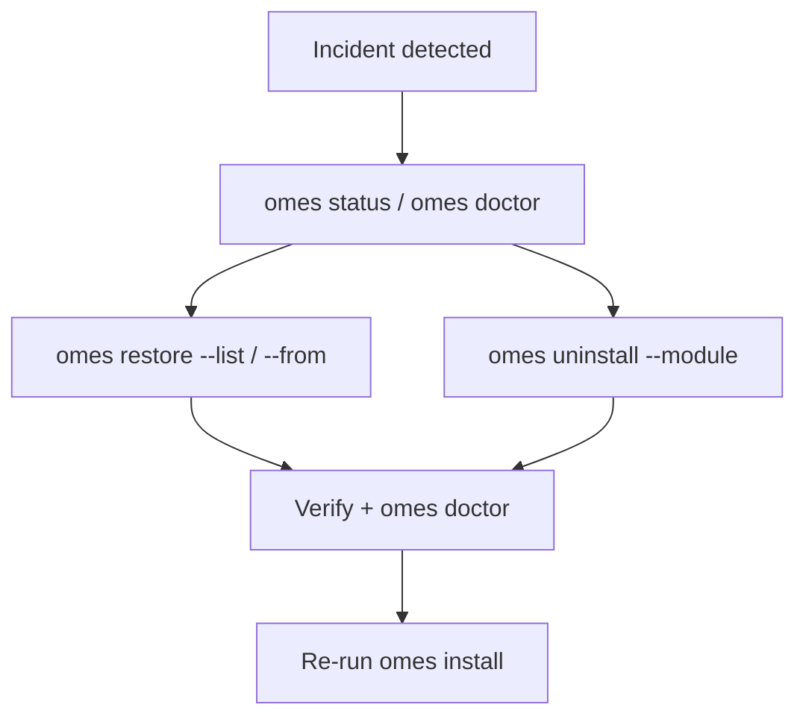

# OMES Disaster Recovery

> Status: describes the recovery procedures verified in issue [#17](https://github.com/ahliweb/omes/issues/17)
> as they exist in this repository today, built on `docs/rollback.md`'s backup/restore/uninstall
> contract (issue #10) and `docs/testing.md`'s test suite (issue #15). Every runbook below is
> written to be executable by a non-expert: exact commands, expected output, and what to do if a
> step doesn't match. `docs/rollback.md` section 8 ("Tested scenarios") lists which automated
> test proves each one. See also
> [docs/hermes-deployment-guide.md §§14-16](hermes-deployment-guide.md#14-upgrades)
> for the Hermes-specific upgrade/rollback/removal-boundary summary.

## 1. Before you start: two commands that answer most questions

```bash
omes status                       # what's applied, where the state dir is, log location
omes doctor                       # OK/WARN/FAIL per check, offline, safe to run any time
```

Both are read-only and safe to run first, as any user, even offline, even mid-incident.

## 2. Recovery runbooks

### 2.1 Failed installation mid-profile

**Symptoms**: `omes install --profile <name>` exits 6 (module apply failed) or 7 (verification
failed), naming a module partway through a multi-module profile.

**Preconditions**: none - this is the normal failure path `omes install` is designed to stop at
safely (check-all-then-apply per `docs/architecture.md` section 3.2; the failing module's own
pre-apply backup was already taken before its `module_apply` ran).

**Commands**:

```bash
omes status                                 # confirms which module has no "applied" status
omes restore --list                         # every backup session, oldest first
omes restore --from <earlier-module's-timestamp> --yes   # returns that module's managed files
                                             # to their pre-install content
# fix the underlying cause (network, a held/broken package, disk space, ...), then:
omes install --profile <name> --yes         # re-run; idempotent modules converge
```

**Expected output**: the failing module's `module_apply` error names it explicitly (e.g. `module
apply failed: hermes-gateway (exit 6)`). `omes restore --list` shows one session per module that
ran before the failure, each with `module=<name> reason=pre-apply`. `omes restore --from
<timestamp> --yes` prints `restore: restored N file(s) from <timestamp>` and `restore: complete`.

**Verify**: `omes status` shows the earlier module still `applied`; re-running `omes install`
after the fix reports both modules `applied`/`would-apply` and does not re-download/re-install
anything already correct.

**Data-loss boundary**: only files the failed module (or a later one) registered via
`omes_manage_path` before this incident are recoverable. See section 3.

**Known gap**: `omes status`/`omes restore --list` do **not** show an explicit "failed" marker
for the module that didn't finish - it simply has no `module.<name>.status` key at all (absent,
not `failed`). Look at the `omes install` output itself (or its log file) to see which module
failed; `omes status`'s module list only tells you what *did* succeed.

**Automated test**: `tests/integration/dr-failed-install.bats`.

### 2.2 Broken desktop session (Hyprland)

**Symptoms**: the Hyprland session entry at the login screen fails to start, or starts into a
broken/black screen; you need to get back to a working desktop.

**Preconditions**: Linux Mint, `hyprland-session` (and usually `desktop-config`) applied.

**Commands**:

```bash
# 1. From the LightDM login screen (or Ctrl+Alt+F2 to a TTY if the screen is
#    unresponsive), log in to Cinnamon instead of Hyprland - it is never
#    modified or removed by hyprland-session, so it is always available as
#    a fallback (docs/business/release-gates.md section 3).

# 2. Once in a working session (Cinnamon, or a TTY):
sudo omes uninstall --module hyprland-session --dry-run    # preview
sudo omes uninstall --module hyprland-session --yes        # removes ONLY the OMES session
                                                             # entry and wrapper

# 3. If your own hyprland.conf (or other desktop-config-managed file) was
#    also overwritten and you want your pre-OMES version back:
omes restore --list                                        # find desktop-config's timestamp
omes restore --from <timestamp> --yes
```

**Expected output**: `uninstall` prints `hyprland-session: removed <session file>` and `hermes-
gateway: removed <wrapper>` (paths under `/usr/share/wayland-sessions` and `/usr/local/bin`), and
`module.hyprland-session.status=removed` in `omes status`. The Cinnamon session entry is never
mentioned - it was never touched.

**Verify**: the login screen no longer offers the OMES Hyprland entry; Cinnamon still works
exactly as before; `cat /usr/share/lightdm/... ` (or your DM's own session list) still shows
Cinnamon.

**Data-loss boundary**: `hyprland-session` manages only its own session file and wrapper script -
it never touches Cinnamon's own `.desktop` file, LightDM's configuration, or the default-session
setting. `desktop-config` overwrites a *differing* pre-existing config file only with `--yes`,
after backing it up first - `omes restore` is how you get that specific pre-existing content back
(uninstalling `desktop-config` itself removes the OMES-templated file outright if OMES created it
fresh, or restores the pre-existing one if a backup shows one existed - same restore-vs-remove
logic as any other module, `docs/rollback.md` section 4).

**Automated test**: `tests/integration/dr-desktop-session.bats` (skips with a clear message,
never fakes it, if issue #8's modules are absent from a given checkout).

### 2.3 Failed Hermes gateway

**Symptoms**: Hermes Agent's Telegram/messaging bot stops responding; `hermes gateway status` or
`systemctl --user is-active hermes-gateway` reports the unit is not running.

**Preconditions**: `hermes-gateway` applied (user mode) or `hermes-gateway-system` applied
(system mode, root).

**Commands**:

```bash
omes doctor                                       # user mode: run as the target user
sudo omes doctor                                   # system mode: run as root
# doctor reports "module:hermes-gateway FAIL" (not WARN) when the unit is inactive

systemctl --user status hermes-gateway             # user mode - see why it stopped
journalctl --user -u hermes-gateway -n 100 --no-pager

omes uninstall --module hermes-gateway --dry-run    # preview the rollback
omes uninstall --module hermes-gateway --yes        # stops/disables the unit, removes OMES's
                                                      # PATH drop-in, disables lingering if OMES
                                                      # had enabled it - never touches Hermes
                                                      # itself or $HERMES_HOME

omes install --module hermes --module hermes-gateway --yes   # re-install to recover
```

**Expected output**: `omes doctor`'s JSON shows
`{"name":"module:hermes-gateway","level":"FAIL","detail":"module_verify failed"}`; a plain-text
run shows the same line with `FAIL`. After `uninstall`, `systemctl --user is-enabled
hermes-gateway` exits non-zero (disabled). After re-`install`, it is enabled and active again and
`omes doctor` returns to all-`OK`.

**Verify**: `hermes gateway status` reports running; the messaging adapter itself (e.g. Telegram)
responds - **a green `systemctl` status does not by itself prove the adapter is connected**, see
`docs/hermes-integration.md` part 2 ("green signals can lie"); check the adapter directly (send
it a message) before considering the incident closed.

**Data-loss boundary**: rollback removes only the OMES-managed drop-in file and the unit's
enabled/active state (and disables lingering only if OMES itself had enabled it - never
lingering an operator enabled by hand). Hermes Agent's own configuration
(`$HERMES_HOME/config.yaml`) and secrets (`$HERMES_HOME/.env`) are never touched by this rollback
(see section 3 - `.env` is never backed up or restored by OMES at all).

**Automated test**: `tests/integration/dr-gateway.bats`.

### 2.4 Corrupted configuration (a managed file truncated/garbled)

**Symptoms**: a file OMES manages (a module's config, a session file, a PATH snippet) has been
truncated, overwritten with garbage, or otherwise corrupted by something other than OMES
(a crash mid-write by another tool, a bad manual edit, disk corruption).

**Preconditions**: at least one backup session exists for the affected module (any prior
successful `module_apply`, or a manual `omes backup`, creates one).

**Commands**:

```bash
omes doctor                          # see the "known gap" note below before trusting this
omes restore --list                  # find the right session for this module
omes restore --from <timestamp> --yes
```

**Expected output**: `restore` prints `restore: restored <path>` for each file in that session
and `restore: complete`, exit 0. The repaired content is whatever that specific backup session
captured - if it is the module's very first pre-apply backup, that is the file's content
**before OMES ever touched it**, not necessarily "OMES's fully-configured version"; pick the
timestamp accordingly (`omes restore --list`'s `reason`/`module` columns help - a `reason=pre-
apply` session for the module you care about is usually what you want if OMES was mid-edit).

**Verify**: `cat` the repaired file and confirm it looks sane; re-run the owning module's
`module_verify` indirectly via `omes doctor` (or `sudo omes doctor` for a root-scope module).

**Data-loss boundary / known gap**: `omes doctor` has **no checksum-based corruption check**
today - its per-module check only asserts *functional* behavior (a package present, a unit
active, a binary on `PATH`), never "does this managed file's content still match what OMES last
wrote." A corrupted file that doesn't happen to also break its owning module's functional check
will **not** be flagged by `omes doctor` - you have to notice the symptom yourself (a broken
config, unexpected behavior) and go straight to `omes restore --list`. Suggested follow-up (out
of this issue's file scope, `lib/omes/module.sh`, to add): a doctor-level check that compares
every currently-applied module's managed paths against the sha256 recorded in its most recent
backup's `MANIFEST`, reporting a mismatch as `WARN` (a mismatch is not automatically wrong - the
operator may have intentionally hand-edited the file - so `WARN`, not `FAIL`).

Separately, `omes restore` **refuses a corrupt `MANIFEST` outright**, exit 9, before touching
anything - this is not a gap, it is the deliberate safety behavior `docs/rollback.md` section 3
describes (a malformed backup is never partially trusted).

**Automated test**: `tests/integration/dr-corrupted-config.bats` (covers both the doctor gap and
the MANIFEST refusal).

### 2.5 Corrupted or deleted state file

**Symptoms**: `<state-dir>/state` is corrupted (binary garbage, a crash mid-write) or has been
deleted entirely (e.g. an accidental `rm`); `omes status`/`omes modules` look wrong or empty.

**Preconditions**: at least one backup session exists under `<state-dir>/backups/` (backups are
stored independently of the state file - see below).

**Commands**:

```bash
omes status                          # see the "known limitation" note below
omes restore --list                  # works from <state-dir>/backups/ alone
omes restore --yes                   # or --from <timestamp>; works even with no state file at all
```

**Expected output**: `omes restore --list` and `omes restore` both work normally and print the
same output as section 2.4 above - restoring never reads the state file. `omes status`, if the
state file is garbled, silently reports fewer or zero modules (not a crash, not an error - see
the limitation below); if the state file is deleted entirely, `omes status` reports "modules:
none applied yet" as if nothing were ever applied (even though the underlying packages/files
from a real prior install are still on disk).

**Verify**: after restoring, spot-check the files you cared about; re-run `omes install
--profile <name> --yes` for any profile you know was previously applied - every module's
`module_apply`/`module_check` is designed to be idempotent regardless of what the state file
currently says, so a clean re-install re-establishes correct state bookkeeping even after a state
file loss.

**Data-loss boundary / known limitation**: `omes status` does **not** "fail safe with a clear
message" today. `lib/omes/state.sh`'s line-by-line parsing has no corruption detection at all -
a garbled state file is simply under-reported (lines that don't look like `module.*.*=...` are
silently skipped), never surfaced as an explicit "the state file is corrupted, here's what to do"
error. This is a confirmed gap, not a silently-assumed pass (see
`tests/integration/dr-corrupted-state.bats`, which tests and documents the actual behavior
rather than an aspirational one). Suggested follow-up (out of this issue's file scope,
`lib/omes/state.sh`, to add): an explicit state-file structural validation on read, analogous to
`backup_manifest_validate` for a `MANIFEST`, that reports a clear `omes status`/`omes doctor`
error instead of silently returning an empty/partial module list.

What **does** work correctly, and is the actual point of this runbook: `omes restore` and `omes
uninstall`'s managed-path rollback never read the state file for anything except "which paths did
this module manage" (`module.<name>.managed_paths`) - if that key itself is gone (state file
deleted), `omes uninstall` has nothing to roll back for that module (nothing to do, not a crash),
but `omes restore --from <timestamp>` still works by timestamp alone, reading only
`<state-dir>/backups/<timestamp>/MANIFEST` and the files next to it - completely independent of
the state file's presence or integrity.

**Automated test**: `tests/integration/dr-corrupted-state.bats`.

### 2.6 SSH locked out by firewall

**Symptoms**: `ufw` (enabled by `security-baseline`, issue #7) is blocking your SSH connection.

**Preconditions**: server profile, `security-baseline` applied. Note: `security-baseline` is
designed to prevent this outright - it detects the invoking session was reached over SSH (or that
`sshd`/`ssh` is active/enabled) and adds an explicit `ufw allow` rule for the detected SSH port
**before** ever running `ufw --force enable` (`docs/security.md` section 3,
`modules/security-baseline/module.sh`'s `module_apply` comment on ordering). This runbook is for
the case that protection didn't apply to your situation (e.g., `sshd`'s port was changed *after*
OMES ran, or `ufw` was enabled by hand outside OMES with a different policy).

**Commands** (via your hosting provider's serial/VNC console - **not** SSH, since that's what's
blocked):

```bash
sudo ufw allow OpenSSH        # or: sudo ufw allow <your-actual-sshd-port>/tcp
sudo ufw status verbose       # confirm the rule is there and the port is right
# once confirmed reachable again over SSH from a second terminal, optionally:
sudo ufw disable              # only if you want the firewall off entirely while you investigate
```

**Expected output**: `ufw status verbose` lists `22/tcp (OpenSSH) ALLOW IN` (or your custom port)
alongside `Status: active`. SSH from a fresh connection should now succeed.

**Verify**: `ssh` back in from a machine that was previously blocked.

**Data-loss boundary**: this is a live host-firewall change made directly via `ufw`, not through
`omes` - it is not tracked by OMES's backup/restore mechanism (ufw's own rule set is not a
`omes_manage_path`-registered file). Once confirmed working, consider re-running `sudo omes
install --module security-baseline --yes` so OMES's own idempotent apply re-asserts a consistent,
recorded state (it will not remove your manual `allow` rule; it only adds rules it doesn't yet
see present).

**Automated test**: manual only - this requires a real console/out-of-band access path that
cannot be simulated by a shim or a container without genuinely testing "SSH is now blocked",
which would make the test host itself unreachable. `tests/unit/security-baseline.bats` and
`tests/integration/server.bats` cover the underlying "SSH rule added before enable" ordering
logic that is what prevents this in the first place.

### 2.7 Lost sudo/root access

**Symptoms**: the account you installed OMES with no longer has `sudo` rights (accidentally
revoked, a `sudoers` mistake, an account lockout) and you need to run a root-scope module or
recover a root-scope managed file.

**Preconditions**: physical/console/provider access to the host (this is fundamentally an OS
account-recovery problem, not something `omes` itself can fix from user space by design - see
`docs/security.md`: OMES never escalates privilege itself and never stores a way to bypass
`sudo`).

**Commands** (via console, single-user/recovery mode, or your provider's rescue environment):

```bash
# Standard Ubuntu/Debian sudo recovery (not OMES-specific): boot into
# recovery mode / a root shell, then either add the user back to the sudo
# group or fix /etc/sudoers.d, e.g.:
usermod -aG sudo <user>
# or, from an existing root shell:
visudo    # fix a broken /etc/sudoers.d entry

# Once sudo works again, root-scope OMES state and backups were never
# affected by a sudo/account problem (they live under /var/lib/omes,
# owned by root, unrelated to which user has sudo rights) - resume
# normally:
sudo omes status
sudo omes doctor
```

**Expected output**: standard `usermod`/`visudo` output; once `sudo` works, `sudo omes status`
resumes exactly where it left off (root-scope state is untouched by this whole incident).

**Verify**: `sudo -l` lists the expected privileges again; `sudo omes doctor` runs clean.

**Data-loss boundary**: none from OMES's side - `/var/lib/omes/` (state, backups) is not affected
by a `sudo`/account-level lockout at all. This entire runbook is standard Linux account recovery,
included here because "I can't sudo anymore" is a realistic reason an operator would reach for a
disaster-recovery document that mentions OMES.

**Automated test**: manual only - OS account/sudo recovery is out of OMES's own scope
(`docs/scope.md` section 4) and not something a bats/container/VM test exercises meaningfully
without faking the very account system being tested.

### 2.8 OMES state directory deleted

**Symptoms**: `<state-dir>` (root: `/var/lib/omes`; user: `${XDG_STATE_HOME:-$HOME/.local/state}/omes`)
was deleted entirely (accidental `rm -rf`, a disk/volume issue).

**Preconditions**: none for the recovery steps below to at least *attempt* to run; whether they
help depends entirely on whether anything survived (see boundary below).

**Commands**:

```bash
omes status              # reports a fresh/empty state (dir recreated on next mutation)
omes restore --list      # reports "no backups available" - there is nothing left to restore
omes doctor               # reports backups: "0 session(s) available"; not a FAIL by itself
```

**Expected output**: exactly as if OMES had never been run on this host before. No error, no
crash - `omes_state_dir()` (lib/omes/core.sh) simply resolves to a path that doesn't exist yet,
and every read-only command already handles "state dir absent" as a normal case (documented,
tested behavior - see `tests/unit/state.bats`).

**Verify**: there is nothing to verify recovery-wise - see the boundary below.

**Data-loss boundary - this is a hard, honest one**: `docs/rollback.md` section 6 already states
"backups themselves are not backed up." **This is the concrete consequence**: if the state
directory (and therefore its `backups/` subdirectory) is deleted, **every backup OMES ever took
is gone with it**, and there is nothing `omes restore` can do - it can only restore from a
session directory that still exists on disk. The only paths forward are:

1. A filesystem/volume-level backup or snapshot taken *of the host itself* (outside OMES
   entirely - e.g. your cloud provider's disk snapshot, an `rsync`/borg backup job, a filesystem
   with reflink/CoW snapshots) that predates the deletion. Restore `<state-dir>` from that,
   then `omes restore --list` works again normally.
2. If no such snapshot exists: the managed files/services are still on disk in whatever state
   they were in at deletion time (OMES's backup loss does not undo the *current* files, only the
   *history* of what they looked like before OMES last touched them) - `omes doctor`/manually
   inspecting the affected paths is your only remaining signal. A clean `omes install
   --profile <name> --yes` re-establishes correct state bookkeeping going forward, but cannot
   recover pre-deletion history that no longer exists anywhere.

**Automated test**: manual only for the "state dir gone, no backups left, nothing to restore"
end state itself (trivially true, low value to automate as its own test); the closely-related
"state file (not the whole dir) corrupted/deleted, backups/ subdirectory intact" case **is**
automated - see `tests/integration/dr-corrupted-state.bats`, section 2.5 above.

### 2.9 Restoring from a backup copied off-host

**Symptoms**: you want to recover onto a *different* host (a rebuild, a migration, disaster
recovery in the literal "the original host is gone" sense) using a backup session you copied
off-host yourself beforehand.

**Preconditions**: you have, at some point, copied a `<state-dir>/backups/<timestamp>/` directory
(the whole thing: `MANIFEST`, `META`, and the backed-up files under it) somewhere else - OMES
itself never does this for you (`docs/rollback.md` section 1: "backups are local only... OMES
never transmits a backup off-host" - this is a deliberate boundary, not a gap, see
`docs/security.md`/`docs/threat-model.md` for why a backup directory - which can contain
sensitive config content, though never `.env` secrets, see section 3 below - is not something
OMES pushes over the network on its own).

**Commands**:

```bash
# On the NEW host, as the same effective privilege scope (root or the same
# user) the backup was taken under:
sudo mkdir -p /var/lib/omes/backups          # or the user-scope equivalent
sudo cp -a /path/to/copied/<timestamp> /var/lib/omes/backups/
sudo chmod 700 /var/lib/omes/backups/<timestamp>

omes restore --list                          # confirms the copied session is visible
omes restore --from <timestamp> --yes
```

**Expected output**: `omes restore --list` shows the copied-in session exactly like a locally-
created one (it is just a directory in the expected place with the expected `MANIFEST`/`META`
shape); `omes restore --from <timestamp> --yes` restores it identically to a local restore -
`restore_backup` (`lib/omes/restore.sh`) has no concept of "where a session came from," only "is
it structurally valid and does every file's checksum match."

**Verify**: same as any restore - `cat`/inspect the restored files; `omes doctor` afterward.

**Data-loss boundary**: this restores *files*, not *installed state*. `module.<name>.managed_paths`
and `.status` on the new host come from the new host's own (likely absent, if this is a fresh
box) state file - a copied-in backup session restores the *content* of the paths its `MANIFEST`
lists, but does not by itself make `omes status`/`omes uninstall` aware those modules are
"applied" on this new host. Follow a restore-onto-a-new-host with a normal `omes install
--profile <name> --yes` (idempotent - it will see the files already correct and do little/nothing
further) so the new host's own state bookkeeping is consistent going forward.

**Automated test**: manual only - moving a backup session between two independent hosts/state
directories is exercised conceptually (a session directory copied from one `OMES_STATE_DIR` into
another, then restored) rather than literally "two hosts," since bats tests run single-process;
the underlying mechanism (`restore_backup` never depends on where a session was created) is the
same code path `tests/unit/restore.bats` and `tests/integration/restore.bats` already exercise
for a normal, same-host restore.

## 3. Data-loss boundaries table

| Path / data | Backed up by OMES? | Restored/removed by `omes restore`/`uninstall`? | Notes |
|---|---|---|---|
| A module's config file registered via `omes_manage_path` | Yes, before every mutation | Yes | The normal case - most of section 2 above. |
| A module's installed packages | No (packages themselves aren't files OMES backs up) | Recorded, only removed with `--purge-packages` | `docs/rollback.md` section 2. |
| `$HERMES_HOME/.env` (Hermes secrets) | **Never** | **Never** | Deliberate (`modules/hermes/module.sh`'s `_hermes_ensure_env_file` comment, `docs/security.md` section 5) - a secret file must never land in a backup directory or be subject to restore/rollback overwriting a live credential. |
| `$HERMES_HOME` itself (Hermes's own data, config.yaml) | No | No | `hermes` module's rollback explicitly "never deletes `$HERMES_HOME` or any Hermes data" - only OMES's own PATH-wiring files are managed. |
| ufw's live rule set / firewall state | No | No | Section 2.6 - a direct `ufw` action, not an `omes_manage_path`-tracked file. |
| The OMES state file itself (`<state-dir>/state`) | No (it is not a *managed path* of any module - it's OMES's own bookkeeping) | N/A | Section 2.5 - corruption/loss is a documented gap/limitation, not silently fixed. |
| The backups directory itself (`<state-dir>/backups/`) | **No** ("backups are not backed up") | N/A | Section 2.8 - the hard boundary; host-level snapshots are the only mitigation OMES does not provide itself. |
| Disk partitioning, bootloader, kernel config | Never touched at all | N/A | Out of scope entirely (`docs/scope.md` section 4) - not a gap, a non-goal. |
| Data a running service creates *after* OMES finished installing it (e.g. a database's contents, application logs) | No | No | `docs/rollback.md` section 2 - OMES's backup granularity is "the file(s) a module wrote," captured once, right before that module wrote them; it is not continuous data protection for anything downstream. |
| Third-party apt repository files added via `repo_add` | Yes (goes through `omes_manage_path`) | Yes | Same as any other managed path - see `docs/packages.md`. |

## 4. Evidence

Running the automated scenarios above locally or in CI produces the same
`tests/matrix/results/`/`tests/matrix/logs/` evidence conventions `docs/testing.md` section 3
describes; `docs/rollback.md` section 8 ("Tested scenarios") is the authoritative index of which
automated test proves which claim in this document.

<!-- OMES-MERMAID: docs/disaster-recovery.md -->

## Visual summary


