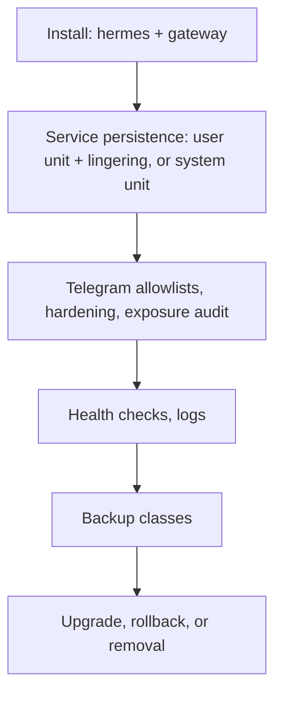

# Hermes Runtime Deployment Guide

> Status: authoritative, describes the actual repository state on this
> branch (issue [#86](https://github.com/ahliweb/omes/issues/86)). This
> document is the single end-to-end runbook for deploying, operating,
> hardening, backing up, and removing a Hermes Agent runtime under OMES.
> It supersedes scattered walkthroughs elsewhere and cross-references the
> dedicated per-topic documents (linked throughout) rather than
> duplicating their detail. Every command below is executable against the
> code in this tree — verified with `bin/omes <cmd> --help`/the command's
> own usage text, or by grepping `lib/omes/cmd/` and `lib/omes/py/` — or
> is explicitly marked **planned (issue #N)**.
>
> OMES is an independent, MIT-licensed, Omarchy-inspired compatibility
> layer for Ubuntu Server 24.04 LTS and Linux Mint 22.x. It is **not**
> official Omarchy. Hermes Agent is a separate upstream project
> (nousresearch.com) that OMES installs, configures, and operates — OMES
> does not author Hermes's reasoning, messaging, memory, skills, or
> model/provider routing (see [AGENTS.md](../AGENTS.md) §2 and
> [docs/agent-runtime-boundary.md](agent-runtime-boundary.md)).
>
> This document makes no absolute security claim. Every claim below is
> bounded to what OMES actually controls; see §14 for the explicit list
> of what it does not, and [docs/security.md](security.md) §9 for the
> full "what OMES does NOT claim" list this guide inherits.

## Table of contents

1. [Prerequisites](#1-prerequisites)
2. [OS tiers](#2-os-tiers)
3. [Profile-safe paths](#3-profile-safe-paths)
4. [Permissions and root/user scope](#4-permissions-and-rootuser-scope)
5. [Installing Hermes](#5-installing-hermes)
6. [Service persistence](#6-service-persistence)
7. [Logs](#7-logs)
8. [Telegram allowlists](#8-telegram-allowlists)
9. [Health and readiness](#9-health-and-readiness)
10. [Exposure audit](#10-exposure-audit)
11. [Hardening profiles](#11-hardening-profiles)
12. [Backup classes](#12-backup-classes)
13. [Compatibility records and provenance](#13-compatibility-records-and-provenance)
14. [Upgrades](#14-upgrades)
15. [Rollback](#15-rollback)
16. [Removal boundaries](#16-removal-boundaries)
17. [Per-agent deployments (`omes agent`)](#17-per-agent-deployments-omes-agent)
18. [OMES-vs-Hermes responsibility table](#18-omes-vs-hermes-responsibility-table)
19. [Known limitations and bounded security claims](#19-known-limitations-and-bounded-security-claims)

## 1. Prerequisites

- A host on one of the [supported OS tiers](#2-os-tiers). Verify with
  `omes check` (read-only, no mutation, any user).
- Outbound HTTPS to `hermes-agent.nousresearch.com` (installer download)
  and to whatever LLM provider(s) the operator configures.
- `bash`, `systemd` (`systemctl`), and `curl` on `PATH` — all present by
  default on every supported tier.
- Docker CLI, **optional**: only needed for `omes agent`'s rootless
  Docker Compose backend (§17.5); not required for the systemd-only
  deployment path in §5–§16.
- Root (`sudo`) for any root-scope module (e.g. `hermes-gateway-system`);
  never required for the per-user path in §5–§9. OMES never
  self-escalates with `sudo` — every privileged step is one the operator
  runs explicitly (`docs/security.md` §1, `AGENTS.md` §3).

## 2. OS tiers

(Full detail: [docs/compatibility-matrix.md](compatibility-matrix.md).)

| Tier | OS | Notes |
|---|---|---|
| 1 | Ubuntu Server 24.04 LTS amd64 | Primary target. |
| 1 | Linux Mint 22.x amd64 (desktop profile) | Docker/Hermes packages resolved via `$UBUNTU_CODENAME` (`noble`), since Docker officially supports only Ubuntu. |
| 2 | Ubuntu 22.04 amd64 | Supported, secondary. |
| 3 | arm64 (either distro) | Best-effort; not exercised in CI's container matrix. |
| — | Anything else | `omes check` exits 3 (unsupported platform) **before any mutation**. |

## 3. Profile-safe paths

Every path below is resolved the same way regardless of profile, so two
profiles (or two `omes agent` deployments, §17) never collide:

| Path | Resolution | Notes |
|---|---|---|
| `HERMES_HOME` | `OMES_HERMES_HOME` env var if set, else `~/.hermes` | One per installing user; set `OMES_HERMES_HOME` **before** `omes install` to give a profile its own instance. Per-agent deployments (§17) get their own isolated `HERMES_HOME` automatically — never shared. |
| OMES state dir | `OMES_STATE_DIR` if set, else `/var/lib/omes` (root scope) or `${XDG_STATE_HOME:-$HOME/.local/state}/omes` (user scope) | Mode `0700`. Holds `state`, `backups/`, `logs/`, and (for `omes agent`) `agents/<name>/`. |
| OMES config dir | `OMES_CONFIG_DIR` (see [docs/configuration.md](configuration.md)) | Holds `agents/<name>.json` manifests (§17). |
| Log file | `OMES_LOG_FILE` if set, else `<state-dir>/logs/omes-<UTC timestamp>.log` | |

Never hand-edit `$HERMES_HOME/config.yaml` where a `hermes config set
<key> <value>` command exists — this guide, and every OMES document it
supersedes, uses `hermes config set` exclusively for Hermes configuration
changes. `hermes` itself, not OMES, owns `config.yaml`'s schema.

## 4. Permissions and root/user scope

- **No sudo escalation by OMES, ever.** Root-scope modules refuse to run
  as non-root (exit 5); user-scope modules refuse to run as root (exit
  5). This is a hard invariant of the module contract
  ([docs/architecture.md](architecture.md) §4,
  [docs/security.md](security.md) §1) — there is no flag that relaxes it.
- The `hermes` module and the user-mode `hermes-gateway` module are
  **user-scope**: they install and run entirely as the invoking,
  unprivileged account. Run them as that user, never with `sudo`.
- `hermes-gateway-system` is **root-scope**: it writes a
  `/etc/systemd/system` unit but still runs the gateway *process* as a
  dedicated, non-root service account (`OMES_HERMES_GATEWAY_SYSTEM_USER`,
  required, validated to not be `root`) — root is needed only to install
  the unit file, never to run Hermes itself.
- `omes agent apply` (§17) enforces the same rule per manifest:
  `serviceMode: user` refused as root, `serviceMode: system` refused as
  non-root, exit 5, no mutation either way
  ([docs/agent-deployment.md](agent-deployment.md) §3.1).

## 5. Installing Hermes

```bash
omes check --module hermes                 # read-only preflight
omes install --module hermes --dry-run     # preview
omes install --module hermes --yes         # install for real (user scope)
hermes doctor                               # upstream self-check
```

`modules/hermes/module.sh` downloads the upstream installer
(`https://hermes-agent.nousresearch.com/install.sh`) **to a temporary
file first**, optionally verifies it against
`OMES_HERMES_INSTALLER_SHA256` (verified
`00f9080c6452bf87f03ef2fffb4b2c23b9f43f946aaae956e4c547d17e310b22` for
upstream release `v2026.9.14`), then executes it — never a direct
`curl | bash` (`docs/security.md` §6, ADR-0006). It creates an empty,
mode-`0600` `$HERMES_HOME/.env` if none exists and wires a managed `PATH`
snippet; `module_verify` proves `hermes --version` and `hermes doctor`
both succeed. Full detail: [docs/hermes-integration.md](hermes-integration.md)
§§1–10.

For the gateway (Telegram/other channel connectivity):

```bash
omes install --module hermes-gateway --yes          # user-mode unit (default, recommended)
sudo omes install --module hermes-gateway-system --yes   # system-mode unit (opt-in)
```

User vs. system trade-offs: [docs/hermes-integration.md §11](hermes-integration.md#11-user-vs-system-decision-table).

## 6. Service persistence

- **User unit + lingering**: the default. `hermes-gateway` runs as a
  `systemctl --user` unit. On a headless host, a user unit stops when the
  last session for that user ends **unless lingering is enabled**:

  ```bash
  sudo loginctl enable-linger "$(whoami)"
  ```

  Without this, the gateway will not survive a reboot or an SSH logout.
- **System-mode (`--system`) service-user policy**: `hermes-gateway-system`
  requires `OMES_HERMES_GATEWAY_SYSTEM_USER` to name an existing,
  non-root account; `module_check` fails otherwise. The unit itself is
  installed to `/etc/systemd/system` (root required to install), but the
  process it starts always runs as that non-root account — OMES never
  writes a unit that runs Hermes as root.
- Manage the service with `hermes gateway status|start|stop` (upstream
  Hermes CLI) or the equivalent `systemctl [--user] <verb>
  hermes-gateway`.

## 7. Logs

| Scope | Command |
|---|---|
| User-mode gateway | `journalctl --user -u hermes-gateway -f` |
| System-mode gateway | `journalctl -u hermes-gateway -f` |
| Per-agent deployment (§17, systemd backend) | `omes agent logs <name> [journalctl-args...]` — a `journalctl` passthrough scoped to that agent's own unit (`docs/agent-deployment.md`) |
| Per-agent deployment (§17, compose backend) | `omes agent logs <name> [--tail N] [--follow]` — `docker compose -p <project> -f <compose-file> logs --no-color --tail <n>` (`--follow` never the default); see `docs/agent-deployment.md` §11.2 |
| OMES's own actions | `<state-dir>/logs/omes-<timestamp>.log`, or override with `OMES_LOG_FILE` |

**Green signals can lie**: `systemctl [--user] is-active` proves the
process is running, not that it authenticated to Telegram or any
provider successfully. Always check `journalctl` (or `omes health`, §9)
for the actual connection outcome before declaring a deployment healthy
— see [docs/hermes-integration.md §14](hermes-integration.md#14-green-signals-can-lie-what-module_verify-actually-proves).

## 8. Telegram allowlists

Three env vars, read **once, at gateway start**, live in
`$HERMES_HOME/.env`:

| Variable | Controls |
|---|---|
| `TELEGRAM_ALLOWED_USERS` | DM access (numeric user ids) |
| `TELEGRAM_ALLOWED_CHATS` | Group/channel access (half of the pair) |
| `TELEGRAM_GROUP_ALLOWED_CHATS` | Group/channel access (**both** vars must list every allowed group — a group in only one is "half-enabled") |

Manage the allowlist with the dedicated tool, never by hand-editing
`.env`'s allowlist lines and never by editing `config.yaml`:

```bash
modules/hermes-gateway/telegram-allowlist.sh add -1001234567890      # writes both vars atomically
modules/hermes-gateway/telegram-allowlist.sh remove -1001234567890
modules/hermes-gateway/telegram-allowlist.sh --check                 # flags half-enabled groups, redacts the token
modules/hermes-gateway/telegram-allowlist.sh diagnose <chat-id>       # safe getChat/getChatMemberCount lookup
```

Then **restart** — allowlist edits are inert until the gateway restarts:

```bash
systemctl --user restart hermes-gateway     # user-mode
sudo systemctl restart hermes-gateway       # system-mode
```

Chat/config values that are *not* allowlist entries (model, toolsets,
compression, etc.) are set with `hermes config set <key> <value>` —
never by hand-editing `config.yaml`.

**Never call `getUpdates`, `setWebhook`, or `deleteWebhook`** against a
running polling gateway: `getUpdates` causes a 409 conflict and steals
updates from the real poller; `setWebhook`/`deleteWebhook` are mutually
exclusive with polling. Safe chat-id discovery uses only `getChat`,
`getChatMember`, `getChatMemberCount`, `getMe`, and `getWebhookInfo` — see
[docs/telegram-security.md §7](telegram-security.md#7-safe-chat-id-discovery-never-getupdates)
for the full discovery procedure and
[docs/telegram-security.md §12](telegram-security.md#12-operator-checklist)
for the pre-production checklist (token storage, rotation, DM policy,
mention policy).

## 9. Health and readiness

```bash
omes health                 # = omes health agent: host/runtime/gateway/provider/channel layers
omes health gateway         # same model, scoped to gateway/provider/channel
omes health ollama          # optional local-AI-runtime layered check
```

Layers (`lib/omes/py/health/hermes.py`, issue #79):

| Layer | Proves |
|---|---|
| `host` | systemd present, disk/memory above threshold |
| `runtime` | `hermes` on `PATH`, `hermes doctor` succeeds |
| `gateway` | unit enabled/active (does **not** prove connectivity — see §7) |
| `provider` | LLM provider reachability, `not_applicable` unless configured (e.g. `OMES_OLLAMA_ENABLED=1`) |
| `channel` | Telegram reachability via `getMe`/`getWebhookInfo` only — never `getUpdates` |

Exit codes: 0 ready, 7 not ready. Full remediation table:
[docs/hermes-integration.md §17](hermes-integration.md#17-health-and-readiness-issue-79).
`omes health ollama` policy/profiles: [docs/ollama.md](ollama.md).

## 10. Exposure audit

```bash
omes audit exposure           # detect unsafe listener exposure
omes audit exposure --json | jq -e '.ok'
```

Parses `ss -H -tulpn`, classifies every listener (Hermes gateway,
browser-control/CDP, MCP server, Ollama, other) as loopback / LAN /
wildcard, and cross-references `ufw status` for firewall coverage
(`lib/omes/py/health/exposure.py`, issue #80). **Detection only** — it
never opens a port, alters a firewall rule, or reads a credential value.
A non-loopback bind is a finding (exit 7) unless approved via
`OMES_EXPOSURE_ALLOW="host:port,..."`; a missing `ss` binary is a
distinct exit 4, never a false "ok". Remediation is always an explicit
operator action, and — per the never-hand-edit rule in §3 — should use
`hermes config set` to change a bind address, not a direct edit of
`config.yaml`. Full detail: [docs/hermes-integration.md §18](hermes-integration.md#18-exposure-audit-issue-80).

## 11. Hardening profiles

Opt-in, off by default (`OMES_HERMES_HARDENING=off|conservative|strict`):

```bash
OMES_HERMES_HARDENING=conservative omes install --module hermes-gateway --yes   # recommended opt-in
OMES_HERMES_HARDENING=strict omes install --module hermes-gateway --yes        # documented compatibility trade-offs
```

- **`off`** (default): no hardening drop-in.
- **`conservative`** (recommended): `NoNewPrivileges`, `PrivateTmp`,
  `ProtectSystem=full`, `UMask=0077`, restart/crash-loop limits, a
  configurable `MemoryMax`/`MemoryHigh` (default `2G`, `OMES_HERMES_MEMORY_MAX`).
  Compatible with browser automation and MCP subprocess tools.
- **`strict`**: adds `ProtectHome=read-only` (with `OMES_HERMES_RW_PATHS`
  as the escape hatch), kernel/module/log protections, an empty
  capability bounding set. **Breaks** any tool writing outside
  `$HERMES_HOME` under `$HOME`, and can break sandboxed browser helper
  binaries using a foreign-arch shim — read
  [docs/hermes-hardening.md §2](hermes-hardening.md#2-profiles) before
  choosing it.

If a hardening-triggered restart doesn't come back active within
`OMES_HERMES_HARDENING_TIMEOUT` (default 15s), the drop-in is
**automatically removed and the unit restarted again** — the one place
in the gateway modules where automatic rollback is justified, because it
only undoes what the same `module_apply` call just did. Full detail,
including the exact directive tables and `hermes agent`'s reuse of this
same `hardening_render` function for per-agent deployments (§17):
[docs/hermes-hardening.md](hermes-hardening.md).

## 12. Backup classes

Two separate backup systems exist, deliberately:

| Tool | Scope | Never touches |
|---|---|---|
| `omes backup` / `omes restore` | OMES-managed paths (config/PATH drop-ins the modules themselves wrote) | `$HERMES_HOME/.env` (secrets) — never registered for backup |
| `omes agent-backup` (issue #82) | Hermes's own data under `$HERMES_HOME`, by explicit data class or recovery class | `secrets` class unless `--include-secrets`/`--restore-secrets` is passed; `sessions`/`memory` classes and the `portable-profile`/`full-runtime-dr` recovery classes unless `--allow-restricted-scope` is passed (issue #235 — see below) |

```bash
omes agent-backup create --recovery-class omes-host   # safe default: config, skills only
omes agent-backup create                              # native portable-profile (ADR-0020) -
                                                        # ALWAYS includes session state, so this
                                                        # now requires --allow-restricted-scope too
omes agent-backup create --class memory --class sessions --allow-restricted-scope
omes agent-backup list
omes agent-backup verify <timestamp>
omes agent-backup restore <timestamp> --yes
```

`omes agent apply`'s own automatic pre-mutation backup step pins
`--recovery-class omes-host` explicitly (issue #235), so a routine
`apply`/`update`/`rollback` never triggers the Restricted-scope gate.

| Class | Paths | Default? | Requires `--allow-restricted-scope`? |
|---|---|---|---|
| `config` | `config.yaml`, `SOUL.md` | Yes (under `omes-host`) | No |
| `skills` | `skills/` | Yes (under `omes-host`) | No |
| `memory` | `memories/` | No | **Yes** (issue #235) |
| `sessions` | `sessions/`, `state.db` | No | **Yes** (issue #235) |
| `runtime-state` | `logs/`, `cache/`, `cron/`, `state-snapshots/`, `modal_snapshots.json`, `verification_evidence.db` | No | No |
| `secrets` | `.env`, `auth.json` | **Never** without `--include-secrets` | No (separate gate) |

The native recovery classes `portable-profile` (upstream `hermes profile
export`) and `full-runtime-dr` (upstream `hermes backup`) both always
include session state by upstream Hermes's own design (ADR-0020) and
therefore also always require `--allow-restricted-scope`, on both create
and restore. See [docs/hermes-backup.md](hermes-backup.md) section 3a.

`--dry-run` uses `os.stat` only — it never opens a file's content, even
for `secrets` with `--include-secrets` — so a dry run cannot leak secret
content through any error path. Restore validates every checksum before
writing anything and takes a pre-restore safety backup first. Full
class-to-path mapping, privacy/retention notes, and the doctor
integration (`omes doctor` reports last-backup age once
`modules/hermes-backup` is applied): [docs/hermes-backup.md](hermes-backup.md).

## 13. Compatibility records and provenance

**Available on the provenance branch; merging with this stack is
tracked in PR [#122](https://github.com/ahliweb/omes/pull/122)/[#126](https://github.com/ahliweb/omes/pull/126).**
`omes health versions` (compatibility evidence, issue #83) and
`omes audit provenance` (provenance recording, issue #84) are implemented
on `origin/feat/84-provenance-audit` — a sibling branch to this one, not
present in this tree. `docs/compatibility-evidence.md` and
`docs/provenance.md` on that branch document them.

What **is** in this tree today: `omes agent apply` (§17) already records
a bounded provenance object per deployment — `omesVersion` (from
`VERSION`), `gitRef` (`git rev-parse HEAD` at apply time, best-effort),
`hermesVersion` (`hermes --version` output, best-effort), and, for the
compose backend, `composeImageDigest`/`composeFileSha256` — **never a
credential**
([docs/agent-deployment.md §4](agent-deployment.md#4-state-and-provenance)).
This is a narrower, per-agent record; it is not the general-purpose
`omes health versions`/`omes audit provenance` commands from #83/#84,
which remain unmerged into this stack as of this document.

## 14. Upgrades

```bash
omes update                 # fast-forwards this OMES checkout via git, then re-runs `omes check`
hermes doctor                # confirm Hermes itself still passes its own self-check after any change
```

`omes update` goes through the same backup-before-mutate path as any
other module action (`docs/security.md` §4). Upgrading the Hermes binary
itself is upstream Hermes's own concern — re-run the installer
(`omes install --module hermes --yes`; a version mismatch against
`OMES_HERMES_VERSION`, if pinned, triggers a re-install automatically)
and re-verify with `hermes doctor` and `omes health` (§9) afterward.
For a per-agent deployment (§17), re-run `omes agent apply <name>` —
it is idempotent and re-applies from `preflighted`, backing up the
agent's `HERMES_HOME` first if one already exists.

## 15. Rollback

```bash
omes restore --list                      # list available backup sessions
omes restore --from <timestamp> --yes    # restore a specific session, offline-safe
sudo omes uninstall --dry-run            # preview what a full module rollback would do
```

`omes restore`/`module_rollback` operate **only** on paths a module
registered via `omes_manage_path` — nothing else is ever touched. A
pre-existing file is restored to what it was before OMES wrote it; a
file OMES created from nothing is removed. Every restore validates
`MANIFEST` sha256 checksums before writing anything, and works fully
offline (no network call anywhere in the restore path). Full detail,
including the `omes uninstall`-vs-`omes restore` distinction and the
disaster-recovery scenario walkthroughs: [docs/rollback.md](rollback.md)
and [docs/disaster-recovery.md](disaster-recovery.md).

For a per-agent deployment (§17): `omes agent rollback <name>` stops and
disables that agent's unit and removes only the unit/drop-in files this
tool itself wrote — it never touches the agent's `HERMES_HOME`. For the
compose backend, `rollback` tears the project down and restores the
previously-rendered `compose.yaml` if one exists.

## 16. Removal boundaries

**What `omes uninstall` removes:** exactly the paths recorded in
`module.<name>.managed_paths` for the target module(s)/profile, restored
or removed per §15's rule, plus (only with `--purge-packages`) the
packages that same module's `installed_packages` record shows it
installed — never a package that was already present before OMES ran.

**What `omes uninstall` never removes (operator-owned Hermes data):**

- `$HERMES_HOME` and everything under it (`config.yaml`, `.env`,
  `SOUL.md`, `memories/`, `skills/`, `sessions/`, `state.db`, `logs/`,
  `cron/`, etc.) — none of this is ever registered via
  `omes_manage_path` by the `hermes`/`hermes-gateway` modules.
- `.env` specifically, structurally: no code path in the `hermes`/
  `hermes-gateway` modules or in `telegram-allowlist.sh` ever calls
  `omes_manage_path` on it (`docs/telegram-security.md` §9).
- Anything an operator or Hermes itself created after OMES finished
  applying (a database, generated content, a manually-edited file
  outside the managed-path set).

**What `omes agent rollback <name>` removes:** only that agent's own
unit/drop-in (systemd backend) or compose project + rendered
`compose.yaml`/directory (compose backend, and only when `omes agent
remove` is used — see [docs/agent-deployment.md §3.5, §9.4](agent-deployment.md)).
It never removes the agent's `HERMES_HOME`, never another agent's
resources, and never Hermes's own `backups/` directory.

**Manual removal that is genuinely outside OMES's boundary**: uninstalling
Hermes itself (the `hermes` binary, `~/.hermes/hermes-agent/`) is an
upstream Hermes concern, not something `omes uninstall` performs — OMES
only ever undoes its *own* installer wiring (the `PATH` snippet, the
empty `.env` it may have created if none existed). Removing Hermes
entirely is a manual, operator-driven step (delete `~/.hermes/`,
`~/.local/bin/hermes`) that this guide documents but does not automate,
consistent with never deleting data OMES did not create and does not
exclusively own.

## 17. Per-agent deployments (`omes agent`)

For deployments needing more than one isolated Hermes instance per host
(issue #87, compose isolation issue #96). Full design, manifest schema,
lifecycle contract, and every "left for follow-up" item:
[docs/agent-deployment.md](agent-deployment.md).

### 17.1 What it is / is not

`omes agent` declares, plans, applies, verifies, backs up, and rolls back
the **deployment** of an already-installed Hermes instance under an
isolated `HERMES_HOME`. It reuses, rather than duplicates, §9's health
model, §11's hardening directives, and §12's backup engine. It does not
reimplement any part of Hermes itself.

### 17.2 CLI

```bash
omes agent list                          # every declared/applied agent + state
omes agent doctor [--json]               # every deployed agent's state + health, read-only
omes agent check <name>                  # preflight only, no mutation
omes agent plan <name>                   # computed plan, no mutation
omes agent apply <name> [--dry-run] [--yes]
omes agent status <name> [--json]
omes agent health <name> [--json]
omes agent restart <name>
omes agent logs <name>                   # systemd: journalctl passthrough
omes agent logs <name> [--tail N] [--follow]  # compose: docker compose logs
omes agent rollback <name> [--yes]
omes agent remove <name> [--yes]         # compose backend only
```

`omes doctor` also reports every deployed agent automatically (one
`agent:<name>` row per agent, `OK`/`WARN` based on its health) whenever
at least one has been declared — see
[docs/agent-deployment.md §11](agent-deployment.md#11-omes-doctor-integration-and-omes-agent-logs-compose).

`omes agent` is an optional extension command
([lib/omes/cmd/README.md](../lib/omes/cmd/README.md)); it is never
referenced by any installer profile.

### 17.3 Manifest

A versioned JSON file (never YAML — ADR-0012) at
`$OMES_CONFIG_DIR/agents/<name>.json`, validated against
[`contracts/agent/v1/agent-deployment.schema.json`](../contracts/agent/v1/agent-deployment.schema.json).
Manifests never contain a secret **value** — `spec.secrets` is a list of
reference **names** only.

### 17.4 Lifecycle

```text
declared -> preflighted -> planned -> backed-up -> applied -> verified -> ready -> healthy
```

Failure states: `degraded | failed | rolled-back`. `apply` is
`check -> plan -> backup -> mutate -> verify` and idempotent — re-running
it against an already-`ready`/`healthy` deployment restarts the same
cycle rather than being rejected.

### 17.5 Backend choice: systemd vs. compose

| Backend | When to use | Isolation |
|---|---|---|
| `systemd` (default) | A plain Hermes install under an isolated `HERMES_HOME` is enough | Own `HERMES_HOME`, own `systemctl` unit (`omes-agent-<name>.service`), own state directory |
| `compose` (issue #96) | Untrusted/lightly-trusted generated code, per-agent browser profile, or any workload needing stronger isolation than a systemd service | Pinned-by-digest image, dedicated network namespace, no ambient host access, container-scoped resource limits |

The compose backend **requires a rootless Docker daemon**
(`docker context show`/`docker info` reporting `name=rootless`, never
the well-known rootful socket path, never `docker`-group-only access on
a rootful daemon — refused at exit 4, before any mutation, if not met).
OMES never adds the operator to the `docker` group and never runs `sudo`
for this backend. The manifest schema structurally rejects Docker-socket
mounts, `privileged`/host-PID/host-network, non-loopback port binds, and
tag-only (non-digest-pinned) images. Full manifest shape and rendering
detail: [docs/agent-deployment.md §8](agent-deployment.md#8-compose-backend-rootless-docker-compose-isolation-issue-96).

## 18. OMES-vs-Hermes responsibility table

| Area | OMES | Hermes |
|---|---|---|
| Host compatibility, preflight, package installation | **Owns** | No role |
| Installing/updating the `hermes` binary and its systemd unit(s) | **Owns** (installer download-to-file, unit rendering, PATH/drop-in wiring) | Owns its own binary's internal update mechanics, if any |
| `config.yaml` schema and values | No role beyond invoking `hermes config set` | **Owns** |
| Secrets (`.env`, `auth.json`) storage location and permissions | **Owns** (creates empty `0600` file, never populates it, never backs it up by default) | **Owns** the values and how the running process reads them |
| Reasoning, messaging, sessions, memory, skills, cron, browser automation, model/provider routing | No role — must never reimplement | **Owns** |
| Telegram allowlist file mechanics (atomic write, both vars together) | **Owns** (`telegram-allowlist.sh`) | Owns reading the allowlist at gateway start and enforcing it |
| Systemd unit hardening (resource limits, sandboxing directives) | **Owns** (opt-in drop-in, §11) | No role |
| Health/readiness aggregation across layers | **Owns** (§9) | Owns what each individual probe (`hermes doctor`, `getMe`, etc.) reports |
| Exposure audit (detection) | **Owns** (§10) | Owns the actual bind address / listener configuration `hermes config set` changes |
| Backup/restore of Hermes's own data | **Owns** the mechanics and class boundaries (§12) | Owns the data's meaning and its own internal `backups/` snapshots (not covered by any OMES class) |
| Per-agent deployment lifecycle and isolation | **Owns** (§17) | Owns the runtime behavior of each deployed instance |
| Provenance/compatibility evidence | **Owns** the mechanics (§13; general-purpose form pending #83/#84 merge) | No role |

## 19. Known limitations and bounded security claims

- This guide, and the code it describes, do not certify a host as
  secure. OMES applies documented least-privilege defaults and
  reversible changes; it does not scan for or fix vulnerabilities
  unrelated to what it installs (`docs/security.md` §9).
- `omes health versions`/`omes audit provenance` (issues #83/#84) are
  **not present in this tree** — see §13. Do not assume compatibility
  evidence or general-purpose provenance recording exists until that
  merge lands.
- The compose backend (§17.5) has **no VM/real-rootless-Docker evidence**
  in this implementation environment; every test here runs against
  `tests/shims/docker`. Real-host verification is tracked as follow-up
  (`docs/agent-deployment.md` §10).
- `omes agent`'s compose-backend health layer does not yet reuse
  `lib/omes/py/health/hermes.py`'s provider/channel checks (they assume a
  host-reachable `HERMES_HOME`); it implements its own in-container
  check instead (`docs/agent-deployment.md` §10).
- `omes agent logs` is a `journalctl` passthrough and does not cover the
  compose backend yet (§7).
- Hardening's `strict` profile is a documented compatibility trade-off,
  not a universal recommendation — read
  [docs/hermes-hardening.md §2](hermes-hardening.md#2-profiles) before
  choosing it for a deployment that uses browser automation.
- OMES cannot set a hard ceiling on LLM provider spend, cannot enforce
  Hermes's own agent-loop decisions (when it chooses to call a tool), and
  does not manage disk encryption or the bootloader
  (`docs/security.md` §9, `docs/threat-model.md` §6). These remain
  operator responsibilities regardless of which deployment path (§5–§17)
  is used.
- No claim in this document is absolute ("fully secure", "cannot be
  bypassed"); every control names its scope and its opt-in escape hatch,
  if one exists, per `docs/security.md` §1's table.

## See also

- [docs/agent-deployment.md](agent-deployment.md) — full per-agent
  manifest schema, lifecycle, and compose backend detail (§17 here is a
  summary).
- [docs/hermes-integration.md](hermes-integration.md) — the `hermes`/
  `hermes-gateway`/`hermes-gateway-system` module reference this guide
  summarizes in §§5–§10.
- [docs/hermes-hardening.md](hermes-hardening.md), [docs/hermes-backup.md](hermes-backup.md) —
  full detail behind §11/§12.
- [docs/telegram-security.md](telegram-security.md) — full detail behind §8.
- [docs/security.md](security.md), [docs/threat-model.md](threat-model.md) —
  the security baseline and STRIDE threat table this guide's claims are
  bounded by.
- [docs/rollback.md](rollback.md), [docs/disaster-recovery.md](disaster-recovery.md) —
  full detail behind §15/§16.
- [docs/agent-runtime-boundary.md](agent-runtime-boundary.md), [ADR-0013](adr/0013-agent-runtime-boundary.md) —
  the runtime-neutral contract Hermes fulfils today.

<!-- OMES-MERMAID: docs/hermes-deployment-guide.md -->

## Visual summary


