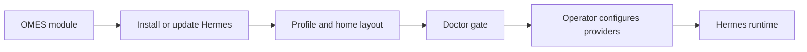

# Hermes Integration

> Status: describes the actual repository state. Sections marked **Not
> implemented yet** are tracked by the linked issue; everything else
> reflects `modules/hermes/module.sh` as it exists today.
>
> This document covers the `hermes` module (part 1, issue
> [#11](https://github.com/ahliweb/omes/issues/11)) and the
> `hermes-gateway`/`hermes-gateway-system` modules (part 2, issue
> [#12](https://github.com/ahliweb/omes/issues/12), sections 11+).
> Telegram-specific security guidance lives in
> [`docs/telegram-security.md`](./telegram-security.md) (issue
> [#13](https://github.com/ahliweb/omes/issues/13)).
>
> OMES is an independent, MIT-licensed, Omarchy-inspired compatibility
> layer. It is not official Omarchy and Hermes Agent is a separate upstream
> project (nousresearch.com) that OMES installs and configures, not
> something OMES authors.
>
> For the runtime-neutral contract OMES needs from any agent runtime
> (install, preflight, verify, service, health, provenance, backup,
> rollback) and how Hermes fulfils it today, see
> [docs/agent-runtime-boundary.md](agent-runtime-boundary.md) and
> [ADR-0013](adr/0013-agent-runtime-boundary.md) (issue
> [#85](https://github.com/ahliweb/omes/issues/85)).
>
> `modules/hermes/module.sh` also records runtime version/compatibility
> evidence (`omes health versions`, issue #83; see
> [docs/compatibility-evidence.md](./compatibility-evidence.md)) at
> apply time and on `omes doctor`, and installer/package-manager
> supply-chain provenance (`omes audit provenance`, issue #84; see
> [docs/provenance.md](./provenance.md)) at install time - both are
> additive read-only reports layered on top of the module contract
> described below, not a change to what `module_apply`/`module_verify`
> require to succeed.

## 1. What the `hermes` module does

`modules/hermes/module.sh` (`MODULE_SCOPE=user`) installs the Hermes Agent
CLI for the invoking user by downloading and running the upstream installer,
then does the minimum additional wiring needed for the `hermes` command to
be usable in future shells: a managed `PATH` snippet, and an empty,
mode-`0600` `$HERMES_HOME/.env` if one does not already exist.

It follows the standard OMES module lifecycle (`docs/architecture.md`
§4): `module_check` (read-only preflight), `module_apply` (idempotent
install + wiring), `module_verify` (proves `hermes --version` and `hermes
doctor` both succeed), `module_rollback` (best-effort undo of OMES's own
wiring only).

## 2. Install model

**Contract: per-user only, never root.** Hermes installs entirely within
the invoking user's `$HOME` (`~/.hermes/hermes-agent/` for its code,
`~/.local/bin/hermes` for the binary). `MODULE_SCOPE="user"` means the OMES
module runner refuses to run it as root (exit 5), and `module_check` itself
additionally refuses and logs:

```text
[omes] ERROR hermes: must not run as root - Hermes installs per-user; re-run as the target user without sudo (see docs/hermes-integration.md)
```

This is a hard invariant, not a default that can be overridden with a flag
— see `docs/security.md` §1 ("Hermes runtime user").

**Supply chain.** OMES never pipes the upstream installer directly into a
shell (`curl | bash`). `module_apply`:

1. Downloads `https://hermes-agent.nousresearch.com/install.sh` (override
   for testing only via `OMES_HERMES_INSTALLER_URL`) to a private temp file
   with `curl -fsSL <url> -o <tmpfile>`.
2. If `OMES_HERMES_INSTALLER_SHA256` is set, verifies the downloaded file's
   sha256 against it; a mismatch aborts with **no execution** and
   `module_apply` fails (exit 6 from `omes install`).
3. If `OMES_HERMES_INSTALLER_SHA256` is **not** set, logs a `WARN` and
   proceeds anyway — pinning is optional (upstream does not currently
   publish a stable release hash to pin against) but its absence is always
   visible in the log, never silent. See `docs/security.md` §6.
4. Runs the verified temp file with an explicit `HERMES_HOME=<resolved
   home>` environment variable, then deletes the temp file.

This satisfies ADR-0006 and the "no `curl | bash` inside a module"
invariant in `docs/architecture.md` §10.

## 3. `HERMES_HOME` and profile layout

- Default: `~/.hermes` (the upstream default, unchanged).
- Override: set `OMES_HERMES_HOME` before running `omes install` to give a
  profile its own isolated Hermes instance (e.g. a second, differently
  configured Hermes identity on the same host). The module resolves
  `HERMES_HOME` once per `module_apply`/`module_verify` call and exports it
  for the rest of that `omes` process, so later modules in the same run
  (e.g. `hermes-gateway`, issue #12) see the same value.
- OMES does **not** create or manage multiple named profiles itself; a
  distinct `HERMES_HOME` value per invocation *is* the profile mechanism,
  exactly as upstream Hermes defines it. Running `omes install --profile
  hermes` twice with two different `OMES_HERMES_HOME` values produces two
  independent Hermes installs under the same OS user.

## 4. What OMES manages vs. what the operator manages

| Path | Managed by | Notes |
|---|---|---|
| `~/.hermes/hermes-agent/`, `~/.local/bin/hermes` | The upstream Hermes installer (invoked by OMES) | OMES does not vendor or modify this code; `module_rollback` never deletes it. |
| `$HERMES_HOME/config.yaml` | The operator, via `hermes config set <key> <value>` | OMES never writes this file directly. |
| `$HERMES_HOME/.env` | OMES creates it (empty, mode `0600`) **only if absent**; the operator fills in secrets | OMES never overwrites an existing `.env`, never reads secret values out of it, and never writes a provider or Telegram credential into it. **Not** registered via `omes_manage_path`: unlike every other path in this table, `.env` is never backed up, never restored, and never deleted by `module_rollback` — it is deliberately outside the backup/restore/uninstall system entirely, so a live secret is never copied into `<state-dir>/backups/`. See §5. |
| `${XDG_DATA_HOME:-~/.local/share}/omes/hermes-path.sh` | OMES (fully) | A small, marker-commented snippet exporting `PATH="$HOME/.local/bin:$PATH"` when not already present. Overwritten idempotently on every `module_apply`. |
| `~/.bashrc`, `~/.profile` | OMES appends one marker-delimited block sourcing the snippet above; the rest of the file is the operator's | Backed up (via `omes_manage_path`) before the first append; a file that already contains the marker block is left untouched on re-run. |
| Provider/model configuration (LLM API keys, `hermes model`) | The operator, entirely | See §5 — OMES never automates this. |

## 5. Secret boundaries: provider setup is never automated

**OMES never writes a provider API key, Telegram bot token, or any other
credential into `.env` or anywhere else.** `module_apply` only ever
*creates an empty* `.env` file (mode `0600`) when one does not already
exist, so a fresh install has a secrets file with the right permissions
ready for the operator to populate — it never contains a real or
placeholder-real-looking secret written by OMES itself.

**`.env` is never backed up, restored, or deleted by OMES.** Every other
path this module touches is registered via `omes_manage_path`, which makes
`lib/omes/backup.sh` copy it into `<state-dir>/backups/<timestamp>/` before
each apply so it can be restored or removed later (`docs/architecture.md`
§4.6, §7). `.env` is the one deliberate exception: it is created/mode-fixed
directly, without ever calling `omes_manage_path` on it. This means:

- `omes install`/`omes update` never copies a live secret into a backup
  directory.
- `omes restore` never overwrites an operator's current `.env` with an old
  one, and never needs to (there is nothing to restore it *from*).
- `module_rollback` (`omes uninstall`) never deletes `.env` — rotating or
  removing a Telegram/provider credential is always the operator's own
  action, never a side effect of OMES rollback.

This is a hard rule, not a default: it applies to every OMES module that
touches a Hermes secrets file (see issue #12 for the gateway and issue #13
for Telegram allowlist tooling), and CI/test coverage in
`tests/unit/hermes.bats` and `tests/integration/hermes.bats` asserts that
no backup session ever contains a file named `.env`.

Provider and model configuration is entirely a manual, documented, operator
action, using the Hermes CLI directly:

```console
$ hermes config set provider.name <provider>
$ hermes model                      # interactive model picker / current model
$ $EDITOR "$HERMES_HOME/.env"       # add e.g. ANTHROPIC_API_KEY=... yourself
```

This is deliberate: embedding a credential-writing step in an installer
module would mean OMES scripts handle plaintext secrets, and would give any
`omes install` run the ability to silently overwrite operator-managed
credentials. Neither is acceptable per `docs/security.md` §5. Telegram bot
token handling specifically is documented in
[`docs/telegram-security.md`](./telegram-security.md) (issue #13).

## 6. The doctor gate

`module_verify` treats `hermes doctor` as the authoritative proof that the
install actually works, not just that the binary exists:

1. `hermes --version` must succeed; its output is logged. Failure here
   fails verification immediately (exit 7) — the binary is missing or
   broken regardless of what `doctor` would say.
2. `hermes doctor` is then run. Its exit code decides the result:
   - **Non-zero exit (`FAIL`)** → `module_verify` fails, and the doctor
     output is logged at `ERROR` level in full so the operator sees exactly
     what to fix, instead of a generic "verification failed" message.
   - **Zero exit with `WARN` somewhere in its output** → `module_verify`
     still succeeds, but the output is logged at `WARN` level so the
     warning is visible in `omes install`'s output and in the log file, not
     silently swallowed.
   - **Zero exit, no `WARN`** → logged at `INFO` level; nothing further to
     do.

This means `omes install --profile hermes` failing with exit 7 always means
"look at the `hermes doctor` output printed above it," not an opaque
failure.

### 6.1 Ollama, when configured

`modules/hermes/module.sh` also defines an additive, advisory
`module_doctor` hook (read by `omes doctor`, see `bin/omes`'s
`cmd_doctor`): when Ollama looks configured for this install
(`OMES_OLLAMA_ENABLED=1`, or the `ollama` binary is present *and*
`OMES_OLLAMA_MODEL` is set), it runs the layered Ollama health check
(`omes health ollama`, issue [#71](https://github.com/ahliweb/omes/issues/71))
and reports a one-line `ready=.../service=.../model=...` summary. This
never fails `module_verify` itself — an unhealthy Ollama surfaces as a
`WARN` in `omes doctor`'s output, not a `FAIL`, since Ollama is optional
and orthogonal to whether Hermes itself installed correctly. See
[docs/ollama.md](ollama.md) for the full layered contract, profiles, and
remediation guidance.

## 7. Idempotency

Re-running `omes install --profile hermes` (or `--module hermes`) against an
already-applied host:

- Does **not** re-download or re-run the installer when a `hermes` binary
  is already present and runnable (`hermes --version` succeeds), unless
  `OMES_HERMES_VERSION` is set and does not match the installed version's
  output — in which case the installer runs again to bring the host to the
  pinned version.
- Does **not** duplicate the `~/.bashrc`/`~/.profile` marker block (checked
  by the marker's presence before appending).
- Does **not** overwrite an existing `$HERMES_HOME/.env` (checked by file
  existence before creating).
- Leaves `module.hermes.status=applied` and re-runs `module_verify`
  regardless, so a doctor regression is still caught on every run.

## 8. Rollback

`module_rollback` is invoked by `omes uninstall`/`omes restore`, or
explicitly by an operator recovering from a `failed` state — never
automatically mid-`install` (see `docs/architecture.md` §3.2). It removes
only what OMES itself created:

- The managed PATH snippet file.
- The marker-delimited block it appended to `~/.bashrc`/`~/.profile`
  (everything else in those files is left untouched).
- The `module.hermes.home` state key.

It **never** deletes `$HERMES_HOME` or `~/.local/bin/hermes` — that is
real Hermes data and the operator's install, not something OMES has enough
information to safely destroy (config, secrets, session history, skills).
In particular, `$HERMES_HOME/.env` is never touched by rollback (it was
never registered as a managed path in the first place — see §4/§5), so
rollback cannot delete an operator's Telegram/provider credentials as a
side effect. Instead, it prints the exact command a human would run to
fully remove Hermes themselves:

```text
[omes] WARN hermes: to fully remove Hermes yourself, run: rm -rf '/home/<user>/.hermes' "$HOME/.local/bin/hermes"
```

## 9. Environment variables this module reads

| Variable | Purpose | Default |
|---|---|---|
| `OMES_HERMES_HOME` | Overrides `HERMES_HOME` for this install | `~/.hermes` |
| `OMES_HERMES_VERSION` | Pins the installed version; a mismatch triggers re-install | unset (accept whatever the installer provides) |
| `OMES_HERMES_INSTALLER_SHA256` | Verifies the downloaded installer's integrity before executing it | unset (proceeds with a `WARN`) |
| `OMES_HERMES_INSTALLER_URL` | Overrides the installer URL | `https://hermes-agent.nousresearch.com/install.sh` (testing only; not a documented operator knob) |

## 10. Status (part 1 / `hermes` module)

`omes doctor`/`omes update` are implemented first-class CLI commands (issue
#14; `bin/omes`'s `cmd_doctor`/`cmd_update`) — `omes doctor` runs this
module's `module_verify` for every host where `hermes` is recorded as
applied. `omes uninstall`/`omes restore` are implemented (issue #10,
`lib/omes/restore.sh`), so this module's `module_rollback` is reachable via
`omes uninstall --module hermes` in addition to being callable directly.
Nothing in part 1 is outstanding.

<!-- OMES-MERMAID: docs/hermes-integration.md -->

## Visual summary (part 1)



---

# Part 2: `hermes-gateway` and `hermes-gateway-system`

> Covers issue [#12](https://github.com/ahliweb/omes/issues/12):
> `modules/hermes-gateway/module.sh` (`MODULE_SCOPE=user`, the default
> path, wired into `profiles/server.profile` and `profiles/hermes.profile`)
> and `modules/hermes-gateway-system/module.sh` (`MODULE_SCOPE=root`,
> opt-in only, not wired into any profile file).
>
> **Why two modules, not one with a flag:** `OMES_GATEWAY_MODE=user|system`
> exists as documented intent and as a guard (the user-mode module refuses
> outright if `OMES_GATEWAY_MODE=system` is set — see §12.2), but it cannot
> be the *only* thing that decides which module runs, because
> `MODULE_SCOPE` is a single fixed value read once when a module is loaded
> (`docs/architecture.md` §4.5), and the runner refuses (exit 5) to run a
> `root`-scope module as non-root or a `user`-scope module as root. A
> single module cannot legitimately serve both privilege levels, so the
> system path lives in its own module, `modules/hermes-gateway-system/`,
> exactly as the issue brief anticipated as an acceptable design ("if that
> is cleaner under the scope contract, and say so in the PR" — this is
> that note).

## 11. User vs. system: decision table

| | **User mode (default)** — `modules/hermes-gateway` | **System mode (opt-in)** — `modules/hermes-gateway-system` |
|---|---|---|
| Applied via | `omes install --profile server` / `--profile hermes` (wired in by default) | `sudo omes install --module hermes-gateway-system` (never wired into a profile; explicit opt-in only) |
| Runs as | The invoking user, via `systemctl --user` | Root runs the *installation* step only; the resulting system unit runs the gateway process under a dedicated, non-root service account (never root — this module refuses outright to target the root account, see §12.5) |
| Best for | A workstation/desktop with an interactive login session, or a server where the operator is comfortable relying on `loginctl enable-linger` for persistence | A headless server/VPS where no user is expected to stay "logged in," or where gateway lifecycle should be independent of any one account's session |
| Reboot/logout survival | Survives reboot once enabled (`systemctl --user enable`); survives **logout** only if lingering is enabled (§12.3) — without it, the `--user` service manager itself stops when the last session for that user ends | Survives reboot and logout unconditionally — a system unit has no session dependency at all |
| Privilege footprint | Never root at any point | Root is used only for the one-time `hermes gateway install --system` + systemd wiring step; the running gateway process itself is not root |
| Logs | `journalctl --user -u hermes-gateway -f` | `journalctl -u hermes-gateway -f` |
| Status | `systemctl --user status hermes-gateway`, `hermes gateway status` | `systemctl status hermes-gateway`, `sudo -u <user> hermes gateway status` (the CLI belongs to the target user, not root) |
| Restart | `systemctl --user restart hermes-gateway` | `sudo systemctl restart hermes-gateway` |
| Rollback | `module_rollback` stops/disables the `--user` unit, removes OMES's drop-in, disables lingering **only if OMES itself enabled it** (state-tracked) | `module_rollback` stops/disables the system unit and removes OMES's drop-in |

**Recommendation:** start with user mode. It is the default in every
profile that includes the gateway, needs no extra flags, and is what the
architecture's "least privilege by default" posture (`docs/security.md`
§1) prefers. Reach for system mode only when the workstation-vs-server
trade-off above genuinely calls for it (a headless box where you do not
want gateway uptime tied to any one login session).

## 12. User mode (`modules/hermes-gateway`)

### 12.1 What `module_apply` does

1. Ensures `~/.local/bin` is on `PATH` for the rest of the run (same
   runtime-PATH mechanism as the `hermes` module).
2. Runs `hermes gateway install`.
3. Writes an OMES-managed systemd `--user` drop-in at
   `~/.config/systemd/user/hermes-gateway.service.d/omes-path.conf`
   (registered via `omes_manage_path`, so it is backed up before every
   overwrite) containing an explicit `Environment=PATH=...`. A `--user`
   unit does **not** inherit an interactive shell's `PATH`, so without
   this drop-in the gateway process may not find `node`, `ffmpeg`, or
   other tools it shells out to. Set `OMES_HERMES_GATEWAY_EXTRA_PATH`
   (colon-separated directories, e.g. wherever `nvm`/`fnm` or a
   manually-installed `ffmpeg` actually live) before running `omes
   install` to have those directories prepended into the drop-in's
   `PATH=` value; the module has no way to auto-discover them.
4. `systemctl --user daemon-reload`, then `systemctl --user enable --now
   hermes-gateway`.
5. On a headless/server host only (detected via
   `lib/omes/detect.sh`'s `detect_session`), offers to run `sudo loginctl
   enable-linger <user>` (§12.3).

### 12.2 `OMES_GATEWAY_MODE`

`OMES_GATEWAY_MODE` defaults to `user`. Setting it to `system` before
running `omes install` against the user-mode module makes `module_check`
fail immediately with a message pointing at
`--module hermes-gateway-system` instead — it exists so a misconfigured
environment variable fails loudly and early rather than silently applying
the wrong mode.

### 12.3 Lingering: why, when, and consent

**Why:** `systemctl --user` (the whole `--user` service manager instance,
not just this one unit) is normally torn down when a user's last session
ends. `loginctl enable-linger <user>` tells `systemd-logind` to keep that
user's `--user` manager running even with no active session — this is
what lets the gateway survive a plain SSH logout on a headless host.

**When OMES offers it:** only when `detect_session` reports a
headless/server session (never on a desktop session — a desktop user is
expected to stay logged in, and unconditionally enabling lingering there
would be a needless privilege-adjacent change for no benefit).

**Consent, always:** OMES never runs `sudo loginctl enable-linger` without
explicit consent — `--yes`/`OMES_NONINTERACTIVE=1`, or an interactive `y`
answer to the prompt. Declining is not an error: `module_apply` still
succeeds, the gateway still runs while the user stays logged in, and a
`WARN` explains exactly what to run manually later
(`sudo loginctl enable-linger <user>`).

**State-tracked, so rollback undoes only what OMES did:** whether OMES
itself enabled lingering is recorded in
`module.hermes-gateway.linger_enabled` (`true`/`false`). `module_rollback`
only ever runs `loginctl disable-linger` when this key is `true` — if the
operator had already enabled lingering themselves (or declined the OMES
prompt and enabled it manually later), OMES rollback leaves it alone.

### 12.4 Status, logs, restart (user mode)

```console
$ systemctl --user status hermes-gateway
$ journalctl --user -u hermes-gateway -f
$ systemctl --user restart hermes-gateway
$ hermes gateway status
```

### 12.5 Failure recovery (user mode)

- **Unit enabled but not active** (crashed, or never started):
  `module_verify` fails with an explicit "is not active" message.
  Check `journalctl --user -u hermes-gateway -f` for the crash reason,
  fix it (often a missing `PATH` entry — see `OMES_HERMES_GATEWAY_EXTRA_PATH`
  above, or a Hermes config/secret problem covered by `hermes doctor`),
  then `systemctl --user restart hermes-gateway` or re-run `omes install`.
- **`hermes gateway install` itself fails**: `module_apply` fails (exit 6)
  before touching systemd at all; nothing is enabled/started.
- **Lingering was declined and the operator later logs out**: the gateway
  stops (this is expected, not a bug) until the next login, or until
  lingering is enabled manually.

## 13. System mode (`modules/hermes-gateway-system`)

### 13.1 Required configuration

`OMES_HERMES_GATEWAY_SYSTEM_USER` **must** be set to the existing,
non-root account whose Hermes install (`$HERMES_HOME`) the system gateway
should use. `module_check` refuses (exit 4 at `omes check`/preflight) when:

- the variable is unset,
- it names `root` (OMES never configures a system gateway for the root
  user — this is a hard, non-overridable refusal), or
- the named account does not exist.

This module also does **not** attempt to install Hermes itself for that
user, and does not install/symlink a system-reachable `hermes` binary; it
assumes one is already reachable on root's `PATH` before it runs (Hermes
itself always installs per-user — issue #11 — so making a system-scope
`hermes` reachable, e.g. via a symlink, is a manual operator step this
module's `module_check` will tell you about if `hermes` is not found).

### 13.2 What `module_apply` does

1. `hermes gateway install --system`.
2. Writes an OMES-managed drop-in at
   `/etc/systemd/system/hermes-gateway.service.d/omes-path.conf`
   (registered via `omes_manage_path`) with an explicit
   `Environment=PATH=<target user's home>/.local/bin:...` (plus
   `OMES_HERMES_GATEWAY_EXTRA_PATH` if set, same mechanism as user mode).
3. `systemctl daemon-reload`, then `systemctl enable --now hermes-gateway`
   (no `--user` — this is the system manager).

### 13.3 Status, logs, restart (system mode)

```console
$ systemctl status hermes-gateway
$ journalctl -u hermes-gateway -f
$ sudo systemctl restart hermes-gateway
$ sudo -u <user> hermes gateway status   # the CLI itself belongs to <user>, not root
```

### 13.4 Failure recovery (system mode)

Same shape as user mode (§12.5): a "not active" `module_verify` failure
means check `journalctl -u hermes-gateway -f`; an `install --system`
failure means nothing was enabled. There is no lingering concept in system
mode — the unit's persistence is unconditional, not session-dependent.

## 14. Green signals can lie: what `module_verify` actually proves

**This is the single most important caveat in this document.** Both
`module_verify` implementations check, in order:

1. `systemctl [--user] is-enabled hermes-gateway` — proves the unit is
   configured to start.
2. `systemctl [--user] is-active hermes-gateway` — proves the **process**
   is currently running.
3. `hermes gateway status` (user mode only — see §13.1 for why system mode
   cannot easily run this as the target user from a root-scope module) —
   proves the CLI itself considers the gateway reachable.

**None of the above proves the messaging adapter (e.g. Telegram) is
actually connected.** A unit can be `enabled` + `active` — every green
light `systemctl` can show you — while the underlying Telegram long-poll
connection is failing (bad token, revoked bot, network egress blocked,
rate-limited). This is exactly the failure mode where an operator trusts
`systemctl status` and never notices the bot has been silently
unreachable for days.

Both modules' `module_verify` therefore **always** logs an explicit `WARN`
stating this limitation, every single time verification runs — not just
on failure — specifically so it appears in ordinary `omes install` output,
not only when something is already broken. When `hermes gateway status`'s
own output contains a recognizable disconnected-looking phrase
(`disconnected`, `not connected`, `unauthorized`, `unreachable`), an
additional, more specific `WARN` is logged quoting that output. This is a
narrow, best-effort heuristic, not a guarantee — the authoritative way to
confirm adapter connectivity is the safe Telegram diagnostics documented
in [`docs/telegram-security.md`](./telegram-security.md) (issue #13),
which explicitly avoid the prohibited long-polling read endpoint (see
`docs/security.md` §2).

The adapter-connectivity caveat above lives inside `module_verify` itself,
so it runs on every `omes install`, not only when `omes doctor` (issue
#14, implemented) is invoked separately. `module_doctor` (an additive,
optional fifth function `omes doctor` also calls when present — see
`bin/omes`'s `cmd_doctor`) now exists on `hermes-gateway`/
`hermes-gateway-system` too, but only as a deeper, on-demand
self-diagnosis hook (issue #79 — see §17 below); it does not replace the
`module_verify` check above, which is the one that gates `omes install`
itself.

## 15. Environment variables this part reads

| Variable | Purpose | Default | Applies to |
|---|---|---|---|
| `OMES_GATEWAY_MODE` | Guards against applying the user-mode module when system mode was intended | `user` | `hermes-gateway` |
| `OMES_HERMES_GATEWAY_EXTRA_PATH` | Colon-separated extra directories prepended into the managed `PATH=` drop-in | unset | both |
| `OMES_HERMES_GATEWAY_SYSTEM_USER` | The non-root account the system gateway serves; required, no default | unset (module_check fails without it) | `hermes-gateway-system` |
| `OMES_HERMES_GATEWAY_SYSTEM_DROPIN_DIR` | Overrides the system drop-in directory | `/etc/systemd/system` (testing-only override; not a documented operator knob) | `hermes-gateway-system` |

## 16. Status and known limitations (part 2)

`omes doctor` (issue #14) is implemented and runs the adapter-caveat check
on demand: it calls `module_verify` for every module recorded as `applied`,
which is exactly where the caveat logged in §14 lives, so
`omes doctor`/`sudo omes doctor` reach it without a full `omes install`.

Not implemented / manual by design:

- Automatic discovery of Node/ffmpeg/etc. install locations for
  `OMES_HERMES_GATEWAY_EXTRA_PATH` — this is a manual, documented operator
  step (§12.1), not automated.

## 16a. Systemd hardening profiles (issue #81)

Both gateway modules now also manage an opt-in, off-by-default systemd
hardening drop-in (`conservative`/`strict`, via `OMES_HERMES_HARDENING`) -
see [`docs/hermes-hardening.md`](hermes-hardening.md) for the full
directive-by-directive rationale, compatibility notes, and the
env-var/`module_check`/`module_apply`/`module_verify`/`module_doctor`/
`module_rollback` wiring (`modules/hermes-gateway/hardening.sh`, shared
by both modules).

## 17. Health and readiness (issue #79)

`omes health agent` and `omes health gateway` (via
[`lib/omes/cmd/health.sh`](../lib/omes/cmd/health.sh) and
[`lib/omes/py/health/hermes.py`](../lib/omes/py/health/hermes.py), Python
3 stdlib only per [ADR-0012](adr/0012-python-stdlib-for-workflow-engines.md))
distinguish five layers, each reporting `pass`/`fail`/`not_applicable`
plus explicit `enabled`/`active`/`reachable`/`ready`/`connected` signals,
a `proves` sentence, and a `remediation` string. `agent` evaluates all
five layers; `gateway` evaluates only gateway/provider/channel (skips
host/runtime).

| Layer | What a `pass` proves | What it does NOT prove |
|---|---|---|
| `host` | systemd is present and disk/memory are above threshold | Hermes is installed or running at all |
| `runtime` | the `hermes` binary runs and `hermes doctor` passed | the gateway service or any channel is connected |
| `gateway` | the gateway systemd unit is enabled/active and `hermes gateway status` succeeded (plus an optional loopback API health endpoint) | a messaging channel is connected — see §14's "green signals can lie" |
| `provider` | the configured Ollama provider (via `omes health ollama`, issue #71) is healthy | anything, when no provider is configured (`not_applicable`) |
| `channel` | the Telegram bot token is valid and the Telegram API is reachable (`getMe`/`getWebhookInfo` only — never `getUpdates`, reusing `modules/hermes-gateway/telegram-allowlist.sh`'s existing `curl -K` pattern via its new `health` subcommand) | a running polling gateway is actually processing updates |

The top-level result is `{"layers": {...}, "ready": bool, "connected":
bool}`: `ready` requires host, runtime, and gateway to each `pass`, and
the provider layer to `pass` or be `not_applicable`; `connected` reflects
the channel layer alone (`not_applicable` counts as connected — nothing
to be disconnected from). A deployment can be `ready` with `connected:
false` (host/runtime/gateway/provider healthy, Telegram unreachable) —
these are reported as two distinct booleans on purpose, never collapsed
into one.

Every probe uses a bounded timeout (`OMES_HEALTH_TIMEOUT`, default 10s).
An optional gateway API health endpoint is only ever called on
`127.0.0.1`/`localhost` (`OMES_HERMES_GATEWAY_HEALTH_URL`); a bearer
token, if configured, is read from a file path
(`OMES_HERMES_GATEWAY_HEALTH_TOKEN_FILE`) — never accepted as a value on
argv. `modules/hermes-gateway`/`modules/hermes-gateway-system` also
expose this as a `module_doctor` hook (advisory — never fails
`module_verify`), scoped to their own mode. See
[docs/cli.md](cli.md) for the full flag/exit-code reference.

## 18. Exposure audit (issue #80)

`omes audit exposure` ([`lib/omes/cmd/audit.sh`](../lib/omes/cmd/audit.sh),
[`lib/omes/py/health/exposure.py`](../lib/omes/py/health/exposure.py))
detects unsafe listener exposure — the Hermes gateway, browser-control/CDP
ports, MCP servers, and Ollama — without changing anything. It parses `ss
-H -tulpn`, classifies each listener as `loopback` / `lan` / `wildcard`,
maps it to an owning category by port and process name, and
cross-references `ufw status` for firewall coverage. A non-loopback bind
is a finding (exit 7) unless approved via
`OMES_EXPOSURE_ALLOW="host:port,..."`.

**Remediation is always an explicit operator action.** If a finding names
a service you do not want exposed, rebind it via that service's own
configuration mechanism — for Hermes, use `hermes config set` (see §2's
"OMES never writes `config.yaml` directly" rule in §4); never hand-edit
`config.yaml`, and never expect `omes audit exposure` itself to open,
close, or firewall a port — it is detection-only, matching every other
`module_check`-style OMES command's read-only contract.

Missing `ss` is reported as a distinct exit 4 ("required tool missing"),
never silently treated as "nothing exposed." See
[docs/security.md §3.1](security.md) for the policy and
[docs/threat-model.md T24](threat-model.md) for the threat this
mitigates.

## 19. Data-class backup and restore (issue #82)

`omes agent-backup create|list|verify|restore` (`lib/omes/cmd/agent-backup.sh`,
`lib/omes/py/hermesbackup/`) provides opt-in, class-scoped backup/restore
for `$HERMES_HOME` data - `config`/`skills` by default, `memory`/`sessions`/
`runtime-state` on explicit opt-in, and `secrets` never without
`--include-secrets`/`--restore-secrets`. See
[docs/hermes-backup.md](hermes-backup.md) for the full class-to-path
mapping (verified against upstream Hermes documentation), manifest
format, and privacy/retention guidance. This is a separate tool from
`omes backup`/`omes restore` (docs/rollback.md), which cover OMES's own
managed paths, not Hermes's internal data.
