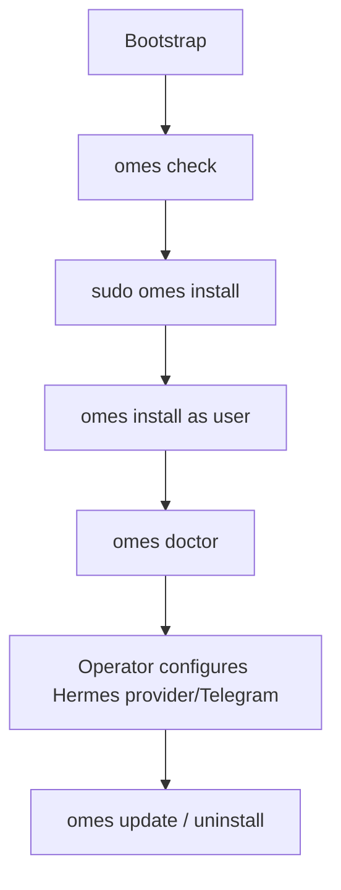

# OMES Installation Guide

> Status: describes the actual repository state (`bin/omes`, `lib/omes/*.sh`,
> `modules/*/module.sh`, `profiles/*.profile`, `install/bootstrap.sh`, as they exist
> in this repository today). OMES is an independent, MIT-licensed,
> **Omarchy-inspired** compatibility layer for Ubuntu Server 24.04 LTS and Linux
> Mint 22.x, with [Hermes Agent](https://hermes-agent.nousresearch.com/) as the
> automation layer. It is **not** official Omarchy — see
> [docs/branding-and-trademarks.md](branding-and-trademarks.md).
>
> This is the complete operator walkthrough for a clean machine, for both
> profiles. Every privileged (`sudo`) command below is explained: what it does and
> why. For symptom-driven recovery, see [docs/troubleshooting.md](troubleshooting.md).
> For the full flag/exit-code/JSON reference, see [docs/cli.md](cli.md). For every
> environment variable, see [docs/configuration.md](configuration.md).

## 1. Supported vs. unsupported configurations

**Supported (tested in CI containers; Tier 1 targets get a VM pass too — see
[docs/compatibility-matrix.md](compatibility-matrix.md)):**

| Target | Tier | Profile |
|---|---|---|
| Ubuntu Server 24.04 LTS, amd64 | 1 | `server` |
| Linux Mint 22.x, amd64 | 1 (desktop) | `desktop` |
| Ubuntu Server 22.04 LTS, amd64 | 2 | `server` |
| Ubuntu 24.04/22.04 Desktop, amd64 | 2 (desktop profile) | `desktop` (Mint is the validated Tier 1 target) |
| Any of the above, arm64 | 3, best-effort | either |

**Unsupported — `omes check`/`omes install` exit 3 before any mutation:**
Debian, Pop!_OS, Zorin OS, elementary OS, Linux Mint 21.x or LMDE, Fedora, WSL (any
distro), and any architecture other than `amd64`/`arm64`. See
[docs/compatibility-matrix.md §2.4](compatibility-matrix.md#24-explicitly-unsupported-distributions-with-rationale)
for why each of these is excluded rather than merely untested.

**Not implemented yet:** a `--enable-ssh`/`--rootless` CLI flag (use the
`OMES_ENABLE_SSH=1`/`OMES_DOCKER_ROOTLESS=1` environment variables instead — see
[docs/configuration.md](configuration.md)); real VM-based reboot/desktop-session
testing beyond the container matrix (`tests/vm/`, tracked in issue #15's follow-on
work); a `hermes-gateway-system` `MODULE_REQUIRES` edge onto the user-scope
`hermes` module (cross-scope dependencies cannot be expressed — see
[docs/architecture.md §13](architecture.md#13-non-goals-and-known-limitations)).

## 2. What gets written where

| Location | Contents | Mode |
|---|---|---|
| `/var/lib/omes/` (root scope) | State file, backups, logs | `0700` dir, `0600` files |
| `${XDG_STATE_HOME:-$HOME/.local/state}/omes/` (user scope) | Same, for user-scope modules | `0700` dir, `0600` files |
| `<state-dir>/state` | `key=value` lines: `omes.version`, `omes.profile`, `module.<name>.status`/`applied_at`/`version`/`managed_paths`/`installed_packages` | `0600` |
| `<state-dir>/backups/<UTC timestamp>/` | `MANIFEST` (sha256 + path per file), `META` (version/module/reason), copies of every backed-up file | `0700` dir; `.env`-named files always copied at `0600` |
| `<state-dir>/logs/omes-<UTC timestamp>.log` | One line per log event for that invocation | `0600`-ish (created by the process; no stricter guarantee documented) |
| `~/.local/share/omes/omes.git` — actually `~/.local/share/omes` (`OMES_INSTALL_DIR`) | The cloned OMES repository (bootstrap only) | operator's normal umask |
| `~/.local/bin/omes` | Symlink to `<install dir>/bin/omes` | operator's normal umask |

**Managed files per module** (derived from every `omes_manage_path` call — the
mechanism that makes a path backed-up/restorable/removable by `omes uninstall`):

| Module | Managed paths |
|---|---|
| `apt-base` | None (only installs packages; tracked in `module.apt-base.installed_packages`). |
| `security-baseline` | `/etc/apt/apt.conf.d/52omes-unattended-upgrades`, `/etc/systemd/journald.conf.d/omes.conf`. |
| `containers` | `/etc/apt/keyrings/docker.asc`, `/etc/apt/sources.list.d/docker.sources`. |
| `hermes` | `${XDG_DATA_HOME:-~/.local/share}/omes/hermes-path.sh`, `~/.bashrc`, `~/.profile` (marker-delimited append only). **Never** `$HERMES_HOME/.env` — see §5. |
| `hermes-gateway` | `~/.config/systemd/user/hermes-gateway.service.d/omes-path.conf`. |
| `hermes-gateway-system` | `/etc/systemd/system/hermes-gateway.service.d/omes-path.conf`. |
| `desktop-preflight` | None (read-only checks only). |
| `hyprland-session` | `/usr/share/wayland-sessions/omes-hyprland.desktop`, `/usr/local/bin/omes-hyprland-session`. |
| `desktop-config` | `~/.config/{hypr,waybar,foot}/*` (per-file, only if newly created or overwritten with `--yes`), `~/.config/omes/shell.sh`, `~/.bashrc` (marker-delimited append only). |

## 3. Server install — Ubuntu Server 24.04 (also works on 22.04)

Run on a freshly provisioned host, as your own non-root user with `sudo` access.

### 3.1 Bootstrap

```console
$ curl -fsSL https://raw.githubusercontent.com/ahliweb/omes/main/install/bootstrap.sh | bash
```

**Privileged command this may run, and why:** only if `git` is missing,
`install/bootstrap.sh` runs `sudo apt-get update` and
`sudo DEBIAN_FRONTEND=noninteractive apt-get install -y --no-install-recommends git`
— both printed before they run, and both no-ops if `git` is already present.
Everything else (cloning to `~/.local/share/omes`, symlinking
`~/.local/bin/omes`) runs as your own user. The script never installs an OMES
module; it hands off to `omes check` and prints the next commands.

### 3.2 Check (no mutation)

```console
$ omes check --profile server
```

Detects the OS/arch/tier. Root-scope modules (`apt-base`, `security-baseline`)
report `requires root privilege` and are listed as **skipped, not failed** — this
is expected on a first, non-root run. User-scope modules (`hermes`,
`hermes-gateway`) run their real preflight. Exit 4 here means a real problem
(e.g. a package unavailable in the configured repositories); exit 0 with
skipped root-scope modules is the normal non-root result.

### 3.3 Install as root

```console
$ sudo omes install --profile server --dry-run --yes   # preview, no mutation
$ sudo omes install --profile server --yes
```

**What runs as root, and why:**

- `apt-base` installs baseline CLI tooling (`curl`, `git`, `python3`, `jq`, `ufw`,
  ...) — root is required to install system packages.
- `security-baseline` enables `ufw` (`default deny incoming` / `default allow
  outgoing`, with SSH kept open first — see [docs/security.md §3](security.md)),
  installs `unattended-upgrades` for the security pocket only, and writes a
  journald log-size drop-in. All of these require root: firewall rules, apt
  installs, and `/etc`-rooted config are not something a non-root user can do.

`--dry-run` first is the recommended habit — it prints every planned command
(prefixed `[dry-run] would run:`) and mutates nothing. `hermes`/`hermes-gateway`
are silently skipped in this invocation (they are user-scope); the command prints
the exact follow-up.

### 3.4 Install as your own user

```console
$ omes install --profile server --yes
```

Installs the Hermes Agent CLI and its gateway **for the invoking user, never as
root** (`hermes`/`hermes-gateway` refuse outright — exit 5 — if run as root).
This is the exact command `sudo omes install --profile server` printed as its
follow-up.

### 3.5 Post-install verification

```console
$ omes doctor              # as your user: verifies hermes, hermes-gateway
$ sudo omes doctor         # as root: verifies apt-base, security-baseline (+ containers if installed)
$ omes status --json | jq '.modules'
```

`omes doctor` runs OK/WARN/FAIL checks: platform tier, required commands, state
dir/file permissions, every applied module's `module_verify` (plus its optional
`module_doctor` hook), backup availability, and log-directory writability. Exit 0
unless something is FAIL. A module that needs the other privilege level to verify
reports `WARN "requires root to verify"` / `WARN "must not run as root to
verify"` — not a failure.

**Green-signal caveat (read before trusting "it works"):** `hermes-gateway`'s
`module_verify` only proves the *process* is running (`systemctl --user
is-active`), never that the Telegram (or other messaging) connection is actually
alive. It always logs an explicit `WARN` about this — see
[docs/hermes-integration.md part 2, §14](hermes-integration.md) and
[docs/troubleshooting.md](troubleshooting.md).

## 4. Desktop install — Linux Mint 22

Run on a freshly provisioned Linux Mint 22.x host, as your own non-root user with
`sudo` access. Cinnamon is Mint's default session and **is never removed,
disabled, or modified** by OMES — the Hyprland session is a strictly additive,
opt-in second login option.

### 4.1 Bootstrap and check

```console
$ curl -fsSL https://raw.githubusercontent.com/ahliweb/omes/main/install/bootstrap.sh | bash
$ omes check --profile desktop
```

Same bootstrap privileged step as §3.1. `omes check --profile desktop` runs the
full `desktop-preflight` battery **read-only, as your user**: GPU/driver vendor
(Intel/AMD OK, NVIDIA proprietary WARN with driver/`modeset` sub-checks, Nouveau
FAIL, unrecognized FAIL), Mesa/Wayland libraries, display manager, xdg-desktop-portal
backend, RAM (>= 8 GB)/disk (>= 20 GB) minimums, package availability for every
piece of the toolset, and the Cinnamon-session invariant. Nothing is installed by
this step.

**Be honest about package availability:** as of this writing, `hyprland`,
`hypridle`, and `hyprlock` are **not** in Ubuntu 24.04 "noble"'s official archive
(Mint 22.x's base). `omes check --profile desktop` on a stock host will very
likely FAIL preflight (exit 4) naming exactly these packages, with no PPA
allowlisted to work around it — see [docs/linux-mint.md §3](linux-mint.md) and
[docs/packages.md](packages.md). This is not a bug in OMES; it is an honest
report of what apt currently offers. If it fails, stop here until a validated
source exists (a future release, or a reviewed PPA added to `docs/packages.md`)
— OMES never builds Hyprland from source as a workaround.

### 4.2 Install as root

```console
$ sudo omes install --profile desktop --dry-run --yes
$ sudo omes install --profile desktop --yes
```

**What runs as root, and why:** `apt-base` (baseline tooling, same as server) and
`hyprland-session` — which installs the Hyprland/Wayland package set (whatever
passed preflight) and writes an **additive** session entry
(`/usr/share/wayland-sessions/omes-hyprland.desktop`) plus a wrapper script
(`/usr/local/bin/omes-hyprland-session`). Both require root because they touch
system package installs and paths outside any one user's home. Cinnamon's own
session file and LightDM's default-session config are never touched.

### 4.3 Install as your own user

```console
$ omes install --profile desktop --yes
```

Runs `desktop-preflight` again (re-verification) and `desktop-config`, which
templates `~/.config/{hypr,waybar,foot}` and a shell-aliases snippet
(`~/.config/omes/shell.sh`, sourced from `~/.bashrc`). A pre-existing file that
differs from the OMES template is **left alone** (logged, recorded as skipped)
unless you pass `--yes`, which overwrites it after backing it up first.

### 4.4 Log in to the new session

Log out, and at the LightDM login screen choose **"OMES Hyprland"** instead of
"Cinnamon". Cinnamon remains the default and pre-selected option; OMES Hyprland
is the additional entry.

### 4.5 Post-install verification

```console
$ omes doctor
$ sudo omes doctor
```

Same doctor contract as §3.5. `hyprland-session` additionally runs a best-effort
crash report (checks `~/.local/share/hyprland/` and recent
`journalctl --user -b -p err` lines mentioning Hyprland) as part of its
`module_verify`, so a broken session leaves a diagnostic trail even before you
ask.

## 5. Hermes provider/model setup (operator action, no credentials in this repo)

OMES's `hermes` module installs the CLI and the minimum PATH wiring; it
**never** writes a provider API key or Telegram token anywhere, and it registers
`$HERMES_HOME/.env` for backup/restore **only by exception — it does not**: `.env`
is deliberately never passed to `omes_manage_path`, so it is never copied into a
backup, never restored, and never deleted by `omes uninstall` (see
[docs/hermes-integration.md §5](hermes-integration.md)). Provider and model setup
is entirely a manual operator action using the Hermes CLI directly, after the
`hermes` module has applied:

```console
$ hermes config set provider.name <provider>
$ hermes model                        # interactive model picker / current model
$ $EDITOR "$HERMES_HOME/.env"         # add e.g. ANTHROPIC_API_KEY=... yourself
```

For Telegram specifically (also manual, also never automated by OMES):

```console
$ $EDITOR "$HERMES_HOME/.env"
# Add (no wildcards, numeric ids only):
#   TELEGRAM_BOT_TOKEN=<from @BotFather>
#   TELEGRAM_ALLOWED_USERS=<your numeric user id>
#   TELEGRAM_ALLOWED_CHATS=<group chat id>          # both group vars, or neither
#   TELEGRAM_GROUP_ALLOWED_CHATS=<same group chat id>
$ systemctl --user restart hermes-gateway            # allowlists are read only at start
$ modules/hermes-gateway/telegram-allowlist.sh --check
```

See [docs/telegram-security.md](telegram-security.md) for the complete Telegram
security model, chat-id discovery (never `getUpdates` against a running poller),
and the token rotation procedure. `telegram-allowlist.sh add`/`remove` are the
safe, atomic way to edit both allowlist variables together instead of hand-editing
`.env`.

## 6. Upgrading

```console
$ omes update --dry-run     # see whether a fast-forward is even possible
$ omes update                # git fetch + fast-forward-only merge, then re-runs `omes check`
```

`omes update` updates **the OMES checkout itself** via `git` — it never
auto-applies any module. It refuses on a dirty working tree, a detached `HEAD`,
or a diverged/missing upstream (all exit 1), and requires network for the fetch
(exit 8 if offline). After a successful update it re-runs `omes check`, so its
final output on success **is** `omes check`'s output, not a separate schema.
Re-run `omes install --profile <name> --yes` (both scopes) afterward if you want
the updated module code actually applied.

## 7. Uninstalling

```console
$ sudo omes uninstall --dry-run --yes    # preview, root-scope modules
$ sudo omes uninstall --yes              # roll back this scope's applied modules
$ omes uninstall --yes                   # as your user: the profile's user-scope modules
```

`omes uninstall` resolves targets **from state only** — it never touches a module
OMES never recorded as applied. It runs each module's `module_rollback` plus a
generic managed-path rollback (restore a path some backup captured as
pre-existing before OMES touched it; remove a path no backup ever captured, i.e.
OMES created it fresh) in reverse dependency order. Packages a module installed
are always **reported** (with the exact `apt-get remove` command) but never
removed unless you pass `--purge-packages`, and only the ones recorded for that
module. Cinnamon, `$HERMES_HOME`, and `~/.local/bin/hermes` are never touched by
any rollback — see [docs/rollback.md](rollback.md) for the full policy and
per-scenario walkthroughs.

<!-- OMES-MERMAID: docs/installation.md -->

## Visual summary


