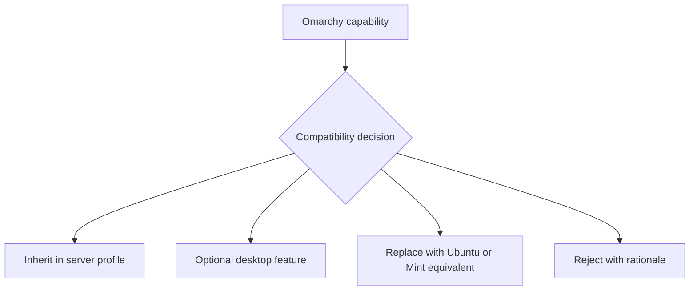

# Omarchy compatibility inventory

> Status: accepted baseline (Phase 0 — Foundation and design decisions)
> Related: [docs/scope.md](scope.md), [docs/research-and-implementation-plan.md](research-and-implementation-plan.md), [Issue #2](https://github.com/ahliweb/omes/issues/2)

## 1. Purpose

This document maps every upstream Omarchy capability area to one of four
decision categories, so that OMES only reproduces what makes sense on an
apt/systemd host and never silently inherits Arch-specific assumptions.
Per-item rationale, package-availability notes, and sources are recorded so
the decision can be revisited as Ubuntu/Mint package availability changes.

### 1.1 Decision categories

- **PORT** — usable as-is (or with only packaging changes) because an
  Ubuntu/Mint package (or an install method OMES already trusts) exists.
- **ADAPT** — the underlying capability is kept, but OMES re-implements it
  for apt/systemd rather than reusing Omarchy's Arch-specific mechanism.
- **DEFER** — plausible for a later release; not part of the MVP.
- **REJECT** — never implemented by OMES, because it depends on a mechanism
  OMES explicitly excludes (see [docs/scope.md §4, non-goals](scope.md)) or
  because it would overstate what OMES can guarantee.

### 1.2 How to read the table

Each row gives: the capability area, the decision, rationale, an honest
note on Ubuntu/Mint package availability (marked "verify per release" where
the package's presence, version, or currency in the Ubuntu/Mint archives has
not been confirmed against a specific release at the time of writing), which
OMES profile(s) it applies to, and a source link.

## 2. Inventory

| Capability area | Decision | Rationale | Ubuntu/Mint package availability | Profile | Source |
|---|---|---|---|---|---|
| Hyprland compositor | ADAPT | Core of Omarchy's desktop experience, but Ubuntu/Mint do not ship it as a first-party package at the same pace as Arch; OMES installs it as an opt-in, preflight-gated desktop session rather than a mandatory base | Not in Ubuntu/Mint main archives as of writing; typically via a third-party PPA or the Hyprland project's own build instructions — verify per release, and preflight Mesa/Wayland/kernel support before install | desktop | [Hyprland Installation](https://wiki.hypr.land/Getting-Started/Installation/), [Omarchy Manual](https://omarchy.org/manual/) |
| Quickshell / Waybar status bar | ADAPT | Omarchy's shell/bar stack is Hyprland-integrated; OMES reuses the bar concept (status, workspaces, tray) but must select whichever of Waybar/Quickshell is reliably packaged | Waybar is packaged in Ubuntu universe (verify per release); Quickshell is newer and less consistently packaged — verify per release, may require a PPA or DEFER to Waybar only | desktop | [Omarchy Manual](https://omarchy.org/manual/) |
| Walker launcher | DEFER | Application launcher is a nice-to-have for the desktop profile; not required for MVP parity with the server-first rollout | Not confirmed in Ubuntu/Mint archives — verify per release | desktop | [Omarchy Manual](https://omarchy.org/manual/) |
| Terminal emulator (Alacritty / Ghostty / foot) | PORT | Alacritty and foot are both in Ubuntu's archives; a GPU-accelerated terminal is a low-risk, high-value default for the desktop profile | Alacritty: in Ubuntu universe (verify per release); foot: in Ubuntu universe, Wayland-only (verify per release); Ghostty: newer, packaging varies — verify per release | desktop | [Omarchy Manual](https://omarchy.org/manual/) |
| Shell tooling (zsh/bash, starship, fzf, zoxide, eza, bat, ripgrep, fd, lazygit, lazydocker, btop) | PORT | This is the highest-value, lowest-risk part of the Omarchy workflow: all of these tools are widely packaged for Debian/Ubuntu and provide immediate value on a headless server as well as a desktop | All listed tools are in Ubuntu universe/main in recent releases (verify exact versions per release; `bat`/`fd` may be installed as `batcat`/`fdfind` on older Ubuntu and need a compatibility shim) | both | [Omarchy Manual](https://omarchy.org/manual/), [Omakub Manual](https://manual.omakub.org/1/read) |
| Neovim (LazyVim) | PORT | Neovim is packaged for Ubuntu/Mint; LazyVim is a configuration distribution (a git-based config template), not a binary package, so OMES templates the config rather than "installing LazyVim" | Neovim in Ubuntu universe (verify per-release version is recent enough for LazyVim's plugin requirements); LazyVim itself is applied as a templated config, not an apt package | both | [Omarchy Manual](https://omarchy.org/manual/) |
| AI CLIs (Claude Code, etc.) | ADAPT | Individual AI CLIs are optional developer tools OMES can install/document like any other dev tool, but they are not OMES's primary automation layer | Installed per-vendor instructions (npm/curl installers), not from Ubuntu/Mint archives; OMES treats these as optional, documented add-ons | both | [Omarchy AI](https://omarchy.org/manual/ai/) |
| Omarchy's AI menu | REJECT (replaced) | Omarchy's built-in AI menu is Arch/Hyprland-integrated tooling; OMES's automation layer is Hermes Agent, a separate, already-adopted product, so the AI menu itself is not reproduced — its *role* is filled by Hermes, not by porting the menu | N/A — replaced by Hermes Agent | both | [Omarchy AI](https://omarchy.org/manual/ai/), [Hermes messaging gateway](https://hermes-agent.nousresearch.com/docs/user-guide/messaging/) |
| Themes / theme switching | ADAPT | Theme switching (terminal color scheme, bar, wallpaper) is a desktop-experience feature; OMES can template terminal/shell color schemes for both profiles but full visual theming (bar, compositor, wallpaper) only applies where there is a GUI | Implemented via OMES-managed config templates, not an apt package | desktop (terminal color scheme only: both) | [Omarchy Manual](https://omarchy.org/manual/) |
| mise (runtime/tool version manager) | PORT | Directly reusable: mise has an official install script and works identically on any systemd Linux; it is one of the most valuable "developer baseline" pieces of the Omarchy workflow and applies equally to a headless server | Installed via mise's official install script (not from Ubuntu/Mint archives); works on both profiles unmodified | both | research plan §2.1 |
| Dev tools: Docker | ADAPT | Docker is officially supported on Ubuntu; on Mint it works but is not officially supported, so OMES must detect the host and use the underlying `$UBUNTU_CODENAME` repository with an explicit warning rather than claiming parity | Ubuntu: official Docker apt repo, tier-1 support; Mint: works via the Ubuntu codename repo but is not Docker-official — see [docs/scope.md non-goals](scope.md) | both (server: default; desktop: opt-in with warning) | [Docker Ubuntu installation](https://docs.docker.com/engine/install/ubuntu/), [Docker post-install security](https://docs.docker.com/install/linux/linux-postinstall) |
| Dev tools: databases via Docker | ADAPT | Same reasoning as Docker itself; OMES can template common database containers (Postgres, Redis, etc.) but does not manage them outside of Docker | Depends on Docker; images pulled from Docker Hub, not apt | both | research plan §2.4 |
| Dev tools: language runtimes (Node/Ruby/etc.) | PORT | Delivered through mise rather than apt, avoiding Ubuntu's often-stale language-runtime packages | Managed by mise, not apt | both | research plan §2.1 |
| Update channel (`omarchy-update`) | REJECT (Arch-specific mechanism), ADAPT (equivalent capability) | `omarchy-update` assumes pacman semantics; OMES instead provides its own `omes update` built on apt plus its own module versioning — the *capability* (a single, safe update command) is kept, the *mechanism* is not | N/A — `omes update` uses apt directly | both | [Omarchy Updates](https://omarchy.org/manual/updates/) |
| Backup / snapshots (Limine + btrfs snapshots) | REJECT (boot/filesystem snapshot mechanism), ADAPT (file-level backup) | OMES does not manage the bootloader or require btrfs, and taking over boot-time snapshots on an existing host would violate the no-destructive-default policy; instead OMES provides its own file-level backup/restore with manifests and checksums (see [docs/scope.md §5](scope.md)) | N/A — OMES backups are plain file copies under its own state directory, filesystem-agnostic | both | research plan §2.4, §3; [docs/scope.md](scope.md) |
| Security: LUKS / disk encryption | REJECT | OMES installs onto an existing host and does not control how that host's disks were provisioned; claiming to manage LUKS would overstate what OMES can guarantee | N/A — out of scope; operators must configure disk encryption themselves before or independently of OMES | both | [Omarchy Security](https://omarchy.org/manual/security/), [docs/scope.md non-goals](scope.md) |
| Security: firewall / default-deny | ADAPT | The *policy* (default-deny inbound, explicit allow rules, explicit SSH activation) is directly reusable; the *mechanism* is Ubuntu's `ufw` (iptables/nftables frontend) rather than Arch's typical setup | `ufw` is in Ubuntu main / Mint by default | both | [Omarchy Security](https://omarchy.org/manual/security/), research plan §2.4 |
| Security: fingerprint / FIDO2 | DEFER | Valuable for a desktop login flow but not required for MVP; depends on hardware and PAM configuration that needs its own testing pass | `fprintd`/`libfido2` availability varies by hardware — verify per release | desktop | [Omarchy Security](https://omarchy.org/manual/security/) |
| Screenshots / screen recording | ADAPT | Useful desktop convenience; re-implemented with Wayland-native tools compatible with whichever compositor is active (Hyprland or, as a fallback, Cinnamon's own tooling) | Tooling (e.g. `grim`/`slurp` equivalents) availability varies — verify per release | desktop | [Omarchy Manual](https://omarchy.org/manual/) |
| Notifications (mako) | ADAPT | mako is a Wayland-only notification daemon relevant only when the Hyprland session is active; Cinnamon has its own notification stack that OMES does not replace | Packaging availability varies — verify per release | desktop | [Omarchy Manual](https://omarchy.org/manual/) |
| Clipboard | ADAPT | Cross-application clipboard behavior differs between Wayland (Hyprland) and X11/Cinnamon; OMES configures the Wayland-side tooling only for the opt-in Hyprland session | Standard Wayland clipboard utilities, availability varies — verify per release | desktop | [Omarchy Manual](https://omarchy.org/manual/) |
| Idle / lock (hypridle / hyprlock) | ADAPT | Screen-lock and idle policy is a security-relevant desktop feature kept for the opt-in Hyprland session only; Cinnamon's own lock screen remains the default when Hyprland is not selected | Packaging availability varies — verify per release | desktop | [Omarchy Security](https://omarchy.org/manual/security/) |
| Keyboard-first bindings | ADAPT | The keyboard-first philosophy is reusable, but bindings are re-templated for Hyprland's config syntax rather than assuming Arch defaults; shell-level bindings (fzf, zoxide, etc.) already apply on the server profile as part of shell tooling above | N/A — templated config, not a package | desktop (window-manager bindings); both (shell-level bindings, covered under shell tooling) | [Omarchy Manual](https://omarchy.org/manual/) |
| Web apps (site-as-app launchers) | DEFER | A desktop-only convenience feature (launching web services as app-like windows); not required for MVP | N/A — depends on browser-integration tooling, not yet evaluated | desktop | [Omarchy Manual](https://omarchy.org/manual/) |
| Installer / ISO | REJECT | OMES installs onto an existing Ubuntu Server or Linux Mint host; it does not, and will not, produce or maintain a bootable ISO or full-disk installer — this is the clearest boundary between OMES and official Omarchy | N/A | N/A | [Omarchy Getting Started](https://omarchy.org/manual/getting-started/), [docs/scope.md non-goals](scope.md) |

## 3. What the server profile inherits vs. desktop-only

The **server profile inherits**:

- All terminal/TUI tooling (zsh/bash, starship, fzf, zoxide, eza, bat,
  ripgrep, fd, lazygit, lazydocker, btop) and Neovim/LazyVim.
- mise, and therefore Node/Ruby/other language runtimes managed through it.
- Hermes Agent as the automation layer (replacing Omarchy's AI menu role).
- The security and update policy: default-deny firewall via `ufw`, explicit
  SSH activation, and `omes update`/`omes doctor` as the update and health
  workflow.
- The file-level backup/restore/rollback model (replacing Limine/btrfs
  snapshots).

**Desktop-only** (Linux Mint, opt-in Hyprland session):

- Hyprland compositor itself, and the Quickshell/Waybar bar.
- Walker launcher (deferred).
- GUI terminal emulator selection (Alacritty/foot/Ghostty).
- Visual theme switching (bar, wallpaper, compositor look-and-feel).
- Screenshots/screen recording, notifications (mako), Wayland clipboard,
  idle/lock (hypridle/hyprlock), window-manager keybindings, and web-app
  launchers.
- Fingerprint/FIDO2 login (deferred).

Cinnamon remains the default Mint session in all cases; nothing in the
desktop-only list is installed or activated unless the desktop profile is
explicitly selected and preflight passes (see
[docs/scope.md §3.2](scope.md)).

## 4. Related documents

- [docs/scope.md](scope.md) — product boundary and non-goals (Issue #1).
- [docs/compatibility-matrix.md](compatibility-matrix.md) — supported OS/hardware matrix (written in parallel).
- [docs/architecture.md](architecture.md) — module and CLI architecture (written in parallel).
- [docs/security.md](security.md) — threat model and security defaults (written in parallel).
- [THIRD_PARTY_NOTICES.md](../THIRD_PARTY_NOTICES.md) — licensing of referenced upstream projects (Issue #26).

<!-- OMES-MERMAID: docs/omarchy-compatibility-inventory.md -->

## Visual summary

