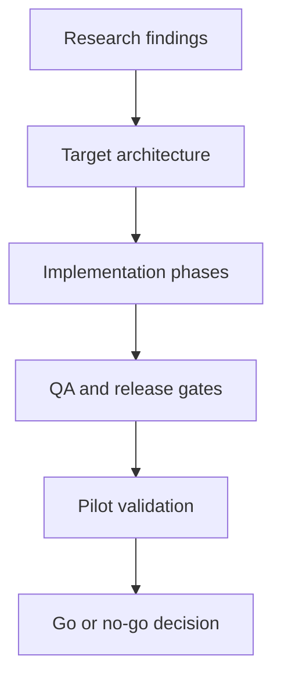

# OMES — Deep Research and Implementation Plan

> Status: research baseline and implementation plan
> Research date: 2026-09-18 (WIB)
> Repository: https://github.com/ahliweb/omes
> Owner: ahliweb / Unggul

## 1. Executive summary

OMES will not attempt to install official Omarchy on Ubuntu Server or Linux Mint. Official Omarchy is an Arch-based distribution built around Hyprland and Quickshell and installed through an ISO. OMES is positioned as an **Omarchy-inspired compatibility layer and deployment toolkit** for Ubuntu Server and Linux Mint, with Hermes Agent as the automation and agentic-operations layer.

Initial product decisions:

- Ubuntu Server LTS: headless, Hermes-first, systemd-based, observable, optional Docker, no GUI by default.
- Linux Mint: optional Hyprland/Wayland desktop profile; Cinnamon remains the fallback session.
- OMES core: idempotent installer, preflight checks, backups, rollback, package mapping, service management, diagnostics, and documentation.
- Hermes: per-user or service-user installation, profile-safe `HERMES_HOME`, optional Telegram gateway, and separate secret configuration.
- All desktop features remain modular because Hyprland introduces dependency drift risk and is not appropriate as a server baseline.

## 2. Technical research findings

### 2.1 Upstream Omarchy

Omarchy combines Arch, Hyprland, Quickshell, Neovim, terminal/TUI workflows, development tools, AI CLIs, themes, update channels, security defaults, and system snapshots. Its product value is not merely a package list; it is an opinionated integration, keyboard-first workflow, and coordinated operating model.

Concepts suitable for OMES:

- opinionated developer baseline;
- terminal/TUI-first workflow;
- mise for runtime and tool version management;
- agents as first-class workflow components;
- theme/configuration layer;
- explicit update, diagnostics, backup, and rollback workflows;
- security-by-default and documented recovery.

Features that must not be copied as assumptions:

- pacman/AUR/Arch mirror behavior;
- Limine snapshot boot flow;
- ISO and full-disk installation;
- any claim that Ubuntu/Mint provides the same dependency or update guarantees.

### 2.2 Ubuntu and Linux Mint feasibility

Ubuntu Server provides schema-validated autoinstall YAML, and its command lists run as root. This is suitable for provisioning a baseline but increases the risk of remote or non-idempotent commands. Autoinstall must therefore be a separate, validated artifact and must not be the only installation path.

Linux Mint is suitable for personal desktop use and provides LTS releases, but desktop dependencies, GPU support, compositor, display manager, portals, and kernel behavior must be tested per release. Mint requires its own compatibility matrix as an Ubuntu derivative.

Hyprland upstream warns that Ubuntu may lag in dependencies and packaged versions. Therefore:

- source builds must not be the default MVP path;
- preflight must check kernel, Mesa, Wayland, GPU, display manager, portal, and session requirements;
- Cinnamon must remain available as a recovery fallback;
- server mode must not depend on Hyprland.

Docker also states that installation on Ubuntu derivatives such as Linux Mint is not officially supported, even though it may work. OMES must detect Mint, provide a warning, and test the selected package path; it must not promise the same Docker support level as Ubuntu.

### 2.3 Hermes Agent

Hermes provides a Linux installer, `hermes setup`, `hermes doctor`, profiles through `HERMES_HOME`, separate `config.yaml` and `.env` secret storage, and a messaging gateway. The gateway supports user services and system services; headless servers can use a system service or a user service with lingering enabled.

Design implications:

- OMES must never place provider or Telegram tokens in the repository.
- Each profile must have an explicit secret and state boundary.
- `hermes config set` is safer than hand-editing YAML.
- `hermes doctor` is a mandatory post-install health check.
- Telegram must use numeric allowlists rather than wildcards by default.
- The gateway service must have an explicit PATH so launchers, Node, ffmpeg, and related tooling are available.
- Agent commands with system impact must remain subject to Hermes approval policies.

### 2.4 Security and operations

Security concepts from Omarchy that can inform OMES include default-deny firewalling, encrypted storage where available, update policy, explicit SSH activation, and recovery paths. However, OMES does not control the bootloader or disk encryption on an existing host; security claims must be limited to settings actually managed by OMES.

The Docker daemon is also sensitive: membership in the `docker` group is effectively root-level access. OMES must not automatically add a user to that group without explicit opt-in and a risk warning. Defaults should be:

1. `sudo docker` for ordinary hosts;
2. rootless Docker when requirements are met;
3. the `docker` group only through explicit opt-in.

## 3. Target architecture

```text
omes/
├── README.md
├── LICENSE
├── docs/
│   ├── research-and-implementation-plan.md
│   ├── architecture.md
│   ├── ubuntu-server.md
│   ├── linux-mint.md
│   ├── hermes-integration.md
│   ├── security.md
│   ├── rollback.md
│   └── troubleshooting.md
├── install/
│   ├── bootstrap.sh
│   ├── preflight.sh
│   ├── ubuntu-server.sh
│   ├── linux-mint.sh
│   ├── desktop.sh
│   └── hermes.sh
├── modules/
│   ├── apt/
│   ├── hermes/
│   ├── services/
│   ├── desktop/
│   ├── developer-tools/
│   ├── containers/
│   └── security/
├── config/
│   ├── hypr/
│   ├── waybar/
│   ├── foot/
│   ├── shell/
│   └── nvim/
├── tests/
│   ├── unit/
│   ├── integration/
│   ├── vm/
│   └── fixtures/
└── .github/workflows/
    ├── lint.yml
    └── compatibility.yml
```

Dependency principles:

- `preflight` performs no mutation;
- `install` calls only modules that pass preflight;
- every module has `check`, `apply`, `verify`, and, where practical, `rollback` operations;
- OMES state is tracked explicitly rather than inferred from file contents;
- root operations are separated from user operations;
- user configuration is backed up before it is managed;
- output is available in human-readable and JSON formats.

## 4. Implementation phases

### Phase 0 — Foundation and design decisions

Issues: #1, #2, #3, #4, #5, #18, #26

Deliverables:

- scope and non-goals;
- feature inventory and compatibility matrix;
- threat model;
- module architecture;
- naming, licensing, and third-party notices;
- README and contribution rules.

Gate: no production installer work begins until the OS matrix, threat model, and rollback policy are approved.

### Phase 1 — Preflight and core installer

Issues: #6, #9, #10, #14

Deliverables:

- `omes check`;
- OS, version, and architecture detection;
- privilege, network, disk, display, and GPU checks;
- dry-run mode;
- structured logging;
- idempotent package installation;
- backup manifest;
- rollback and uninstall;
- stable exit codes.

Acceptance:

- fresh installation and re-run converge to the same state;
- unsupported operating systems stop before mutation;
- partial failures identify the failed module;
- restore can be tested without an internet connection.

### Phase 2 — Ubuntu Server profile

Issues: #7, #12, #16, #17

Sequence:

1. base packages and time/network checks;
2. Hermes with a per-user or dedicated service user;
3. `hermes doctor`;
4. gateway service with systemd;
5. journald, log rotation, and health command;
6. explicit firewall and SSH policy;
7. optional Docker with a rootless-first evaluation;
8. reboot and recovery testing.

Acceptance:

- the service is running after reboot;
- credentials do not appear in process arguments or logs;
- operators can inspect status and journal logs;
- Telegram is not enabled without explicit setup;
- installation does not require a GUI.

### Phase 3 — Linux Mint desktop profile

Issues: #8, #9, #10, #15, #17

Sequence:

1. back up Cinnamon and session configuration;
2. preflight GPU, kernel, Mesa, Wayland, portal, and display manager;
3. install compositor/session components from supported sources;
4. configure terminal, launcher, notifications, clipboard, idle, and screenshots;
5. create the Hyprland session entry;
6. retain Cinnamon as a fallback;
7. verify login, logout, suspend, multi-monitor, screen sharing, and recovery.

Acceptance:

- Cinnamon remains selectable;
- login failure does not make the host unusable;
- configuration can be restored;
- unsupported GPUs produce clear warnings.

### Phase 4 — Hermes workflow and Telegram

Issues: #11, #12, #13, #14

Deliverables:

- provider-neutral installer;
- profile-safe state;
- CLI diagnostics;
- gateway service;
- Telegram allowlist;
- group/topic isolation guidance;
- secret rotation and backup policy.

Acceptance:

- `hermes doctor` is clean or produces actionable warnings;
- gateway status can be proven through systemd;
- Telegram tests succeed only for authorized identities;
- backups contain no tokens.

### Phase 5 — QA and release

Issues: #15, #16, #17, #27

Minimum test matrix:

- Ubuntu Server 24.04 amd64 VM;
- Ubuntu Server 22.04 amd64 if retained;
- Linux Mint 22.x amd64 VM or physical test;
- fresh installation;
- re-run;
- reboot;
- unavailable network;
- package failure;
- broken-session rollback;
- secret scanning;
- ShellCheck;
- CI smoke test.

Release gates:

- no secret in the tree or history;
- no destructive default;
- documented rollback;
- success evidence for every supported profile;
- issue severity and known limitations published;
- business pilot with a measurable success threshold.

### Phase 6 — Control Center and service entitlements

Issues: [#89](https://github.com/ahliweb/omes/issues/89), [#90](https://github.com/ahliweb/omes/issues/90), [#91](https://github.com/ahliweb/omes/issues/91), [#92](https://github.com/ahliweb/omes/issues/92)

This is a companion control-plane track, not a replacement for the native CLI or Hermes. It defines the AWCMS/awcms-one boundary, authenticated allowlisted jobs, idempotency, desired/observed deployment state, tenant scope, service catalog, subscription, and entitlement enforcement. Herman is used only as a UX reference for navigation, deployment cards, session/usage views, streamed job output, confirmation and maintenance workflows; it is not imported as a runtime or execution boundary.

Gate:

- no arbitrary shell endpoint;
- job replay is idempotent;
- all mutations are audited and reconciled;
- Control Center outage does not stop an already-healthy local Hermes deployment;
- RLS/ABAC and secret-reference requirements are tested.

### Phase 7 — Billing and reporting

Issues: [#93](https://github.com/ahliweb/omes/issues/93), [#94](https://github.com/ahliweb/omes/issues/94), [#95](https://github.com/ahliweb/omes/issues/95)

Deliverables:

- manual invoice and immutable billing ledger;
- recurring billing adapter contract;
- signed payment webhooks with replay protection;
- grace period and suspension policy;
- prorated changes and refund semantics;
- operational, usage, billing, and revenue projections.

Gate:

- provider events are processed outside database transactions;
- payment state cannot be mistaken for deployment or domain success;
- financial records are immutable and reconciliable;
- reports identify freshness and rebuild scope.

### Phase 8 — Domain and GitHub provider integrations

Milestone: [Domain and Integration Services](https://github.com/ahliweb/omes/milestone/8)

Issues: [#98](https://github.com/ahliweb/omes/issues/98), [#99](https://github.com/ahliweb/omes/issues/99), [#100](https://github.com/ahliweb/omes/issues/100), [#101](https://github.com/ahliweb/omes/issues/101), [#102](https://github.com/ahliweb/omes/issues/102)

Deliverables:

- provider-neutral registrar and DNS contracts;
- capability matrix and manual fallback;
- Cloudflare Registrar/DNS for supported international extensions;
- SRS-X `.id` registration, renewal, and document workflow where the reseller account supports them;
- GitHub App, repository, webhook, Actions, and provenance integration;
- domain billing, renewal reminders, and provider reconciliation.

Gate:

- price and capability snapshots are immutable at checkout;
- unsupported API operations are visible manual tasks;
- provider actions are idempotent and externally reconciled;
- PII, domain contacts, and `.id` documents have tenant-scoped encryption/retention controls;
- no live provider credential is required for default CI tests;
- Herman-inspired UI passes the adopt/adapt/observe/reject fit matrix and never bypasses the #89/#90 job boundary.

### Phase 9 — Isolation and multi-server operations

Issues: [#96](https://github.com/ahliweb/omes/issues/96), [#97](https://github.com/ahliweb/omes/issues/97)

Deliverables:

- rootless Docker Compose worker backend;
- optional Coolify adapter;
- provenance, health, resource, backup, and rollback integration;
- multi-server reconciliation.

Gate:

- native systemd remains the default;
- privileged Docker access is not granted implicitly;
- Coolify is optional and does not become OMES's source of truth;
- disposable-host and fake-provider tests cover failure and rollback paths.

- [docs/web-panel-reference-evaluation.md](web-panel-reference-evaluation.md) — Herman reference-only fit matrix and web security adaptations.
- [ADR-0016](adr/0016-herman-web-panel-reference.md) — Herman UX reference decision.

## 5. Business research and recommendations

### 5.1 Priority ICP

Validation order:

1. ahliweb internal operators and workstations;
2. freelancers and developers who want a reproducible setup;
3. web/digital agencies with multiple workstations or servers;
4. small teams that need an internal Hermes assistant;
5. self-hosters and education labs.

Problems to validate rather than assume:

- Linux developer setup takes too long;
- AI agent and gateway configuration is difficult to reproduce;
- small teams lack dedicated DevOps capacity;
- users want Ubuntu/Mint stability while preferring keyboard-first workflows;
- setup and support cost less than the engineering time currently lost.

### 5.2 Positioning

Recommended positioning:

> OMES is an open-source deployment layer that makes Ubuntu Server and Linux Mint ready for Hermes-based development and operations, with an Omarchy-inspired workflow that remains reversible and respects the host platform.

Do not claim that OMES is an official Omarchy product or use “Omarchy for Ubuntu” as an affiliation claim. Use “Omarchy-inspired” or “compatibility layer” and explain the technical differences.

### 5.3 Business models to test

- open-source core: installer, profiles, documentation, and tests;
- paid setup and migration;
- support subscription: updates, backups, incident response, and troubleshooting;
- business hardening: allowlists, isolated profiles, logging, backups, and policy;
- custom integrations: Telegram, GitHub, Docker, internal tools, and provider routing;
- training and workshops: Linux and AI-agent operations for small teams.

MVP commercial recommendation: do not start with SaaS or hosting. Use OMES as a **productized-service delivery engine**, then measure implementation time and support cost before introducing a subscription.

### 5.4 Unit economics to measure

Track during every pilot:

- preflight time;
- installation time;
- troubleshooting time;
- number of manual interventions;
- rollback count;
- compute, API, and support cost;
- Hermes onboarding time;
- monthly maintenance time;
- willingness to pay and objections.

Basic formulas:

```text
gross contribution = revenue - delivery labor - infrastructure - variable support cost
payback months = acquisition/setup cost / monthly gross contribution
support burden = support hours / active deployment / month
```

No market-size or final pricing figure may be treated as fact before customer discovery.

### 5.5 Main business risks

- Ubuntu/Mint/Hyprland maintenance matrix becomes too expensive;
- upstream desktop changes outpace maintenance capacity;
- installer incidents damage an existing host;
- users mistake OMES for an official Omarchy or Hermes product;
- AI provider pricing and availability change;
- agent or Docker access creates a security incident;
- the desktop value proposition is indistinguishable from ordinary dotfiles.

Mitigations:

- focus first on Hermes/server reliability;
- make the desktop profile opt-in;
- maintain a strict compatibility matrix;
- use reproducible VM tests;
- require backup and rollback;
- keep security claims conservative;
- base paid offerings on support and operational outcomes.

## 6. 30/60/90-day priorities

### Days 0–30

- complete #1–#5;
- create the README and architecture document;
- implement preflight;
- implement Ubuntu Server dry-run and check;
- validate Hermes installation and service operation;
- run the first internal pilot.

### Days 31–60

- implement the idempotent server installer;
- add rollback and diagnostics;
- add CI linting and secret scanning;
- document the secure Telegram profile;
- begin the Linux Mint profile on one hardware target or VM;
- interview prospective users and capture evidence.

### Days 61–90

- stabilize the desktop profile;
- add the compatibility matrix and regression VM;
- release an alpha;
- run 2–5 controlled pilots;
- calculate support burden and unit economics;
- decide whether paid setup/support is viable.

## 7. Go/no-go criteria

Proceed to alpha when:

- Ubuntu Server installation, re-run, reboot, and rollback are tested;
- Hermes service and health check work;
- secret boundaries are validated;
- another operator can follow the documentation;
- no destructive default exists;
- one internal pilot completes a real workflow.

Delay the desktop release when:

- Hyprland requires a fragile source build;
- Cinnamon fallback is not guaranteed;
- screen sharing, portals, or GPU support are unstable;
- the support matrix cannot be maintained.

Delay monetization when:

- support time exceeds setup value;
- customers show no willingness to pay;
- positioning is not meaningfully different from dotfiles or Ansible;
- cross-distro maintenance cannot be covered by service revenue.

## 8. Primary sources

1. Omarchy Manual — https://omarchy.org/manual/
2. Omarchy Getting Started — https://omarchy.org/manual/getting-started/
3. Omarchy Security — https://omarchy.org/manual/security/
4. Omarchy Updates — https://omarchy.org/manual/updates/
5. Omarchy AI — https://omarchy.org/manual/ai/
6. Omarchy upstream repository — https://github.com/omacom/omarchy
7. Hyprland Installation — https://wiki.hypr.land/Getting-Started/Installation/
8. Ubuntu Autoinstall reference — https://ubuntu.com/server/docs/install/autoinstall-reference/
9. Ubuntu Automatic Updates — https://ubuntu.com/server/docs/how-to/software/automatic-updates/
10. Linux Mint FAQ — https://linuxmint.com/faq.php
11. Docker Ubuntu installation — https://docs.docker.com/engine/install/ubuntu/
12. Docker Linux post-install security — https://docs.docker.com/install/linux/linux-postinstall
13. Hermes installation — https://hermes-agent.nousresearch.com/docs/getting-started/installation
14. Hermes messaging gateway — https://hermes-agent.nousresearch.com/docs/user-guide/messaging/
15. Hermes Telegram — https://hermes-agent.nousresearch.com/docs/user-guide/messaging/telegram
16. Hermes configuration — https://hermes-agent.nousresearch.com/docs/user-guide/configuration
17. Omakub Manual — https://manual.omakub.org/1/read

## 9. Research limitations

- There is no customer, revenue, CAC, churn, or willingness-to-pay data for OMES; those business decisions remain hypotheses.
- Compatibility claims must be proven through VM or hardware testing, not only upstream documentation.
- OS, Hyprland, Docker, and Hermes versions change; CI and periodic review are required to keep the plan current.
- This research is not a formal security audit and does not claim that an agent is always safe.

<!-- OMES-MERMAID: docs/research-and-implementation-plan.md -->

## Visual summary



