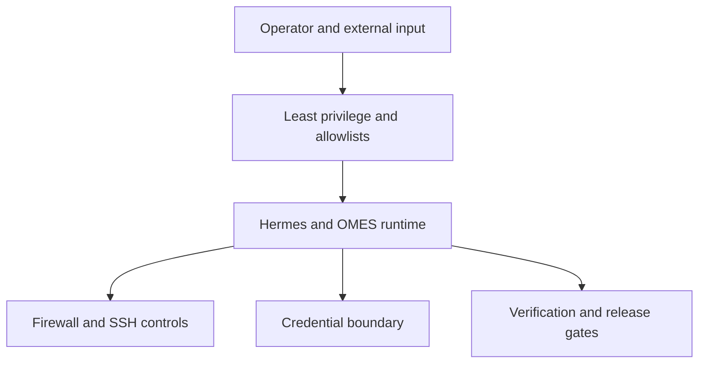

# OMES Security Baseline

> Status: implemented. Companion to [`docs/threat-model.md`](./threat-model.md). Every
> control below is implemented in this repository's `bin/omes`, `lib/omes/*.sh`, and
> `modules/*/module.sh` unless marked **operator-responsibility** (OMES documents/warns
> but cannot enforce it) or **out-of-scope** (see §8). Each row/section names the file
> that implements it so a claim here can be checked directly against code.
>
> For the operator-facing deployment runbook these controls apply to
> (paths, permissions, Telegram allowlists, hardening profiles, exposure
> audit, backups), see [docs/hermes-deployment-guide.md](hermes-deployment-guide.md).

## 1. Least-privilege defaults

These are the defaults OMES ships with. Any deviation requires an explicit operator
opt-in flag/env var, and every opt-in stays visible in `omes status`/`omes doctor` output
for as long as it is active (docs/threat-model.md T06).

| Area | Default | Opt-in escape hatch | Implemented in |
|------|---------|----------------------|---------------------|
| Installer scope separation | Root-scope modules refuse to run as non-root (exit 5); user-scope modules refuse to run as root (exit 5). No module is ever both. | None — this is a hard invariant of the module contract | `lib/omes/module.sh` (`run_checks`/`run_apply`), `bin/omes` (`_omes_check_explicit_module_scope`) |
| Docker access | `sudo docker` by default; rootless Docker via an explicit opt-in | `OMES_DOCKER_ROOTLESS=1` (installs `docker-ce-rootless-extras`, prints the setup command, never runs it); `--allow-docker-group` (prints a root-equivalence warning, recorded in state) | `modules/containers/module.sh` |
| Hermes runtime user | `hermes` (and its gateway) run as the unprivileged user who installed it, never as root | `sudo omes install --module hermes-gateway-system` (still runs the gateway process as a dedicated service account, never root) | `modules/hermes/module.sh`, `modules/hermes-gateway/module.sh`, `modules/hermes-gateway-system/module.sh` |
| Secrets on disk | `$HERMES_HOME/.env` mode `0600`, owned by the running user; never registered for backup/restore/rollback | None | `modules/hermes/module.sh` (`_hermes_ensure_env_file`) |
| State directory | `/var/lib/omes/` (root scope) or `${XDG_STATE_HOME:-$HOME/.local/state}/omes/` (user scope), mode `0700` | `OMES_STATE_DIR` override (testing) | `lib/omes/core.sh` (`omes_state_dir`), `lib/omes/state.sh` (`state_init`) |
| Installer & Bootstrap (issue #169) | Defaults to immutable pinned release tag (`v0.4.0`), never mutable `main`; explicit `stable`/`rc`/`edge`/`dev` channels; validates git remote origin URL before mutation; refuses to overwrite dirty/uncommitted checkout (exit 5); removes error-suppressing `|| true`; writes `.omes-channel.json` provenance record | `--allow-unverified-origin` for custom testing/mirrors; `--channel dev` to preserve local developer worktrees | `install/bootstrap.sh`; see [`docs/installation.md`](./installation.md) |
| Backups | `<state-dir>/backups/<timestamp>/`, mode `0700`; files inside preserve source mode (`.env` stays `0600`) | None | `lib/omes/backup.sh` |
| Telegram/API bind address | Upstream Hermes's own gateway binding, not configured by OMES | N/A — OMES does not itself open a network listener | operator-responsibility (upstream Hermes) |
| sudo | OMES never writes a NOPASSWD sudoers entry for any account | None — out of scope for any automated escape hatch | audited by review + `scripts/check-supply-chain.sh` (CI) |
| Hermes gateway systemd hardening | Off (`OMES_HERMES_HARDENING=off`); no resource limits or sandboxing beyond the base unit | `OMES_HERMES_HARDENING=conservative` (recommended) or `=strict` (documented compatibility trade-offs); see [`docs/hermes-hardening.md`](./hermes-hardening.md) | `modules/hermes-gateway/hardening.sh` |
| Hermes data-class backup | Default (no arguments, and `omes agent apply`'s automatic pre-mutation backup) is `omes-host`/`config`+`skills` only; `sessions`/`memory` (legacy classes) and the native `portable-profile`/`full-runtime-dr` recovery classes (both of which upstream Hermes documents as always including session state) are refused with a stable reason code (`BACKUP_RESTRICTED_SCOPE_REQUIRES_OPT_IN`) unless explicitly opted into; `secrets` never backed up by default | `--allow-restricted-scope` (issue #235; required for `sessions`/`memory`/`portable-profile`/`full-runtime-dr`, on both create and restore); `--include-secrets` (create) / `--restore-secrets` (restore), both printing a warning | `lib/omes/py/hermesbackup/restricted_scope.py`, `lib/omes/py/hermesbackup/` (`omes agent-backup`); see [`docs/hermes-backup.md`](./hermes-backup.md) section 3a |
| Agent deployment privilege | `serviceMode: user` refused as root; `serviceMode: system` refused as non-root (exit 5 either way, no mutation); manifests never contain a secret value, only reference names | None — hard invariant of `omes agent apply`/`rollback` | `lib/omes/py/agent/cli.py` (`_check_privilege`), `lib/omes/py/agent/manifest.py`; see [`docs/agent-deployment.md`](./agent-deployment.md) |
| Agent Compose backend (`spec.backend: "compose"`) | Requires a rootless Docker daemon (refused before any mutation otherwise); Docker socket never mounted into the agent container; no privileged/host-PID/host-network; bind mounts confined to the agent's own state directory; port binds loopback-only; images pinned by digest only | None — OMES never adds the operator to the `docker` group and never runs `sudo` for this backend | `lib/omes/py/agent/compose_preflight.py`, `lib/omes/py/agent/compose.py` (`validate_compose_spec`); see [`docs/agent-deployment.md` section 8](./agent-deployment.md) |

| Compatibility evidence collection (`omes health versions`, issue #83) | Read-only, argv-safe, timeout-bounded probes only; never reads `$HERMES_HOME/.env`; only a fixed non-secret Hermes config key allowlist may be queried; never dumps `os.environ` | None — the allowlist and the `.env` exclusion are hard invariants, not configurable | `lib/omes/py/provenance/versions.py`, `lib/omes/versions.sh` (see `docs/compatibility-evidence.md`) |
| Supply-chain provenance audit (`omes audit provenance`, issue #84) | Read-only; never executes a discovered skill/plugin/MCP executable (stat/hash only); a recorded checksum mismatch fails closed (`FAIL`, exit 7); never records a credential | None — fail-closed on mismatch and never-execute are hard invariants | `lib/omes/py/provenance/{record,audit}.py`, `lib/omes/cmd/audit-provenance.sh` (see `docs/provenance.md`) |

| Content distribution (optional; issues #63–#70) | `content/sessions/<platform>/` mode `0700`, created only by a platform worker's own `prepare`/`bootstrap-session` op; never referenced by `reports.py`/export/audit/backup code; publish approval-gated by default with an immutable artifact-hash binding and staleness expiry; each `publish` call scoped to one platform | Fully automatic (no-approval) publishing is out of scope for this repository — not offered as a flag | `lib/omes/py/content/{paths,jobs,workers/base,reports}.py`; see `docs/content-threat-model.md` |

| Graphify semantic extraction & vault export | `omes graphify run`/`sync` default to local, code-only AST extraction (no network call, no credential read); `omes graphify export` writes only under an OMES-owned vault subdirectory, never `.obsidian/` or unrelated notes; `.graphifyignore`/`.gitignore` safe defaults ship via `omes graphify init-ignore` | `--mode semantic` + `OMES_GRAPHIFY_PROVIDER_ENV=<VAR>` (names, never stores, a provider credential) to opt into a semantic pass — see docs/graphify-privacy.md | `lib/omes/cmd/graphify.sh`, `lib/omes/py/graphify/{obsidian,sync}.py`, `docs/graphify-privacy.md` |

## 2. Telegram policy

Telegram is the primary remote-control surface for Hermes, and it is internet-facing by
construction (long-polling reaches every Telegram user, not just the operator, until an
allowlist filters them out). OMES's Telegram posture:

- **Numeric allowlists only, no wildcards.** `TELEGRAM_ALLOWED_USERS` must contain explicit
  numeric Telegram user IDs. Any documentation, setup helper, or default that would leave the
  DM surface open to unrecognized users is treated as a defect.
- **Both group allowlist variables must be set together.** `TELEGRAM_ALLOWED_CHATS` and
  `TELEGRAM_GROUP_ALLOWED_CHATS` must both list every allowed group. A group listed in only
  one is "half-enabled" and behaves inconsistently — any OMES-provided helper for adding a
  group writes both atomically, preserving file mode and owner, and never restarts the
  gateway as part of that write.
- **Restart required.** Allowlists are read once, at gateway start. Editing `.env` while the
  gateway is running changes nothing until it restarts. Documentation and any setup flow must
  say this explicitly rather than let an operator "test" an edit against a stale process.
- **`getUpdates` is prohibited against a running polling gateway.** Calling it causes a 409
  Conflict and can steal updates from the real poller. Chat discovery must use `getChat`,
  `getChatMember`, `getChatMemberCount`, or an observer pattern that records rejected-message
  metadata — never `getUpdates`, and never `setWebhook`/`deleteWebhook` on a polling
  deployment.
- **Mention policy.** Group behavior (whether the bot requires an explicit mention/reply to
  act) and the DM policy for unpaired senders (`unauthorized_dm_behavior`: ignore vs.
  pairing-code reply) must be documented per deployment, with pairing codes always delivered
  out-of-band (e.g., a DM to the owner) — never displayed on a surface the agent itself can
  read back.
- **Token handling.** The bot token is a secret (§5) and is never embedded in a hand-typed
  URL, printed to stdout, or passed as a CLI argument; Telegram API calls go through the
  Hermes CLI/tooling, not ad hoc `curl`.

Implementing issue: #13 (depends on #5, #11, #12).

## 3. Firewall and SSH policy

Applies to the Ubuntu Server headless profile by default; the desktop profile documents the
same principles but does not assume a server-style exposure.

- **Default deny incoming, allow outgoing** (`ufw default deny incoming` / `ufw default allow
  outgoing`), applied by the server profile.
- **SSH is allowed only when explicitly enabled by the operator via `--enable-ssh`, or when an
  SSH session is already active at the time OMES runs.** OMES does not assume SSH should be
  open just because the profile is headless.
- **Never lock the operator out.** Before applying any firewall change, OMES detects whether
  the current process is running inside an active SSH session (e.g., via `$SSH_CONNECTION` /
  `who`). If one is detected, port 22 stays allowed regardless of other flags, and OMES prints
  a warning naming the detected session. This is a hard invariant: there is no flag that
  disables it, because the failure mode (an operator locked out of a remote host with no
  console access) is worse than a slightly more permissive firewall.
- Any other inbound port (gateway API, Docker-published ports, a desktop remote-access tool)
  requires an explicit, individually justified firewall rule — never a blanket allow.

Implementing issue: #7 (depends on #6).

### 3.1 Exposure audit (`omes audit exposure`, issue #80)

`omes audit exposure` (`lib/omes/py/health/exposure.py`) makes unsafe
listener exposure **visible** without changing anything: it parses `ss
-H -tulpn`, classifies each listener as loopback / LAN / wildcard, maps
it to an owning category (Hermes gateway, browser-control/CDP,
MCP server, Ollama, other) by port and process name, and cross-references
`ufw status` to report whether a firewall rule actually covers the port.
A non-loopback bind is a finding (exit 7) unless explicitly approved via
`OMES_EXPOSURE_ALLOW="host:port,..."`. It never opens a port, alters
firewall rules, reads credential values, or calls Telegram — detection
only; remediation is always an explicit operator action, ideally via
`hermes config set` rather than hand-editing `config.yaml` (see
[docs/hermes-integration.md §18](hermes-integration.md#18-exposure-audit-issue-80)).
Missing `ss` is a distinct, clearly reported exit 4, not a false "ok".

## 4. Update policy

- **Server profile:** `unattended-upgrades` configured for security updates only. OMES does
  not enable unattended upgrades for the full archive by default — only the security pocket —
  to avoid unreviewed behavioral changes on an unattended host.
- **Desktop profile:** updates remain manual. A desktop session is interactive by nature and
  an unexpected package upgrade mid-session (compositor, display driver) is more disruptive
  than useful; the operator is prompted/informed instead.
- OMES itself is versioned (`VERSION`, SemVer) and updated only via `omes update`, which must
  go through the same backup-before-mutate path as any other module action.

Implementing issue: #7 (server), #8 (desktop).

## 5. Secret handling rules for OMES code

These apply to every script under `bin/`, `lib/`, `modules/`, and `install/`:

- **Never echo a secret.** No `echo "$TOKEN"`, no `printf` of a variable known to hold a
  secret, no debug `set -x` left enabled around code that touches `.env` contents. Any
  temporary `set -x` for debugging must be paired with `set +x` immediately around
  secret-bearing sections, and reviewers must treat a missing `set +x` guard as a bug.
- **Redaction in logs.** `lib/omes/log.sh` provides a single redaction path; any value whose
  variable name matches a secret-like pattern (`*TOKEN*`, `*KEY*`, `*SECRET*`, `*PASSWORD*`)
  is masked before it reaches stdout, stderr, the log file, or `--json` output.
- **No secrets in argv.** OMES commands never accept a secret as a CLI flag value (visible via
  `ps`/`/proc/<pid>/cmdline` to any local user). Secrets are read from `.env`, environment
  variables set in a non-logged context, or stdin.
- **`.gitignore` for `.env`.** Any `.env` file, real or example-with-real-looking-values, is
  git-ignored. Example/template files use obviously fake placeholder values
  (`TELEGRAM_BOT_TOKEN=changeme`), never a plausible-looking token.
- **Backups copy `.env` by content, never by logging it.** The backup module records a sha256
  hash and file metadata in `MANIFEST`/`META`; it never writes secret file contents into a log
  or into the manifest itself.

Implementing issue: #6 (core helpers), #11 (Hermes secret handling), #16 (CI enforcement).

## 6. Supply-chain rules

- **Download-to-file, never `curl | bash` directly.** Any third-party installer (notably the
  Hermes installer) is downloaded to a temporary file first, cryptographically verified, then
  executed as a separate step. This makes the exact bytes executed inspectable and verifiable.
- **Enforced SHA-256 verification by default.** Known upstream baselines (such as Hermes
  v2026.9.14) have their verified installer digests recorded in trusted repository metadata
  (`lib/omes/versions.sh`) and enforced by default (issue #170). A mismatch aborts before
  execution with no mutation and records fail-closed provenance. Unmapped baselines fail closed
  unless an explicit expected hash (`OMES_HERMES_INSTALLER_SHA256`) or explicit unsafe development
  override (`OMES_HERMES_ALLOW_UNVERIFIED_INSTALLER=1`) is supplied.
- **GitHub Actions pinned by SHA.** Every third-party Action referenced in
  `.github/workflows/*.yml` is pinned to a commit SHA, not a mutable tag or branch. Bumping a
  pin is a reviewed change, not an automatic update.
- **No PPAs unless allowlisted.** OMES does not run `add-apt-repository` for an arbitrary PPA
  at runtime. Any PPA a module needs is declared in the compatibility layer
  (`lib/omes/pkg.sh`) as part of an explicit, reviewed allowlist — a module cannot introduce a
  new package source that wasn't already reviewed.
- **Dependency review for language-ecosystem packages.** Where Hermes or desktop tooling pulls
  in npm/pip packages, OMES documents the trust boundary; OMES itself does not vendor or
  silently install additional language-ecosystem dependencies beyond what those upstream
  installers require.

Implementing issue: #6, #9, #11 (mechanics), #16 (CI enforcement and pin review).

## 7. Security acceptance gates for release

No OMES release (including an internal pilot) proceeds unless all of the following hold.
These gates map directly to the QA/security issues that produce the evidence:

| Gate | Evidence required | Verified by |
|------|---------------------|-------------|
| No secret in the tree or history | Secret-scanning CI job passes on the full history, not just the diff | #16 |
| ShellCheck clean on all shell under `bin/`, `lib/`, `modules/`, `install/` | CI job output attached to the PR | #16 |
| Third-party Actions pinned by SHA | CI/lint check rejects unpinned Action references | #16 |
| No destructive default | Manual review against the module contract (`module_apply` honors `OMES_DRY_RUN`; no module deletes data without a prior backup) | #17 |
| Rollback/restore proven offline | `omes restore` succeeds with network disabled, restoring a known-good backup verified against `MANIFEST` sha256 | #17 |
| Firewall/SSH invariant proven | Test asserts an active SSH session is never locked out when firewall rules are applied | #7, #17 |
| Telegram allowlist behavior proven | Test asserts unauthorized users/groups are rejected and authorized ones are served, in both directions (see hermes-telegram-bot lessons: verify allowlisted groups still serve unknown *users* correctly) | #13, #15 |
| Known limitations published | This document and `docs/threat-model.md` are current and linked from the release notes | #5, #18 |

## 8. Control Center and provider integration security

The web Control Center and provider adapters are **not implemented in the current CLI branch**. The OMES-side control job runner (`omes job`, issue [#90](https://github.com/ahliweb/omes/issues/90), `lib/omes/py/jobs/`) IS implemented and already enforces several of the bullets below locally — see [docs/jobs.md](jobs.md) for what it does today. When issues [#89](https://github.com/ahliweb/omes/issues/89)–[#102](https://github.com/ahliweb/omes/issues/102) are fully implemented (including the Control Center itself and a transport), the following are release requirements:

- AWCMS is a companion control plane; it must not expose arbitrary shell or replace Hermes.
- Every host/provider mutation uses an allowlisted, idempotent, audited job with tenant, actor, target, correlation ID, and reconciliation evidence.
- The preferred OMES connection is a local socket, authenticated mTLS channel, or pull worker; a public privileged listener is not the default.
- Registrar, DNS, GitHub, payment, and OMES credentials are secret references; raw values never enter browser payloads, state, logs, issues, or backups.
- Cloudflare and SRS-X capabilities are checked per account/extension/operation. Unsupported capabilities become manual tasks.
- `.id` registrant data and documents receive encryption, tenant-scoped access, access audit, retention, and deletion/legal-hold treatment.
- External calls occur outside database transactions. Webhook signatures, event IDs, timestamps, and replay protection are mandatory.
- Registrar state, DNS state, invoice state, entitlement state, and deployment state remain separate and reconcile asynchronously.
- Existing panels such as Herman may inform UX, but their local single-user security model is not an OMES control. Any web-panel feature must pass the fit matrix, tenant/job/audit requirements, and provenance rules in `docs/web-panel-reference-evaluation.md` and ADR-0012.

See [docs/control-center-and-integrations.md](control-center-and-integrations.md), [docs/web-panel-reference-evaluation.md](web-panel-reference-evaluation.md), and [ADR-0011](adr/0011-control-center-and-provider-boundaries.md) for the normative boundary.

### 8.1 `omes job` controls implemented today (issue #90)

| Control | Implemented in |
|---|---|
| Allowlisted operations only; no free-form command field | `contracts/control-center/v1/deployment.request.schema.json` (#89), enforced by `lib/omes/py/jobs/cli.py`'s `cmd_submit` before a job record is even created |
| Contract schema validation fails closed on unsupported keywords (`$ref`, `format`, `if`/`then`, etc.) with `SchemaError`; annotations are explicitly allowlisted; raw-secret detection operates independently | `lib/omes/py/jobs/schema.py`, `lib/omes/py/agent/jsonschema_lite.py`, `scripts/check-contracts.py` (#172) |
| Idempotent submission; a replay never re-executes | `lib/omes/py/jobs/store.py`'s `submit()`, `idempotency.json` index |
| Destructive operations (`restore`, `rollback`, `stop`, `configure`) require explicit approval | `lib/omes/py/jobs/store.py`'s `is_destructive()`/`can_auto_approve()`, enforced in `runner.run()` |
| Cross-tenant/cross-target rejection, audited | `store.submit()`'s `OMES_JOBS_TENANT_ID`/`OMES_JOBS_SERVER_ID` checks |
| Append-only, hash-chained audit log | `lib/omes/py/jobs/audit.py` (`append()`/`verify_chain()`) |
| Redacted logs and capped command-output tails, with a bounded-backtracking redaction regex (fixed during #90's own test suite — see docs/threat-model.md T40) | `lib/omes/py/jobs/audit.py`'s `redact_structure()`/`capped_redacted_tail()` |
| Read-back verification; a timeout is never reported as success | `lib/omes/py/jobs/runner.py`'s `_compare_desired_observed()` |
| No arbitrary shell: operation → command mapping is a fixed Python literal, unimplemented operations fail typed rather than falling back to a shell | `lib/omes/py/jobs/runner.py`'s `build_argv()` |
| Control Center screens receive a self-describing, previously-decided permission (`granted`, `policy_id`) on every operation request, and a desired/observed/error-evidence split on every deployment view, instead of a trust-me boolean or a single merged state blob | `contracts/control-center/v1/operation-request.schema.json`, `contracts/control-center/v1/deployment-view.schema.json` (#91) |
| Entitlement allow/deny is re-derived server-side from `entitlement.limits`/`catalog-resource-policy` on every request; no client-supplied "granted" flag is trusted; suspension never silently stops a healthy existing deployment unless a resource policy explicitly says so | `lib/omes/py/jobs/entitlement.py`'s `evaluate()`, data-driven state transitions in `lib/omes/py/jobs/states.py` + `contracts/control-center/v1/subscription.states.json` (#92) |
| All money amounts are integer minor units (never floats); currency mismatches and duplicate payment/refund confirmations (by `idempotency_key`) are rejected before they can double-count; invoice price snapshots are immutable once issued | `lib/omes/py/jobs/ledger.py`'s `compute_totals()`/`record_payment()`/`record_refund()`, `contracts/control-center/v1/invoice.states.json` (#93) |
| Webhook signature verified (constant-time HMAC-SHA256), then timestamp freshness, then replay-by-event-id, in that fixed order, before any event field is trusted; a destructive automated action from a non-payment webhook requires human approval unless a policy explicitly opts out | `lib/omes/py/jobs/payments.py`'s `verify_webhook()`/`decide_automation()` (#94) |
| Every reported measurement is labeled `estimate`/`provider_confirmed` and reconciled only against re-derived source records (never another projection); export redaction replaces identifying tenant scope rather than silently dropping it | `lib/omes/py/jobs/projections.py`'s `reconcile_measurement()`/`redact_for_export()` (#95) |

### 8.2 Domain provider abstraction controls implemented today (issue #98)

| Control | Implemented in |
|---|---|
| No raw provider credential value may exist behind a secret-like field name anywhere in a domain contract instance; only a `{"store","key"}` reference or `null` is accepted | `lib/omes/py/jobs/schema.py`'s existing key/pattern secret ban, applied to `contracts/domains/v1/credential-reference.schema.json`, `domain-transfer.request.schema.json`'s `auth_code_reference`, and every other domains contract |
| Capability lookup by provider + extension pattern + account scope + operation, never TLD-suffix-only routing; explicit `manual_fallback` when nothing matches | `lib/omes/py/domains/routing.py`'s `Router.resolve()` (see docs/threat-model.md T41) |
| Domain-order state machine forbids skipping reconciliation (e.g. `pending` cannot jump directly to `active`); every transition is explicit and rejects illegal edges | `lib/omes/py/domains/states.py`'s `TRANSITIONS` table and `apply_transition()` |

### 8.3 Cloudflare profile controls implemented today (issue #99)

| Control | Implemented in |
|---|---|
| A scoped-token credential is preflight-checked (provider match, secret_ref resolvability, required scopes) before any job may reference it, without ever reading the raw token value | `lib/omes/py/domains/preflight.py`'s `run_preflight()` |
| Renewal/transfer/contact-update are not claimed automated for Cloudflare; the capability profile omits them so routing falls through to `manual_fallback` | `lib/omes/py/domains/profiles/cloudflare.py`'s `REGISTRAR_CAPABILITY["supported_operations"]` (see docs/threat-model.md T42) |
| A registration poll never reports success on a timed-out or incomplete check | `lib/omes/py/domains/fake_provider.py`'s `poll_registration()`; `contracts/domains/v1/registration-poll.response.schema.json`'s `timed_out` field |

### 8.4 SRS-X profile controls implemented today (issue #100)

| Control | Implemented in |
|---|---|
| An SRS-X config's password reference, egress IP, and required fields are structurally validated (never logged, never a live request) before a job may use them | `lib/omes/py/domains/preflight.py`'s `run_srsx_preflight()` |
| The document-required lifecycle (`documents_required` → ... → `active`/`rejected`) is tracked separately from the raw API result code, so an ambiguous `1001` never silently becomes a false success or a blind retry | `lib/omes/py/domains/retry.py`'s `classify_srsx_result_code()` (see docs/threat-model.md T43); `contracts/domains/v1/document-lifecycle.schema.json` |
| A document upload reference expires and a late submission is rejected rather than silently accepted | `lib/omes/py/domains/fake_provider.py`'s `request_document_upload()`/`submit_documents()` tick-based expiry |
| Transfer, contact update, and DNS/DNSSEC are not claimed automated for SRS-X until verified against a live/sandbox account | `lib/omes/py/domains/profiles/srsx.py`'s `REGISTRAR_CAPABILITY["supported_operations"]` |

### 8.2 Coolify adapter controls implemented today (issue #97)

| Control | Implemented in |
|---|---|
| Fail closed on a missing or ambiguous instance/project/environment/resource mapping | `contracts/coolify/v1/mapping.schema.json`'s single-string (not array) fields, `lib/omes/py/coolify/provider.py`'s `require_mapping_fields()` |
| Credential reference only — never a raw Coolify API token in a contract, state file, or log | `contracts/coolify/v1/instance-registration.request.schema.json`'s `credential_ref`, enforced generically by `lib/omes/py/jobs/schema.py`'s secret-value ban (reused across every `contracts/<area>/v1/` directory) |
| Idempotent apply/redeploy/rollback; a replayed `idempotency_key` never triggers a second deploy | `lib/omes/py/coolify/fake.py`'s `FakeCoolifyProvider` |
| Rollback fails closed on an unobserved `rollback_ref` | `lib/omes/py/coolify/provider.py`'s `RollbackReferenceUnknownError`, enforced in `fake.py`'s `rollback()` |
| Observed state is metadata only — no schema field exists for a raw log body | `contracts/coolify/v1/observed-state.schema.json`'s `logs_metadata` (`additionalProperties: false`) |
| Reconciliation cannot overwrite an OMES logical/policy/entitlement field | `contracts/coolify/v1/reconciliation.request.schema.json`'s closed `observation_patch` key set, enforced again at runtime by `lib/omes/py/coolify/reconcile.py`'s `validate_patch()` |
| Token never touches argv, is read only from the environment variable a credential reference names, and is redacted from every error message | `lib/omes/py/coolify/client.py`'s `_token()`/`_request()`, `lib/omes/py/coolify/audit.py`'s `redact_text()` |
| No network call by default; a real Coolify call requires `OMES_COOLIFY_LIVE=1` | `lib/omes/py/coolify/client.py`'s `live_enabled()` gate in `_request()`, asserted by `tests/py/coolify/test_client.py` patching `urllib.request.urlopen` |
| Every delegated operation is audited to an append-only, hash-chained log | `lib/omes/py/coolify/provider.py`'s `_audit()`, `lib/omes/py/coolify/audit.py` (same record shape as `lib/omes/py/jobs/audit.py`) |

### 8.5 GitHub App controls implemented today (issue #101)

| Every webhook delivery's `X-Hub-Signature-256` is verified with a constant-time HMAC-SHA256 comparison before any state update; a malformed or missing header is rejected, never treated as "unsigned but OK" | `lib/omes/py/domains/github.py`'s `verify_signature()` (see docs/threat-model.md T44) |
| A delivery outside its replay window, or a duplicate `delivery_id`, is rejected/idempotently ignored rather than reprocessed | `lib/omes/py/domains/github.py`'s `ReplayGuard` |
| A revoked installation rejects every subsequent delivery; access outside the installation's repositories or granted permissions is denied | `lib/omes/py/domains/github.py`'s `FakeGitHubApp.receive_webhook()` (`RevokedInstallationError`/`AccessDeniedError`) |
| A deployment observation whose ref does not match its environment's configured branch pattern is rejected rather than silently accepted | `lib/omes/py/domains/github.py`'s `BranchMismatchError` |
| The minimum GitHub App permission set OMES requests is named and reviewable, with excluded permissions and their rationale recorded alongside it | `lib/omes/py/domains/profiles/github.py`'s `MINIMUM_PERMISSIONS`/`EXCLUDED_PERMISSIONS_RATIONALE` |

### 8.6 Domain billing/reconciliation controls implemented today (issue #102)

| Control | Implemented in |
|---|---|
| Every checkout snapshot requires payment (and, where configured, approval) before a registration/renewal job may proceed; the gate raises rather than silently allowing an unconfirmed billable operation | `lib/omes/py/domains/billing.py`'s `create_checkout_snapshot()`/`assert_registration_allowed()` |
| A replayed idempotency key from ANY event source (payment provider, registrar, DNS, GitHub) is recognized as a duplicate of the first-seen event, never a new domain order/invoice/renewal | `lib/omes/py/domains/billing.py`'s `DedupeIndex` (see docs/threat-model.md T45) |
| A domain order that has reached `succeeded`/`active`/`renewal_due` at the provider is never refundable through this ledger | `lib/omes/py/domains/billing.py`'s `refund_eligibility()` |
| Registrar, invoice, entitlement, and DNS state are named as distinct state domains; a reconciliation rule cannot claim a state domain is reconciled against itself | `lib/omes/py/domains/billing.py`'s `build_reconciliation_rule()` |

### 8.7 AI model data-egress and privacy boundary (issue #213)

[ADR-0029](adr/0029-ai-data-boundary-and-private-inference.md) and
[docs/ai-data-privacy-and-model-security.md](ai-data-privacy-and-model-security.md)
define the canonical trust boundary for local/private and cloud AI inference.

Security requirements:

- `RESTRICTED` data, credentials, API tokens, private keys, authentication material, and
  other secret values default to local/private processing and are denied for cloud-model egress.
- Missing or unknown classification fails closed for model egress.
- Hermes remains authoritative for model/provider routing; OMES must not implement a second LLM
  router or inspect private Hermes runtime databases.
- Model output is untrusted input and never becomes authorization. Host/API mutations continue
  through deterministic, typed, allowlisted OMES operations.
- Application/data owners remain responsible for domain-specific minimization, tokenization,
  aggregation, and lawful processing; generic OMES redaction is not treated as proof that arbitrary
  data is safe to disclose.
- RAG chunks, embeddings, vector retrieval, reranking, and assembled context inherit the source
  data classification.
- Audit and Control Center evidence records policy/posture metadata, not raw Restricted prompts,
  full transcripts, chain-of-thought, credentials, or protected records.
- Provider statements such as "not used for training" are not treated as equivalent to zero
  retention, no human/subprocessor access, or no cross-border processing.

**Current implementation status:** the policy is authoritative, and the machine-readable
classification/egress-policy contract and its deterministic evaluator are implemented
([#214](https://github.com/ahliweb/omes/issues/214); see
[contracts/ai-egress/v1](../contracts/ai-egress/v1/) and
[lib/omes/py/privacy/egress_policy.py](../lib/omes/py/privacy/egress_policy.py)). A read-only AI
privacy posture/egress evidence surface — `omes health ai-privacy`, backed by
[lib/omes/py/privacy/posture_evidence.py](../lib/omes/py/privacy/posture_evidence.py) and
[contracts/ai-egress/v1/privacy-posture-evidence.schema.json](../contracts/ai-egress/v1/privacy-posture-evidence.schema.json)
— is also implemented ([#216](https://github.com/ahliweb/omes/issues/216)): it reports bounded
policy/destination/isolation metadata and a PASS/FAIL/WARN/BLOCKED status with stable reason
codes, never raw prompt/response content or credentials, and reads the #215 local-only posture
source (a missing source degrades to `BLOCKED`, never a healthy default, under a declared
restricted-local-only posture). The Restricted local-only deployment posture for the Hermes system
gateway is implemented ([#215](https://github.com/ahliweb/omes/issues/215); see
`modules/hermes-restricted/module.sh` and
[lib/omes/py/privacy/restricted_posture.py](../lib/omes/py/privacy/restricted_posture.py),
[docs/ai-data-privacy-and-model-security.md section 10](ai-data-privacy-and-model-security.md#10-local-only-runtime-posture)
for the per-requirement status), and the read-only Control Center projection of that evidence is
implemented ([#217](https://github.com/ahliweb/omes/issues/217); see
[lib/omes/py/privacy/posture_projection.py](../lib/omes/py/privacy/posture_projection.py)). Threat
AI-07's structured provider-assurance evidence (retention, human access, subprocessors, residency)
is implemented ([#237](https://github.com/ahliweb/omes/issues/237); see
[contracts/ai-egress/v1/provider-assurance-evidence.schema.json](../contracts/ai-egress/v1/provider-assurance-evidence.schema.json)):
the egress evaluator denies `cloud_sanitized` when this evidence is missing or incomplete, or when
it is not bound to the exact destination provider (`provider_posture.provider_id` must exactly
equal `provider_assurance.provider_id`), fail closed, regardless of provider posture or
sanitization evidence. Opt-in retention and rotation for any AI-privacy evidence OMES itself
persists is implemented ([#234](https://github.com/ahliweb/omes/issues/234); see
[lib/omes/py/privacy/evidence_retention.py](../lib/omes/py/privacy/evidence_retention.py)):
`omes health ai-privacy` still persists nothing by default; `--persist` re-validates the evidence
object against the published schema (fail-closed on anything unbounded or secret-shaped) before
writing to the OMES-owned `<state-dir>/ai-privacy-evidence/` directory, and `omes health
ai-privacy prune` deletes records past a configurable max-age/max-count, confined to that
directory and never following a symlink.
Security regression gates for this boundary are implemented
([#218](https://github.com/ahliweb/omes/issues/218), closed; commit `ce44b0a`, PR #231; see
`tests/py/privacy/test_privacy_boundary_regression.py`).

## 9. What OMES does NOT claim

To keep security claims honest and bounded to what OMES actually controls:

- OMES does **not** provide disk encryption. Full-disk or home-directory encryption is a
  host/OS installation-time decision outside OMES's reach on an already-installed system.
- OMES does **not** manage or harden the bootloader. Secure Boot, GRUB configuration, and
  kernel signing are untouched by OMES.
- OMES is **not** a security audit, and running it does not certify a host as secure. It
  applies a documented set of least-privilege defaults and reversible changes; it does not
  scan for or fix vulnerabilities unrelated to what it installs.
- OMES does **not** control Hermes's own agent decision-making (when it chooses to call a
  tool, what it treats as authorization) — that is upstream Hermes behavior. OMES configures
  the environment Hermes runs in, not its reasoning.
- OMES does **not** set a hard ceiling on LLM provider spend. That control exists only at the
  provider's dashboard/billing settings.
- OMES does **not** guarantee protection against a determined operator overriding a documented
  default (e.g., manually adding a user to the `docker` group, disabling the firewall). OMES's
  responsibility ends at making the safe path the default and any deviation explicit, logged,
  and reversible.

See [`docs/threat-model.md`](./threat-model.md) for the full threat/mitigation mapping this
baseline is derived from, and `SECURITY.md` at the repository root for how to report a
vulnerability in OMES itself.

<!-- OMES-MERMAID: docs/security.md -->

## Visual summary

