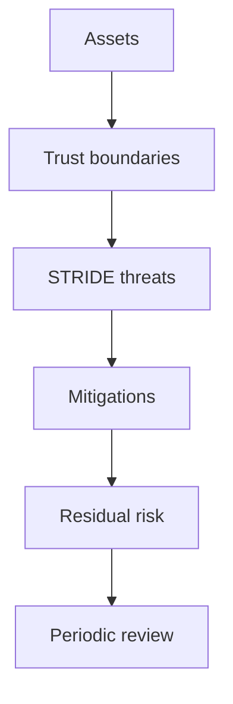

# OMES Threat Model

> Status: implemented. The "OMES control" column in the STRIDE table below reflects the
> actual repository state: `implemented-in-OMES` rows are enforced by the named code in
> `bin/omes`/`lib/omes/*.sh`/`modules/*/module.sh` today (cross-check the "Implementing
> issue" column's PR history if you want the commit that landed it); `operator-responsibility`
> rows are documented but cannot be enforced by OMES (usually because the behavior belongs
> to upstream Hermes or Telegram); `out-of-scope` rows are explicitly excluded — see
> [`docs/security.md`](./security.md) §8. This is not a certified security audit.

## 1. Purpose and scope

OMES installs and operates two things on a host the operator already owns and controls:

1. an Omarchy-inspired compatibility layer (packages, dotfiles, services) on Ubuntu Server
   24.04 LTS and Linux Mint 22.x, and
2. Hermes Agent, an AI agent that can execute shell commands, read/write files, and receive
   instructions over Telegram and other channels.

Combining a system installer that needs root with an agent that executes arbitrary shell
commands on behalf of remote, sometimes-untrusted input is the central risk this document
addresses. The threat model covers: secret handling, prompt injection into tool execution,
Telegram access control, privilege escalation, supply chain, log/backup exposure, multi-user
isolation, network exposure, denial-of-wallet, desktop-specific exposure, and rollback
tampering, per the issue #5 acceptance criteria.

Out of scope: vulnerabilities in the Linux kernel, Ubuntu/Mint packages, Docker, Telegram's
own infrastructure, or the LLM provider's model weights/training data. OMES can only add
controls at the layer it manages (installer, configuration, service wiring).

## 2. System description

```text
 Operator shell (human, SSH or console)
   │  runs `omes`, `hermes`, `sudo`
   ▼
 OMES installer (bin/omes + lib/omes/* + modules/*)
   │  root-scope modules run as root; user-scope modules refuse to run as root
   ▼
 apt / upstream package repositories, PPAs  ──▶ installed packages, kernel-adjacent config
   │
   ▼
 Hermes installer (curl | bash from hermes-agent.nousresearch.com) ──▶ ~/.hermes/hermes-agent/, ~/.local/bin/hermes
   │
   ▼
 Hermes runtime (per-profile HERMES_HOME)
   ├─ config.yaml (non-secret) + .env (secrets, 0600)
   ├─ tool execution: SHELL COMMANDS, file read/write, cron jobs, self-authored skills
   ├─ gateway (user or system systemd unit) ── Telegram network (long-polling) ── operator/group chats
   └─ outbound HTTPS ── LLM provider APIs (prompts, tool schemas, spend)
   │
   ▼
 Docker daemon (optional; `docker` group == root-equivalent)
 Backups (<state-dir>/backups/<ts>/, 0700) and logs (journald / OMES log file)
 Host is potentially multi-user (other local accounts, per-user HERMES_HOME and gateway units)
```

## 3. Trust boundaries

| ID | Boundary | Trusted side | Untrusted / lower-trust side |
|----|----------|---------------|-------------------------------|
| TB1 | Operator shell | Human operator issuing commands | N/A (root of trust for consent) |
| TB2 | OMES installer privilege split | Root-scope modules (system packages, services, firewall) | User-scope modules (dotfiles, per-user Hermes) must never require root; root modules must refuse to run as an ordinary user's proxy for privilege it wasn't granted |
| TB3 | apt / upstream & PPA repositories | Ubuntu/Mint official archives (signed) | Third-party PPAs (unsigned trust, maintainer-controlled) |
| TB4 | Hermes installer & upstream releases | Operator's decision to install Hermes | `curl \| bash` payload from `hermes-agent.nousresearch.com`, outside OMES's control |
| TB5 | Hermes runtime ↔ tool execution | OMES/operator configuration and approval policy | Any text the agent is asked to act on: LLM output, Telegram messages, fetched web content, tool results — all of it can attempt to become a shell command |
| TB6 | Telegram network | Bot token + configured allowlists | The entire internet reaching the bot via Telegram; any Telegram user, not just the operator |
| TB7 | LLM provider APIs | Provider's published data-handling terms | Every prompt/tool schema sent is data leaving the host; provider outages/pricing are provider-controlled |
| TB8 | Docker daemon / `docker` group | Root (via `sudo docker`) | Any local account placed in the `docker` group (root-equivalent without `sudo`) |
| TB9 | Backups & logs at rest | Filesystem permissions OMES sets | Any process/account able to read the state or log directory |
| TB10 | Multi-user host | Each user's own `HERMES_HOME` and session | Other local accounts on a shared host; a system-scope gateway service shared across users |
| TB11 | Network exposure | Loopback-only services, explicit firewall rules | The LAN/internet-facing network interface |
| TB12 | GitHub Actions / CI | Repository maintainer-reviewed workflow files | Third-party Actions referenced by tag/branch (mutable) instead of pinned SHA |
| TB13 | Control Center ↔ OMES host boundary | Authenticated local/mTLS/pull job channel and OMES policy | Public web requests, compromised tenant session, or forged job payload |
| TB14 | OMES ↔ registrar/DNS providers | Scoped provider credentials and verified adapter responses | Provider API, asynchronous status, unsupported capability, and stale external state |
| TB15 | Control Center billing ↔ provider operation | Immutable invoice/price snapshot and reconciliation | Payment event replay, provider failure after payment, or false success assumption |
| TB16 | `.id` document workflow | Encrypted object storage and tenant-scoped access | Registrant PII, expiring upload links, provider review state, and unauthorized download |

## 4. Assets

| ID | Asset | Why it matters |
|----|-------|-----------------|
| A1 | LLM provider API keys | Direct financial and data-exfiltration exposure if leaked; often high spend limits |
| A2 | Telegram bot token | Full control of the bot identity; token holder can message as the bot, read allowlist-gated traffic, or hijack `getUpdates` polling |
| A3 | `HERMES_HOME` state and session transcripts (config.yaml, .env, SOUL.md, skills, cron prompts, conversation history) | Contains secrets, personal data, and self-authored automation that the agent will re-read and re-execute |
| A4 | sudo / root privilege on the host | Installer and several modules require root; misuse compromises the whole host |
| A5 | SSH keys / SSH access | Operator's remote-access path; also a rollback-safety dependency (never lock the operator out) |
| A6 | User data reachable by agent tool execution | The agent's shell access can read/modify/exfiltrate anything the running user can touch |
| A7 | Host integrity (packages, systemd units, firewall rules, kernel-adjacent config) | What the installer and modules mutate; the thing rollback must be able to restore |
| A8 | OMES state and backups (`state` file, `<state-dir>/backups/*`) | Records what was changed and holds copies of managed files, including `.env` |
| A9 | GitHub repository, history, and CI (Actions secrets, workflow files) | Supply-chain integrity of OMES itself; a compromise here reaches every OMES install |
| A10 | Control Center tenant, entitlement, invoice, and job records | Cross-tenant disclosure or unauthorized mutation could provision infrastructure, expose billing data, or misrepresent service state |
| A11 | Registrar/DNS/GitHub provider credentials and external resource identifiers | Provider credentials can register domains, modify DNS, access repositories, or create financial liability |
| A12 | Domain registrant contacts and `.id` verification documents | Personal/business identity data and documents may be required for registration and must not leak across tenants |

## 5. STRIDE threat table

Legend — **Likelihood/Impact**: H = High, M = Medium, L = Low.
**OMES control** classification: `implemented-in-OMES` (OMES code enforces it),
`operator-responsibility` (OMES documents/warns but cannot enforce), `out-of-scope`
(explicitly not covered by OMES; see §8 of `docs/security.md`).

| ID | Threat | STRIDE | Asset(s) | Likelihood | Impact | Mitigation | OMES control | Implementing issue |
|----|--------|--------|----------|:-:|:-:|-------------|---------------|----|
| T01 | Secret (API key/bot token) committed to the OMES repo or its git history | Information Disclosure | A1, A2, A9 | M | H | `.gitignore` for `.env`; pre-commit/CI secret scanning (gitleaks or equivalent); never generate example files with real-looking values | implemented-in-OMES | #16 |
| T02 | Secret appears in OMES log output or `--json` output | Information Disclosure | A1, A2 | H | H | Central redaction helper in `lib/omes/log.sh`; deny-list of env var name patterns (`*TOKEN*`, `*KEY*`, `*SECRET*`) scrubbed before any log/print call; JSON mode emits only the documented schema | implemented-in-OMES | #14 |
| T03 | Secret passed as a CLI argument, visible to any local user via `ps`/`/proc/<pid>/cmdline` | Information Disclosure | A1, A2 | M | H | OMES never accepts secrets as flags; secrets are only ever written to `.env` (0600) or read from stdin/env; `set +x` guard around any `bash -x` debug tracing that might touch a secret-bearing variable | implemented-in-OMES | #6, #11 |
| T04 | Bot token exposed via a hand-rolled Telegram API URL (token embedded in the URL) reaching shell history, stdout, or a session transcript that gets backed up | Information Disclosure | A2, A3, A8 | M | H | Document (and, where OMES wraps Telegram calls, enforce) that token-bearing calls go through `hermes` tooling, never a raw `curl` the operator/agent types; token never printed even when a call fails | operator-responsibility (Hermes CLI is upstream); OMES documents the rule | #13 |
| T05 | Prompt injection (malicious text in a Telegram message, fetched web page, or tool output) causes the agent to execute a destructive or exfiltrating shell command | Tampering, Elevation of Privilege | A4, A5, A6, A7 | H | H | OMES cannot rewrite Hermes's own agent loop; OMES's contribution is to (a) default the gateway/service user to the least privilege that still functions, (b) never grant the `docker` group or passwordless sudo by default, (c) document that command-approval / allowlist settings in Hermes are a required control, not optional, and (d) never itself hand the agent a broad automation credential (see hermes-telegram-bot skill: "move the decision, not the permission") | operator-responsibility (agent behavior is upstream Hermes); OMES enforces the surrounding least-privilege defaults | #11, #12, #13 |
| T06 | A single approved capability (e.g., an `--allow-docker-group` opt-in, or a `command_allowlist` "always approve" entry) silently widens over time and is never re-checked | Elevation of Privilege | A4, A7 | M | H | `omes doctor`/`status` reports any active privilege-widening flag every run, not just at install time; document as a drift-check duty (see hermes-telegram-bot skill: "watch the invariant daily, not just the code") | implemented-in-OMES | #14, #17 |
| T07 | Unauthorized Telegram user reaches the bot because an allowlist uses a wildcard or is left unset | Spoofing, Elevation of Privilege | A3, A6 | H | H | OMES default profile ships no Telegram enablement; when enabled, `hermes` requires numeric `TELEGRAM_ALLOWED_USERS`; OMES documentation and any setup helper reject wildcard/empty-means-open configurations and print a warning instead of silently accepting them | implemented-in-OMES (documentation + setup checks) | #13 |
| T08 | A Telegram group is enabled in only one of `TELEGRAM_ALLOWED_CHATS` / `TELEGRAM_GROUP_ALLOWED_CHATS`, leaving it "half-enabled" with inconsistent behavior | Elevation of Privilege | A3 | M | M | Document that both variables must list every allowed group; any OMES-provided helper for adding a group must write both atomically | implemented-in-OMES (helper); operator-responsibility if edited by hand | #13 |
| T09 | Operator edits the Telegram allowlist but does not restart the gateway; the change appears to take effect (file is saved) but does not | Spoofing | A3 | H | L | Document that allowlists are read only at gateway start; `omes`/setup guidance requires a restart step and, where practical, checks the gateway start time against the `.env` mtime and warns if stale | implemented-in-OMES (warning) | #12, #13 |
| T10 | The bot itself (or an operator script) calls Telegram `getUpdates` while the gateway is long-polling, causing a 409 conflict and starving the real poller | Denial of Service | A2 | M | M | Documentation explicitly prohibits `getUpdates` against a running polling gateway; any OMES/Hermes helper for chat discovery uses `getChat`/`getChatMember`/an observer pattern instead | implemented-in-OMES (documentation); out-of-scope for enforcement (Hermes gateway internals) | #13 |
| T11 | An unpaired DM sender is silently ignored or, depending on `unauthorized_dm_behavior`, receives a pairing code that itself becomes a spoofing vector if displayed insecurely | Spoofing | A3 | M | M | Document default `unauthorized_dm_behavior`; require pairing/confirmation codes to be delivered out-of-band (DM to the owner) and never echoed to a surface the agent itself can read | operator-responsibility (Hermes behavior); OMES documents the required posture | #13 |
| T12 | The OMES installer (root-scope modules) is tricked into running with more privilege than a step needs, or a user-scope module is run as root and silently succeeds with wrong ownership | Elevation of Privilege | A4, A7 | M | H | Module contract requires `MODULE_SCOPE` (`root` or `user`, never both); the runner refuses (exit 5) a root-scope module run as non-root and a user-scope module run as root | implemented-in-OMES | #4 (design), #6 |
| T13 | Operator/installer adds the running user to the `docker` group, granting root-equivalent access without a clear warning | Elevation of Privilege | A4, A6, A7 | M | H | Default is `sudo docker`, then rootless Docker when eligible; `docker` group membership only via explicit `--allow-docker-group` flag, which prints an explicit root-equivalence warning and is recorded in state so `omes status` always shows it | implemented-in-OMES | #9, #12 |
| T14 | Installer or a module grants passwordless sudo (NOPASSWD) to simplify automation | Elevation of Privilege | A4, A7 | L | H | OMES never writes a NOPASSWD sudoers entry; any sudo use by OMES itself is interactive/explicit at the operator's own shell, not silently provisioned for a service account | implemented-in-OMES (by omission — audited in CI/review) | #16 |
| T15 | The Hermes installer script fetched via `curl \| bash` is compromised or served differently than expected (MITM, compromised upstream) and executes arbitrary code at install time | Tampering | A4, A6, A7, A9 | M | H | OMES downloads the installer to a temp file first (never pipes directly into `bash`), verifies TLS, and optionally checks `OMES_HERMES_INSTALLER_SHA256` before executing; failure to match the pin aborts (no mutation) | implemented-in-OMES | #6, #11 |
| T16 | A third-party PPA added for a dependency (e.g., desktop/Hyprland packages) introduces untrusted or unsigned packages | Tampering | A7 | M | M | PPAs are not added by default; any PPA use goes through an explicit allowlist in the compatibility layer (`lib/omes/pkg.sh`), reviewed and pinned, never an ad hoc `add-apt-repository` invented at runtime | implemented-in-OMES | #9 |
| T17 | npm/pip or other language-ecosystem dependencies pulled in by Hermes or desktop tooling introduce a malicious transitive package | Tampering | A6, A7 | M | M | OMES does not vendor or auto-install arbitrary npm/pip packages; where Hermes/tooling requires them, document the trust boundary and prefer pinned lockfiles upstream; dependency updates go through the same CI checks as OMES's own code | operator-responsibility (upstream ecosystem); implemented-in-OMES for anything OMES itself declares | #16 |
| T18 | A GitHub Actions workflow references a third-party action by mutable tag/branch, letting the action's maintainer change behavior after the fact | Tampering | A9 | M | H | CI workflows pin third-party Actions by commit SHA, not tag; Dependabot/renovate-style review required before bumping a pin | implemented-in-OMES | #16 |
| T19 | Journald or the OMES log file captures secret values printed by a misbehaving module or by Hermes itself | Information Disclosure | A1, A2 | M | H | Redaction at the logging layer (see T02); log rotation configured; documentation instructs operators to treat `journalctl -u hermes-gateway` output as sensitive until reviewed | implemented-in-OMES | #12, #14 |
| T20 | Backup archives under `<state-dir>/backups/` are world-readable, or retained indefinitely, exposing `.env` contents to any later reader | Information Disclosure | A1, A2, A8 | M | H | Backups directory and every backup subdirectory created at 0700; `.env` files copied with mode 0600 preserved; MANIFEST/META never include file contents, only hashes and metadata; retention/rotation policy documented | implemented-in-OMES | #10 |
| T21 | A rollback/backup silently fails or restores a tampered/stale backup, giving false confidence that recovery works | Tampering | A7, A8 | M | H | `MANIFEST` sha256 per file is verified before restore; restore is tested offline in CI (#17); `omes restore` reports mismatches instead of silently applying a corrupted backup; exit code 10 reserved for rollback failure | implemented-in-OMES | #10, #17 |
| T22 | On a multi-user host, one user's `HERMES_HOME`, secrets, or transcripts are readable by another local user | Information Disclosure | A1, A2, A3, A6 | M | H | Per-user `HERMES_HOME` under the user's own home directory with default filesystem permissions; user-scope state dir at `${XDG_STATE_HOME:-$HOME/.local/state}/omes/` mode 0700; OMES never widens a home directory's permissions | implemented-in-OMES | #4, #11 |
| T23 | A system-scope Hermes gateway service (shared across users) is chosen when isolation was actually required, mixing multiple users' agent sessions under one identity | Elevation of Privilege | A3, A6 | L | M | Documentation is explicit about the user-vs-system service trade-off; OMES defaults to per-user service + `loginctl enable-linger` for headless persistence rather than defaulting to a system-wide unit | implemented-in-OMES (default choice); operator-responsibility if they opt into system scope | #12 |
| T24 | Gateway/API port is reachable from the network instead of loopback-only, exposing an unauthenticated or weakly authenticated control surface | Information Disclosure, Elevation of Privilege | A3, A4 | M | H | The Hermes gateway's own bind address/exposure is upstream Hermes configuration, not something `modules/hermes-gateway{,-system}/module.sh` sets; OMES documents that any exposure beyond loopback needs an explicit firewall rule, never an implicit wide-open bind | operator-responsibility (upstream Hermes gateway binding); OMES documents the required posture | #12 |
| T25 | Host firewall is left in default-allow, exposing services (SSH, gateway, Docker-published ports) that were never meant to be internet-facing | Elevation of Privilege, Denial of Service | A4, A7 | M | H | `ufw` (or equivalent) configured default-deny incoming / allow outgoing on the server profile; SSH allowed only when explicitly enabled via `--enable-ssh` or detected already active | implemented-in-OMES | #7 |
| T26 | Applying the firewall policy locks the operator out of the very SSH session they are using to run the installer | Denial of Service | A5 | M | H | OMES detects an active SSH session before applying firewall rules and unconditionally keeps port 22 allowed when one is detected, printing a warning rather than silently blocking; "never lock the operator out" is a hard invariant, not a default that can be disabled by omission | implemented-in-OMES | #7 |
| T27 | Denial of wallet: prompt injection, a runaway cron job, or normal use drives LLM provider spend far beyond what the operator expected | Denial of Service (financial) | A1 | H | H | Document that OMES cannot set a hard spend ceiling — only the provider dashboard can; recommend `session_reset` and bounded session/context size on day one; treat unexpected spend as an incident-response trigger | operator-responsibility (spend caps live at the provider); OMES documents the requirement and default session hygiene | #13 |
| T28 | Approval fatigue: a compromised or misbehaving session floods the operator with confirmation prompts until they start approving without reading, or disables approvals entirely | Elevation of Privilege | A4, A6 | M | H | Document the principle "move the decision, not the permission" — dangerous capabilities should require an out-of-band, rate-limited confirmation channel, not an in-session "always approve" that becomes a standing grant; a separate issue-limiter should throttle unconfirmed requests so flooding is not free | operator-responsibility (approval UX is upstream Hermes); OMES documents the required posture for any OMES-provided broker/automation | #13 |
| T29 | On a Linux Mint desktop profile, screen sharing or portal permissions (e.g., wlr/xdg-desktop-portal) expose the session to a remote viewer or another local process without a clear consent step | Information Disclosure | A6 | L | M | Preflight documents portal/consent requirements for the chosen compositor; OMES does not silently grant broad portal permissions; Cinnamon fallback remains available if portal behavior cannot be verified | implemented-in-OMES (documentation, preflight checks) | #8 |
| T30 | Desktop session left unlocked while an agent with shell access is running, allowing a passerby (or a screen-shared viewer) physical/visual access to an authenticated session | Information Disclosure, Elevation of Privilege | A5, A6 | L | M | Document that lock-screen/idle-lock configuration is the operator's responsibility; OMES does not disable idle locking and, where it configures idle behavior for the desktop profile, defaults to enabling a lock timeout rather than disabling one | operator-responsibility; out-of-scope for enforcement | #8 |
| T31 | An attacker with write access to a backup (T20) or to the repository tampers with a backup or a module's rollback path so that `omes restore`/`module_rollback` re-applies malicious state instead of the last-known-good one | Tampering | A7, A8 | L | H | MANIFEST sha256 verification (T21) also protects against tampered restores; state file changes are append/overwrite with explicit `applied_at` timestamps that CI/QA can diff against expectations in #17 | implemented-in-OMES | #10, #17 |
| T32 | No audit trail of what the agent's shell tool actually executed, making incident response and repudiation claims ("the agent did this, not me") impossible to resolve | Repudiation | A3, A7 | M | M | Document that Hermes session transcripts/logs are the audit trail and must be retained per the backup policy; OMES itself logs every module action it takes (apply/verify/rollback) with timestamps to the state file and log file | implemented-in-OMES (installer actions); operator-responsibility (agent tool-call transcript retention is upstream Hermes behavior) | #14, #17 |
| T33 | A compromised Control Center session submits an arbitrary host command or targets another tenant's server | Elevation of Privilege, Tampering | A4, A7, A10 | M | H | Versioned allowlisted operations, server-side tenant/target authorization, no arbitrary shell, idempotent audited jobs, local/mTLS/pull boundary, and cross-tenant integration tests | design requirement; not implemented yet | #89, #90, #91 |
| T34 | A replayed or forged provider webhook creates duplicate invoice, domain order, entitlement, or deployment state | Spoofing, Tampering, Repudiation | A10, A11 | M | H | Verify signature, event ID, timestamp, source, and idempotency before applying events; process outside transactions and reconcile provider state | design requirement; not implemented yet | #94, #99, #100, #101, #102 |
| T35 | Provider capability drift causes OMES to advertise or charge for an unsupported registrar/DNS operation | Tampering, Financial Denial of Service | A10, A11 | M | M | Capability matrix by account/extension/operation, immutable price/capability snapshot, visible manual fallback, and periodic reconciliation | design requirement; not implemented yet | #98, #99, #100, #102 |
| T36 | Cloudflare or SRS-X registration is accepted asynchronously but OMES reports success before reconciliation | Repudiation, Financial Denial of Service | A10, A11 | M | H | Distinguish submitted/pending/action-required/succeeded/failed; poll or read provider state; never treat timeout as success | design requirement; not implemented yet | #90, #99, #100 |
| T37 | `.id` registrant data or verification documents are exposed through tenant leakage, logs, long-lived upload URLs, or support exports | Information Disclosure | A12 | M | H | Encrypted object storage, short-lived signed upload/download capability, tenant-scoped access, audit, redaction, retention, deletion/legal hold | design requirement; not implemented yet | #100, #102 |
| T38 | Payment success or subscription suspension directly stops a healthy deployment without policy, grace period, or rollback | Tampering, Denial of Service | A10, A7 | M | H | Separate invoice, entitlement, and deployment state; explicit grace/suspension policy; approval for destructive action; no automatic stop by default | design requirement; not implemented yet | #92, #93, #94, #102 |
| T39 | A local-panel UX pattern is promoted into a public/multi-tenant web boundary with direct process, filesystem, credential, endpoint, or internal-runtime access | Elevation of Privilege, Information Disclosure | A1, A3, A4, A6, A7, A10, A11 | M | H | Classify reference features as adopt/adapt/observe/reject; reimplement through tenant-scoped allowlisted jobs, approvals, audit, secret references, SSRF controls, verification and reconciliation; never import a local panel as a privileged executor | design requirement; not implemented yet | #89, #90, #91, #98, #101, ADR-0016 |

## 6. Residual risk summary

Even with every mitigation above implemented, the following risks remain and are the
responsibility of the operator, not OMES:

- Hermes's own agent loop (how it decides to call a tool, and whether a given command
  requires approval) is upstream behavior OMES configures but does not author.
- LLM provider trust (data handling, hallucination, jailbreak resistance) is outside OMES.
- Physical security, disk encryption, and bootloader integrity of the host are outside OMES
  (see `docs/security.md` §8).
- A determined operator can always override a default (e.g., pass `--allow-docker-group`,
  disable the firewall, add a NOPASSWD sudoers line by hand). OMES's job is to make the safe
  path the default and the unsafe path explicit and logged, not to make unsafe configurations
  impossible.
- Until issues #89–#102 land, the Control Center, billing, registrar, DNS, and GitHub controls
  described in T33–T38 are design requirements, not implemented protections. A public pilot
  must not advertise them as available.

## 7. Review cadence

This threat model must be revisited whenever: a new module is added, a new network-facing
service is introduced, Hermes's upstream security posture changes materially, an external
provider adapter is added or changes capability, or a security incident (real or near-miss)
occurs during a pilot. Until then, treat it as the gate referenced
in `docs/research-and-implementation-plan.md` §4 (Phase 0).

<!-- OMES-MERMAID: docs/threat-model.md -->

## Visual summary



