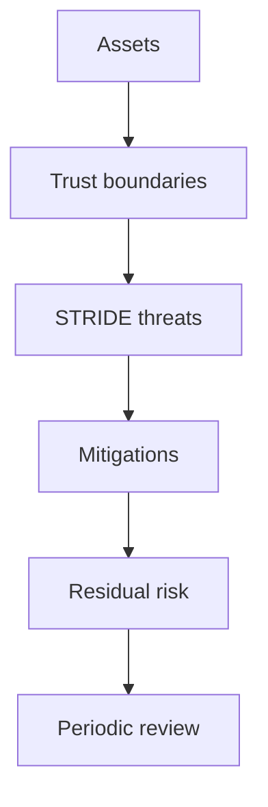

# OMES Threat Model

> Status: implemented. The "OMES control" column in the STRIDE table below reflects the
> actual repository state: `implemented-in-OMES` rows are enforced by the named code in
> `bin/omes`/`lib/omes/*.sh`/`modules/*/module.sh` today (cross-check the "Implementing
> issue" column's PR history if you want the commit that landed it); `operator-responsibility`
> rows are documented but cannot be enforced by OMES (usually because the behavior belongs
> to upstream Hermes or Telegram); `out-of-scope` rows are explicitly excluded — see
> [`docs/security.md`](./security.md) §8. This is not a certified security audit.
>
> See [docs/hermes-deployment-guide.md §19](hermes-deployment-guide.md#19-known-limitations-and-bounded-security-claims)
> for the deployment-runbook summary of the bounded security claims this
> document backs.

## 1. Purpose and scope

OMES installs and operates two things on a host the operator already owns and controls:

1. an Omarchy-inspired compatibility layer (packages, dotfiles, services) on Ubuntu Server
   24.04 LTS and Linux Mint 22.x, and
2. Hermes Agent, an AI agent that can execute shell commands, read/write files, and receive
   instructions over Telegram and other channels.

Combining a system installer that needs root with an agent that executes arbitrary shell
commands on behalf of remote, sometimes-untrusted input is the central risk this document
addresses. The threat model covers: secret handling, prompt injection into tool execution,
Telegram access control, privilege escalation, supply chain, log/backup exposure, multi-user
isolation, network exposure, denial-of-wallet, desktop-specific exposure, and rollback
tampering, per the issue #5 acceptance criteria.

Out of scope: vulnerabilities in the Linux kernel, Ubuntu/Mint packages, Docker, Telegram's
own infrastructure, or the LLM provider's model weights/training data. OMES can only add
controls at the layer it manages (installer, configuration, service wiring).

## 2. System description

```text
 Operator shell (human, SSH or console)
   │  runs `omes`, `hermes`, `sudo`
   ▼
 OMES installer (bin/omes + lib/omes/* + modules/*)
   │  root-scope modules run as root; user-scope modules refuse to run as root
   ▼
 apt / upstream package repositories, PPAs  ──▶ installed packages, kernel-adjacent config
   │
   ▼
 Hermes installer (curl | bash from hermes-agent.nousresearch.com) ──▶ ~/.hermes/hermes-agent/, ~/.local/bin/hermes
   │
   ▼
 Hermes runtime (per-profile HERMES_HOME)
   ├─ config.yaml (non-secret) + .env (secrets, 0600)
   ├─ tool execution: SHELL COMMANDS, file read/write, cron jobs, self-authored skills
   ├─ gateway (user or system systemd unit) ── Telegram network (long-polling) ── operator/group chats
   └─ outbound HTTPS ── LLM provider APIs (prompts, tool schemas, spend)
   │
   ▼
 Docker daemon (optional; `docker` group == root-equivalent)
 Backups (<state-dir>/backups/<ts>/, 0700) and logs (journald / OMES log file)
 Host is potentially multi-user (other local accounts, per-user HERMES_HOME and gateway units)
```

## 3. Trust boundaries

| ID | Boundary | Trusted side | Untrusted / lower-trust side |
|----|----------|---------------|-------------------------------|
| TB1 | Operator shell | Human operator issuing commands | N/A (root of trust for consent) |
| TB2 | OMES installer privilege split | Root-scope modules (system packages, services, firewall) | User-scope modules (dotfiles, per-user Hermes) must never require root; root modules must refuse to run as an ordinary user's proxy for privilege it wasn't granted |
| TB3 | apt / upstream & PPA repositories | Ubuntu/Mint official archives (signed) | Third-party PPAs (unsigned trust, maintainer-controlled) |
| TB4 | Hermes installer & upstream releases | Operator's decision to install Hermes | `curl \| bash` payload from `hermes-agent.nousresearch.com`, outside OMES's control |
| TB5 | Hermes runtime ↔ tool execution | OMES/operator configuration and approval policy | Any text the agent is asked to act on: LLM output, Telegram messages, fetched web content, tool results — all of it can attempt to become a shell command |
| TB6 | Telegram network | Bot token + configured allowlists | The entire internet reaching the bot via Telegram; any Telegram user, not just the operator |
| TB7 | LLM provider APIs | Provider's published data-handling terms | Every prompt/tool schema sent is data leaving the host; provider outages/pricing are provider-controlled |
| TB8 | Docker daemon / `docker` group | Root (via `sudo docker`) | Any local account placed in the `docker` group (root-equivalent without `sudo`) |
| TB9 | Backups & logs at rest | Filesystem permissions OMES sets | Any process/account able to read the state or log directory |
| TB10 | Multi-user host | Each user's own `HERMES_HOME` and session | Other local accounts on a shared host; a system-scope gateway service shared across users |
| TB11 | Network exposure | Loopback-only services, explicit firewall rules | The LAN/internet-facing network interface |
| TB12 | GitHub Actions / CI | Repository maintainer-reviewed workflow files | Third-party Actions referenced by tag/branch (mutable) instead of pinned SHA |
| TB13 | Control Center ↔ OMES host boundary | Authenticated local/mTLS/pull job channel and OMES policy | Public web requests, compromised tenant session, or forged job payload |
| TB14 | OMES ↔ registrar/DNS providers | Scoped provider credentials and verified adapter responses | Provider API, asynchronous status, unsupported capability, and stale external state |
| TB15 | Control Center billing ↔ provider operation | Immutable invoice/price snapshot and reconciliation | Payment event replay, provider failure after payment, or false success assumption |
| TB16 | `.id` document workflow | Encrypted object storage and tenant-scoped access | Registrant PII, expiring upload links, provider review state, and unauthorized download |
| TB17 | Hermes gateway systemd sandbox | The OMES-managed hardening drop-in (`docs/hermes-hardening.md`), off by default | A compromised or misbehaving gateway process attempting to escalate privileges, exhaust host resources, or reach outside `$HERMES_HOME` |
| TB18 | Hermes data-class backup (`docs/hermes-backup.md`) | `config`/`skills` classes (the enforced default, `0700`/`0600` permissions, checksum-validated restore); Restricted-scope classes/recovery classes (`sessions`/`memory`, `portable-profile`/`full-runtime-dr`) refused with a stable reason code unless `--allow-restricted-scope` is explicitly passed (issue #235, `lib/omes/py/hermesbackup/restricted_scope.py`) | `secrets` (`.env`, `auth.json`, still gated by the separate `--include-secrets`/`--allow-sensitive-credentials` control) and any Restricted-scope class an operator explicitly opts into, containing credentials or user-provided content, which must never leave the default backup scope without that explicit, reviewed opt-in |

## 4. Assets

| ID | Asset | Why it matters |
|----|-------|-----------------|
| A1 | LLM provider API keys | Direct financial and data-exfiltration exposure if leaked; often high spend limits |
| A2 | Telegram bot token | Full control of the bot identity; token holder can message as the bot, read allowlist-gated traffic, or hijack `getUpdates` polling |
| A3 | `HERMES_HOME` state and session transcripts (config.yaml, .env, SOUL.md, skills, cron prompts, conversation history) | Contains secrets, personal data, and self-authored automation that the agent will re-read and re-execute |
| A4 | sudo / root privilege on the host | Installer and several modules require root; misuse compromises the whole host |
| A5 | SSH keys / SSH access | Operator's remote-access path; also a rollback-safety dependency (never lock the operator out) |
| A6 | User data reachable by agent tool execution | The agent's shell access can read/modify/exfiltrate anything the running user can touch |
| A7 | Host integrity (packages, systemd units, firewall rules, kernel-adjacent config) | What the installer and modules mutate; the thing rollback must be able to restore |
| A8 | OMES state and backups (`state` file, `<state-dir>/backups/*`) | Records what was changed and holds copies of managed files, including `.env` |
| A9 | GitHub repository, history, and CI (Actions secrets, workflow files) | Supply-chain integrity of OMES itself; a compromise here reaches every OMES install |
| A10 | Control Center tenant, entitlement, invoice, and job records | Cross-tenant disclosure or unauthorized mutation could provision infrastructure, expose billing data, or misrepresent service state |
| A11 | Registrar/DNS/GitHub provider credentials and external resource identifiers | Provider credentials can register domains, modify DNS, access repositories, or create financial liability |
| A12 | Domain registrant contacts and `.id` verification documents | Personal/business identity data and documents may be required for registration and must not leak across tenants |
| A13 | Content distribution browser session cookies and platform login state (`content/sessions/<platform>/`) | Holds live logged-in platform sessions; theft lets an attacker publish/act as the operator's account on that platform |

## 5. STRIDE threat table

Legend — **Likelihood/Impact**: H = High, M = Medium, L = Low.
**OMES control** classification: `implemented-in-OMES` (OMES code enforces it),
`operator-responsibility` (OMES documents/warns but cannot enforce), `out-of-scope`
(explicitly not covered by OMES; see §8 of `docs/security.md`).

| ID | Threat | STRIDE | Asset(s) | Likelihood | Impact | Mitigation | OMES control | Implementing issue |
|----|--------|--------|----------|:-:|:-:|-------------|---------------|----|
| T01 | Secret (API key/bot token) committed to the OMES repo or its git history | Information Disclosure | A1, A2, A9 | M | H | `.gitignore` for `.env`; pre-commit/CI secret scanning (gitleaks or equivalent); never generate example files with real-looking values | implemented-in-OMES | #16 |
| T02 | Secret appears in OMES log output or `--json` output | Information Disclosure | A1, A2 | H | H | Central redaction helper in `lib/omes/log.sh`; deny-list of env var name patterns (`*TOKEN*`, `*KEY*`, `*SECRET*`) scrubbed before any log/print call; JSON mode emits only the documented schema | implemented-in-OMES | #14 |
| T03 | Secret passed as a CLI argument, visible to any local user via `ps`/`/proc/<pid>/cmdline` | Information Disclosure | A1, A2 | M | H | OMES never accepts secrets as flags; secrets are only ever written to `.env` (0600) or read from stdin/env; `set +x` guard around any `bash -x` debug tracing that might touch a secret-bearing variable | implemented-in-OMES | #6, #11 |
| T04 | Bot token exposed via a hand-rolled Telegram API URL (token embedded in the URL) reaching shell history, stdout, or a session transcript that gets backed up | Information Disclosure | A2, A3, A8 | M | H | Document (and, where OMES wraps Telegram calls, enforce) that token-bearing calls go through `hermes` tooling, never a raw `curl` the operator/agent types; token never printed even when a call fails | operator-responsibility (Hermes CLI is upstream); OMES documents the rule | #13 |
| T05 | Prompt injection (malicious text in a Telegram message, fetched web page, or tool output) causes the agent to execute a destructive or exfiltrating shell command | Tampering, Elevation of Privilege | A4, A5, A6, A7 | H | H | OMES cannot rewrite Hermes's own agent loop; OMES's contribution is to (a) default the gateway/service user to the least privilege that still functions, (b) never grant the `docker` group or passwordless sudo by default, (c) document that command-approval / allowlist settings in Hermes are a required control, not optional, and (d) never itself hand the agent a broad automation credential (see hermes-telegram-bot skill: "move the decision, not the permission") | operator-responsibility (agent behavior is upstream Hermes); OMES enforces the surrounding least-privilege defaults | #11, #12, #13 |
| T06 | A single approved capability (e.g., an `--allow-docker-group` opt-in, or a `command_allowlist` "always approve" entry) silently widens over time and is never re-checked | Elevation of Privilege | A4, A7 | M | H | `omes doctor`/`status` reports any active privilege-widening flag every run, not just at install time; document as a drift-check duty (see hermes-telegram-bot skill: "watch the invariant daily, not just the code") | implemented-in-OMES | #14, #17 |
| T07 | Unauthorized Telegram user reaches the bot because an allowlist uses a wildcard or is left unset | Spoofing, Elevation of Privilege | A3, A6 | H | H | OMES default profile ships no Telegram enablement; when enabled, `hermes` requires numeric `TELEGRAM_ALLOWED_USERS`; OMES documentation and any setup helper reject wildcard/empty-means-open configurations and print a warning instead of silently accepting them | implemented-in-OMES (documentation + setup checks) | #13 |
| T08 | A Telegram group is enabled in only one of `TELEGRAM_ALLOWED_CHATS` / `TELEGRAM_GROUP_ALLOWED_CHATS`, leaving it "half-enabled" with inconsistent behavior | Elevation of Privilege | A3 | M | M | Document that both variables must list every allowed group; any OMES-provided helper for adding a group must write both atomically | implemented-in-OMES (helper); operator-responsibility if edited by hand | #13 |
| T09 | Operator edits the Telegram allowlist but does not restart the gateway; the change appears to take effect (file is saved) but does not | Spoofing | A3 | H | L | Document that allowlists are read only at gateway start; `omes`/setup guidance requires a restart step and, where practical, checks the gateway start time against the `.env` mtime and warns if stale | implemented-in-OMES (warning) | #12, #13 |
| T10 | The bot itself (or an operator script) calls Telegram `getUpdates` while the gateway is long-polling, causing a 409 conflict and starving the real poller | Denial of Service | A2 | M | M | Documentation explicitly prohibits `getUpdates` against a running polling gateway; any OMES/Hermes helper for chat discovery uses `getChat`/`getChatMember`/an observer pattern instead | implemented-in-OMES (documentation); out-of-scope for enforcement (Hermes gateway internals) | #13 |
| T11 | An unpaired DM sender is silently ignored or, depending on `unauthorized_dm_behavior`, receives a pairing code that itself becomes a spoofing vector if displayed insecurely | Spoofing | A3 | M | M | Document default `unauthorized_dm_behavior`; require pairing/confirmation codes to be delivered out-of-band (DM to the owner) and never echoed to a surface the agent itself can read | operator-responsibility (Hermes behavior); OMES documents the required posture | #13 |
| T12 | The OMES installer (root-scope modules) is tricked into running with more privilege than a step needs, or a user-scope module is run as root and silently succeeds with wrong ownership | Elevation of Privilege | A4, A7 | M | H | Module contract requires `MODULE_SCOPE` (`root` or `user`, never both); the runner refuses (exit 5) a root-scope module run as non-root and a user-scope module run as root | implemented-in-OMES | #4 (design), #6 |
| T13 | Operator/installer adds the running user to the `docker` group, granting root-equivalent access without a clear warning | Elevation of Privilege | A4, A6, A7 | M | H | Default is `sudo docker`, then rootless Docker when eligible; `docker` group membership only via explicit `--allow-docker-group` flag, which prints an explicit root-equivalence warning and is recorded in state so `omes status` always shows it | implemented-in-OMES | #9, #12 |
| T14 | Installer or a module grants passwordless sudo (NOPASSWD) to simplify automation | Elevation of Privilege | A4, A7 | L | H | OMES never writes a NOPASSWD sudoers entry; any sudo use by OMES itself is interactive/explicit at the operator's own shell, not silently provisioned for a service account | implemented-in-OMES (by omission — audited in CI/review) | #16 |
| T15 | The Hermes installer script fetched via `curl \| bash` is compromised or served differently than expected (MITM, compromised upstream) and executes arbitrary code at install time | Tampering | A4, A6, A7, A9 | M | H | OMES downloads the installer to a temp file first (never pipes directly into `bash`), verifies TLS, and enforces verified SHA-256 baseline digest matching by default (fail closed on mismatch or unmapped baseline without override; issue #170) before executing; failure to match aborts (no mutation) | implemented-in-OMES | #6, #11, #170 |
| T16 | A third-party PPA added for a dependency (e.g., desktop/Hyprland packages) introduces untrusted or unsigned packages | Tampering | A7 | M | M | PPAs are not added by default; any PPA use goes through an explicit allowlist in the compatibility layer (`lib/omes/pkg.sh`), reviewed and pinned, never an ad hoc `add-apt-repository` invented at runtime | implemented-in-OMES | #9 |
| T17 | npm/pip or other language-ecosystem dependencies pulled in by Hermes or desktop tooling introduce a malicious transitive package | Tampering | A6, A7 | M | M | OMES does not vendor or auto-install arbitrary npm/pip packages; where Hermes/tooling requires them, document the trust boundary and prefer pinned lockfiles upstream; dependency updates go through the same CI checks as OMES's own code | operator-responsibility (upstream ecosystem); implemented-in-OMES for anything OMES itself declares | #16 |
| T18 | A GitHub Actions workflow references a third-party action by mutable tag/branch, letting the action's maintainer change behavior after the fact | Tampering | A9 | M | H | CI workflows pin third-party Actions by commit SHA, not tag; Dependabot/renovate-style review required before bumping a pin | implemented-in-OMES | #16 |
| T19 | Journald or the OMES log file captures secret values printed by a misbehaving module or by Hermes itself | Information Disclosure | A1, A2 | M | H | Redaction at the logging layer (see T02); log rotation configured; documentation instructs operators to treat `journalctl -u hermes-gateway` output as sensitive until reviewed | implemented-in-OMES | #12, #14 |
| T20 | Backup archives under `<state-dir>/backups/` are world-readable, or retained indefinitely, exposing `.env` contents to any later reader | Information Disclosure | A1, A2, A8 | M | H | Backups directory and every backup subdirectory created at 0700; `.env` files copied with mode 0600 preserved; MANIFEST/META never include file contents, only hashes and metadata; retention/rotation policy documented | implemented-in-OMES | #10 |
| T21 | A rollback/backup silently fails or restores a tampered/stale backup, giving false confidence that recovery works | Tampering | A7, A8 | M | H | `MANIFEST` sha256 per file is verified before restore; restore is tested offline in CI (#17); `omes restore` reports mismatches instead of silently applying a corrupted backup; exit code 10 reserved for rollback failure | implemented-in-OMES | #10, #17 |
| T22 | On a multi-user host, one user's `HERMES_HOME`, secrets, or transcripts are readable by another local user | Information Disclosure | A1, A2, A3, A6 | M | H | Per-user `HERMES_HOME` under the user's own home directory with default filesystem permissions; user-scope state dir at `${XDG_STATE_HOME:-$HOME/.local/state}/omes/` mode 0700; OMES never widens a home directory's permissions | implemented-in-OMES | #4, #11 |
| T23 | A system-scope Hermes gateway service (shared across users) is chosen when isolation was actually required, mixing multiple users' agent sessions under one identity | Elevation of Privilege | A3, A6 | L | M | Documentation is explicit about the user-vs-system service trade-off; OMES defaults to per-user service + `loginctl enable-linger` for headless persistence rather than defaulting to a system-wide unit | implemented-in-OMES (default choice); operator-responsibility if they opt into system scope | #12 |
| T24 | Gateway/API port is reachable from the network instead of loopback-only, exposing an unauthenticated or weakly authenticated control surface | Information Disclosure, Elevation of Privilege | A3, A4 | M | H | The Hermes gateway's own bind address/exposure is upstream Hermes configuration, not something `modules/hermes-gateway{,-system}/module.sh` sets; `omes audit exposure` (issue #80, `lib/omes/py/health/exposure.py`) detects non-loopback binds for the gateway, browser-control/CDP, MCP, and Ollama ports via `ss -H -tulpn` and cross-references `ufw status`, reporting an unapproved exposure as a finding (exit 7) | implemented-in-OMES (detection via `omes audit exposure`); remediation (rebinding the service, e.g. via `hermes config set`) remains an explicit operator action — the audit never opens/closes a port or edits firewall rules itself | #12, #80 |
| T25 | Host firewall is left in default-allow, exposing services (SSH, gateway, Docker-published ports) that were never meant to be internet-facing | Elevation of Privilege, Denial of Service | A4, A7 | M | H | `ufw` (or equivalent) configured default-deny incoming / allow outgoing on the server profile; SSH allowed only when explicitly enabled via `--enable-ssh` or detected already active | implemented-in-OMES | #7 |
| T26 | Applying the firewall policy locks the operator out of the very SSH session they are using to run the installer | Denial of Service | A5 | M | H | OMES detects an active SSH session before applying firewall rules and unconditionally keeps port 22 allowed when one is detected, printing a warning rather than silently blocking; "never lock the operator out" is a hard invariant, not a default that can be disabled by omission | implemented-in-OMES | #7 |
| T27 | Denial of wallet: prompt injection, a runaway cron job, or normal use drives LLM provider spend far beyond what the operator expected | Denial of Service (financial) | A1 | H | H | Document that OMES cannot set a hard spend ceiling — only the provider dashboard can; recommend `session_reset` and bounded session/context size on day one; treat unexpected spend as an incident-response trigger | operator-responsibility (spend caps live at the provider); OMES documents the requirement and default session hygiene | #13 |
| T28 | Approval fatigue: a compromised or misbehaving session floods the operator with confirmation prompts until they start approving without reading, or disables approvals entirely | Elevation of Privilege | A4, A6 | M | H | Document the principle "move the decision, not the permission" — dangerous capabilities should require an out-of-band, rate-limited confirmation channel, not an in-session "always approve" that becomes a standing grant; a separate issue-limiter should throttle unconfirmed requests so flooding is not free | operator-responsibility (approval UX is upstream Hermes); OMES documents the required posture for any OMES-provided broker/automation | #13 |
| T29 | On a Linux Mint desktop profile, screen sharing or portal permissions (e.g., wlr/xdg-desktop-portal) expose the session to a remote viewer or another local process without a clear consent step | Information Disclosure | A6 | L | M | Preflight documents portal/consent requirements for the chosen compositor; OMES does not silently grant broad portal permissions; Cinnamon fallback remains available if portal behavior cannot be verified | implemented-in-OMES (documentation, preflight checks) | #8 |
| T30 | Desktop session left unlocked while an agent with shell access is running, allowing a passerby (or a screen-shared viewer) physical/visual access to an authenticated session | Information Disclosure, Elevation of Privilege | A5, A6 | L | M | Document that lock-screen/idle-lock configuration is the operator's responsibility; OMES does not disable idle locking and, where it configures idle behavior for the desktop profile, defaults to enabling a lock timeout rather than disabling one | operator-responsibility; out-of-scope for enforcement | #8 |
| T31 | An attacker with write access to a backup (T20) or to the repository tampers with a backup or a module's rollback path so that `omes restore`/`module_rollback` re-applies malicious state instead of the last-known-good one | Tampering | A7, A8 | L | H | MANIFEST sha256 verification (T21) also protects against tampered restores; state file changes are append/overwrite with explicit `applied_at` timestamps that CI/QA can diff against expectations in #17 | implemented-in-OMES | #10, #17 |
| T32 | No audit trail of what the agent's shell tool actually executed, making incident response and repudiation claims ("the agent did this, not me") impossible to resolve | Repudiation | A3, A7 | M | M | Document that Hermes session transcripts/logs are the audit trail and must be retained per the backup policy; OMES itself logs every module action it takes (apply/verify/rollback) with timestamps to the state file and log file | implemented-in-OMES (installer actions); operator-responsibility (agent tool-call transcript retention is upstream Hermes behavior) | #14, #17 |
| T33 | A compromised Control Center session submits an arbitrary host command or targets another tenant's server | Elevation of Privilege, Tampering | A4, A7, A10 | M | H | Versioned allowlisted operations, server-side tenant/target authorization, no arbitrary shell, idempotent audited jobs, local/mTLS/pull boundary, and cross-tenant integration tests | design requirement; not implemented yet | #89, #90, #91 |
| T34 | A replayed or forged provider webhook creates duplicate invoice, domain order, entitlement, or deployment state | Spoofing, Tampering, Repudiation | A10, A11 | M | H | Verify signature, event ID, timestamp, source, and idempotency before applying events; process outside transactions and reconcile provider state | design requirement; not implemented yet | #94, #99, #100, #101, #102 |
| T35 | Provider capability drift causes OMES to advertise or charge for an unsupported registrar/DNS operation | Tampering, Financial Denial of Service | A10, A11 | M | M | Capability matrix by account/extension/operation, immutable price/capability snapshot, visible manual fallback, and periodic reconciliation | design requirement; not implemented yet | #98, #99, #100, #102 |
| T36 | Cloudflare or SRS-X registration is accepted asynchronously but OMES reports success before reconciliation | Repudiation, Financial Denial of Service | A10, A11 | M | H | Distinguish submitted/pending/action-required/succeeded/failed; poll or read provider state; never treat timeout as success | design requirement; not implemented yet | #90, #99, #100 |
| T37 | `.id` registrant data or verification documents are exposed through tenant leakage, logs, long-lived upload URLs, or support exports | Information Disclosure | A12 | M | H | Encrypted object storage, short-lived signed upload/download capability, tenant-scoped access, audit, redaction, retention, deletion/legal hold | design requirement; not implemented yet | #100, #102 |
| T38 | Payment success or subscription suspension directly stops a healthy deployment without policy, grace period, or rollback | Tampering, Denial of Service | A10, A7 | M | H | Separate invoice, entitlement, and deployment state; explicit grace/suspension policy; approval for destructive action; no automatic stop by default | design requirement; not implemented yet | #92, #93, #94, #102 |
| T39 | A local-panel UX pattern is promoted into a public/multi-tenant web boundary with direct process, filesystem, credential, endpoint, or internal-runtime access | Elevation of Privilege, Information Disclosure | A1, A3, A4, A6, A7, A10, A11 | M | H | Classify reference features as adopt/adapt/observe/reject; reimplement through tenant-scoped allowlisted jobs, approvals, audit, secret references, SSRF controls, verification and reconciliation; never import a local panel as a privileged executor | design requirement; not implemented yet | #89, #90, #91, #98, #101, ADR-0016 |
| T40 | A compatibility-evidence probe (`omes health versions`) is extended to read `$HERMES_HOME/.env` or an unreviewed Hermes config key, leaking a secret into evidence output/state | Information Disclosure | A1, A2 | L | H | `.env` is never opened by any evidence code path; `hermes config get` is restricted to a fixed, documented, reviewed allowlist (`ALLOWED_HERMES_CONFIG_KEYS`) that a reviewer must re-verify against upstream docs before adding a key; unit tests assert a secret canary in `.env` never appears in the report | implemented-in-OMES | #83 |
| T41 | A recorded installer checksum mismatch is silently downgraded to a warning instead of failing the audit, letting a tampered/substituted installer look "reviewed" | Tampering | A4, A6, A7, A9 | M | H | `omes audit provenance` treats any recorded `checksum.expected != checksum.actual` as a `FAIL` finding (exit 7) unconditionally - there is no code path that reclassifies a mismatch as a warning; tests assert fail-closed behavior with a fixture | implemented-in-OMES | #84 |
| T42 | `omes audit provenance`'s review of executable files under managed skill/plugin/MCP paths is changed to execute a discovered file (e.g. to "verify" it), turning a read-only audit into an arbitrary code execution path | Elevation of Privilege, Tampering | A4, A6, A7 | L | H | `review_managed_executables` only ever calls `os.stat`/reads file bytes to hash them - there is no `subprocess`/`exec` call on a discovered path anywhere in `lib/omes/py/provenance/audit.py`; a test fixture that would write a canary file if executed asserts the canary is absent after the audit runs | implemented-in-OMES | #84 |

| T40 | The optional content distribution workflow's browser session cookies (A13), approval flow, or audit trail is stolen, spoofed, tampered with, or leaked — see [docs/content-threat-model.md](content-threat-model.md) for the full STRIDE breakdown (session/cookie theft, log/artifact leakage, approval spoofing, stale approval, artifact tampering between approval and publish, duplicate publish on restart, partial platform failure, rate limits/ToS) | Spoofing, Tampering, Repudiation, Information Disclosure, Denial of Service, Elevation of Privilege | A13, A2 | M | H | Isolated per-platform `0700` session directories never read by reports/export/audit/backup code; approval bound to an immutable artifact hash with staleness expiry and channel-specific authorization; hash-chained append-only audit log; resume-after-restart re-verifies only, never re-publishes; each `publish` call is scoped to one platform so a failure never cross-contaminates another target | implemented-in-OMES | #64, #66, #67, #68, #65, #69, #70 |


| T40 | A per-agent systemd deployment is applied with the wrong privilege scope (a `serviceMode: user` agent applied as root, or a `system` unit written by a non-root caller), or two agents collide on the same `HERMES_HOME`/unit name, mixing isolation boundaries | Elevation of Privilege, Information Disclosure | A1, A3, A4, A6 | M | H | `omes agent apply`/`rollback` refuse a privilege mismatch (exit 5, no mutation) before touching the filesystem; manifest name validation rejects path traversal/unsafe unit identifiers and a filename/`metadata.name` mismatch (duplicate-name protection); each agent gets its own `HERMES_HOME`, unit, and state file, never shared by default | implemented-in-OMES | #87 |
| T41 | A `spec.backend: "compose"` agent deployment is applied against a rootful Docker daemon, is given Docker socket access, or is granted privileged/host-PID/host-network/non-loopback-port configuration, collapsing container isolation to root-equivalent host access | Elevation of Privilege, Information Disclosure | A1, A3, A4, A6 | M | H | `omes agent apply`/`check` refuse (exit 4, before any mutation) unless the active Docker context reports `name=rootless` and its socket is not the well-known rootful path; the manifest schema has no `privileged`/host-PID/host-network field at all, `network: "host"`/`"none"` is rejected explicitly, `spec.compose.volumes` rejects any Docker-socket path and any host path outside the agent's own state directory, and `spec.compose.ports` accepts only `127.0.0.1:*` binds; OMES never adds the operator to the `docker` group and never runs `sudo` for this backend | implemented-in-OMES | #96 |

| T40 | A crafted or unusually large captured command output makes the job runner's log-redaction step consume excessive CPU (regex backtracking denial of service) before a job's error/evidence is recorded | Denial of Service | A4, A7 | M | M | `lib/omes/py/jobs/audit.py`'s secret-redaction regex uses bounded (`{0,32}`) quantifiers instead of unbounded (`*`) ones on either side of the secret-keyword alternation, and `capped_redacted_tail()` truncates to 4096 characters BEFORE running the redaction regex, not after — bounding the regex's input size regardless of how large the captured output is (found and fixed during #90's own test suite, which took 4+ minutes before the fix and under a second after) | implemented-in-OMES | #90 |
| T41 | A Control Center screen sends OMES a pre-decided "granted" permission the actor never actually held, or renders `observed_state` as if it were `desired_state` (hiding drift/failure from the operator) | Spoofing, Elevation of Privilege, Information Disclosure | A4, A7, A10 | M | H | `operation-request.schema.json` makes the AWCMS permission decision (`granted`, `policy_id`) an explicit, schema-shaped field the job runner independently re-derives rather than trusts; `deployment-view.schema.json` requires `desired_state` and `observed_state` as separate required objects plus a non-optional `error_evidence` field, so a producer cannot omit drift/error evidence and still satisfy the schema | implemented-in-OMES (contract only; AWCMS-side enforcement and the OMES-side operation→job translation are not implemented in this repository — see docs/control-center-foundation.md "Left for awcms-one") | #91 |
| T42 | A compromised or buggy Control Center client supplies its own "entitlement granted" decision, or a suspended/cancelled subscription's healthy deployment is silently stopped without an explicit policy decision, or a replayed subscription event double-applies a state change | Tampering, Elevation of Privilege, Denial of Service | A7, A10 | M | H | `lib/omes/py/jobs/entitlement.py`'s `evaluate()` is a pure function that recomputes allow/deny from `entitlement.limits` and `catalog-resource-policy` server-side, never trusting a client-supplied flag; `existing_healthy_deployments_action` defaults to `keep_running`; `apply_subscription_event()` is idempotent by `event_id`; `lib/omes/py/jobs/states.py` rejects any state transition not present in `subscription.states.json` | implemented-in-OMES (evaluator and state machine only; the AWCMS-side event source and the OMES-side call site that would invoke this evaluator before a provisioning job are not implemented in this repository) | #92 |
| T43 | A duplicate or replayed manual payment/refund confirmation double-counts against an invoice, a rounding or currency-mixing bug under- or over-charges a tenant, or a catalog price change silently rewrites an already-issued invoice's historical line amounts | Tampering, Repudiation, Financial Denial of Service | A10, A11 | M | H | `lib/omes/py/jobs/ledger.py` rejects a duplicate `idempotency_key` on both payments and refunds, rejects a currency mismatch rather than converting, uses only integer minor-unit arithmetic with deterministic per-line tax rounding, and clamps a total at 0; `invoice.lines[].price_snapshot` is an immutable copy of the price at issuance time, never re-read from the live catalog | implemented-in-OMES (ledger helper and contracts only; no invoice-generation pipeline, live payment gateway, or AWCMS-side RLS/ABAC enforcement exists in this repository — see docs/control-center-contracts.md §2.7) | #93 |
| T44 | A forged or replayed payment-provider webhook (wrong/missing signature, stale or future timestamp, or a redelivered `event_id`) triggers a state change, or a webhook-triggered destructive deployment action runs unattended without an explicit automation policy allowing it | Spoofing, Tampering, Elevation of Privilege, Denial of Service | A7, A10, A11 | M | H | `lib/omes/py/jobs/payments.py`'s `verify_webhook()` checks signature (constant-time HMAC-SHA256) before freshness before replay, in that fixed order, and fails closed on any one failing; `decide_automation()` requires human approval for every destructive event type by default, only skipping it when a `suspension-automation-policy` explicitly opts out | implemented-in-OMES (verifier, proration calculator, and contracts only; no webhook HTTP endpoint, outbox dispatcher, or live provider integration exists in this repository — see docs/control-center-contracts.md §2.8) | #94 |
| T45 | A stale or partially-rebuilt reporting projection is presented as current without indicating staleness, an unlabeled measurement is read as authoritative when it was only an estimate, or an export leaks which tenant a platform-level report actually covers | Information Disclosure, Repudiation | A4, A10, A11 | M | M | `projection-state`'s `freshness.stale`/`rebuild.status` are required fields, not optional metadata a producer can omit; `report-billing`/`report-operations`'s `measurements[].label` (`estimate`/`provider_confirmed`) is required per entry; `lib/omes/py/jobs/projections.py`'s `redact_for_export()` replaces identifying tenant scope with `[REDACTED]` rather than silently dropping the field when the exporting role is not authorized to see it | implemented-in-OMES (projection builder and contracts only; no projection dispatcher, report API, or export UI exists in this repository — see docs/control-center-contracts.md §2.9) | #95 |


| T40 | Graphify semantic extraction sends source code, docs, or vault content to an external LLM provider when an operator opts in; or an Obsidian export overwrites/leaks into unrelated vault notes | Information Disclosure | A1, A6 | M | M | Code-only/local AST extraction is the only OMES-triggered default (`omes graphify run`/`sync`); semantic mode is always explicit opt-in, gated by `OMES_GRAPHIFY_PROVIDER_ENV` naming (never storing) a credential; vault export writes only under an OMES-owned subdirectory and refuses to overwrite any note lacking the `omes_generated` marker; `.graphifyignore`/`.gitignore` safe defaults exclude secrets/vault dirs; `omes graphify purge` removes only marker/manifest-owned artifacts | implemented-in-OMES | #53, #54, #55 |

| T41 | A TLD/operation is routed to a registrar provider by naive suffix matching (e.g. a bare `endswith(".id")` check), silently sending an unsupported extension or operation to a provider account that cannot actually service it | Tampering, Financial Denial of Service | A10, A11 | M | M | `lib/omes/py/domains/routing.py`'s `Router` resolves a `RegistrarCapability` by extension pattern, account scope, AND operation together, and returns an explicit `manual_fallback: true` `routing-decision` (`contracts/domains/v1/routing-decision.schema.json`) when no capability matches, rather than defaulting to any provider | implemented-in-OMES (contracts + fake-provider tests only; no live Cloudflare/SRS-X adapter yet) | #98 |
| T42 | OMES treats Cloudflare dashboard-documented registrar/DNS features as available through the (beta) Registrar API, registering or reporting success for an operation the API cannot actually perform | Tampering, Financial Denial of Service | A10, A11 | M | M | `lib/omes/py/domains/profiles/cloudflare.py`'s `REGISTRAR_CAPABILITY` only lists `search`/`availability`/`pricing`/`registration`/`read_sync` (never `renewal`/`transfer`/`contact_update`, which Cloudflare's own docs state are not yet available via the API), with an explicit citation of the source pages and a documented "verify against `extension_not_supported_via_api` before production" caveat on the illustrative TLD subset | implemented-in-OMES (profile data + fake-provider tests only; no live Cloudflare client) | #99 |
| T43 | SRS-X's ambiguous `1001` result code (documented to mean EITHER "pending document" OR "creation failure") is misread as a safe-to-retry transient failure, causing a duplicate/duplicate-cost `.id` registration attempt | Tampering, Financial Denial of Service | A10, A11 | M | H | `lib/omes/py/domains/retry.py`'s `classify_srsx_result_code()` never marks a `1001` result retryable regardless of the caller-tracked `document_pending` flag; only a distinct `TransportError` (a genuinely transient failure, which does not consume the idempotency key) is classified retryable | implemented-in-OMES (fake-provider tests only; no live SRS-X client) | #100 |
| T44 | A forged or replayed GitHub webhook delivery (no valid `X-Hub-Signature-256`, or a genuine signed payload captured and resent later) updates OMES/awcms-one's repository/deployment observation state | Spoofing, Tampering, Repudiation | A9, A10, A11 | M | H | `lib/omes/py/domains/github.py`'s `verify_signature()` (constant-time HMAC-SHA256 comparison per GitHub's own documented validation method) rejects any delivery without a verifying signature; `ReplayGuard` rejects deliveries outside a configured timestamp window and idempotently ignores an already-seen `delivery_id` rather than reprocessing it | implemented-in-OMES (fake webhook tests only; no live GitHub App/webhook receiver) | #101 |
| T45 | A duplicate payment or provider event creates a second domain order, registration job, invoice, or renewal for the same underlying operation, or a refund is issued for a registration that already succeeded at the provider | Tampering, Financial Denial of Service, Repudiation | A10, A11 | M | H | `lib/omes/py/domains/billing.py`'s `DedupeIndex` recognizes a replayed `idempotency_key` across every event source (payment provider, registrar, DNS, GitHub) as a duplicate of the first-seen event; `refund_eligibility()` marks `succeeded`/`active`/`renewal_due` domain-order states as never refundable through this ledger | implemented-in-OMES (fake-provider end-to-end tests only; no live payment/registrar integration) | #102 |


| T41 | A delegated Coolify resource's deployment ID, log content, or state overwrites/impersonates OMES logical policy, or a rollback/deploy targets an unintended or ambiguous Coolify resource because a mapping was incomplete | Tampering, Elevation of Privilege, Information Disclosure | A7, A10, A11 | M | H | Fail-closed mapping validation (missing/ambiguous instance/project/environment/resource rejected before any operation); `observation_patch` restricted to the closed observed-state key set so it structurally cannot carry a logical/policy field; `logs_metadata` carries no raw log body; rollback rejects any `rollback_ref` not previously observed for the resource; token read only from a named environment variable and redacted from every error; no network call without `OMES_COOLIFY_LIVE=1` | implemented-in-OMES (contracts and fake-provider adapter only; no live HTTP integration, no `omes job`/manifest wiring) | #97 |


### 5.x AI model and data-egress threat delta (issue #213)

The following threats are governed by
[ADR-0029](adr/0029-ai-data-boundary-and-private-inference.md) and
[docs/ai-data-privacy-and-model-security.md](ai-data-privacy-and-model-security.md).
They use a separate `AI-` identifier namespace because the historical STRIDE table above already
contains repeated numeric identifiers from independently landed implementation sections.

| ID | Threat | STRIDE | Primary control | Implementation status |
|---|---|---|---|---|
| AI-01 | Raw Restricted data, credentials, or secrets are included in a cloud-model request | Information Disclosure | Default-deny classification/egress policy; Restricted is local/private by default | Evaluator implemented (#214); enforced for the Hermes system gateway deployment posture (#215, `modules/hermes-restricted`); posture evidence and Control Center projection implemented (#216, #217); regression/exfiltration-resistance coverage implemented (#218, `tests/py/privacy/test_privacy_boundary_regression.py`). Not yet wired into every AI-invoking path — only the Hermes system gateway and the contracts above are covered; other AI-invoking paths in this repository have no equivalent wiring. |
| AI-02 | Prompt injection or model output changes the security/egress decision | Tampering, Elevation of Privilege | Deterministic policy and authorization outside the model; typed allowlisted operations | Policy enforcement implemented (#214, `lib/omes/py/privacy/egress_policy.py`, a pure function outside the model); regression coverage implemented (#218); fixed-argv job boundary already exists |
| AI-03 | A Restricted local workload silently falls back to a cloud provider | Information Disclosure | Local-only deployment posture, no automatic fallback, drift verification | Implemented for the Hermes system gateway (#215): `module_check`/`module_apply` refuse on a non-local endpoint and `module_verify` reports drift as a hard failure; `omes health ai-privacy` additionally reports `FAIL` for a restricted-local-only→cloud drift and detects a cloud-destined `fallback_model` as `cloud_fallback_enabled=enabled` (#216); regression coverage implemented (#218) |
| AI-04 | RAG, embedding, reranking, or retrieval exports protected source content through a different provider path | Information Disclosure | Propagate source classification through the full retrieval/embedding pipeline | Not implemented yet — no retrieval/embedding/vector-store pipeline exists in this repository. #218's regression suite adds a canary (`test_no_embedding_or_vector_pipeline_module_has_landed_without_this_coverage`) that fails the build the day one lands without equivalent classification-propagation coverage. |
| AI-05 | Raw prompts, transcripts, embeddings, or protected records are persisted in audit/Control Center evidence | Information Disclosure, Repudiation | Bounded metadata-only evidence; schema rejection of raw-content fields | Implemented for the host evidence surface (#216: `lib/omes/py/privacy/posture_evidence.py`, `contracts/ai-egress/v1/privacy-posture-evidence.schema.json`) and for the Control Center projection (#217: `lib/omes/py/privacy/posture_projection.py`, `contracts/control-center/v1/ai-privacy-posture-view.schema.json`); regression gates implemented (#218) |
| AI-06 | A local model is trusted solely because it is local despite compromised model/runtime/dependency provenance | Tampering, Elevation of Privilege | Non-root runtime, supply-chain/provenance evidence, network hardening, integrity checks | Implemented: #215 verifies the Hermes gateway's non-root system-service identity and denies outbound network access from that unit by default; [#236](https://github.com/ahliweb/omes/issues/236) adds model/runtime artifact provenance/integrity evidence layered on the existing #84 checksum model (`omes audit provenance --verify-artifacts` hashes operator-DECLARED artifact paths, never an auto-discovered or Hermes-internal path; a checksum mismatch or a missing artifact is FAIL, fail-closed) and surfaces a cheap, hashing-free summary through `omes health ai-privacy`'s `model_artifact_provenance` field, which BLOCKS (under a declared restricted-local-only posture) or WARNs (otherwise) when no such evidence is available for a currently-local destination. Residual limits: signature verification (e.g. sigstore/minisign) is not implemented - see docs/ai-data-privacy-and-model-security.md section 10; the re-hash cache trusts an unchanged (size, mtime) stat pair between runs, so a same-size/same-mtime replacement is not caught until the next `--force` run; and OMES still does not verify a separately-managed local inference server's own process identity/non-root posture. |
| AI-07 | A provider claim such as "not used for training" is treated as a complete privacy guarantee | Information Disclosure | Separate assurance for retention, human access, subprocessors, residency/transfer, deletion and incident terms | Implemented ([#237](https://github.com/ahliweb/omes/issues/237)): [contracts/ai-egress/v1/provider-assurance-evidence.schema.json](../contracts/ai-egress/v1/provider-assurance-evidence.schema.json) records the section 5 due-diligence checklist as structured, versioned evidence (bounded status + opaque evidence reference per item - never a raw provider response), embedded as `provider_assurance` in an egress-decision-request; `lib/omes/py/privacy/egress_policy.py` denies `cloud_sanitized` (`AI_EGRESS_DENY_MISSING_PROVIDER_ASSURANCE`/`AI_EGRESS_DENY_PROVIDER_ASSURANCE_INCOMPLETE`) whenever this evidence is missing or any of the 9 required items is not `verified`, fail-closed, regardless of provider posture or sanitization evidence, and further denies (`AI_EGRESS_DENY_PROVIDER_ASSURANCE_MISMATCH`) unless `provider_posture.provider_id` is present and exactly equals `provider_assurance.provider_id`, so adequate evidence recorded for one provider can never approve egress to a different one. Residual limit: the evaluator trusts the caller's recorded status: it has no way to verify that a `verified` item is actually true of the provider - see docs/ai-data-privacy-and-model-security.md section 5. |
| AI-08 | Model-generated text is executed as arbitrary shell/API action | Tampering, Elevation of Privilege | Existing typed/fixed-argv job runner and pull-worker; negative regression tests | Existing boundary #90/#192; AI regression coverage implemented (#218, `tests/py/privacy/test_privacy_boundary_regression.py`) |

## 6. Residual risk summary

Even with every mitigation above implemented, the following risks remain and are the
responsibility of the operator, not OMES:

- Hermes's own agent loop (how it decides to call a tool, and whether a given command
  requires approval) is upstream behavior OMES configures but does not author.
- LLM provider trust (data handling, hallucination, jailbreak resistance) is outside OMES.
- Physical security, disk encryption, and bootloader integrity of the host are outside OMES
  (see `docs/security.md` §8).
- A determined operator can always override a default (e.g., pass `--allow-docker-group`,
  disable the firewall, add a NOPASSWD sudoers line by hand). OMES's job is to make the safe
  path the default and the unsafe path explicit and logged, not to make unsafe configurations
  impossible.
- Until issues #89–#102 land, the Control Center, billing, registrar, DNS, and GitHub controls
  described in T33–T38 are design requirements, not implemented protections. A public pilot
  must not advertise them as available.

## 7. Review cadence

This threat model must be revisited whenever: a new module is added, a new network-facing
service is introduced, Hermes's upstream security posture changes materially, an external
provider adapter is added or changes capability, or a security incident (real or near-miss)
occurs during a pilot. Until then, treat it as the gate referenced
in `docs/research-and-implementation-plan.md` §4 (Phase 0).

<!-- OMES-MERMAID: docs/threat-model.md -->

## Visual summary



