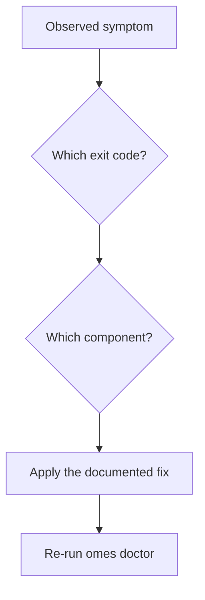

# OMES Troubleshooting

> Status: describes the actual repository state. Organized by exit code first
> (§1), then by component (§2+). See [docs/cli.md](cli.md) for the full
> command/flag/JSON reference, [docs/configuration.md](configuration.md) for
> every environment variable, and [docs/rollback.md](rollback.md) /
> [docs/disaster-recovery.md](disaster-recovery.md) for backup/restore recovery
> procedures in depth.

## 1. By exit code

| Exit | Meaning | Common cause | Fix |
|---|---|---|---|
| 0 | Success | — | — |
| 1 | General/unexpected error (also a declined confirmation without `--yes`, or a failed `omes doctor`) | Ran a mutating command non-interactively without `--yes` and without a TTY; `omes update` on a dirty/detached checkout; a doctor FAIL | Re-run with `--yes` if you meant to proceed; `git status`/`git checkout <branch>` before `omes update`; read the doctor output for the specific FAIL line |
| 2 | Usage error | Bad flag; `install` with neither `--profile` nor `--module`; a `MODULE_REQUIRES` cycle; no command given at all | Fix the command line; `omes help` |
| 3 | Unsupported platform (OS/arch) | Running on Debian/Pop!_OS/Zorin/elementary/Mint 21.x/LMDE/Fedora/WSL/non-amd64-arm64 | Not supported — see [docs/compatibility-matrix.md](compatibility-matrix.md); nothing was mutated |
| 4 | Preflight failed (a `module_check` failed; no mutation) | A package not found in the configured repositories; network required but absent during check; missing prerequisite (systemctl, curl, etc.) | Read the named check's detail line; see §3 (apt/repos) or §7 (network) below |
| 5 | Privilege error | An explicit `--module <name>` request whose scope does not match the current privilege (e.g. `sudo omes install --module hermes`) | Run root-scope modules with `sudo`, user-scope modules without it; or use `--profile` instead of `--module` so scope mismatches are filtered instead of rejected |
| 6 | Module apply failed (names the module) | `apt-get install`/`apt-get update` itself failed (dpkg lock, disk full, broken repo); `hermes gateway install` failed; a confirmation-gated action (docker group) was declined | Read the module name in the error and the log file; fix the underlying `apt`/`hermes` failure and re-run `omes install` (idempotent) |
| 7 | Verification failed (names the module) | `module_verify` found the target state not actually present (service not active, binary missing, `hermes doctor` failing) | See §5 (gateway) / §4 (Hermes) below; check `journalctl` for the named service |
| 8 | Network required but unavailable | `apt-base`/`containers`/`hermes` need network and it's down; `omes update`'s `git fetch` failed for the same reason | Check connectivity (`omes check` reports `network: offline`); retry once online |
| 9 | Backup/restore failed | No backup found for the given `--from`; corrupt `MANIFEST`; a checksum mismatch | See §6 below |
| 10 | Rollback failed (names the module) | `module_rollback` or the generic managed-path rollback hit an error (e.g. `apt-get remove` failed under `--purge-packages`) | Read the module name and error; the already-rolled-back modules from this run remain rolled back — fix the specific failure and re-run `omes uninstall` |

## 2. Preflight (exit 4) — general

**Symptom:** `omes check`/`omes install` exits 4 naming a check.

- **Cause: a package is missing from the configured repositories.** `pkg_exists_in_repos`
  ran `apt-cache policy <pkg>` and got no candidate. **Fix:** confirm the package name is
  right for this release (`apt-cache search <name>`); if it genuinely is not packaged (e.g.
  Hyprland on stock noble — see §4 below), there is nothing to fix until a validated source
  exists — OMES will not add a PPA on its own.
- **Cause: `apt-get` itself is missing** (non-Debian host reached this far somehow). **Fix:**
  this should not happen on a supported platform; re-run `omes check` and confirm
  `platform.tier` is not `unsupported`.
- **Cause: network required but unavailable during `module_check`.** Surfaces as exit 4
  (not 8) during `check`/`install`, per the exit-code contract — the check phase folds a
  network-absence failure into the generic preflight-failed bucket. **Fix:** get online, or
  wait for a run where the packages needed are already installed (offline is safe when
  nothing new needs fetching).

## 3. apt / repositories, including Mint-specific notes

- **Docker on Linux Mint (`containers` module):** OMES uses `$UBUNTU_CODENAME` (not Mint's
  own codename) for Docker's apt suite and logs an explicit `WARN`: *"Linux Mint detected;
  Docker officially supports Ubuntu only ... No support parity is claimed."* This is expected,
  not a bug — see [docs/adr/0007-docker-access-policy.md](adr/0007-docker-access-policy.md).
  If `docker-ce` still fails to install, check that `$UBUNTU_CODENAME` in `/etc/os-release`
  actually resolves to a codename Docker's repo publishes (`noble`, `jammy`, `focal`,
  `bionic` — see `modules/containers/module.sh`'s `_containers_supported_codenames`).
- **"hyprland not available in noble":** `hyprland`, `hypridle`, and `hyprlock` are not in
  Ubuntu 24.04's official archive as of this writing. `desktop-preflight`/`hyprland-session`
  will FAIL preflight (exit 4) naming exactly these packages every time, on every supported
  Mint 22.x/Ubuntu 24.04 host, until (a) a future release carries them, or (b) a PPA is
  reviewed and added to [docs/packages.md](packages.md)'s allowlist (none is allowlisted
  today). There is no flag to force past this — OMES never builds from source as a
  workaround. See [docs/linux-mint.md §3](linux-mint.md).
- **A soft-toolset package (waybar, foot, a launcher, ...) is missing:** these are WARN, not
  FAIL — `hyprland-session` simply skips installing whichever ones apt does not have. Check
  the `omes install --profile desktop` output for which specific packages were skipped.
- **Broken repo / dpkg lock mid-apply (exit 6):** read the module name in the error, run
  `sudo dpkg --configure -a` / clear the lock manually if that's the cause, then re-run
  `omes install` (idempotent — already-installed packages are skipped).

## 4. Firewall / SSH lockout

- **"I ran install and now I'm locked out over SSH":** should not happen — the SSH-keep-open
  guard in `security-baseline` runs *before* `ufw --force enable` on every apply, every time,
  unconditionally (no flag disables it). If it happens anyway (e.g. a non-standard sshd port
  that `_security_sshd_port` could not auto-detect):
  1. Use the cloud/VM provider's serial/VNC console (out-of-band from SSH).
  2. `sudo ufw status verbose` to see what is actually configured.
  3. `sudo ufw allow <port>/tcp`, or reset entirely (`sudo ufw --force reset`) and re-run
     `sudo omes install --profile server --yes` with `OMES_ENABLE_SSH=1` set, or from an
     already-active SSH session (either condition keeps SSH open before `ufw` is enabled).
- **ufw not active after install:** `sudo ufw status verbose`; if it shows `Status: inactive`,
  re-run `sudo omes install --profile server --yes` and read the apply-phase output for
  errors around the `ufw --force enable` step.

## 5. Hermes install / doctor

- **`hermes` module fails preflight/apply as root:** `hermes` and `hermes-gateway` refuse to
  run as root outright (exit 5, or a `module_check` failure before that). Re-run as your own
  user, without `sudo`.
- **`omes install --module hermes` fails with exit 7 ("verification failed"):** `module_verify`
  runs `hermes --version` (must succeed) then `hermes doctor` (its own exit code is
  authoritative — non-zero fails verification with the full `hermes doctor` output logged at
  `ERROR`). Read that output; it names the actual Hermes-side problem, not an OMES one.
- **Installer download fails:** check `detect_network`'s result (`omes check`'s `network`
  field); the Hermes installer is downloaded to a temp file first (never `curl | bash`), so a
  network failure here is a clean, no-mutation exit 6/8, safe to retry.

## 6. Hermes gateway (unit inactive, lingering, PATH, "green signals lie")

- **Unit enabled but not active** (crashed or never started): `module_verify` fails with an
  explicit "is not active" message. Check `journalctl --user -u hermes-gateway -f` (or
  `journalctl -u hermes-gateway -f` for system mode) for the crash reason — very often a
  missing `PATH` entry (the gateway's systemd unit does not inherit an interactive shell's
  PATH; see `OMES_HERMES_GATEWAY_EXTRA_PATH` in [docs/configuration.md](configuration.md)) or a
  Hermes config/secret problem `hermes doctor` would also catch. Fix, then
  `systemctl --user restart hermes-gateway` or re-run `omes install`.
- **Gateway stops after logout on a headless host:** lingering was declined, or was never
  offered because the session was not detected as headless. Enable it manually:
  `sudo loginctl enable-linger <user>`. `omes install` only offers this prompt on a
  server/headless session and only if it has not already recorded lingering as enabled.
- **"green signals can lie":** `systemctl [--user] is-active hermes-gateway` (and even
  `hermes gateway status`) prove the **process** is running, never that the Telegram (or
  other adapter) connection is actually healthy. `module_verify` always logs this caveat, not
  only on failure. Check `journalctl [--user] -u hermes-gateway -f` for the real connection
  outcome, or a real message round-trip in an allowlisted chat. See
  [docs/hermes-integration.md part 2, §14](hermes-integration.md).
- **`hermes gateway install` itself fails:** `module_apply` fails (exit 6) before touching
  systemd at all — nothing is enabled/started; safe to fix and re-run.

## 7. Telegram

- **No reply from the bot at all:**
  1. Confirm the sender's numeric user id is in `TELEGRAM_ALLOWED_USERS` (DM) or the chat id
     is in **both** `TELEGRAM_ALLOWED_CHATS` and `TELEGRAM_GROUP_ALLOWED_CHATS` (group) — run
     `modules/hermes-gateway/telegram-allowlist.sh --check` to see the current lists and any
     half-enabled group.
  2. If it's a group, confirm the bot is actually an admin/member with permission to read
     messages (`getChatMember` via `telegram-allowlist.sh diagnose <chat-id> --member
     <your-user-id>`).
  3. Confirm the gateway was **restarted** since the last `.env` edit — allowlists are read
     only at gateway start; editing `.env` while the gateway runs changes nothing until a
     restart (§6's "restart" commands).
  4. **Never call `getUpdates`** against a running polling gateway to "just check" — it causes
     a 409 Conflict and steals updates from the real poller. Use `telegram-allowlist.sh
     diagnose` (`getChat`/`getChatMemberCount`/`getChatMember` only) instead.
- **Bot not admin / can't see group messages:** add the bot to the group with at least
  read-message permission (Telegram group settings, not an OMES concern) and re-test.
- **409 Conflict in logs:** something else called `getUpdates` or `setWebhook`/`deleteWebhook`
  against this bot while the gateway was long-polling. Stop whatever made that call; OMES's own
  tooling (`telegram-allowlist.sh`) never does.

## 8. Desktop (black screen, back to Cinnamon, NVIDIA, portals)

- **Black screen after selecting "OMES Hyprland":** switch to a text VT
  (`Ctrl+Alt+F3` on most setups), log in, and check `~/.local/share/hyprland/` (if present) and
  `journalctl --user -b -p err | grep -i hyprland` — `hyprland-session`'s `module_verify` runs
  this same best-effort check and prints what it finds. Then return to LightDM.
- **"Back to Cinnamon" recovery path:** at the LightDM login screen, select "Cinnamon" instead
  of "OMES Hyprland" and log in normally. Cinnamon was never modified — this is the guaranteed
  fallback, not a workaround.
- **NVIDIA:** `desktop-preflight` WARNs (does not fail) on the proprietary driver, but calls
  out specifically if the driver is below version **555** or `nvidia-drm.modeset=1` is not on
  the kernel command line — both required for Wayland explicit-sync support. Add
  `nvidia-drm.modeset=1` to `GRUB_CMDLINE_LINUX_DEFAULT` in `/etc/default/grub`, run
  `update-grub`, reboot. **Nouveau (open-source NVIDIA) fails preflight outright** — install
  the proprietary driver or stay on Cinnamon.
- **Portals / screen sharing not working:** confirm `xdg-desktop-portal-hyprland` (preferred)
  or `xdg-desktop-portal-gtk` (fallback) is installed; `desktop-preflight` reports which one it
  found. If neither is available, screen sharing/file pickers will not work under Hyprland.

## 9. Backups / restore (corrupt MANIFEST, exit 9)

- **"MANIFEST not found or unreadable" / "MANIFEST is corrupt (malformed line)":**
  `backup_manifest_validate` refuses a structurally invalid `MANIFEST` outright (exit 9) rather
  than attempt a partial/best-guess restore. Inspect
  `<state-dir>/backups/<timestamp>/MANIFEST` by hand — every non-blank line must be
  `<64-hex-sha256>  <path-with-no-leading-slash>`. There is no automated repair; use a
  different (valid) backup session (`omes restore --list`) or reconstruct the file manually
  from `META` and the files actually present in that session's directory.
- **"checksum mismatch, aborting":** the backed-up copy itself has been altered since it was
  written (disk corruption, manual edit inside the backup dir). Restore stops at the first
  mismatch — files already restored earlier in the same invocation are left restored, not
  rolled further back. Use an earlier session if one exists.
- **"no backup found for timestamp" / "no backups available to restore":** run
  `omes restore --list` (or `--json`) to see what actually exists; the timestamp must match
  exactly (`YYYYMMDDTHHMMSSZ`, optionally with a `-N` suffix for a same-second collision).

## 9a. Agent deployment (`omes agent`, exit 4/5/6/7)

- **"no manifest found for agent '<name>'" (exit 4):** no file at
  `$OMES_CONFIG_DIR/agents/<name>.json` (see
  [docs/configuration.md](configuration.md) for `OMES_CONFIG_DIR`'s
  root/user resolution). Confirm the manifest exists and the command is
  run as the same user/scope it was written for.
- **"declares metadata.name '<x>' but was looked up as '<name>' -
  refusing a mismatched/duplicate name" (exit 4):** the manifest's
  filename and its `metadata.name` field disagree - rename the file to
  `<metadata.name>.json` or fix the field; this is deliberate duplicate-
  name protection, not a bug.
- **"serviceMode 'user' must not be applied as root" / "'system'
  requires root" (exit 5):** `omes agent apply`/`rollback` refuse a
  privilege mismatch before any mutation. Run `serviceMode: user`
  manifests as the target (non-root) operator account; `serviceMode:
  system` requires `sudo`.
- **`apply` fails after "backed-up" with a `systemctl` error (exit 6):**
  the unit/drop-in were written but `daemon-reload`/`enable --now`
  failed - check `journalctl --user -u omes-agent-<name>.service` (or
  without `--user` for `system` scope) and `systemctl --user status
  omes-agent-<name>.service`. The agent's state file
  (`<state-dir>/agents/<name>/state.json`) records `failed` with the
  triggering detail; re-running `apply` retries the full cycle.
- **`omes agent health <name>` reports `degraded`/not ready (exit 7):**
  read the `layers` object in the JSON output - each layer's `proves`
  field states exactly what a `pass` does and does not establish (the
  same "green signals can lie" principle as `omes health`, see section
  6). A `not_applicable` provider/channel layer is normal when no
  Ollama provider or Telegram token is configured for that agent.
- **Rollback did not remove `HERMES_HOME`:** this is intentional -
  `omes agent rollback` removes only the OMES-managed unit and drop-in
  recorded in the agent's own state, never Hermes's own data. Use
  `omes agent-backup`/manual cleanup if you also want the data gone.
- Full reference: [docs/agent-deployment.md](agent-deployment.md).

## 10. State dir and logs

- **Where:** root scope `/var/lib/omes/`; user scope
  `${XDG_STATE_HOME:-$HOME/.local/state}/omes/` (override either with `OMES_STATE_DIR`). Logs:
  `<state-dir>/logs/omes-<UTC timestamp>.log`, one file per invocation unless `--log-file`
  overrides it.
- **`omes doctor` reports `state_dir`/`state_file` WARN with an unexpected mode:** the
  directory should be `0700`, the state file `0600`. Fix with `chmod 700 <state-dir>` /
  `chmod 600 <state-dir>/state`; OMES itself always writes these modes, so a mismatch means
  something outside OMES changed them.
- **Reading `omes doctor --json`:** `jq '.checks[] | select(.level!="OK")'` — every check has
  `name`, `level` (`OK`/`WARN`/`FAIL`), and `detail`. The overall envelope's `ok` field is
  `false` only if at least one check is `FAIL`; a `WARN`-only run still reports `ok: true` and
  exits 0.

```console
$ sudo omes doctor --json | jq '.checks[] | select(.level!="OK")'
$ tail -n 50 "$(omes status --json | jq -r '.last_log')"
```

For a full disaster-recovery walkthrough (multi-file corruption, rebuilding state from
scratch, etc.), see [docs/disaster-recovery.md](disaster-recovery.md).

<!-- OMES-MERMAID: docs/troubleshooting.md -->

## Visual summary


