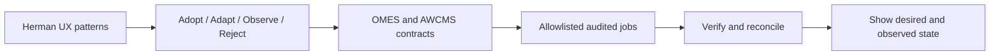

# Web panel reference evaluation: Herman

> Status: accepted reference decision; no Herman runtime or source code is a dependency of OMES.
> Primary reference: [levay08/herman](https://github.com/levay08/herman)
> Target issues: [#89](https://github.com/ahliweb/omes/issues/89), [#90](https://github.com/ahliweb/omes/issues/90), [#91](https://github.com/ahliweb/omes/issues/91), [#95](https://github.com/ahliweb/omes/issues/95), [#98](https://github.com/ahliweb/omes/issues/98), [#99](https://github.com/ahliweb/omes/issues/99), [#100](https://github.com/ahliweb/omes/issues/100), [#101](https://github.com/ahliweb/omes/issues/101), and [#102](https://github.com/ahliweb/omes/issues/102).

## 1. Decision

**Decision: reference-only, with an optional future OMES Local Console interpretation. Herman is not an approved OMES dependency, runtime, control-plane executor, or source of truth.**

OMES may adopt interaction and information-architecture patterns from Herman after reimplementing them behind the existing OMES/AWCMS contracts. OMES must not import Herman's single-user/local security assumptions, direct host access model, internal Hermes database coupling, raw credential workflows, or arbitrary process/filesystem behavior into a public or multi-tenant panel.

This decision does not claim that Herman is insecure. It states that a local operator panel and a tenant-scoped control plane have different trust models, failure modes, and authorities.

## 2. Evidence reviewed

The analysis covered the upstream repository metadata, MIT license, README, primary Python executable, HTML panel, installer, Docker packaging, preflight/security checks, process/session handling, file and archive operations, endpoint/model operations, access/credential screens, usage/insights, maintenance, backup/restore, and repository maturity.

Observed repository facts at review time:

- Repository: `levay08/herman`.
- License: MIT; any copied substantial code must retain the applicable copyright and license notice.
- Primary implementation: Python local server/CLI plus a browser UI.
- The panel is designed around a local Hermes profile/project workflow.
- The repository has no release maturity that makes it an independently verified production control plane.
- The repository's own security checks are useful evidence of tested behavior, but they do not prove multi-tenant suitability for OMES.

The review is a product/reference assessment, not a security audit of Herman and not a claim that every upstream behavior remains unchanged after the reviewed revision.

## 3. Boundary rule

```text
Herman reference patterns
  ├── navigation and dashboard composition
  ├── project/deployment cards
  ├── session and runtime status
  ├── usage/insight presentation
  ├── streaming operation output
  ├── confirmation and maintenance UX
  └── local-first operator workflow
              │ reimplemented, not imported
              ▼
AWCMS Control Center / OMES Local Console
  ├── tenant and authorization boundary
  ├── allowlisted idempotent jobs
  ├── audit and correlation
  ├── desired/observed state
  ├── provider capability and reconciliation
  └── Hermes/OMES source-of-truth contracts
```

The browser must never become a direct shell, SSH, provider-token, or filesystem executor. A web action creates a typed request; authorization, policy, approval, execution, verification, and reconciliation happen in the owning control-plane/job boundary.

## 4. Fit matrix

| Herman capability/pattern | OMES decision | Reimplementation and owning issue |
|---|---|---|
| Sidebar boards: Dashboard, Projects, Model, Insights, Access, Maintenance | Adopt | Use tenant/deployment-oriented navigation in #91; do not copy the domain model literally. |
| Project/profile cards and active project view | Adapt | Model tenant → subscription/service → deployment → server in #89/#91. |
| Runtime/session status | Adopt | Read Hermes observations and OMES health; lifecycle mutations go through #90 and #87. |
| Live operation output and status panel | Adopt | Stream sanitized job events with correlation ID, durable state, retry and reconciliation in #90. |
| Usage, token, cache, context and model summaries | Adapt | Add reporting projections, freshness, rebuild and reconciliation metadata in #95. Estimates must not become invoices automatically. |
| Model/provider and endpoint screens | Adapt | Hermes remains runtime authority; endpoint tests require SSRF/network policy and secret references in #89/#90. |
| Skills, memory, SOUL and session views | Observe/adapt | Display Hermes-owned state through a versioned adapter; do not create a second runtime in #85/#89. |
| Backup/restore and maintenance UX | Adopt | Submit typed backup/restore jobs with preflight, manifest, retention, verification and approval in #82/#90/#91. |
| Access screen for API keys, SSH keys, hosts and git credentials | Reject raw implementation; adopt metadata workflow | Show only secret references, scope, status, rotation and expiry. Never reveal raw values. #89/#91/#101. |
| History/session deletion and process controls | Adapt with stronger policy | Explicit authorization, tenant scope, confirmation, audit, reversible policy and Hermes ownership. #90/#91. |
| Local token/cookie security patterns | Reference for local console only | Production Control Center requires AWCMS identity, RBAC/ABAC, RLS, CSRF/session controls, audit and approval. #89/#91. |
| Local/offline-first operation | Adopt selectively | Native OMES recovery/status remains local and works without AWCMS; healthy deployments must not depend on web availability. #87/#91. |
| Provider registration status and asynchronous action presentation | Adapt | Use explicit provider state machine, capability matrix, action-required/manual fallback and reconciliation in #98–#102. |
| Price and cost snapshots | Adopt conceptually | Immutable provider/customer price snapshot at quote/checkout/invoice; never infer support or success from a UI. #98/#102. |
| Docker packaging and installer convenience | Observe only | OMES requires pinned provenance, preflight, rollback, resource policy and staged backend contracts. #83/#84/#96. |

## 5. Highest-value UX recommendations

### 5.1 Control Center navigation

Use a Herman-inspired board layout, but organize it around OMES ownership:

```text
Overview
  Dashboard · Activity · Alerts
Operations
  Servers · Deployments · Jobs · Health · Backups
Business
  Tenants · Catalog · Subscriptions · Invoices · Entitlements
Integrations
  Domains · DNS · GitHub · Providers
Security
  Audit · Approvals · Credential references · Policies
```

Customer and operator views may share components but must not share authorization assumptions. Hidden UI controls are not authorization; server-side policy and tenant scope are mandatory.

### 5.2 Deployment detail

A deployment page should show, separately and with timestamps:

- tenant and subscription reference;
- server and runtime backend;
- desired state;
- observed state;
- health/readiness;
- current version and provenance;
- active jobs and last correlation ID;
- active Hermes sessions as observations;
- backup freshness and restore references;
- provider/GitHub observations;
- recent audit events;
- allowed actions for the current actor.

Never compress registrar, DNS, billing, entitlement, deployment, or health state into one `active` boolean.

### 5.3 Job console

The operation console should preserve the useful feel of Herman's streaming output while enforcing OMES semantics:

1. show request and actor;
2. show authorization and approval state;
3. show preflight result;
4. show queued/running progress;
5. show sanitized output and evidence references;
6. show verification and reconciliation;
7. show final state, retryability, and manual-intervention path.

A timeout, provider acceptance, or submitted asynchronous request is never displayed as success until read-back verification succeeds.

### 5.4 Reporting and insights

Adopt compact cards, trend charts, filters, and plain-language summaries for:

- deployment count and health duration;
- job failure/retry rate;
- provisioning duration;
- backup compliance;
- token/model usage where measured;
- subscription/invoice state;
- provider cost and customer price snapshots;
- domain renewal and reconciliation drift.

Every report must display source, scope, freshness, estimate/confirmed status, and reconciliation state. Report projections are read models, not a second financial or provider source of truth.

## 6. Security adaptations required before implementation

Any Herman-inspired feature entering a web-facing OMES panel must satisfy all of the following:

- AWCMS identity plus tenant-scoped RBAC/ABAC and row-level isolation.
- Typed allowlisted operation, never an arbitrary command or URL.
- Correlation ID, idempotency key, actor, target and tenant on every mutation.
- Approval for destructive or externally consequential actions.
- Durable job state, retry classification, timeout handling and reconciliation.
- No raw API key, password, private key, PAT, payment credential or provider token in browser payloads, database, logs, issues, backups or reports.
- Use `secret_reference`, provider/account ID, scope, rotation and expiry metadata only.
- SSRF controls for all endpoint/probe features.
- No arbitrary host mounts, Docker socket access, privileged containers or unrestricted network exposure.
- Confirmation and rollback evidence for delete, restore, stop, restart, update and provider actions.
- Sanitized event/log output and redaction tests.
- Default CI uses fake providers/fixtures and no live credentials.

The relevant threat-model rows are T33–T38 in [docs/threat-model.md](threat-model.md).

## 7. License and provenance rule

Herman is MIT-licensed according to the reviewed repository. If OMES later copies substantial source code rather than reimplementing behavior, the change must:

1. retain the upstream copyright and license notice;
2. add the attribution to `THIRD_PARTY_NOTICES.md`;
3. record the exact upstream commit and copied paths;
4. review all transitive dependencies and licenses;
5. perform security, tenant-isolation, and compatibility review;
6. add tests proving that OMES boundaries remain intact.

The default recommendation is reimplementation of documented UX patterns, not source-code reuse. No Herman code is currently vendored or linked as a runtime dependency.

## 8. Implementation sequence

1. #89 records the reference boundary and versioned Control Center contracts.
2. #90 implements the typed job/event boundary and verification semantics.
3. #91 builds the AWCMS screens using the fit matrix above.
4. #95 adds usage and business projections with freshness/reconciliation.
5. #98–#102 apply the same UX to provider capability, asynchronous status, price snapshot, documents and reconciliation.
6. #101 applies repository/project linkage with a least-privilege GitHub App.
7. A future issue or child task may define an OMES Local Console only if the native CLI remains the recovery authority and the console is local/operator-scoped.

No new implementation issue is required solely for Herman: the existing issue set already owns the relevant contracts. If implementation reveals a genuinely independent deliverable, update the traceability matrix and existing issue dependencies before creating anything new.

## 9. Explicit non-goals

This reference decision does not:

- make Herman part of OMES or AWCMS;
- move Hermes runtime ownership into a web panel;
- authorize arbitrary shell, SSH, filesystem, process or provider execution;
- make local token authentication sufficient for a public Control Center;
- make provider registration, billing, DNS or deployment state synchronous;
- imply that issues #89–#102 are implemented;
- change the native MVP of OMES + Hermes + systemd.

## 10. Verification checklist

Before accepting a Herman-inspired UI or operation:

- [ ] owning issue and milestone are identified;
- [ ] source-of-truth owner is identified;
- [ ] feature is classified adopt/adapt/observe/reject;
- [ ] tenant and actor authorization is server-side;
- [ ] operation is typed, idempotent, audited and reconciled;
- [ ] raw secrets and PII are excluded;
- [ ] destructive behavior has approval/confirmation and rollback evidence;
- [ ] fake-provider and cross-tenant tests exist;
- [ ] documentation says proposed/staged/not implemented until code lands;
- [ ] license/provenance is recorded if source is copied.

<!-- OMES-MERMAID: docs/web-panel-reference-evaluation.md -->

## Visual summary


